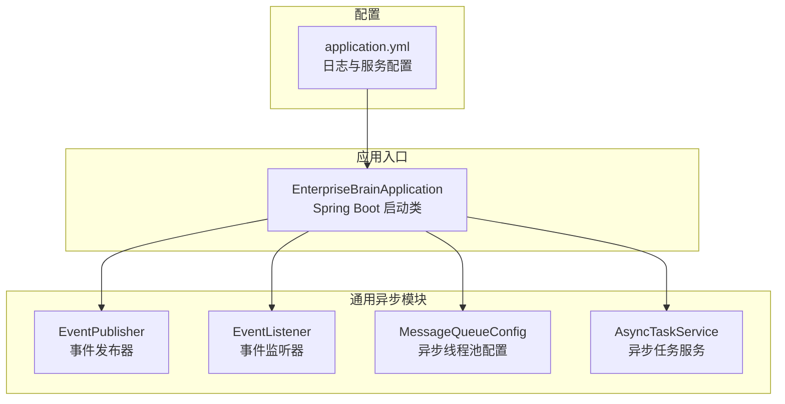
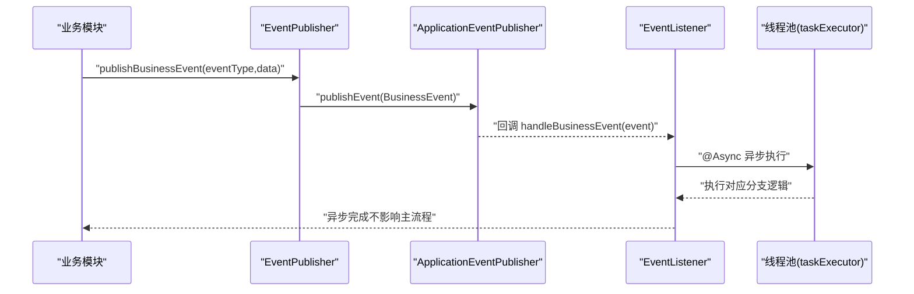
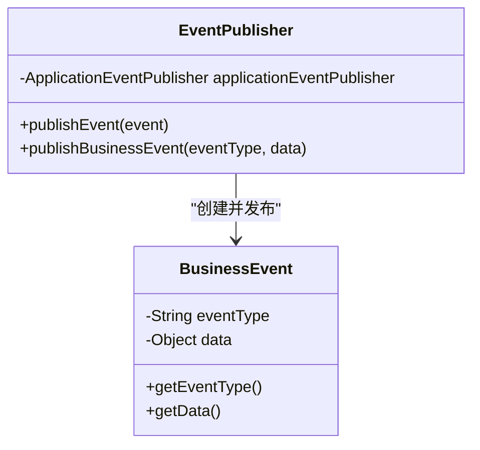
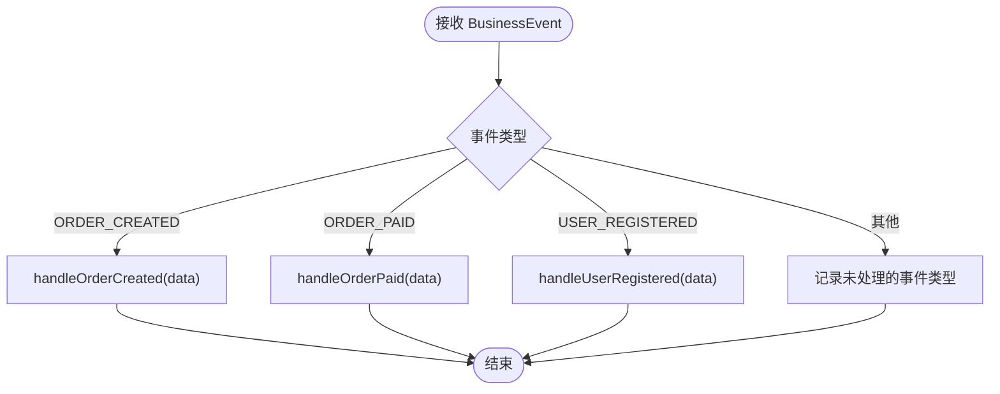
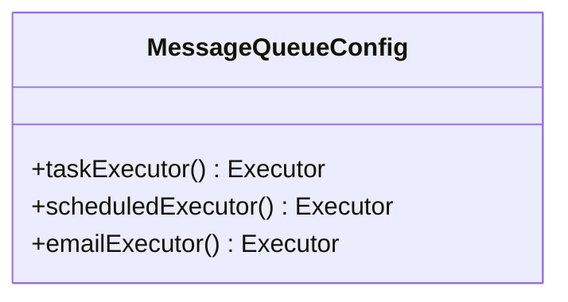
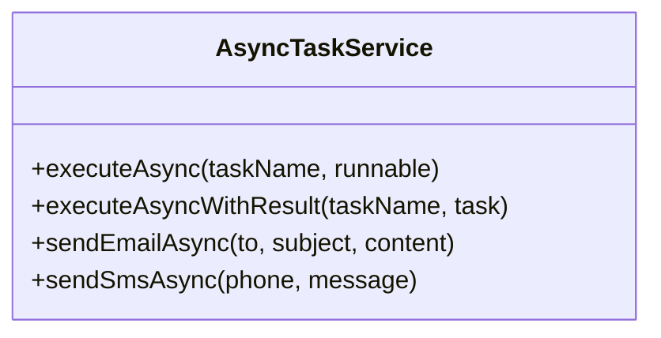
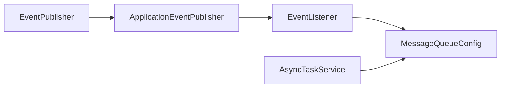

# 事件驱动架构

<cite>
**本文引用的文件列表**
- [EventPublisher.java](file://08-backend/src/main/java/com/enterprise/brain/common/async/EventPublisher.java)
- [EventListener.java](file://08-backend/src/main/java/com/enterprise/brain/common/async/EventListener.java)
- [MessageQueueConfig.java](file://08-backend/src/main/java/com/enterprise/brain/common/async/MessageQueueConfig.java)
- [AsyncTaskService.java](file://08-backend/src/main/java/com/enterprise/brain/common/async/AsyncTaskService.java)
- [EnterpriseBrainApplication.java](file://08-backend/src/main/java/com/enterprise/brain/EnterpriseBrainApplication.java)
- [application.yml](file://08-backend/src/main/resources/application.yml)
</cite>

## 目录
1. [引言](#引言)
2. [项目结构](#项目结构)
3. [核心组件](#核心组件)
4. [架构总览](#架构总览)
5. [组件详解](#组件详解)
6. [依赖关系分析](#依赖关系分析)
7. [性能与可靠性](#性能与可靠性)
8. [故障排查指南](#故障排查指南)
9. [结论](#结论)

## 引言
本文件围绕基于 Spring ApplicationEvent 的事件发布-订阅模式进行系统化解析，重点覆盖：
- EventPublisher 类中 publishEvent 与 publishBusinessEvent 的工作机制
- BusinessEvent 事件对象的设计与使用
- EventListener 类通过 @EventListener 注解监听并处理业务事件（订单创建、订单支付、用户注册等）
- 结合代码路径展示事件驱动架构在解耦业务逻辑、实现模块间通信方面的优势
- 异步事件处理的线程模型、错误处理策略与事件追溯机制
- 如何保证事件处理的可靠性和一致性

## 项目结构
事件驱动能力位于后端 Java 模块的通用异步包中，核心文件如下：
- 事件发布器：EventPublisher
- 事件监听器：EventListener
- 异步线程池配置：MessageQueueConfig
- 异步任务服务：AsyncTaskService
- 应用入口：EnterpriseBrainApplication
- 配置文件：application.yml

图表来源
- [EventPublisher.java](file://08-backend/src/main/java/com/enterprise/brain/common/async/EventPublisher.java#L1-L67)
- [EventListener.java](file://08-backend/src/main/java/com/enterprise/brain/common/async/EventListener.java#L1-L71)
- [MessageQueueConfig.java](file://08-backend/src/main/java/com/enterprise/brain/common/async/MessageQueueConfig.java#L1-L94)
- [AsyncTaskService.java](file://08-backend/src/main/java/com/enterprise/brain/common/async/AsyncTaskService.java#L1-L101)
- [EnterpriseBrainApplication.java](file://08-backend/src/main/java/com/enterprise/brain/EnterpriseBrainApplication.java#L1-L62)
- [application.yml](file://08-backend/src/main/resources/application.yml#L1-L42)

章节来源
- [EventPublisher.java](file://08-backend/src/main/java/com/enterprise/brain/common/async/EventPublisher.java#L1-L67)
- [EventListener.java](file://08-backend/src/main/java/com/enterprise/brain/common/async/EventListener.java#L1-L71)
- [MessageQueueConfig.java](file://08-backend/src/main/java/com/enterprise/brain/common/async/MessageQueueConfig.java#L1-L94)
- [AsyncTaskService.java](file://08-backend/src/main/java/com/enterprise/brain/common/async/AsyncTaskService.java#L1-L101)
- [EnterpriseBrainApplication.java](file://08-backend/src/main/java/com/enterprise/brain/EnterpriseBrainApplication.java#L1-L62)
- [application.yml](file://08-backend/src/main/resources/application.yml#L1-L42)

## 核心组件
- 事件发布器 EventPublisher
  - 提供 publishEvent(Object) 与 publishBusinessEvent(String, Object) 两个入口
  - 将业务事件封装为 Spring ApplicationEvent 子类 BusinessEvent 并委托给 ApplicationEventPublisher 发布
  - 对异常进行捕获与记录，避免阻塞业务流程
- 事件监听器 EventListener
  - 使用 @EventListener 监听 BusinessEvent，并通过 @Async 异步处理
  - 基于事件类型分支处理不同业务场景（订单创建、订单支付、用户注册等）
  - 对异常进行捕获与记录，防止影响事件总线稳定性
- 异步线程池配置 MessageQueueConfig
  - 通过 @EnableAsync 开启异步支持
  - 定义多个线程池 Bean，分别用于通用异步任务、定时任务与邮件发送
  - 设置合理的核心/最大线程数、队列容量、拒绝策略与优雅停机等待时间
- 异步任务服务 AsyncTaskService
  - 提供 executeAsync、executeAsyncWithResult、sendEmailAsync、sendSmsAsync 等异步执行能力
  - 统一记录执行耗时与异常，便于监控与排障
- 应用入口 EnterpriseBrainApplication
  - 启动 Spring Boot 应用，启用调度功能
- 配置文件 application.yml
  - 提供日志级别、服务端口与上下文路径等基础配置

章节来源
- [EventPublisher.java](file://08-backend/src/main/java/com/enterprise/brain/common/async/EventPublisher.java#L1-L67)
- [EventListener.java](file://08-backend/src/main/java/com/enterprise/brain/common/async/EventListener.java#L1-L71)
- [MessageQueueConfig.java](file://08-backend/src/main/java/com/enterprise/brain/common/async/MessageQueueConfig.java#L1-L94)
- [AsyncTaskService.java](file://08-backend/src/main/java/com/enterprise/brain/common/async/AsyncTaskService.java#L1-L101)
- [EnterpriseBrainApplication.java](file://08-backend/src/main/java/com/enterprise/brain/EnterpriseBrainApplication.java#L1-L62)
- [application.yml](file://08-backend/src/main/resources/application.yml#L1-L42)

## 架构总览
事件驱动架构以 Spring ApplicationEvent 为核心，形成“发布-订阅”闭环：
- 业务模块在关键节点调用 EventPublisher 发布事件
- Spring 容器将事件投递给所有匹配的 @EventListener 方法
- EventListener 异步处理事件，执行各自领域的业务逻辑
- MessageQueueConfig 提供线程池保障异步吞吐与稳定性

图表来源
- [EventPublisher.java](file://08-backend/src/main/java/com/enterprise/brain/common/async/EventPublisher.java#L21-L44)
- [EventListener.java](file://08-backend/src/main/java/com/enterprise/brain/common/async/EventListener.java#L23-L46)
- [MessageQueueConfig.java](file://08-backend/src/main/java/com/enterprise/brain/common/async/MessageQueueConfig.java#L24-L54)

## 组件详解

### EventPublisher：事件发布器
- publishEvent(Object)
  - 接收任意对象作为事件载体，委托 Spring 的 ApplicationEventPublisher 发布
  - 包裹异常并记录日志，确保业务主流程不受事件发布失败影响
- publishBusinessEvent(String eventType, Object data)
  - 将事件类型与数据封装为 BusinessEvent，再调用 publishEvent
  - 便于统一监听与按类型分发
- BusinessEvent
  - 继承自 Spring ApplicationEvent，包含 eventType 与 data 字段
  - 提供 getter 方法，供监听器读取事件信息

图表来源
- [EventPublisher.java](file://08-backend/src/main/java/com/enterprise/brain/common/async/EventPublisher.java#L19-L66)

章节来源
- [EventPublisher.java](file://08-backend/src/main/java/com/enterprise/brain/common/async/EventPublisher.java#L21-L66)

### EventListener：事件监听器
- handleBusinessEvent(BusinessEvent)
  - 使用 @EventListener 监听 BusinessEvent
  - 使用 @Async 异步处理，避免阻塞事件派发线程
  - 基于事件类型进行分支处理，当前已预留 ORDER_CREATED、ORDER_PAID、USER_REGISTERED 等分支
  - 对异常进行捕获与记录，防止事件处理失败导致事件丢失或阻塞
- 分支处理方法
  - handleOrderCreated(Object)
  - handleOrderPaid(Object)
  - handleUserRegistered(Object)
  - 当前为占位实现，后续可接入通知、库存、财务等子系统

图表来源
- [EventListener.java](file://08-backend/src/main/java/com/enterprise/brain/common/async/EventListener.java#L23-L71)

章节来源
- [EventListener.java](file://08-backend/src/main/java/com/enterprise/brain/common/async/EventListener.java#L18-L71)

### MessageQueueConfig：异步线程池配置
- @EnableAsync 开启异步支持
- taskExecutor
  - 通用异步任务线程池，核心线程数、最大线程数、队列容量、空闲存活时间、拒绝策略与优雅停机参数均已配置
- scheduledExecutor
  - 定时任务专用线程池，参数独立设置
- emailExecutor
  - 邮件发送专用线程池，参数独立设置

图表来源
- [MessageQueueConfig.java](file://08-backend/src/main/java/com/enterprise/brain/common/async/MessageQueueConfig.java#L17-L94)

章节来源
- [MessageQueueConfig.java](file://08-backend/src/main/java/com/enterprise/brain/common/async/MessageQueueConfig.java#L17-L94)

### AsyncTaskService：异步任务服务
- executeAsync(String, Runnable)
  - 异步执行无返回值任务，记录耗时与异常
- executeAsyncWithResult(String, Callable<T>)
  - 异步执行有返回值任务，返回 Future
- sendEmailAsync(String, String, String)
  - 异步发送邮件（占位实现）
- sendSmsAsync(String, String)
  - 异步发送短信（占位实现）

图表来源
- [AsyncTaskService.java](file://08-backend/src/main/java/com/enterprise/brain/common/async/AsyncTaskService.java#L1-L101)

章节来源
- [AsyncTaskService.java](file://08-backend/src/main/java/com/enterprise/brain/common/async/AsyncTaskService.java#L1-L101)

### EnterpriseBrainApplication：应用入口
- 启动 Spring Boot 应用，启用调度功能
- 输出应用访问信息（协议、主机、端口、上下文路径、Swagger 地址等）

章节来源
- [EnterpriseBrainApplication.java](file://08-backend/src/main/java/com/enterprise/brain/EnterpriseBrainApplication.java#L1-L62)

### application.yml：配置文件
- 日志级别：对 com.enterprise.brain 包开启 DEBUG
- 服务端口与上下文路径
- Swagger 文档路径

章节来源
- [application.yml](file://08-backend/src/main/resources/application.yml#L1-L42)

## 依赖关系分析
- EventPublisher 依赖 Spring 的 ApplicationEventPublisher 进行事件发布
- EventListener 依赖 Spring 的事件监听机制与 @Async 异步执行
- MessageQueueConfig 为 @Async 提供线程池支撑
- AsyncTaskService 与 MessageQueueConfig 协同提供多样化的异步执行能力

图表来源
- [EventPublisher.java](file://08-backend/src/main/java/com/enterprise/brain/common/async/EventPublisher.java#L19-L33)
- [EventListener.java](file://08-backend/src/main/java/com/enterprise/brain/common/async/EventListener.java#L23-L46)
- [MessageQueueConfig.java](file://08-backend/src/main/java/com/enterprise/brain/common/async/MessageQueueConfig.java#L17-L54)
- [AsyncTaskService.java](file://08-backend/src/main/java/com/enterprise/brain/common/async/AsyncTaskService.java#L1-L101)

章节来源
- [EventPublisher.java](file://08-backend/src/main/java/com/enterprise/brain/common/async/EventPublisher.java#L19-L33)
- [EventListener.java](file://08-backend/src/main/java/com/enterprise/brain/common/async/EventListener.java#L23-L46)
- [MessageQueueConfig.java](file://08-backend/src/main/java/com/enterprise/brain/common/async/MessageQueueConfig.java#L17-L54)
- [AsyncTaskService.java](file://08-backend/src/main/java/com/enterprise/brain/common/async/AsyncTaskService.java#L1-L101)

## 性能与可靠性
- 异步线程模型
  - 通过 @Async 与多线程池隔离不同业务负载，避免相互影响
  - CallerRunsPolicy 拒绝策略在高负载下由调用线程回退执行，保护系统稳定性
  - 优雅停机等待时间确保应用关闭前完成在途任务
- 错误处理策略
  - 发布侧：捕获异常并记录日志，不阻塞业务主流程
  - 监听侧：捕获异常并记录日志，避免事件处理失败导致事件丢失
- 事件追溯机制
  - BusinessEvent 中保留 eventType 与 data，便于审计与问题定位
  - 日志级别配置为 DEBUG，便于开发与运维追踪事件流转
- 一致性与可靠性建议
  - 对关键业务事件（如订单支付）建议引入幂等设计与重试/死信队列策略
  - 对外部系统集成（邮件/短信）建议增加补偿机制与人工干预通道
  - 对高频事件建议评估线程池容量与队列长度，避免积压

章节来源
- [MessageQueueConfig.java](file://08-backend/src/main/java/com/enterprise/brain/common/async/MessageQueueConfig.java#L24-L54)
- [EventPublisher.java](file://08-backend/src/main/java/com/enterprise/brain/common/async/EventPublisher.java#L26-L33)
- [EventListener.java](file://08-backend/src/main/java/com/enterprise/brain/common/async/EventListener.java#L23-L46)
- [application.yml](file://08-backend/src/main/resources/application.yml#L30-L36)

## 故障排查指南
- 事件未被监听
  - 检查 @EnableAsync 是否生效（已在启动类启用调度）
  - 确认 EventListener 已被 Spring 管理（@Component）
  - 确认线程池已正确注入与初始化
- 事件处理异常
  - 查看监听器日志，定位异常堆栈
  - 检查线程池参数是否合理，避免拒绝策略导致任务丢失
- 事件发布失败
  - 查看发布器日志，确认异常原因
  - 检查事件对象是否可序列化（Spring 事件默认基于容器内传播，通常无需序列化）
- 性能问题
  - 关注线程池饱和情况与队列长度
  - 调整核心/最大线程数与队列容量，观察日志耗时

章节来源
- [EnterpriseBrainApplication.java](file://08-backend/src/main/java/com/enterprise/brain/EnterpriseBrainApplication.java#L1-L62)
- [EventListener.java](file://08-backend/src/main/java/com/enterprise/brain/common/async/EventListener.java#L23-L46)
- [MessageQueueConfig.java](file://08-backend/src/main/java/com/enterprise/brain/common/async/MessageQueueConfig.java#L24-L54)
- [EventPublisher.java](file://08-backend/src/main/java/com/enterprise/brain/common/async/EventPublisher.java#L26-L33)

## 结论
该事件驱动架构以 Spring ApplicationEvent 为基础，通过 EventPublisher 与 EventListener 形成清晰的发布-订阅链路。配合 MessageQueueConfig 的异步线程池配置，实现了业务解耦与模块间通信的高效协同。当前已具备事件类型枚举与监听分支的扩展点，后续可在各分支中接入具体业务逻辑（如通知、库存、财务等），并通过完善的线程池与日志配置保障性能与可观测性。