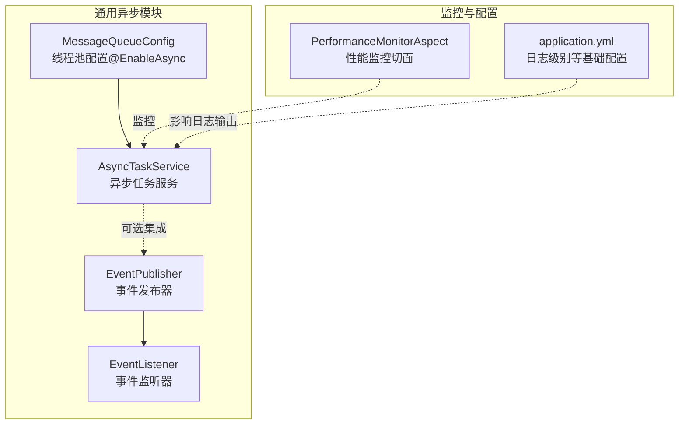
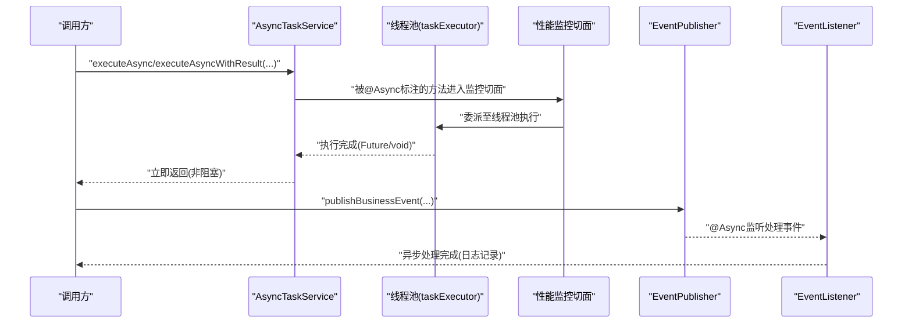
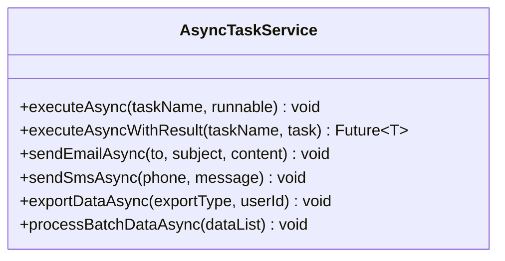
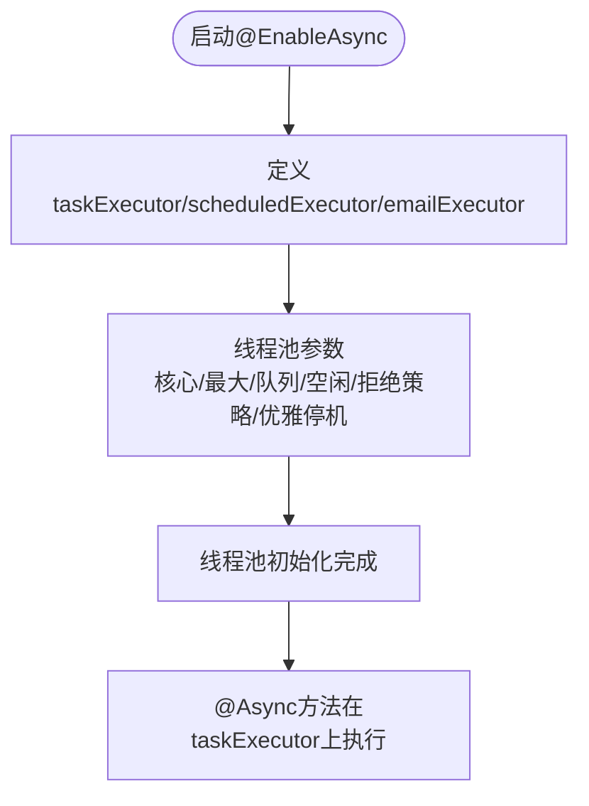
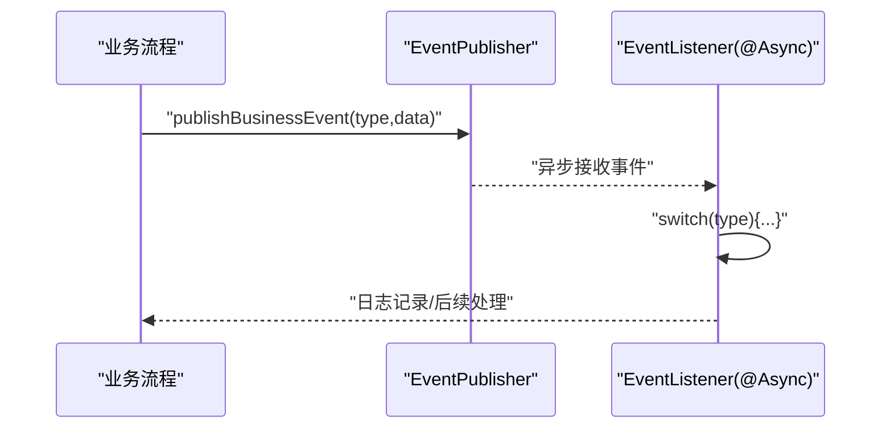
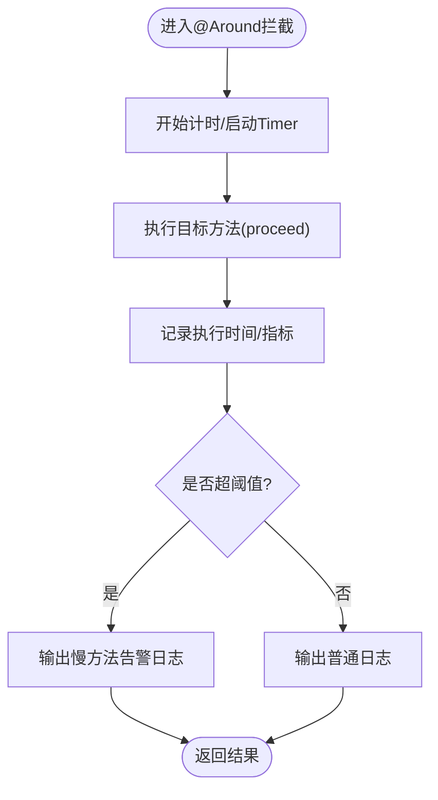
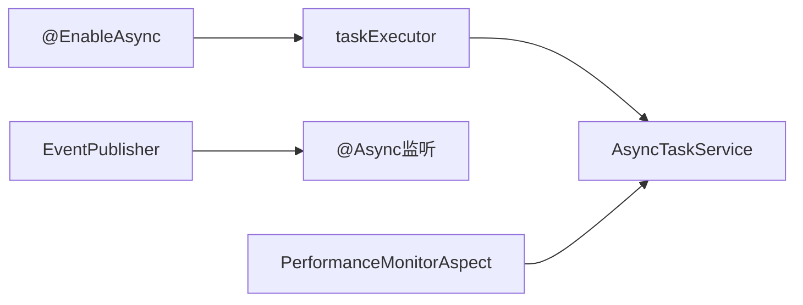

# 异步任务执行器

<cite>
**本文引用的文件**
- [AsyncTaskService.java](file://08-backend/src/main/java/com/enterprise/brain/common/async/AsyncTaskService.java)
- [MessageQueueConfig.java](file://08-backend/src/main/java/com/enterprise/brain/common/async/MessageQueueConfig.java)
- [EventPublisher.java](file://08-backend/src/main/java/com/enterprise/brain/common/async/EventPublisher.java)
- [EventListener.java](file://08-backend/src/main/java/com/enterprise/brain/common/async/EventListener.java)
- [PerformanceMonitorAspect.java](file://08-backend/src/main/java/com/enterprise/brain/common/config/PerformanceMonitorAspect.java)
- [application.yml](file://08-backend/src/main/resources/application.yml)
</cite>

## 目录
1. [简介](#简介)
2. [项目结构](#项目结构)
3. [核心组件](#核心组件)
4. [架构总览](#架构总览)
5. [详细组件分析](#详细组件分析)
6. [依赖关系分析](#依赖关系分析)
7. [性能考量](#性能考量)
8. [故障排查指南](#故障排查指南)
9. [结论](#结论)
10. [附录](#附录)

## 简介
本文件围绕AsyncTaskService类中的基于@Async注解的异步任务执行机制进行深入分析，重点说明executeAsync与executeAsyncWithResult两种方法的实现原理及差异，覆盖无返回值与有返回值任务的处理流程；并结合sendEmailAsync、sendSmsAsync、exportDataAsync、processBatchDataAsync等典型业务场景，阐述邮件发送、短信通知、数据导出与批量数据处理的异步实现思路。文档同时提供异常处理、日志记录、性能监控的最佳实践建议，并讨论异步任务在提升系统响应性与吞吐量方面的价值，以及线程安全与资源管理注意事项。

## 项目结构
AsyncTaskService位于通用异步模块中，配合线程池配置、事件发布与监听、以及性能监控切面共同构成异步执行体系。关键文件如下：
- 异步任务服务：AsyncTaskService.java
- 异步线程池配置：MessageQueueConfig.java
- 事件发布与监听：EventPublisher.java、EventListener.java
- 性能监控切面：PerformanceMonitorAspect.java
- 应用配置：application.yml

图表来源
- [AsyncTaskService.java](file://08-backend/src/main/java/com/enterprise/brain/common/async/AsyncTaskService.java#L1-L149)
- [MessageQueueConfig.java](file://08-backend/src/main/java/com/enterprise/brain/common/async/MessageQueueConfig.java#L1-L94)
- [EventPublisher.java](file://08-backend/src/main/java/com/enterprise/brain/common/async/EventPublisher.java#L1-L68)
- [EventListener.java](file://08-backend/src/main/java/com/enterprise/brain/common/async/EventListener.java#L1-L72)
- [PerformanceMonitorAspect.java](file://08-backend/src/main/java/com/enterprise/brain/common/config/PerformanceMonitorAspect.java#L1-L112)
- [application.yml](file://08-backend/src/main/resources/application.yml#L1-L42)

章节来源
- [AsyncTaskService.java](file://08-backend/src/main/java/com/enterprise/brain/common/async/AsyncTaskService.java#L1-L149)
- [MessageQueueConfig.java](file://08-backend/src/main/java/com/enterprise/brain/common/async/MessageQueueConfig.java#L1-L94)
- [EventPublisher.java](file://08-backend/src/main/java/com/enterprise/brain/common/async/EventPublisher.java#L1-L68)
- [EventListener.java](file://08-backend/src/main/java/com/enterprise/brain/common/async/EventListener.java#L1-L72)
- [PerformanceMonitorAspect.java](file://08-backend/src/main/java/com/enterprise/brain/common/config/PerformanceMonitorAspect.java#L1-L112)
- [application.yml](file://08-backend/src/main/resources/application.yml#L1-L42)

## 核心组件
- AsyncTaskService：提供通用异步任务执行能力，包含executeAsync（无返回值）、executeAsyncWithResult（有返回值），以及面向业务的sendEmailAsync、sendSmsAsync、exportDataAsync、processBatchDataAsync等方法。
- MessageQueueConfig：启用@EnableAsync并定义多个线程池Bean，分别用于通用异步任务、定时任务、邮件发送等场景，支持自定义拒绝策略与优雅停机。
- EventPublisher/EventListener：基于Spring事件机制的异步事件发布与监听，便于解耦业务流程。
- PerformanceMonitorAspect：对指定层（如controller/service）方法执行时间进行监控与指标采集，辅助评估异步任务对整体性能的影响。

章节来源
- [AsyncTaskService.java](file://08-backend/src/main/java/com/enterprise/brain/common/async/AsyncTaskService.java#L1-L149)
- [MessageQueueConfig.java](file://08-backend/src/main/java/com/enterprise/brain/common/async/MessageQueueConfig.java#L1-L94)
- [EventPublisher.java](file://08-backend/src/main/java/com/enterprise/brain/common/async/EventPublisher.java#L1-L68)
- [EventListener.java](file://08-backend/src/main/java/com/enterprise/brain/common/async/EventListener.java#L1-L72)
- [PerformanceMonitorAspect.java](file://08-backend/src/main/java/com/enterprise/brain/common/config/PerformanceMonitorAspect.java#L1-L112)

## 架构总览
下图展示异步任务从调用到执行再到监控的整体流程，以及与线程池、事件系统的交互关系。

图表来源
- [AsyncTaskService.java](file://08-backend/src/main/java/com/enterprise/brain/common/async/AsyncTaskService.java#L1-L149)
- [MessageQueueConfig.java](file://08-backend/src/main/java/com/enterprise/brain/common/async/MessageQueueConfig.java#L1-L94)
- [EventPublisher.java](file://08-backend/src/main/java/com/enterprise/brain/common/async/EventPublisher.java#L1-L68)
- [EventListener.java](file://08-backend/src/main/java/com/enterprise/brain/common/async/EventListener.java#L1-L72)
- [PerformanceMonitorAspect.java](file://08-backend/src/main/java/com/enterprise/brain/common/config/PerformanceMonitorAspect.java#L1-L112)

## 详细组件分析

### AsyncTaskService：异步任务执行器
- executeAsync（无返回值）
  - 接收任务名与Runnable，内部记录开始时间，执行runnable.run()，捕获异常并记录错误日志，最后记录耗时。
  - 适合无需等待结果的后台任务，如清理、通知等。
- executeAsyncWithResult（有返回值）
  - 接收任务名与Callable，执行call()获取结果，返回AsyncResult包装的Future；异常时返回null的AsyncResult，便于调用方感知失败。
  - 适合需要获取计算结果的任务，如数据聚合、报表生成等。
- 业务方法
  - sendEmailAsync：模拟邮件发送耗时，记录收件人与主题，异常时记录错误。
  - sendSmsAsync：模拟短信发送耗时，记录手机号与内容，异常时记录错误。
  - exportDataAsync：模拟导出耗时，记录导出类型与用户ID，异常时记录错误。
  - processBatchDataAsync：按固定批次大小分批处理大数据集，记录批次进度与总量，异常时记录错误。

图表来源
- [AsyncTaskService.java](file://08-backend/src/main/java/com/enterprise/brain/common/async/AsyncTaskService.java#L1-L149)

章节来源
- [AsyncTaskService.java](file://08-backend/src/main/java/com/enterprise/brain/common/async/AsyncTaskService.java#L1-L149)

### 线程池与@EnableAsync：异步执行环境
- 启用@EnableAsync，使@Async生效。
- taskExecutor：通用异步任务线程池，核心/最大线程数、队列容量、空闲存活时间、拒绝策略、优雅停机参数均可配置。
- scheduledExecutor：定时任务专用线程池，独立于通用异步任务。
- emailExecutor：邮件发送专用线程池，隔离邮件I/O对其他异步任务的影响。
- application.yml：设置日志级别为DEBUG，便于观察异步任务执行过程中的日志输出。

图表来源
- [MessageQueueConfig.java](file://08-backend/src/main/java/com/enterprise/brain/common/async/MessageQueueConfig.java#L1-L94)
- [application.yml](file://08-backend/src/main/resources/application.yml#L1-L42)

章节来源
- [MessageQueueConfig.java](file://08-backend/src/main/java/com/enterprise/brain/common/async/MessageQueueConfig.java#L1-L94)
- [application.yml](file://08-backend/src/main/resources/application.yml#L1-L42)

### 事件发布与监听：异步事件处理
- EventPublisher：封装ApplicationEventPublisher，提供publishEvent与publishBusinessEvent方法，统一异常处理。
- EventListener：使用@Async与@EventListener组合，异步监听业务事件，根据事件类型分发处理逻辑（订单创建、支付、用户注册等），异常时记录错误。

图表来源
- [EventPublisher.java](file://08-backend/src/main/java/com/enterprise/brain/common/async/EventPublisher.java#L1-L68)
- [EventListener.java](file://08-backend/src/main/java/com/enterprise/brain/common/async/EventListener.java#L1-L72)

章节来源
- [EventPublisher.java](file://08-backend/src/main/java/com/enterprise/brain/common/async/EventPublisher.java#L1-L68)
- [EventListener.java](file://08-backend/src/main/java/com/enterprise/brain/common/async/EventListener.java#L1-L72)

### 性能监控切面：方法执行时间观测
- 对指定包路径下的controller与service方法进行环绕监控，记录执行时间并上报到MeterRegistry。
- 当方法执行超过阈值（例如1秒）时，输出警告日志；异常时记录错误计数指标并抛出异常。
- 该切面对@Async方法同样生效，有助于评估异步任务对整体延迟的影响。

图表来源
- [PerformanceMonitorAspect.java](file://08-backend/src/main/java/com/enterprise/brain/common/config/PerformanceMonitorAspect.java#L1-L112)

章节来源
- [PerformanceMonitorAspect.java](file://08-backend/src/main/java/com/enterprise/brain/common/config/PerformanceMonitorAspect.java#L1-L112)

## 依赖关系分析
- AsyncTaskService依赖@EnableAsync与taskExecutor线程池，确保@Async方法在独立线程中执行。
- EventPublisher/EventListener与AsyncTaskService之间为松耦合关系，可通过事件机制扩展异步处理流程。
- PerformanceMonitorAspect对AsyncTaskService方法同样生效，便于统一观测性能。

图表来源
- [MessageQueueConfig.java](file://08-backend/src/main/java/com/enterprise/brain/common/async/MessageQueueConfig.java#L1-L94)
- [AsyncTaskService.java](file://08-backend/src/main/java/com/enterprise/brain/common/async/AsyncTaskService.java#L1-L149)
- [EventPublisher.java](file://08-backend/src/main/java/com/enterprise/brain/common/async/EventPublisher.java#L1-L68)
- [EventListener.java](file://08-backend/src/main/java/com/enterprise/brain/common/async/EventListener.java#L1-L72)
- [PerformanceMonitorAspect.java](file://08-backend/src/main/java/com/enterprise/brain/common/config/PerformanceMonitorAspect.java#L1-L112)

章节来源
- [MessageQueueConfig.java](file://08-backend/src/main/java/com/enterprise/brain/common/async/MessageQueueConfig.java#L1-L94)
- [AsyncTaskService.java](file://08-backend/src/main/java/com/enterprise/brain/common/async/AsyncTaskService.java#L1-L149)
- [EventPublisher.java](file://08-backend/src/main/java/com/enterprise/brain/common/async/EventPublisher.java#L1-L68)
- [EventListener.java](file://08-backend/src/main/java/com/enterprise/brain/common/async/EventListener.java#L1-L72)
- [PerformanceMonitorAspect.java](file://08-backend/src/main/java/com/enterprise/brain/common/config/PerformanceMonitorAspect.java#L1-L112)

## 性能考量
- 响应性与吞吐量
  - 将耗时操作（邮件发送、短信通知、数据导出、批量处理）移至异步线程池，避免阻塞请求线程，显著提升接口响应速度与系统吞吐量。
- 线程池参数优化
  - 根据任务特征选择合适的线程池：通用任务使用taskExecutor，邮件I/O使用emailExecutor，定时任务使用scheduledExecutor。
  - 合理设置核心/最大线程数、队列容量与拒绝策略，防止过载导致延迟放大。
- 监控与告警
  - 使用PerformanceMonitorAspect对关键路径进行监控，识别慢方法并定位瓶颈。
  - 结合日志级别（application.yml中DEBUG）与异步任务日志，快速定位异常与耗时热点。
- 资源管理
  - 异步任务中避免长时间持有数据库连接或外部资源，必要时采用连接池与超时控制。
  - 对批量处理任务，注意内存占用与分片粒度，避免单批次过大引发GC压力。

[本节为通用指导，不直接分析具体文件]

## 故障排查指南
- 异常处理
  - AsyncTaskService在executeAsync与executeAsyncWithResult中均捕获异常并记录错误日志，便于快速定位失败原因。
  - 业务方法（邮件/短信/导出/批量处理）同样捕获异常并记录错误信息。
- 日志记录
  - 在application.yml中将日志级别设为DEBUG，可观察异步任务的开始、结束与耗时信息。
- 性能监控
  - PerformanceMonitorAspect对慢方法进行告警，异常时记录错误指标，便于事后分析。
- 事件处理
  - EventListener对未处理的事件类型输出告警日志，确保事件处理链路完整。

章节来源
- [AsyncTaskService.java](file://08-backend/src/main/java/com/enterprise/brain/common/async/AsyncTaskService.java#L1-L149)
- [application.yml](file://08-backend/src/main/resources/application.yml#L1-L42)
- [PerformanceMonitorAspect.java](file://08-backend/src/main/java/com/enterprise/brain/common/config/PerformanceMonitorAspect.java#L1-L112)
- [EventListener.java](file://08-backend/src/main/java/com/enterprise/brain/common/async/EventListener.java#L1-L72)

## 结论
AsyncTaskService通过@Async注解与线程池配置，提供了简洁而强大的异步任务执行能力。executeAsync与executeAsyncWithResult分别满足无返回值与有返回值的场景需求；结合sendEmailAsync、sendSmsAsync、exportDataAsync、processBatchDataAsync等业务方法，能够有效提升系统响应性与吞吐量。配合事件发布/监听与性能监控切面，可实现解耦、可观测与可维护的异步处理体系。在实际应用中，需关注线程池参数、异常处理、日志与监控配置，以及线程安全与资源管理，确保异步任务稳定高效运行。

[本节为总结性内容，不直接分析具体文件]

## 附录

### 如何正确调用异步方法（实践要点）
- executeAsync
  - 适用于无需等待结果的后台任务，如清理、统计、通知等。
  - 调用时传入任务名与Runnable，方法立即返回，避免阻塞当前线程。
- executeAsyncWithResult
  - 适用于需要获取结果的任务，如数据聚合、报表生成等。
  - 调用时传入任务名与Callable，返回Future；调用方可轮询或回调方式获取结果。
- 业务方法
  - sendEmailAsync/sendSmsAsync：传入收件人/手机号与内容，方法内部模拟耗时并记录日志。
  - exportDataAsync：传入导出类型与用户ID，内部模拟导出耗时并记录日志。
  - processBatchDataAsync：传入大数据列表，内部按固定批次大小分批处理并记录进度。

最佳实践
- 异常处理：在调用方捕获异常或检查Future的异常状态，避免静默失败。
- 日志记录：结合application.yml的日志级别，确保异步任务的关键节点均有日志输出。
- 性能监控：对关键异步任务添加监控指标，定期评估执行时间与成功率。
- 线程安全：避免在异步任务中共享可变状态，必要时使用并发安全的数据结构或加锁。
- 资源管理：控制异步任务的资源占用，如数据库连接、网络I/O与内存，避免资源泄漏。

章节来源
- [AsyncTaskService.java](file://08-backend/src/main/java/com/enterprise/brain/common/async/AsyncTaskService.java#L1-L149)
- [application.yml](file://08-backend/src/main/resources/application.yml#L1-L42)
- [PerformanceMonitorAspect.java](file://08-backend/src/main/java/com/enterprise/brain/common/config/PerformanceMonitorAspect.java#L1-L112)