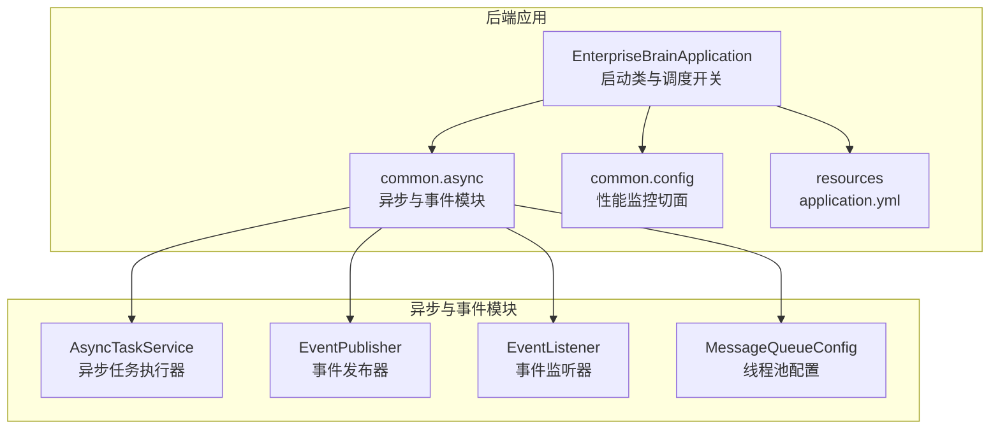
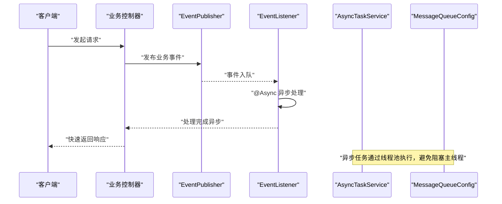
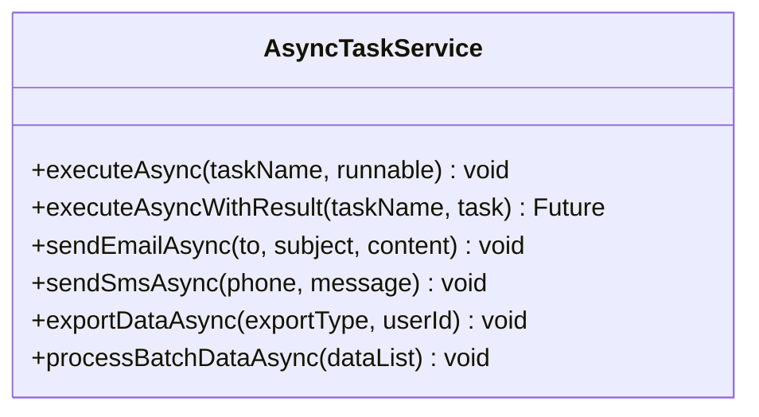
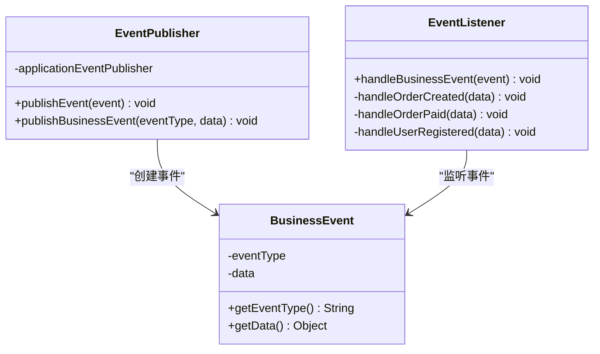
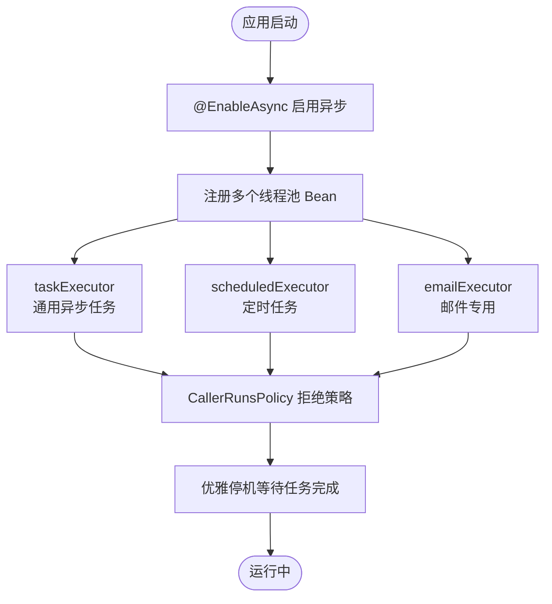
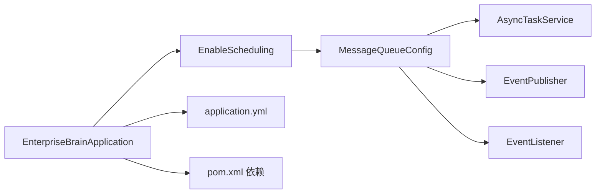

# 异步处理与事件驱动

<cite>
**本文引用的文件**
- [08-backend/src/main/java/com/enterprise/brain/EnterpriseBrainApplication.java](file://08-backend/src/main/java/com/enterprise/brain/EnterpriseBrainApplication.java)
- [08-backend/src/main/java/com/enterprise/brain/common/async/AsyncTaskService.java](file://08-backend/src/main/java/com/enterprise/brain/common/async/AsyncTaskService.java)
- [08-backend/src/main/java/com/enterprise/brain/common/async/EventListener.java](file://08-backend/src/main/java/com/enterprise/brain/common/async/EventListener.java)
- [08-backend/src/main/java/com/enterprise/brain/common/async/EventPublisher.java](file://08-backend/src/main/java/com/enterprise/brain/common/async/EventPublisher.java)
- [08-backend/src/main/java/com/enterprise/brain/common/async/MessageQueueConfig.java](file://08-backend/src/main/java/com/enterprise/brain/common/async/MessageQueueConfig.java)
- [08-backend/src/main/java/com/enterprise/brain/common/config/PerformanceMonitorAspect.java](file://08-backend/src/main/java/com/enterprise/brain/common/config/PerformanceMonitorAspect.java)
- [08-backend/src/main/resources/application.yml](file://08-backend/src/main/resources/application.yml)
- [08-backend/pom.xml](file://08-backend/pom.xml)
- [08-backend/src/main/java/com/enterprise/brain/modules/integration/messaging/entity/MessageLog.java](file://08-backend/src/main/java/com/enterprise/brain/modules/integration/messaging/entity/MessageLog.java)
- [08-backend/src/main/java/com/enterprise/brain/modules/integration/messaging/dto/response/MessageSendResponse.java](file://08-backend/src/main/java/com/enterprise/brain/modules/integration/messaging/dto/response/MessageSendResponse.java)
- [08-backend/src/main/java/com/enterprise/brain/modules/integration/messaging/service/SlackService.java](file://08-backend/src/main/java/com/enterprise/brain/modules/integration/messaging/service/SlackService.java)
</cite>

## 目录
1. [简介](#简介)
2. [项目结构](#项目结构)
3. [核心组件](#核心组件)
4. [架构总览](#架构总览)
5. [详细组件分析](#详细组件分析)
6. [依赖关系分析](#依赖关系分析)
7. [性能考量](#性能考量)
8. [故障排查指南](#故障排查指南)
9. [结论](#结论)
10. [附录](#附录)

## 简介
本文件围绕系统异步处理与事件驱动机制展开，重点解析以下方面：
- 基于 Spring 的异步任务执行器配置与使用
- 基于 Spring Event 的事件发布-订阅模式（EventPublisher 与 EventListener）
- 消息队列（MessageQueueConfig）的线程池配置与可靠性保障策略
- 实际应用场景（日志记录、邮件通知、数据同步等）与最佳实践
- 性能监控与错误重试机制的实现建议

## 项目结构
后端采用 Spring Boot 应用，异步与事件相关的核心代码位于 common.async 包中；应用入口启用调度能力；配置文件提供数据库、缓存、日志等基础环境参数。

图表来源
- [08-backend/src/main/java/com/enterprise/brain/EnterpriseBrainApplication.java](file://08-backend/src/main/java/com/enterprise/brain/EnterpriseBrainApplication.java#L1-L62)
- [08-backend/src/main/java/com/enterprise/brain/common/async/AsyncTaskService.java](file://08-backend/src/main/java/com/enterprise/brain/common/async/AsyncTaskService.java#L1-L149)
- [08-backend/src/main/java/com/enterprise/brain/common/async/EventPublisher.java](file://08-backend/src/main/java/com/enterprise/brain/common/async/EventPublisher.java#L1-L68)
- [08-backend/src/main/java/com/enterprise/brain/common/async/EventListener.java](file://08-backend/src/main/java/com/enterprise/brain/common/async/EventListener.java#L1-L72)
- [08-backend/src/main/java/com/enterprise/brain/common/async/MessageQueueConfig.java](file://08-backend/src/main/java/com/enterprise/brain/common/async/MessageQueueConfig.java#L1-L94)
- [08-backend/src/main/java/com/enterprise/brain/common/config/PerformanceMonitorAspect.java](file://08-backend/src/main/java/com/enterprise/brain/common/config/PerformanceMonitorAspect.java#L1-L89)
- [08-backend/src/main/resources/application.yml](file://08-backend/src/main/resources/application.yml#L1-L42)

章节来源
- [08-backend/src/main/java/com/enterprise/brain/EnterpriseBrainApplication.java](file://08-backend/src/main/java/com/enterprise/brain/EnterpriseBrainApplication.java#L1-L62)
- [08-backend/src/main/resources/application.yml](file://08-backend/src/main/resources/application.yml#L1-L42)

## 核心组件
- AsyncTaskService：提供多种异步执行能力，支持无返回值与有返回值任务，内置常见业务场景（邮件、短信、导出、批量数据处理），并记录执行耗时与错误日志。
- EventPublisher：封装 Spring ApplicationEventPublisher，提供统一事件发布接口，并定义业务事件载体 BusinessEvent。
- EventListener：基于 @EventListener 与 @Async 的事件监听器，按事件类型分派处理逻辑。
- MessageQueueConfig：通过 @EnableAsync 与多个线程池 Bean（taskExecutor、scheduledExecutor、emailExecutor）实现异步任务隔离与可靠性保障。
- PerformanceMonitorAspect：基于 Micrometer 的性能监控切面，对控制器与服务层方法进行执行时间统计与慢调用告警。

章节来源
- [08-backend/src/main/java/com/enterprise/brain/common/async/AsyncTaskService.java](file://08-backend/src/main/java/com/enterprise/brain/common/async/AsyncTaskService.java#L1-L149)
- [08-backend/src/main/java/com/enterprise/brain/common/async/EventPublisher.java](file://08-backend/src/main/java/com/enterprise/brain/common/async/EventPublisher.java#L1-L68)
- [08-backend/src/main/java/com/enterprise/brain/common/async/EventListener.java](file://08-backend/src/main/java/com/enterprise/brain/common/async/EventListener.java#L1-L72)
- [08-backend/src/main/java/com/enterprise/brain/common/async/MessageQueueConfig.java](file://08-backend/src/main/java/com/enterprise/brain/common/async/MessageQueueConfig.java#L1-L94)
- [08-backend/src/main/java/com/enterprise/brain/common/config/PerformanceMonitorAspect.java](file://08-backend/src/main/java/com/enterprise/brain/common/config/PerformanceMonitorAspect.java#L1-L89)

## 架构总览
系统采用“同步请求 + 异步处理 + 事件解耦”的架构模式：
- 控制器接收请求后，快速返回响应，将耗时或外部依赖操作放入异步任务或事件队列
- AsyncTaskService 提供统一的异步执行入口，支持不同粒度的任务
- EventPublisher 将业务事件发布到 Spring 事件总线，EventListener 异步消费事件并执行相应业务逻辑
- MessageQueueConfig 为异步任务提供线程池隔离与拒绝策略，确保系统稳定性
- PerformanceMonitorAspect 对关键路径进行性能观测，辅助定位瓶颈

图表来源
- [08-backend/src/main/java/com/enterprise/brain/common/async/EventPublisher.java](file://08-backend/src/main/java/com/enterprise/brain/common/async/EventPublisher.java#L1-L68)
- [08-backend/src/main/java/com/enterprise/brain/common/async/EventListener.java](file://08-backend/src/main/java/com/enterprise/brain/common/async/EventListener.java#L1-L72)
- [08-backend/src/main/java/com/enterprise/brain/common/async/AsyncTaskService.java](file://08-backend/src/main/java/com/enterprise/brain/common/async/AsyncTaskService.java#L1-L149)
- [08-backend/src/main/java/com/enterprise/brain/common/async/MessageQueueConfig.java](file://08-backend/src/main/java/com/enterprise/brain/common/async/MessageQueueConfig.java#L1-L94)

## 详细组件分析

### AsyncTaskService 异步任务执行器
- 功能要点
  - 提供 executeAsync 与 executeAsyncWithResult 两种异步执行入口，分别适用于无返回值与有返回值任务
  - 内置常用业务场景：sendEmailAsync、sendSmsAsync、exportDataAsync、processBatchDataAsync
  - 统一记录任务开始、结束与异常日志，并计算执行耗时
- 设计模式
  - 使用 @Async 注解开启异步执行，结合线程池配置实现并发控制
  - 通过 Future 返回值支持调用方获取异步结果
- 可扩展性
  - 可根据业务需要新增异步任务方法，遵循统一的日志与异常处理规范

图表来源
- [08-backend/src/main/java/com/enterprise/brain/common/async/AsyncTaskService.java](file://08-backend/src/main/java/com/enterprise/brain/common/async/AsyncTaskService.java#L1-L149)

章节来源
- [08-backend/src/main/java/com/enterprise/brain/common/async/AsyncTaskService.java](file://08-backend/src/main/java/com/enterprise/brain/common/async/AsyncTaskService.java#L1-L149)

### EventPublisher 与 EventListener 事件发布-订阅
- EventPublisher
  - 通过 ApplicationEventPublisher 发布事件，提供 publishEvent 与 publishBusinessEvent 两个入口
  - BusinessEvent 作为自定义事件载体，包含 eventType 与 data 字段
- EventListener
  - 使用 @EventListener 监听业务事件，@Async 异步处理
  - 根据 eventType 进行分支处理（如 ORDER_CREATED、ORDER_PAID、USER_REGISTERED），并记录日志
- 解耦优势
  - 发布方无需关心订阅方实现，降低模块间耦合
  - 异步监听提升整体吞吐与响应速度

图表来源
- [08-backend/src/main/java/com/enterprise/brain/common/async/EventPublisher.java](file://08-backend/src/main/java/com/enterprise/brain/common/async/EventPublisher.java#L1-L68)
- [08-backend/src/main/java/com/enterprise/brain/common/async/EventListener.java](file://08-backend/src/main/java/com/enterprise/brain/common/async/EventListener.java#L1-L72)

章节来源
- [08-backend/src/main/java/com/enterprise/brain/common/async/EventPublisher.java](file://08-backend/src/main/java/com/enterprise/brain/common/async/EventPublisher.java#L1-L68)
- [08-backend/src/main/java/com/enterprise/brain/common/async/EventListener.java](file://08-backend/src/main/java/com/enterprise/brain/common/async/EventListener.java#L1-L72)

### MessageQueueConfig 线程池配置与可靠性保障
- 线程池隔离
  - taskExecutor：通用异步任务线程池，核心/最大线程数与队列容量适配高并发场景
  - scheduledExecutor：定时任务专用线程池，避免与普通异步任务互相影响
  - emailExecutor：邮件发送专用线程池，隔离外部依赖波动
- 拒绝策略
  - CallerRunsPolicy：当线程池饱和时，由调用线程执行任务，避免任务丢失，提高系统稳定性
- 关闭策略
  - waitForTasksToCompleteOnShutdown 与 awaitTerminationSeconds：优雅停机，等待任务完成
- 启用异步
  - @EnableAsync 开启异步注解扫描，使 @Async 生效

图表来源
- [08-backend/src/main/java/com/enterprise/brain/common/async/MessageQueueConfig.java](file://08-backend/src/main/java/com/enterprise/brain/common/async/MessageQueueConfig.java#L1-L94)

章节来源
- [08-backend/src/main/java/com/enterprise/brain/common/async/MessageQueueConfig.java](file://08-backend/src/main/java/com/enterprise/brain/common/async/MessageQueueConfig.java#L1-L94)

### 性能监控与错误重试机制
- 性能监控
  - PerformanceMonitorAspect 基于 Micrometer 对控制器与服务层方法进行环绕监控，记录执行时间并输出慢调用日志
  - 可扩展：将异步任务纳入监控范围，或对特定业务事件处理链路增加指标
- 错误重试
  - 当前代码未实现自动重试，建议在异步任务或事件监听处理中引入幂等设计与重试策略（例如指数退避、死信队列）
  - 对外部依赖（如邮件、短信平台）建议增加熔断与降级策略，避免雪崩效应

章节来源
- [08-backend/src/main/java/com/enterprise/brain/common/config/PerformanceMonitorAspect.java](file://08-backend/src/main/java/com/enterprise/brain/common/config/PerformanceMonitorAspect.java#L1-L89)

## 依赖关系分析
- 启动类与调度
  - EnterpriseBrainApplication 启用调度能力，为定时任务线程池提供运行环境
- 异步与事件
  - AsyncTaskService 与 EventPublisher/EventListener 通过线程池与 Spring 事件机制协同工作
- 配置与环境
  - application.yml 提供数据库、缓存、日志等基础配置，支撑异步与事件处理的持久化与可观测性
- 依赖声明
  - pom.xml 引入 Spring Boot Web、JPA、MyBatis Plus、OpenAPI、Lombok 等依赖，为异步与事件功能提供基础设施

图表来源
- [08-backend/src/main/java/com/enterprise/brain/EnterpriseBrainApplication.java](file://08-backend/src/main/java/com/enterprise/brain/EnterpriseBrainApplication.java#L1-L62)
- [08-backend/src/main/java/com/enterprise/brain/common/async/MessageQueueConfig.java](file://08-backend/src/main/java/com/enterprise/brain/common/async/MessageQueueConfig.java#L1-L94)
- [08-backend/src/main/resources/application.yml](file://08-backend/src/main/resources/application.yml#L1-L42)
- [08-backend/pom.xml](file://08-backend/pom.xml#L1-L115)

章节来源
- [08-backend/src/main/java/com/enterprise/brain/EnterpriseBrainApplication.java](file://08-backend/src/main/java/com/enterprise/brain/EnterpriseBrainApplication.java#L1-L62)
- [08-backend/src/main/resources/application.yml](file://08-backend/src/main/resources/application.yml#L1-L42)
- [08-backend/pom.xml](file://08-backend/pom.xml#L1-L115)

## 性能考量
- 线程池参数调优
  - 根据 CPU 核心数与任务特征设置核心/最大线程数与队列容量，避免频繁拒绝与上下文切换
  - 对邮件等外部依赖任务使用独立线程池，防止阻塞其他业务
- 监控与告警
  - 借助 PerformanceMonitorAspect 输出慢调用日志，结合指标系统（Micrometer）建立告警
  - 对异步任务执行时间、拒绝次数、队列长度等关键指标进行可视化
- 限流与熔断
  - 对外部依赖（邮件、短信、第三方平台）实施限流与熔断，避免系统被拖垮
- 幂等与去重
  - 在事件处理与异步任务中加入幂等校验，避免重复执行造成资源浪费

## 故障排查指南
- 日志定位
  - 异步任务与事件监听均记录开始、结束与异常日志，优先查看对应任务/事件的错误堆栈
- 线程池饱和
  - 若出现大量 CallerRunsPolicy 拒绝，需评估线程池参数或任务拆分策略
- 事件未触发
  - 确认 @EnableAsync 已生效，且 EventPublisher 与 EventListener 在同一应用上下文中
- 外部依赖失败
  - 对邮件/短信等外部调用增加重试与降级策略，并记录 MessageLog 实体以便追踪

章节来源
- [08-backend/src/main/java/com/enterprise/brain/common/async/AsyncTaskService.java](file://08-backend/src/main/java/com/enterprise/brain/common/async/AsyncTaskService.java#L1-L149)
- [08-backend/src/main/java/com/enterprise/brain/common/async/EventListener.java](file://08-backend/src/main/java/com/enterprise/brain/common/async/EventListener.java#L1-L72)
- [08-backend/src/main/java/com/enterprise/brain/common/async/MessageQueueConfig.java](file://08-backend/src/main/java/com/enterprise/brain/common/async/MessageQueueConfig.java#L1-L94)
- [08-backend/src/main/java/com/enterprise/brain/modules/integration/messaging/entity/MessageLog.java](file://08-backend/src/main/java/com/enterprise/brain/modules/integration/messaging/entity/MessageLog.java#L1-L59)

## 结论
本系统通过 Spring 异步与事件机制实现了高内聚、低耦合的异步处理体系：
- AsyncTaskService 提供统一的异步执行入口，覆盖常见业务场景
- EventPublisher/EventListener 基于 Spring 事件实现发布-订阅解耦
- MessageQueueConfig 通过多线程池隔离与拒绝策略保障可靠性
- 结合 PerformanceMonitorAspect，形成可观测、可调优的异步处理闭环

建议后续完善错误重试、熔断降级与指标可视化，进一步提升系统韧性与可维护性。

## 附录
- 实际应用场景
  - 日志记录：将耗时日志写入异步队列，避免阻塞主流程
  - 邮件通知：通过 emailExecutor 线程池异步发送，记录 MessageLog
  - 数据同步：将跨系统同步任务放入异步队列，结合幂等与重试策略
  - 报表导出：异步导出完成后通知用户下载链接
- 参考实体与接口
  - MessageLog：消息发送日志实体，记录发送状态与错误信息
  - MessageSendResponse：消息发送响应结构
  - SlackService：Slack 消息发送接口，便于扩展第三方消息平台

章节来源
- [08-backend/src/main/java/com/enterprise/brain/modules/integration/messaging/entity/MessageLog.java](file://08-backend/src/main/java/com/enterprise/brain/modules/integration/messaging/entity/MessageLog.java#L1-L59)
- [08-backend/src/main/java/com/enterprise/brain/modules/integration/messaging/dto/response/MessageSendResponse.java](file://08-backend/src/main/java/com/enterprise/brain/modules/integration/messaging/dto/response/MessageSendResponse.java#L1-L16)
- [08-backend/src/main/java/com/enterprise/brain/modules/integration/messaging/service/SlackService.java](file://08-backend/src/main/java/com/enterprise/brain/modules/integration/messaging/service/SlackService.java#L1-L42)