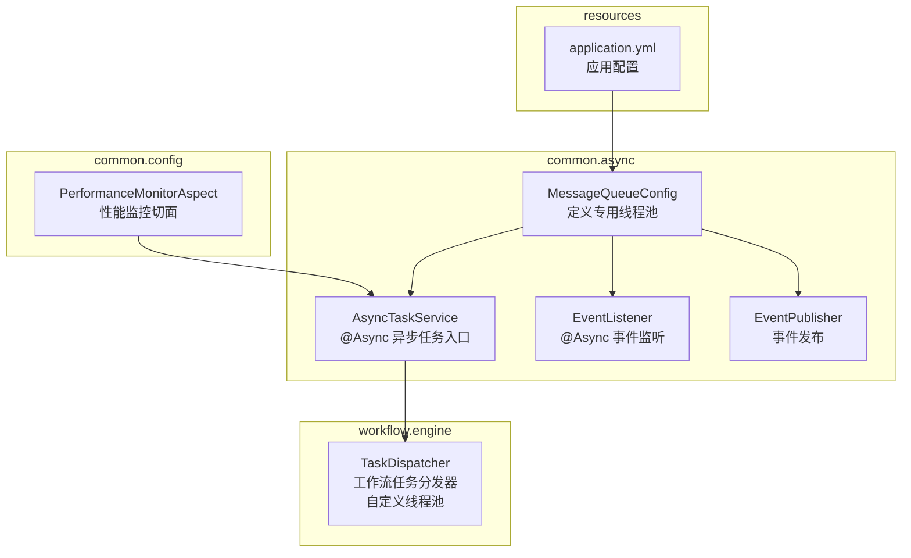
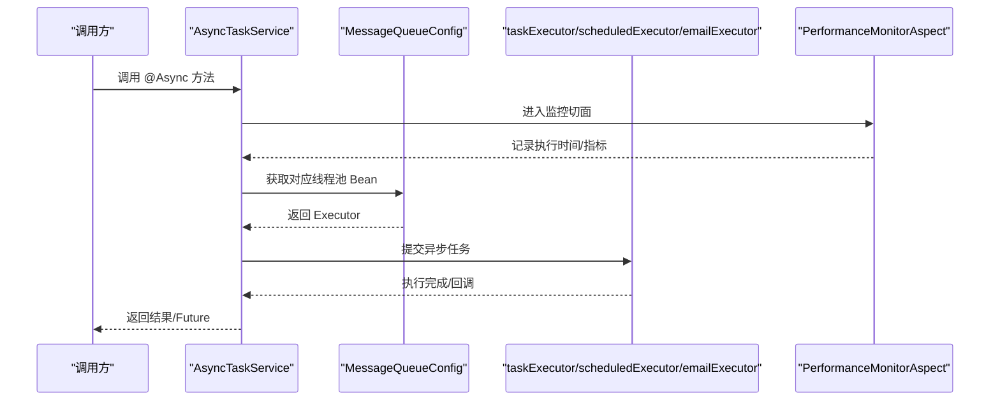
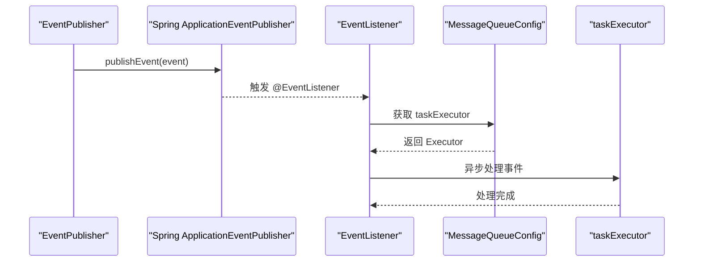
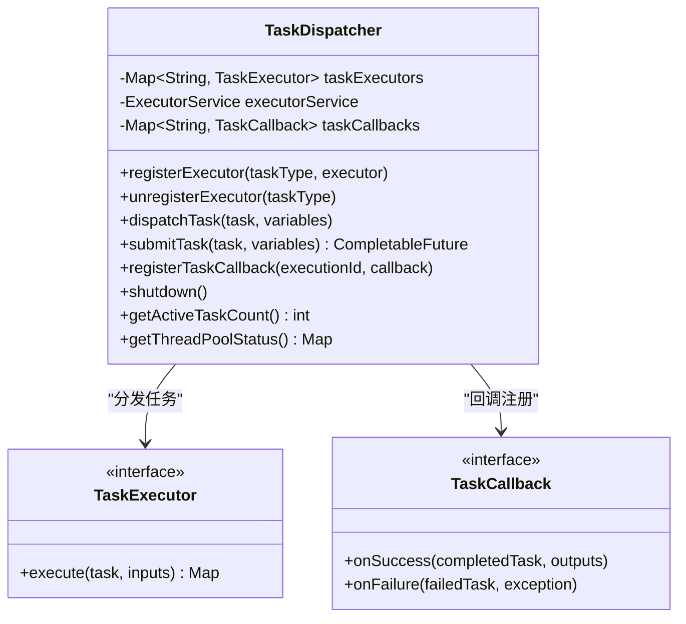
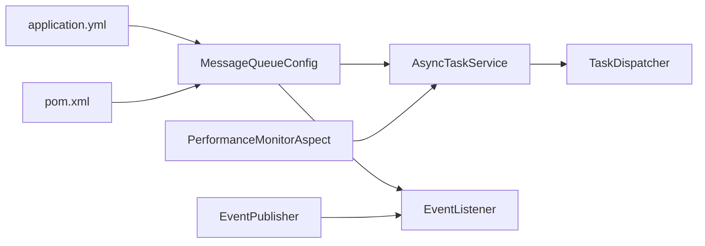

# 线程池配置与管理

<cite>
**本文引用的文件**
- [MessageQueueConfig.java](file://08-backend/src/main/java/com/enterprise/brain/common/async/MessageQueueConfig.java)
- [AsyncTaskService.java](file://08-backend/src/main/java/com/enterprise/brain/common/async/AsyncTaskService.java)
- [EventListener.java](file://08-backend/src/main/java/com/enterprise/brain/common/async/EventListener.java)
- [EventPublisher.java](file://08-backend/src/main/java/com/enterprise/brain/common/async/EventPublisher.java)
- [TaskDispatcher.java](file://08-backend/src/main/java/com/enterprise/brain/modules/workflow/engine/TaskDispatcher.java)
- [PerformanceMonitorAspect.java](file://08-backend/src/main/java/com/enterprise/brain/common/config/PerformanceMonitorAspect.java)
- [application.yml](file://08-backend/src/main/resources/application.yml)
- [pom.xml](file://08-backend/pom.xml)
</cite>

## 目录
1. [简介](#简介)
2. [项目结构](#项目结构)
3. [核心组件](#核心组件)
4. [架构总览](#架构总览)
5. [详细组件分析](#详细组件分析)
6. [依赖关系分析](#依赖关系分析)
7. [性能考量](#性能考量)
8. [故障排查指南](#故障排查指南)
9. [结论](#结论)
10. [附录](#附录)

## 简介
本文件围绕 MessageQueueConfig 中定义的多专用线程池进行深入解析，重点说明：
- taskExecutor 线程池的配置参数（核心线程数、最大线程数、队列容量、空闲时间、拒绝策略等）及其对系统性能的影响；
- scheduledExecutor 定时任务线程池与 emailExecutor 邮件发送线程池的独立配置策略；
- 为什么需要为不同类型的异步任务创建专用线程池；
- @EnableAsync 注解的作用机制以及线程池初始化过程；
- 线程池监控、调优建议与故障排查方法。

## 项目结构
本项目的线程池相关实现主要集中在后端模块的 common.async 包中，并在 workflow.engine 包中存在一个自定义的线程池用于工作流任务分发。同时，应用通过 Spring Boot 的 @EnableAsync 启用异步支持，并通过 Aspect 进行性能监控。

图表来源
- [MessageQueueConfig.java](file://08-backend/src/main/java/com/enterprise/brain/common/async/MessageQueueConfig.java#L1-L93)
- [AsyncTaskService.java](file://08-backend/src/main/java/com/enterprise/brain/common/async/AsyncTaskService.java#L1-L149)
- [EventListener.java](file://08-backend/src/main/java/com/enterprise/brain/common/async/EventListener.java#L1-L46)
- [EventPublisher.java](file://08-backend/src/main/java/com/enterprise/brain/common/async/EventPublisher.java#L1-L67)
- [TaskDispatcher.java](file://08-backend/src/main/java/com/enterprise/brain/modules/workflow/engine/TaskDispatcher.java#L1-L266)
- [PerformanceMonitorAspect.java](file://08-backend/src/main/java/com/enterprise/brain/common/config/PerformanceMonitorAspect.java#L1-L112)
- [application.yml](file://08-backend/src/main/resources/application.yml#L1-L42)

章节来源
- [MessageQueueConfig.java](file://08-backend/src/main/java/com/enterprise/brain/common/async/MessageQueueConfig.java#L1-L93)
- [AsyncTaskService.java](file://08-backend/src/main/java/com/enterprise/brain/common/async/AsyncTaskService.java#L1-L149)
- [TaskDispatcher.java](file://08-backend/src/main/java/com/enterprise/brain/modules/workflow/engine/TaskDispatcher.java#L1-L266)
- [PerformanceMonitorAspect.java](file://08-backend/src/main/java/com/enterprise/brain/common/config/PerformanceMonitorAspect.java#L1-L112)
- [application.yml](file://08-backend/src/main/resources/application.yml#L1-L42)

## 核心组件
- 专用线程池配置：MessageQueueConfig 使用 @EnableAsync 开启异步支持，并定义了三个 Bean：
  - taskExecutor：通用异步任务线程池
  - scheduledExecutor：定时任务线程池
  - emailExecutor：邮件发送线程池
- 异步任务入口：AsyncTaskService 提供多种 @Async 方法，用于执行异步任务、发送邮件、短信、导出数据、批量处理等。
- 事件驱动：EventPublisher 发布业务事件，EventListener 接收并异步处理。
- 工作流任务分发：TaskDispatcher 自定义线程池，负责将工作流任务异步分发给相应执行器。
- 性能监控：PerformanceMonitorAspect 对控制器与服务层方法执行时间进行监控与指标采集。

章节来源
- [MessageQueueConfig.java](file://08-backend/src/main/java/com/enterprise/brain/common/async/MessageQueueConfig.java#L1-L93)
- [AsyncTaskService.java](file://08-backend/src/main/java/com/enterprise/brain/common/async/AsyncTaskService.java#L1-L149)
- [EventListener.java](file://08-backend/src/main/java/com/enterprise/brain/common/async/EventListener.java#L1-L46)
- [EventPublisher.java](file://08-backend/src/main/java/com/enterprise/brain/common/async/EventPublisher.java#L1-L67)
- [TaskDispatcher.java](file://08-backend/src/main/java/com/enterprise/brain/modules/workflow/engine/TaskDispatcher.java#L1-L266)
- [PerformanceMonitorAspect.java](file://08-backend/src/main/java/com/enterprise/brain/common/config/PerformanceMonitorAspect.java#L1-L112)

## 架构总览
下图展示了异步任务从入口到执行的整体流程，以及专用线程池的角色分工。

图表来源
- [AsyncTaskService.java](file://08-backend/src/main/java/com/enterprise/brain/common/async/AsyncTaskService.java#L1-L149)
- [MessageQueueConfig.java](file://08-backend/src/main/java/com/enterprise/brain/common/async/MessageQueueConfig.java#L1-L93)
- [PerformanceMonitorAspect.java](file://08-backend/src/main/java/com/enterprise/brain/common/config/PerformanceMonitorAspect.java#L1-L112)

## 详细组件分析

### 专用线程池配置与参数说明
MessageQueueConfig 定义了三类专用线程池，分别服务于不同类型的异步任务，避免相互影响。

- taskExecutor（通用异步任务）
  - 核心线程数：10
  - 最大线程数：20
  - 队列容量：200
  - 空闲存活时间：60 秒
  - 线程名前缀：async-task-
  - 拒绝策略：CallerRunsPolicy（调用线程直接执行）
  - 关闭策略：等待任务完成再关闭，超时时间 60 秒
  - 初始化：显式 initialize()

- scheduledExecutor（定时任务）
  - 核心线程数：5
  - 最大线程数：10
  - 队列容量：50
  - 空闲存活时间：60 秒
  - 线程名前缀：scheduled-task-
  - 拒绝策略：CallerRunsPolicy
  - 关闭策略：等待任务完成再关闭，超时时间 60 秒
  - 初始化：显式 initialize()

- emailExecutor（邮件发送）
  - 核心线程数：3
  - 最大线程数：5
  - 队列容量：100
  - 空闲存活时间：60 秒
  - 线程名前缀：email-task-
  - 拒绝策略：CallerRunsPolicy
  - 初始化：显式 initialize()

这些参数的选择体现了对不同任务类型的差异化需求：
- 通用异步任务通常并发较高且持续性强，因此较大的核心与最大线程数、较大的队列容量，有助于吞吐与稳定性。
- 定时任务通常周期性、可预期，较小的核心与最大线程数即可满足需求，避免过度占用资源。
- 邮件发送属于 IO 密集型任务，线程数较小即可，但需保证队列容量以应对突发流量。

章节来源
- [MessageQueueConfig.java](file://08-backend/src/main/java/com/enterprise/brain/common/async/MessageQueueConfig.java#L1-L93)

### @EnableAsync 注解与线程池初始化
- @EnableAsync 在配置类上启用 Spring 的异步支持，使标注了 @Async 的方法能够被异步调度执行。
- 线程池 Bean 通过 ThreadPoolTaskExecutor 定义，并设置核心参数后调用 initialize() 完成初始化。
- Spring 默认会使用名为 taskExecutor 的线程池；若需要指定其他线程池，可在 @Async 注解中通过 value 或 executor 参数绑定到具体 Bean 名称（如 scheduledExecutor、emailExecutor）。

章节来源
- [MessageQueueConfig.java](file://08-backend/src/main/java/com/enterprise/brain/common/async/MessageQueueConfig.java#L1-L93)

### 异步任务入口与事件驱动
- AsyncTaskService 提供多种 @Async 方法，覆盖无返回值与有返回值两类场景，并包含邮件、短信、导出、批量处理等典型异步任务。
- EventPublisher 用于发布业务事件，EventListener 通过 @Async 接收并处理，实现事件驱动的异步处理。

图表来源
- [EventPublisher.java](file://08-backend/src/main/java/com/enterprise/brain/common/async/EventPublisher.java#L1-L67)
- [EventListener.java](file://08-backend/src/main/java/com/enterprise/brain/common/async/EventListener.java#L1-L46)
- [MessageQueueConfig.java](file://08-backend/src/main/java/com/enterprise/brain/common/async/MessageQueueConfig.java#L1-L93)

章节来源
- [AsyncTaskService.java](file://08-backend/src/main/java/com/enterprise/brain/common/async/AsyncTaskService.java#L1-L149)
- [EventPublisher.java](file://08-backend/src/main/java/com/enterprise/brain/common/async/EventPublisher.java#L1-L67)
- [EventListener.java](file://08-backend/src/main/java/com/enterprise/brain/common/async/EventListener.java#L1-L46)

### 工作流任务分发器的专用线程池
TaskDispatcher 在其内部创建了一个自定义的 ExecutorService，用于工作流任务的异步执行。该线程池具备以下特点：
- 核心线程数：等于 CPU 核心数
- 最大线程数：核心数的 2 倍
- 队列：LinkedBlockingQueue，容量 1000
- 拒绝策略：CallerRunsPolicy
- 提供线程池状态查询与优雅关闭能力

图表来源
- [TaskDispatcher.java](file://08-backend/src/main/java/com/enterprise/brain/modules/workflow/engine/TaskDispatcher.java#L1-L266)

章节来源
- [TaskDispatcher.java](file://08-backend/src/main/java/com/enterprise/brain/modules/workflow/engine/TaskDispatcher.java#L1-L266)

### 线程池监控与性能指标
- PerformanceMonitorAspect 对控制器与服务层方法执行时间进行监控，记录慢方法与错误指标，便于定位性能瓶颈。
- 该切面基于 Micrometer 的 Timer 与 Counter，将方法执行时间与错误次数上报至指标系统，便于后续可视化与告警。

章节来源
- [PerformanceMonitorAspect.java](file://08-backend/src/main/java/com/enterprise/brain/common/config/PerformanceMonitorAspect.java#L1-L112)

## 依赖关系分析
- MessageQueueConfig 作为配置类，定义了三个线程池 Bean，并通过 @EnableAsync 启用异步功能。
- AsyncTaskService、EventListener 通过 @Async 使用线程池执行异步任务。
- EventPublisher 与 EventListener 形成事件发布与订阅链路，进一步体现异步化设计。
- TaskDispatcher 自定义线程池用于工作流引擎的任务执行，与 Spring 的线程池配置互补。
- application.yml 提供基础应用配置，pom.xml 提供依赖与构建信息。

图表来源
- [MessageQueueConfig.java](file://08-backend/src/main/java/com/enterprise/brain/common/async/MessageQueueConfig.java#L1-L93)
- [AsyncTaskService.java](file://08-backend/src/main/java/com/enterprise/brain/common/async/AsyncTaskService.java#L1-L149)
- [EventListener.java](file://08-backend/src/main/java/com/enterprise/brain/common/async/EventListener.java#L1-L46)
- [EventPublisher.java](file://08-backend/src/main/java/com/enterprise/brain/common/async/EventPublisher.java#L1-L67)
- [TaskDispatcher.java](file://08-backend/src/main/java/com/enterprise/brain/modules/workflow/engine/TaskDispatcher.java#L1-L266)
- [PerformanceMonitorAspect.java](file://08-backend/src/main/java/com/enterprise/brain/common/config/PerformanceMonitorAspect.java#L1-L112)
- [application.yml](file://08-backend/src/main/resources/application.yml#L1-L42)
- [pom.xml](file://08-backend/pom.xml#L1-L115)

章节来源
- [MessageQueueConfig.java](file://08-backend/src/main/java/com/enterprise/brain/common/async/MessageQueueConfig.java#L1-L93)
- [AsyncTaskService.java](file://08-backend/src/main/java/com/enterprise/brain/common/async/AsyncTaskService.java#L1-L149)
- [EventListener.java](file://08-backend/src/main/java/com/enterprise/brain/common/async/EventListener.java#L1-L46)
- [EventPublisher.java](file://08-backend/src/main/java/com/enterprise/brain/common/async/EventPublisher.java#L1-L67)
- [TaskDispatcher.java](file://08-backend/src/main/java/com/enterprise/brain/modules/workflow/engine/TaskDispatcher.java#L1-L266)
- [PerformanceMonitorAspect.java](file://08-backend/src/main/java/com/enterprise/brain/common/config/PerformanceMonitorAspect.java#L1-L112)
- [application.yml](file://08-backend/src/main/resources/application.yml#L1-L42)
- [pom.xml](file://08-backend/pom.xml#L1-L115)

## 性能考量
- 线程池参数与任务类型匹配
  - 通用异步任务（taskExecutor）：较高的核心与最大线程数、较大的队列容量，适合高并发与长尾延迟场景。
  - 定时任务（scheduledExecutor）：较小的核心与最大线程数，避免与通用任务争抢资源。
  - 邮件发送（emailExecutor）：IO 密集型，线程数较小但队列容量适中，防止突发邮件洪峰导致阻塞。
- 拒绝策略
  - CallerRunsPolicy 将拒绝的任务交由调用线程执行，有助于保护系统稳定性，避免任务丢失，但可能增加调用方延迟。
- 关闭与优雅停机
  - 通用线程池设置了等待任务完成再关闭，并设定超时时间，确保在应用关闭时尽量完成未决任务。
- 监控与指标
  - 使用 PerformanceMonitorAspect 对关键路径进行监控，结合 Micrometer 指标，可快速定位热点与异常。
- 资源隔离
  - 不同类型任务使用专用线程池，避免互相干扰，提升整体吞吐与稳定性。

[本节为通用性能讨论，不直接分析具体文件]

## 故障排查指南
- 线程池饱和与拒绝
  - 现象：任务长时间排队或被拒绝。
  - 排查：检查队列容量与线程数是否合理；确认拒绝策略是否为 CallerRunsPolicy；观察调用线程延迟是否上升。
  - 建议：适当增大核心/最大线程数或队列容量；优化任务粒度；拆分更细的线程池。
- 死锁与饥饿
  - 现象：部分任务长期无法执行。
  - 排查：检查线程池参数与任务特性；确认是否存在同步阻塞或循环依赖。
  - 建议：避免在异步任务中进行阻塞操作；合理划分任务边界。
- 资源泄漏
  - 现象：线程数持续增长、内存占用上升。
  - 排查：确认线程池是否正确关闭；检查任务是否异常退出未清理。
  - 建议：使用优雅停机策略；确保异常处理完善。
- 监控与告警
  - 使用 PerformanceMonitorAspect 记录慢方法与错误指标，结合指标系统进行告警。
  - 对工作流线程池，可通过 TaskDispatcher 的状态查询接口获取当前活跃任务数与队列长度，辅助判断负载。

章节来源
- [MessageQueueConfig.java](file://08-backend/src/main/java/com/enterprise/brain/common/async/MessageQueueConfig.java#L1-L93)
- [TaskDispatcher.java](file://08-backend/src/main/java/com/enterprise/brain/modules/workflow/engine/TaskDispatcher.java#L237-L255)
- [PerformanceMonitorAspect.java](file://08-backend/src/main/java/com/enterprise/brain/common/config/PerformanceMonitorAspect.java#L1-L112)

## 结论
通过为不同类型的异步任务配置专用线程池，系统实现了资源隔离与性能优化。MessageQueueConfig 的参数设计兼顾了吞吐、稳定性与可维护性；@EnableAsync 与 @Async 的配合使得异步任务的接入简单直观；结合 PerformanceMonitorAspect 的监控能力，可以有效支撑生产环境的可观测性与故障定位。对于工作流引擎，TaskDispatcher 的自定义线程池提供了更强的控制力与扩展性。

[本节为总结性内容，不直接分析具体文件]

## 附录
- 线程池参数调优建议
  - 通用异步任务（taskExecutor）：在峰值 QPS 下，确保队列长度不超过阈值；若出现频繁拒绝，考虑适度提高核心/最大线程数或队列容量。
  - 定时任务（scheduledExecutor）：保持较小线程数，避免与通用任务竞争；关注任务执行时间波动，必要时拆分为多个调度器。
  - 邮件发送（emailExecutor）：根据 SMTP 服务器并发限制与网络状况调整线程数；监控失败率与重试次数。
- 线程池监控要点
  - 关注活跃线程数、队列长度、完成任务计数与拒绝次数；
  - 对慢方法与错误进行分级告警；
  - 结合业务指标（如请求延迟、成功率）进行关联分析。

[本节为通用指导，不直接分析具体文件]