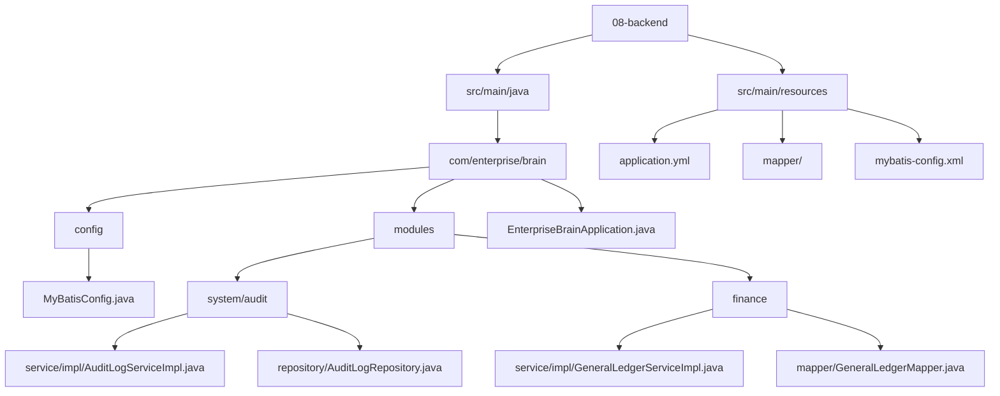
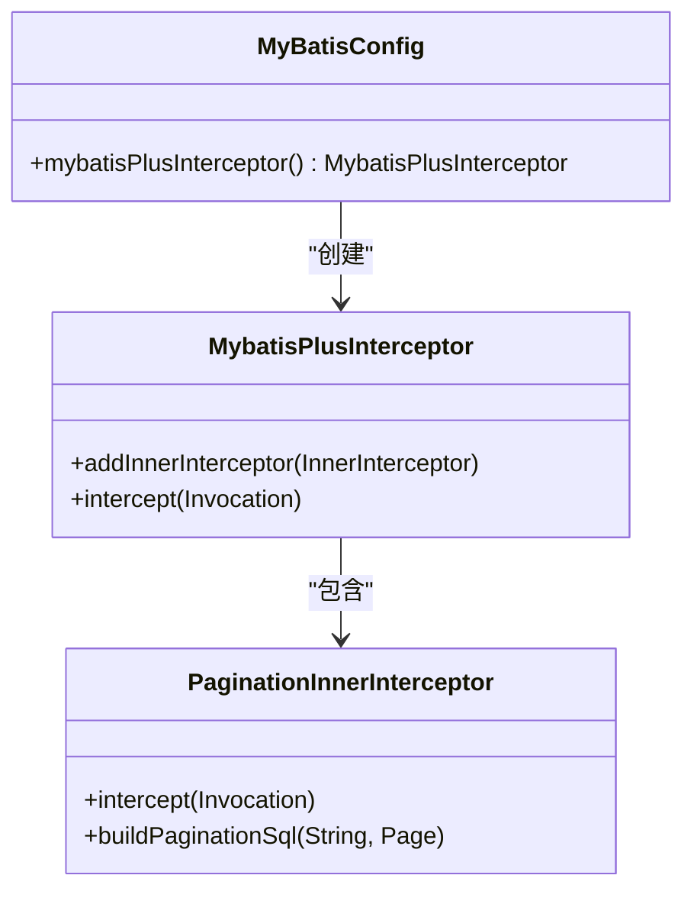
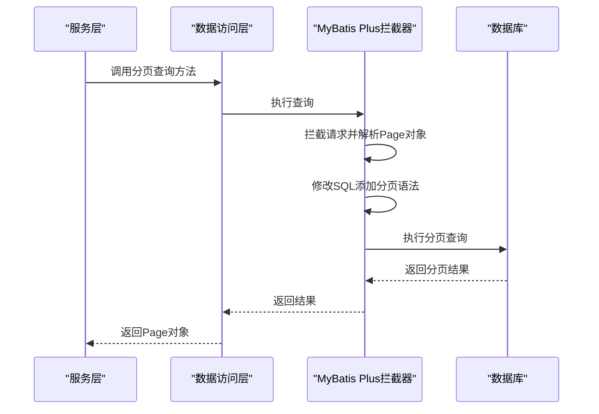
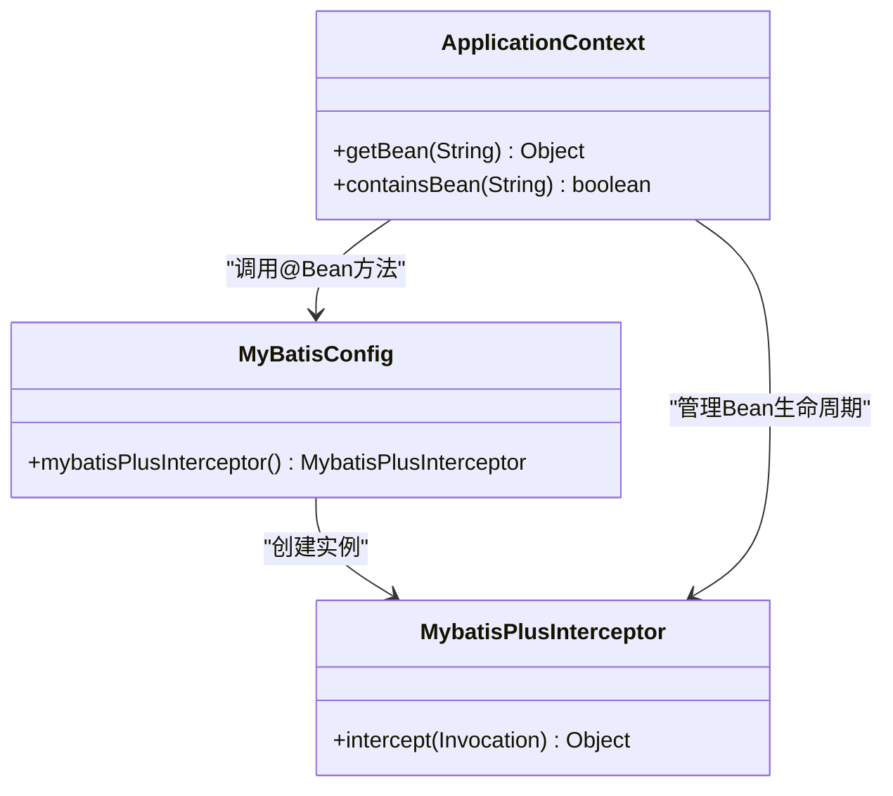
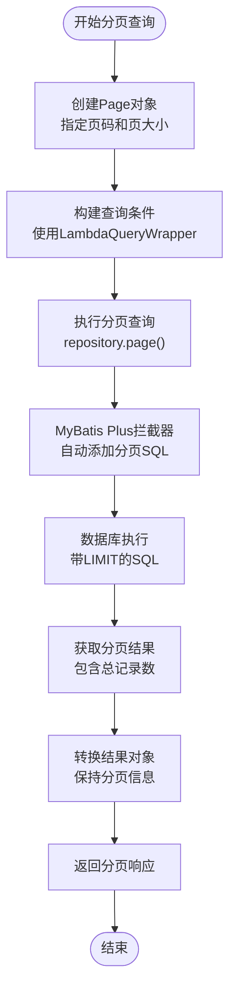

# ORM框架配置

<cite>
**本文档中引用的文件**   
- [MyBatisConfig.java](file://08-backend/src/main/java/com/enterprise/brain/config/MyBatisConfig.java)
- [pom.xml](file://08-backend/pom.xml)
- [application.yml](file://08-backend/src/main/resources/application.yml)
- [EnterpriseBrainApplication.java](file://08-backend/src/main/java/com/enterprise/brain/EnterpriseBrainApplication.java)
- [AuditLogServiceImpl.java](file://08-backend/src/main/java/com/enterprise/brain/modules/system/audit/service/impl/AuditLogServiceImpl.java)
- [GeneralLedgerServiceImpl.java](file://08-backend/src/main/java/com/enterprise/brain/modules/finance/service/impl/GeneralLedgerServiceImpl.java)
- [AuditLogRepository.java](file://08-backend/src/main/java/com/enterprise/brain/modules/system/audit/repository/AuditLogRepository.java)
- [GeneralLedgerMapper.java](file://08-backend/src/main/java/com/enterprise/brain/modules/finance/mapper/GeneralLedgerMapper.java)
</cite>

## 目录
1. [项目结构](#项目结构)
2. [核心配置分析](#核心配置分析)
3. [MyBatis Plus拦截器配置](#mybatis-plus拦截器配置)
4. [分页插件工作机制](#分页插件工作机制)
5. [Spring配置注解解析](#spring配置注解解析)
6. [MyBatis Plus与Spring Boot集成原理](#mybatis-plus与spring-boot集成原理)
7. [实际分页功能应用示例](#实际分页功能应用示例)
8. [配置扩展建议](#配置扩展建议)

## 项目结构

本项目采用典型的Spring Boot多模块架构，后端服务基于Java技术栈构建，使用MyBatis Plus作为ORM框架。项目结构清晰地分离了配置、模块、实体、服务和数据访问层。



**Diagram sources**
- [MyBatisConfig.java](file://08-backend/src/main/java/com/enterprise/brain/config/MyBatisConfig.java)
- [EnterpriseBrainApplication.java](file://08-backend/src/main/java/com/enterprise/brain/EnterpriseBrainApplication.java)
- [application.yml](file://08-backend/src/main/resources/application.yml)

**Section sources**
- [MyBatisConfig.java](file://08-backend/src/main/java/com/enterprise/brain/config/MyBatisConfig.java)
- [EnterpriseBrainApplication.java](file://08-backend/src/main/java/com/enterprise/brain/EnterpriseBrainApplication.java)

## 核心配置分析

项目通过Spring Boot的自动装配机制集成MyBatis Plus框架，核心配置集中在MyBatisConfig.java文件中。该配置类定义了MyBatis Plus拦截器，特别是分页插件的注册。



**Diagram sources**
- [MyBatisConfig.java](file://08-backend/src/main/java/com/enterprise/brain/config/MyBatisConfig.java)

**Section sources**
- [MyBatisConfig.java](file://08-backend/src/main/java/com/enterprise/brain/config/MyBatisConfig.java)

## MyBatis Plus拦截器配置

MyBatis Plus通过拦截器机制实现各种增强功能，其中分页功能由PaginationInnerInterceptor提供。在MyBatisConfig.java中，通过@Configuration注解定义配置类，并使用@Bean注解将MybatisPlusInterceptor实例注入Spring容器。

```java
@Configuration
public class MyBatisConfig {
    @Bean
    public MybatisPlusInterceptor mybatisPlusInterceptor() {
        MybatisPlusInterceptor interceptor = new MybatisPlusInterceptor();
        // 添加分页插件
        interceptor.addInnerInterceptor(new PaginationInnerInterceptor());
        return interceptor;
    }
}
```

此配置创建了一个MybatisPlusInterceptor实例，并向其中添加了PaginationInnerInterceptor分页插件。当MyBatis执行SQL查询时，该拦截器会自动拦截请求，根据Page对象中的分页参数（当前页码和每页大小）动态修改SQL语句，添加LIMIT和OFFSET子句。

**Section sources**
- [MyBatisConfig.java](file://08-backend/src/main/java/com/enterprise/brain/config/MyBatisConfig.java)

## 分页插件工作机制

MyBatis Plus的分页插件通过AOP（面向切面编程）机制在SQL执行前进行拦截，自动为查询语句添加分页相关的SQL片段。分页功能的实现不依赖于手动编写LIMIT语句，而是通过Page对象传递分页参数。

分页插件的工作流程如下：
1. 服务层创建Page对象，指定当前页码和每页记录数
2. 将Page对象传递给Mapper层的分页查询方法
3. MyBatis Plus拦截器拦截查询请求
4. 拦截器解析Page对象中的分页参数
5. 动态修改原始SQL，添加数据库特定的分页语法（如MySQL的LIMIT）
6. 执行修改后的SQL并返回分页结果



**Diagram sources**
- [MyBatisConfig.java](file://08-backend/src/main/java/com/enterprise/brain/config/MyBatisConfig.java)
- [AuditLogServiceImpl.java](file://08-backend/src/main/java/com/enterprise/brain/modules/system/audit/service/impl/AuditLogServiceImpl.java)

## Spring配置注解解析

@Configuration和@Bean是Spring框架中用于组件配置的核心注解，它们在MyBatis Plus集成中扮演着关键角色。

### @Configuration注解

@Configuration注解标识一个类为Spring的配置类，相当于XML配置文件。被@Configuration注解的类会被Spring容器识别为配置源，其中定义的@Bean方法会被容器调用以创建和管理Bean实例。

在本项目中，MyBatisConfig类使用@Configuration注解，表明它是一个配置类，负责配置MyBatis Plus相关的Bean。

### @Bean注解

@Bean注解用于方法上，指示该方法返回一个应被注册为Spring容器中Bean的对象。@Bean注解的方法通常在@Configuration类中定义，Spring容器会在启动时调用这些方法，并将返回的对象纳入容器管理。

在MyBatisConfig.java中，mybatisPlusInterceptor()方法使用@Bean注解，确保创建的MybatisPlusInterceptor实例被注入到Spring应用上下文中，供MyBatis Plus框架使用。



**Diagram sources**
- [MyBatisConfig.java](file://08-backend/src/main/java/com/enterprise/brain/config/MyBatisConfig.java)

**Section sources**
- [MyBatisConfig.java](file://08-backend/src/main/java/com/enterprise/brain/config/MyBatisConfig.java)

## MyBatis Plus与Spring Boot集成原理

MyBatis Plus与Spring Boot的集成基于自动装配（Auto-configuration）机制。当项目引入mybatis-plus-boot-starter依赖后，Spring Boot会自动配置MyBatis Plus所需的各种组件。

### 集成关键点

1. **自动配置类**：mybatis-plus-boot-starter提供了MybatisPlusAutoConfiguration类，自动配置SqlSessionFactory、SqlSessionTemplate等核心组件
2. **Starter依赖**：项目pom.xml中引入了mybatis-plus-boot-starter依赖，版本为3.5.3.1
3. **主应用类扫描**：EnterpriseBrainApplication.java使用@MapperScan注解指定Mapper接口的扫描路径
4. **配置优先级**：项目自定义的MyBatisConfig.java会覆盖自动配置中的相应设置

### 依赖配置

```xml
<dependency>
    <groupId>com.baomidou</groupId>
    <artifactId>mybatis-plus-boot-starter</artifactId>
    <version>3.5.3.1</version>
</dependency>
```

此依赖包含了MyBatis Plus核心功能以及与Spring Boot的集成支持，无需额外配置即可实现基本的ORM功能。

```mermaid
graph TD
A[Spring Boot应用] --> B[mybatis-plus-boot-starter]
B --> C[MyBatis Plus核心]
B --> D[Spring Boot自动装配]
D --> E[MybatisPlusAutoConfiguration]
E --> F[SqlSessionFactory]
E --> G[SqlSessionTemplate]
A --> H[MyBatisConfig.java]
H --> I[自定义拦截器配置]
I --> J[分页插件]
A --> K[@MapperScan]
K --> L[Mapper接口扫描]
```

**Diagram sources**
- [pom.xml](file://08-backend/pom.xml)
- [EnterpriseBrainApplication.java](file://08-backend/src/main/java/com/enterprise/brain/EnterpriseBrainApplication.java)
- [MyBatisConfig.java](file://08-backend/src/main/java/com/enterprise/brain/config/MyBatisConfig.java)

**Section sources**
- [pom.xml](file://08-backend/pom.xml)
- [EnterpriseBrainApplication.java](file://08-backend/src/main/java/com/enterprise/brain/EnterpriseBrainApplication.java)

## 实际分页功能应用示例

在实际业务代码中，分页功能的使用非常简洁，开发者无需关心底层SQL的分页实现。

### 审计日志分页查询

在AuditLogServiceImpl.java中，实现了审计日志的分页查询功能：

```java
@Override
public Page<AuditLogResponse> getAuditLogs(AuditQueryRequest request) {
    Page<AuditLog> page = new Page<>(request.getPageNum(), request.getPageSize());
    LambdaQueryWrapper<AuditLog> queryWrapper = new LambdaQueryWrapper<>();
    
    // 添加查询条件
    if (request.getUserName() != null) {
        queryWrapper.like(AuditLog::getUserName, request.getUserName());
    }
    if (request.getModule() != null) {
        queryWrapper.eq(AuditLog::getModule, request.getModule());
    }
    
    // 执行分页查询
    Page<AuditLog> auditLogPage = auditLogRepository.page(page, queryWrapper);
    
    // 转换为响应对象
    Page<AuditLogResponse> responsePage = new Page<>();
    BeanUtils.copyProperties(auditLogPage, responsePage);
    responsePage.setRecords(auditLogPage.getRecords().stream()
            .map(this::convertToResponse)
            .collect(Collectors.toList()));
    
    return responsePage;
}
```

### 总账分页查询

在GeneralLedgerServiceImpl.java中，同样使用了分页功能：

```java
@Override
public GeneralLedgerListResponse listGeneralLedgers(GeneralLedgerQueryRequest request, int current, int size) {
    LambdaQueryWrapper<GeneralLedger> queryWrapper = new LambdaQueryWrapper<>();
    
    // 构建查询条件
    if (StringUtils.hasText(request.getVoucherNumber())) {
        queryWrapper.like(GeneralLedger::getVoucherNumber, request.getVoucherNumber());
    }
    
    queryWrapper.eq(GeneralLedger::getDeleted, 0);
    queryWrapper.orderByDesc(GeneralLedger::getCreateTime);
    
    // 执行分页查询
    IPage<GeneralLedger> page = this.page(new Page<>(current, size), queryWrapper);
    
    // 构建响应对象
    GeneralLedgerListResponse response = new GeneralLedgerListResponse();
    response.setTotal(page.getTotal());
    response.setCurrent((int) page.getCurrent());
    response.setSize((int) page.getSize());
    response.setRecords(page.getRecords().stream()
            .map(this::convertToResponse)
            .toList());
    
    return response;
}
```



**Diagram sources**
- [AuditLogServiceImpl.java](file://08-backend/src/main/java/com/enterprise/brain/modules/system/audit/service/impl/AuditLogServiceImpl.java)
- [GeneralLedgerServiceImpl.java](file://08-backend/src/main/java/com/enterprise/brain/modules/finance/service/impl/GeneralLedgerServiceImpl.java)

**Section sources**
- [AuditLogServiceImpl.java](file://08-backend/src/main/java/com/enterprise/brain/modules/system/audit/service/impl/AuditLogServiceImpl.java)
- [GeneralLedgerServiceImpl.java](file://08-backend/src/main/java/com/enterprise/brain/modules/finance/service/impl/GeneralLedgerServiceImpl.java)

## 配置扩展建议

虽然当前配置仅包含了基本的分页插件，但MyBatis Plus提供了多种实用插件，可根据项目需求进行扩展配置。

### SQL执行性能分析插件

可以添加PerformanceInterceptor来监控SQL执行性能，帮助识别慢查询：

```java
@Configuration
public class MyBatisConfig {
    @Bean
    public MybatisPlusInterceptor mybatisPlusInterceptor() {
        MybatisPlusInterceptor interceptor = new MybatisPlusInterceptor();
        // 添加分页插件
        interceptor.addInnerInterceptor(new PaginationInnerInterceptor());
        // 添加性能分析插件（开发环境使用）
        // interceptor.addInnerInterceptor(new PerformanceInnerInterceptor());
        return interceptor;
    }
}
```

### 乐观锁插件

对于高并发场景，可以添加乐观锁插件防止数据冲突：

```java
@Configuration
public class MyBatisConfig {
    @Bean
    public MybatisPlusInterceptor mybatisPlusInterceptor() {
        MybatisPlusInterceptor interceptor = new MybatisPlusInterceptor();
        // 添加分页插件
        interceptor.addInnerInterceptor(new PaginationInnerInterceptor());
        // 添加乐观锁插件
        // interceptor.addInnerInterceptor(new OptimisticLockerInnerInterceptor());
        return interceptor;
    }
}
```

使用乐观锁插件需要在实体类中添加@Version注解：

```java
public class AuditLog {
    private Long id;
    private String userName;
    // 其他字段...
    
    @Version
    private Integer version;
}
```

### 多租户插件

对于SaaS应用，可以考虑添加多租户插件：

```java
@Configuration
public class MyBatisConfig {
    @Bean
    public MybatisPlusInterceptor mybatisPlusInterceptor() {
        MybatisPlusInterceptor interceptor = new MybatisPlusInterceptor();
        // 添加分页插件
        interceptor.addInnerInterceptor(new PaginationInnerInterceptor());
        // 添加多租户插件
        // interceptor.addInnerInterceptor(new TenantLineInnerInterceptor(new TenantHandler() {
        //     @Override
        //     public String getTenantId() {
        //         return TenantContext.getTenantId();
        //     }
        // }));
        return interceptor;
    }
}
```

### 配置建议总结

| 插件类型 | 适用场景 | 配置建议 |
|---------|--------|---------|
| 分页插件 | 所有分页查询 | 已配置，生产环境推荐使用 |
| 性能分析插件 | 开发和测试环境 | 建议在开发环境启用，生产环境关闭 |
| 乐观锁插件 | 高并发数据更新 | 在需要防止数据冲突的场景使用 |
| 多租户插件 | SaaS应用 | 在多租户架构中使用 |
| SQL注入防护插件 | 安全敏感应用 | 建议启用以防止SQL注入攻击 |

**Section sources**
- [MyBatisConfig.java](file://08-backend/src/main/java/com/enterprise/brain/config/MyBatisConfig.java)