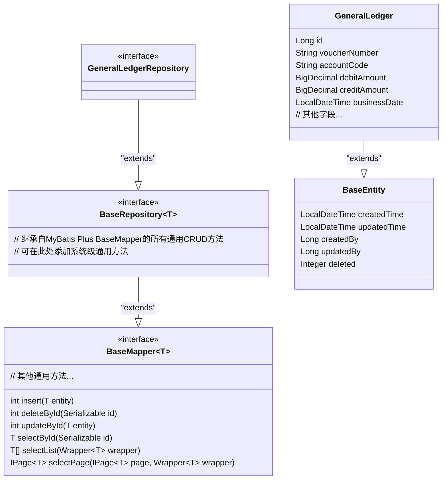
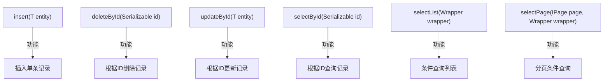
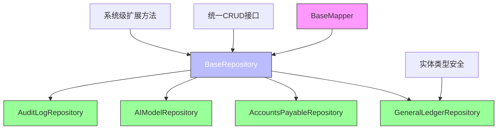

# 基础仓库设计

<cite>
**本文档引用文件**  
- [BaseRepository.java](file://08-backend/src/main/java/com/enterprise/brain/common/base/BaseRepository.java)
- [GeneralLedgerRepository.java](file://08-backend/src/main/java/com/enterprise/brain/modules/finance/repository/GeneralLedgerRepository.java)
- [GeneralLedger.java](file://08-backend/src/main/java/com/enterprise/brain/modules/finance/entity/GeneralLedger.java)
- [GeneralLedgerServiceImpl.java](file://08-backend/src/main/java/com/enterprise/brain/modules/finance/service/impl/GeneralLedgerServiceImpl.java)
- [BaseEntity.java](file://08-backend/src/main/java/com/enterprise/brain/common/base/BaseEntity.java)
- [MyBatisConfig.java](file://08-backend/src/main/java/com/enterprise/brain/config/MyBatisConfig.java)
</cite>

## 目录
1. [引言](#引言)
2. [基础仓库接口设计](#基础仓库接口设计)
3. [通用CRUD方法详解](#通用crud方法详解)
4. [泛型T的具体化过程](#泛型t的具体化过程)
5. [自定义通用方法扩展建议](#自定义通用方法扩展建议)
6. [接口继承机制简化开发](#接口继承机制简化开发)
7. [依赖关系分析](#依赖关系分析)
8. [结论](#结论)

## 引言
BaseRepository是企业智能管理系统中数据访问层的核心基础接口，通过继承MyBatis Plus的BaseMapper<T>，为所有实体仓库提供了统一的CRUD操作规范。该设计实现了代码的高度复用和标准化访问，是整个系统数据持久化架构的重要组成部分。

## 基础仓库接口设计



**图表来源**  
- [BaseRepository.java](file://08-backend/src/main/java/com/enterprise/brain/common/base/BaseRepository.java#L12-L15)
- [GeneralLedgerRepository.java](file://08-backend/src/main/java/com/enterprise/brain/modules/finance/repository/GeneralLedgerRepository.java#L13-L14)

**本节来源**  
- [BaseRepository.java](file://08-backend/src/main/java/com/enterprise/brain/common/base/BaseRepository.java#L1-L15)
- [GeneralLedgerRepository.java](file://08-backend/src/main/java/com/enterprise/brain/modules/finance/repository/GeneralLedgerRepository.java#L1-L15)

## 通用CRUD方法详解

BaseRepository接口通过继承MyBatis Plus的BaseMapper<T>，自动获得了丰富的通用CRUD方法，这些方法无需编写SQL即可直接使用：

### 基础增删改查方法


这些方法在实际业务中的使用示例如下：
- `insert`方法用于创建新的总账凭证记录
- `deleteById`方法用于逻辑删除指定ID的财务数据
- `updateById`方法用于更新已存在的会计科目信息
- `selectById`方法用于获取特定凭证的详细信息
- `selectList`方法配合查询条件包装器实现复杂查询
- `selectPage`方法结合分页插件实现大数据量的分页展示

**本节来源**  
- [BaseRepository.java](file://08-backend/src/main/java/com/enterprise/brain/common/base/BaseRepository.java#L12-L15)
- [MyBatisConfig.java](file://08-backend/src/main/java/com/enterprise/brain/config/MyBatisConfig.java#L11-L15)

## 泛型T的具体化过程

泛型T在实际子接口中的具体化过程体现了Java泛型的类型安全特性：

```mermaid
sequenceDiagram
participant G as GeneralLedgerRepository
participant B as BaseRepository<GeneralLedger>
participant M as BaseMapper<GeneralLedger>
participant E as GeneralLedger实体
Note over G,B,M : 泛型类型具体化过程
G->>B : extends BaseRepository<GeneralLedger>
B->>M : extends BaseMapper<GeneralLedger>
M->>E : 所有方法操作GeneralLedger类型
E-->>M : 返回GeneralLedger实例
M-->>B : 类型安全的方法签名
B-->>G : 完整的类型化CRUD接口
```

在GeneralLedgerRepository的具体实现中，泛型T被具体化为GeneralLedger实体类型：
1. 接口声明`GeneralLedgerRepository extends BaseRepository<GeneralLedger>`
2. 编译时类型检查确保所有操作都针对GeneralLedger类型
3. 方法返回值自动为GeneralLedger或其集合类型
4. 避免了类型转换异常，提高了代码安全性

这种设计模式使得每个实体仓库都能获得专属于其对应实体类型的强类型接口，同时保持了代码的简洁性和可维护性。

**图表来源**  
- [GeneralLedgerRepository.java](file://08-backend/src/main/java/com/enterprise/brain/modules/finance/repository/GeneralLedgerRepository.java#L13-L14)
- [GeneralLedger.java](file://08-backend/src/main/java/com/enterprise/brain/modules/finance/entity/GeneralLedger.java#L19-L81)

**本节来源**  
- [GeneralLedgerRepository.java](file://08-backend/src/main/java/com/enterprise/brain/modules/finance/repository/GeneralLedgerRepository.java#L13-L14)
- [GeneralLedger.java](file://08-backend/src/main/java/com/enterprise/brain/modules/finance/entity/GeneralLedger.java#L19-L81)

## 自定义通用方法扩展建议

虽然MyBatis Plus提供了丰富的基础方法，但BaseRepository的设计允许在基础接口层面添加系统级通用功能：

### 软删除功能扩展
```java
public interface BaseRepository<T> extends BaseMapper<T> {
    /**
     * 逻辑删除（软删除）
     * @param id 主键ID
     * @return 是否删除成功
     */
    default boolean logicDeleteById(Serializable id) {
        return update(
            new UpdateWrapper<T>()
                .eq("id", id)
                .set("deleted", 1)
        ) > 0;
    }
    
    /**
     * 批量逻辑删除
     * @param ids 主键ID集合
     * @return 是否批量删除成功
     */
    default boolean logicDeleteByIds(Collection<? extends Serializable> ids) {
        return update(
            new UpdateWrapper<T>()
                .in("id", ids)
                .set("deleted", 1)
        ) > 0;
    }
}
```

### 批量操作功能扩展
```java
public interface BaseRepository<T> extends BaseMapper<T> {
    /**
     * 批量插入
     * @param entities 实体集合
     * @return 是否批量插入成功
     */
    boolean insertBatch(Collection<T> entities);
    
    /**
     * 批量更新
     * @param entities 实体集合
     * @return 是否批量更新成功
     */
    boolean updateBatchById(Collection<T> entities);
}
```

### 查询优化功能扩展
```java
public interface BaseRepository<T> extends BaseMapper<T> {
    /**
     * 根据条件查询单条记录
     * @param queryWrapper 查询条件
     * @return 匹配的实体，无匹配则返回null
     */
    T selectOne(Wrapper<T> queryWrapper);
    
    /**
     * 根据字段值查询列表
     * @param fieldName 字段名
     * @param value 字段值
     * @return 匹配的实体列表
     */
    List<T> findByField(String fieldName, Object value);
}
```

这些扩展建议可以进一步增强BaseRepository的功能性，为所有子接口提供统一的高级操作能力。

**本节来源**  
- [BaseRepository.java](file://08-backend/src/main/java/com/enterprise/brain/common/base/BaseRepository.java#L12-L15)
- [BaseEntity.java](file://08-backend/src/main/java/com/enterprise/brain/common/base/BaseEntity.java#L49-L51)

## 接口继承机制简化开发

接口继承机制显著简化了数据访问层的开发工作：



### 开发简化优势
1. **代码复用**：避免在每个Repository中重复定义相同的CRUD方法
2. **标准统一**：确保所有数据访问接口遵循相同的设计规范
3. **维护便捷**：通用功能的修改只需在BaseRepository中进行
4. **扩展灵活**：新增系统级功能可集中添加到基础接口
5. **类型安全**：泛型机制保证编译时类型检查

在GeneralLedgerServiceImpl中的实际应用：
```java
@Service
public class GeneralLedgerServiceImpl extends ServiceImpl<GeneralLedgerMapper, GeneralLedger> implements GeneralLedgerService {
    @Override
    public GeneralLedgerResponse createGeneralLedger(GeneralLedgerCreateRequest request) {
        GeneralLedger generalLedger = new GeneralLedger();
        BeanUtils.copyProperties(request, generalLedger);
        this.save(generalLedger); // 直接使用继承的save方法
        // ...
    }
    
    @Override
    public GeneralLedgerResponse getGeneralLedgerById(Long id) {
        GeneralLedger generalLedger = this.getById(id); // 直接使用继承的getById方法
        // ...
    }
}
```

**图表来源**  
- [BaseRepository.java](file://08-backend/src/main/java/com/enterprise/brain/common/base/BaseRepository.java#L12-L15)
- [GeneralLedgerRepository.java](file://08-backend/src/main/java/com/enterprise/brain/modules/finance/repository/GeneralLedgerRepository.java#L13-L14)

**本节来源**  
- [GeneralLedgerServiceImpl.java](file://08-backend/src/main/java/com/enterprise/brain/modules/finance/service/impl/GeneralLedgerServiceImpl.java#L25-L64)
- [BaseRepository.java](file://08-backend/src/main/java/com/enterprise/brain/common/base/BaseRepository.java#L12-L15)

## 依赖关系分析

```mermaid
erDiagram
BASE_REPOSITORY ||--o{ GENERAL_LEDGER_REPOSITORY : "extends"
BASE_REPOSITORY ||--o{ ACCOUNTS_PAYABLE_REPOSITORY : "extends"
BASE_REPOSITORY ||--o{ AI_MODEL_REPOSITORY : "extends"
BASE_REPOSITORY ||--o{ AUDIT_LOG_REPOSITORY : "extends"
BASE_ENTITY ||--o{ GENERAL_LEDGER : "extends"
BASE_ENTITY ||--o{ ACCOUNTS_PAYABLE : "extends"
BASE_ENTITY ||--o{ AI_MODEL : "extends"
BASE_ENTITY ||--o{ AUDIT_LOG : "extends"
BASE_REPOSITORY }|--|| BASE_MAPPER : "extends"
BASE_SERVICE }|--|| I_SERVICE : "extends"
class BASE_REPOSITORY {
泛型T
通用CRUD方法
自定义扩展方法
}
class GENERAL_LEDGER_REPOSITORY {
无额外方法
继承所有通用方法
}
class BASE_ENTITY {
createdTime
updatedTime
createdBy
updatedBy
deleted
}
class GENERAL_LEDGER {
id
voucherNumber
accountCode
debitAmount
creditAmount
businessDate
}
```

**图表来源**  
- [BaseRepository.java](file://08-backend/src/main/java/com/enterprise/brain/common/base/BaseRepository.java#L12-L15)
- [BaseEntity.java](file://08-backend/src/main/java/com/enterprise/brain/common/base/BaseEntity.java#L18-L52)
- [GeneralLedger.java](file://08-backend/src/main/java/com/enterprise/brain/modules/finance/entity/GeneralLedger.java#L19-L81)

**本节来源**  
- [BaseRepository.java](file://08-backend/src/main/java/com/enterprise/brain/common/base/BaseRepository.java#L1-L15)
- [BaseEntity.java](file://08-backend/src/main/java/com/enterprise/brain/common/base/BaseEntity.java#L1-L53)
- [pom.xml](file://08-backend/pom.xml#L60-L65)

## 结论
BaseRepository作为数据访问层的统一基类，通过继承MyBatis Plus的BaseMapper<T>，为系统所有实体仓库提供了标准化的通用CRUD操作。该设计实现了高度的代码复用和维护便利性，通过泛型机制确保了类型安全。建议在BaseRepository中添加软删除、批量操作等系统级通用方法，进一步提升开发效率。接口继承机制有效简化了数据访问层的开发工作，是企业级应用架构中的最佳实践。