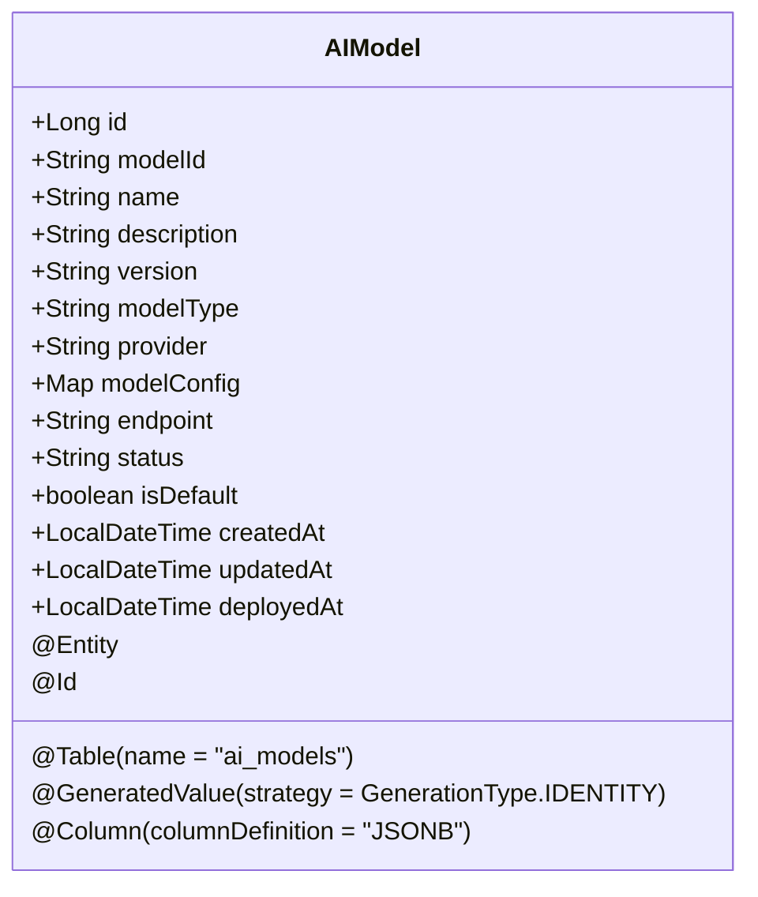
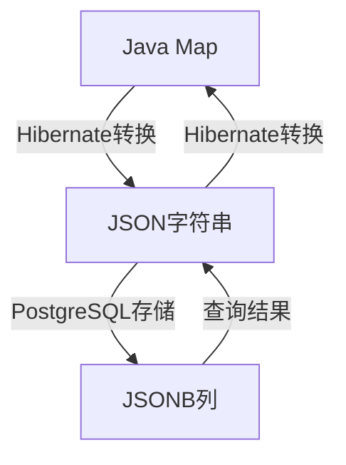
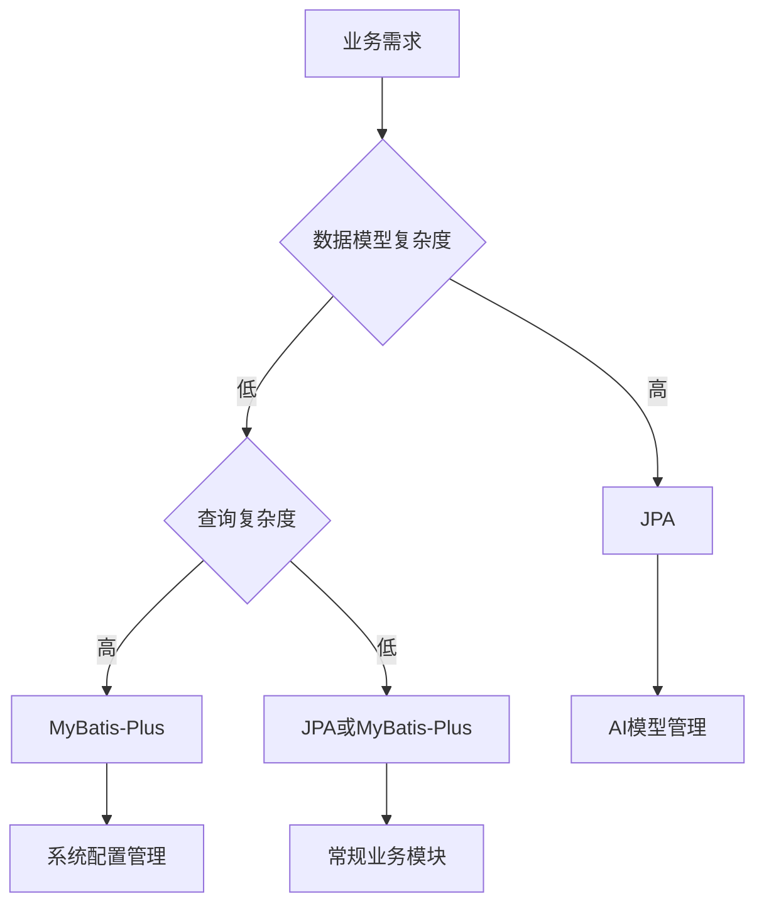

# JPA注解映射

<cite>
**本文档引用文件**   
- [AIModel.java](file://08-backend/src/main/java/com/enterprise/brain/modules/ai/entity/AIModel.java)
- [SmartTable.java](file://08-backend/src/main/java/com/enterprise/brain/modules/smarttable/entity/SmartTable.java)
- [TableColumn.java](file://08-backend/src/main/java/com/enterprise/brain/modules/smarttable/entity/TableColumn.java)
- [SystemConfig.java](file://08-backend/src/main/java/com/enterprise/brain/modules/system/initialization/entity/SystemConfig.java)
- [application.yml](file://08-backend/src/main/resources/application.yml)
- [pom.xml](file://08-backend/pom.xml)
- [MyBatisConfig.java](file://08-backend/src/main/java/com/enterprise/brain/config/MyBatisConfig.java)
</cite>

## 目录
1. [引言](#引言)
2. [JPA核心注解详解](#jpa核心注解详解)
3. [AIModel实体类中的JPA注解应用](#aimodel实体类中的jpa注解应用)
4. [JSONB类型字段的存储与映射策略](#jsonb类型字段的存储与映射策略)
5. [MyBatis-Plus与JPA对比分析](#mybatis-plus与jpa对比分析)
6. [项目中的映射方式选择依据](#项目中的映射方式选择依据)
7. [结论](#结论)

## 引言
本文档旨在深入解析JPA（Java Persistence API）注解在企业级应用中的映射机制，重点分析`@Entity`、`@Table`、`@Id`、`@GeneratedValue`、`@Column`等核心注解的实际应用。通过AIModel实体类中`@Id @GeneratedValue(strategy = GenerationType.IDENTITY)`和`@Column(columnDefinition = "JSONB")`等具体用例，详细阐述注解参数的含义与配置选项。同时，探讨JPA如何实现对象关系映射（ORM），特别是JSONB类型字段在PostgreSQL数据库中的存储与映射策略。最后，对比MyBatis-Plus与JPA两种持久化框架在项目中的应用场景与选择依据。

**文档来源**
- [AIModel.java](file://08-backend/src/main/java/com/enterprise/brain/modules/ai/entity/AIModel.java)
- [application.yml](file://08-backend/src/main/resources/application.yml)
- [pom.xml](file://08-backend/pom.xml)

## JPA核心注解详解

### @Entity
`@Entity`注解用于标识一个Java类为持久化实体，表示该类将映射到数据库中的一个表。每个被`@Entity`标注的类都必须有一个无参构造函数，且不能是final类。

### @Table
`@Table`注解用于指定实体类所映射的数据库表名。当实体类名与数据库表名不一致时，可通过`name`属性进行显式指定。例如，在AIModel类中使用`@Table(name = "ai_models")`将AIModel实体映射到名为`ai_models`的数据库表。

### @Id
`@Id`注解用于标识实体类中的主键字段。每个实体类都必须包含一个且仅一个`@Id`注解的字段，该字段对应数据库表的主键列。

### @GeneratedValue
`@GeneratedValue`注解用于定义主键的生成策略。其`strategy`属性支持多种生成方式：
- `GenerationType.IDENTITY`：使用数据库的自增主键机制
- `GenerationType.AUTO`：由JPA容器自动选择合适的策略
- `GenerationType.TABLE`：使用单独的表来维护主键
- `GenerationType.SEQUENCE`：使用数据库序列

在AIModel实体中，`@GeneratedValue(strategy = GenerationType.IDENTITY)`表明主键id字段采用数据库自增策略。

### @Column
`@Column`注解用于配置实体类属性与数据库列之间的映射关系。常用属性包括：
- `name`：指定数据库列名
- `length`：定义字符串类型的长度
- `nullable`：指定列是否可为空
- `unique`：指定列是否唯一
- `columnDefinition`：自定义列的DDL定义，可用于指定特殊数据类型如JSONB

**文档来源**
- [AIModel.java](file://08-backend/src/main/java/com/enterprise/brain/modules/ai/entity/AIModel.java)
- [SmartTable.java](file://08-backend/src/main/java/com/enterprise/brain/modules/smarttable/entity/SmartTable.java)

## AIModel实体类中的JPA注解应用

### 实体定义与表映射
AIModel实体类通过`@Entity`和`@Table(name = "ai_models")`注解，明确地将Java对象映射到数据库的`ai_models`表。这种声明式映射简化了对象与关系数据库之间的转换过程。



**图示来源**
- [AIModel.java](file://08-backend/src/main/java/com/enterprise/brain/modules/ai/entity/AIModel.java)

### 主键生成策略
AIModel实体的主键字段id使用`@Id`和`@GeneratedValue(strategy = GenerationType.IDENTITY)`注解组合，确保每次插入新记录时，数据库自动生成唯一的递增主键值。这种策略适用于支持自增主键的数据库如MySQL、PostgreSQL等。

### 时间字段自动填充
通过`@PrePersist`和`@PreUpdate`生命周期回调注解，AIModel实现了创建时间和更新时间的自动填充。`@PrePersist`在实体首次持久化前触发，设置`createdAt`和`updatedAt`；`@PreUpdate`在实体更新前触发，仅更新`updatedAt`字段。

**文档来源**
- [AIModel.java](file://08-backend/src/main/java/com/enterprise/brain/modules/ai/entity/AIModel.java)

## JSONB类型字段的存储与映射策略

### JSONB字段定义
在AIModel实体中，`modelConfig`字段使用`@Column(columnDefinition = "JSONB")`注解，明确指定数据库列的数据类型为JSONB。这允许将复杂的配置信息以JSON格式存储在单一数据库列中，同时保持良好的查询性能。

```java
@Column(columnDefinition = "JSONB")
private Map<String, Object> modelConfig;
```

### PostgreSQL中的JSONB支持
PostgreSQL的JSONB类型提供二进制格式存储JSON数据，支持高效的索引和查询操作。相比传统的TEXT类型存储JSON字符串，JSONB具有以下优势：
- 更快的读取和写入性能
- 支持Gin索引进行高效查询
- 可以直接对JSON内容进行修改和更新
- 支持丰富的JSON函数和操作符

### JPA与Hibernate的JSONB映射
Spring Data JPA结合Hibernate ORM框架，能够自动将Java的Map、List等集合类型映射到PostgreSQL的JSONB类型。开发者无需手动序列化/反序列化JSON数据，框架会自动处理类型转换。



**图示来源**
- [AIModel.java](file://08-backend/src/main/java/com/enterprise/brain/modules/ai/entity/AIModel.java)
- [application.yml](file://08-backend/src/main/resources/application.yml)

**文档来源**
- [AIModel.java](file://08-backend/src/main/java/com/enterprise/brain/modules/ai/entity/AIModel.java)

## MyBatis-Plus与JPA对比分析

### 架构设计理念
JPA是一种基于规范的对象关系映射（ORM）框架，强调面向对象的编程模型，通过注解或XML配置实现对象与数据库表的映射。而MyBatis-Plus是MyBatis的增强工具，保持了SQL的完全控制权，同时提供了丰富的CRUD操作封装。

### 注解体系对比
JPA使用标准的JPA注解如`@Entity`、`@Table`、`@Id`等进行实体映射，而MyBatis-Plus使用自定义注解如`@TableName`、`@TableId`、`@TableField`等。两者在功能上相似，但命名和用法有所不同。

```mermaid
classDiagram
class AIModel {
+@Entity
+@Table(name = "ai_models")
+@Id
+@GeneratedValue(strategy = GenerationType.IDENTITY)
+@Column(columnDefinition = "JSONB")
}
class SystemConfig {
+@TableName("sys_config")
+@TableId(value = "id", type = IdType.AUTO)
+@TableField("config_key")
+@TableField(value = "create_time", fill = FieldFill.INSERT)
+@TableLogic
}
AIModel --> "JPA" : 使用
SystemConfig --> "MyBatis-Plus" : 使用
```

**图示来源**
- [AIModel.java](file://08-backend/src/main/java/com/enterprise/brain/modules/ai/entity/AIModel.java)
- [SystemConfig.java](file://08-backend/src/main/java/com/enterprise/brain/modules/system/initialization/entity/SystemConfig.java)

### 功能特性对比
| 特性 | JPA | MyBatis-Plus |
|------|-----|--------------|
| **SQL控制** | 通过JPQL或Criteria API | 完全控制原生SQL |
| **自动CRUD** | JpaRepository提供基础方法 | BaseMapper提供增强方法 |
| **分页支持** | Pageable接口 | PaginationInnerInterceptor |
| **逻辑删除** | 需自定义实现 | @TableLogic注解支持 |
| **字段填充** | @PrePersist/@PreUpdate | @TableField(fill = FieldFill.INSERT) |
| **主键策略** | GenerationType枚举 | IdType枚举 |

### 配置与依赖
项目中同时引入了JPA和MyBatis-Plus两种持久化框架：

```xml
<!-- JPA依赖 -->
<dependency>
    <groupId>org.springframework.boot</groupId>
    <artifactId>spring-boot-starter-data-jpa</artifactId>
</dependency>

<!-- MyBatis Plus依赖 -->
<dependency>
    <groupId>com.baomidou</groupId>
    <artifactId>mybatis-plus-boot-starter</artifactId>
    <version>3.5.3.1</version>
</dependency>
```

**文档来源**
- [pom.xml](file://08-backend/pom.xml)
- [MyBatisConfig.java](file://08-backend/src/main/java/com/enterprise/brain/config/MyBatisConfig.java)
- [SystemConfig.java](file://08-backend/src/main/java/com/enterprise/brain/modules/system/initialization/entity/SystemConfig.java)

## 项目中的映射方式选择依据

### JPA适用场景
在本项目中，JPA主要用于AI模块的实体映射，原因如下：
1. **复杂对象关系**：AI模型、对话、提示等实体之间存在复杂的关联关系，JPA的ORM特性更适合处理这种场景
2. **快速开发**：JPA的自动CRUD和Repository模式能够快速实现基础数据访问
3. **类型安全**：JPQL和Criteria API提供编译时检查，减少运行时错误
4. **JSONB支持**：JPA对PostgreSQL的JSONB类型有良好的支持，适合存储AI模型的配置信息

### MyBatis-Plus适用场景
MyBatis-Plus主要用于系统初始化、配置管理等模块，优势体现在：
1. **SQL灵活性**：需要执行复杂的查询和更新操作时，MyBatis-Plus允许编写原生SQL
2. **性能优化**：对于大数据量的查询，可以直接优化SQL语句
3. **逻辑删除**：`@TableLogic`注解简化了逻辑删除的实现
4. **字段自动填充**：`FieldFill`枚举自动处理创建时间、更新时间等字段

### 混合使用策略
项目采用JPA和MyBatis-Plus混合使用的策略，根据不同模块的需求选择合适的持久化框架：
- **AI相关模块**：使用JPA处理复杂的对象关系和JSON数据
- **系统配置模块**：使用MyBatis-Plus处理常规的CRUD操作和复杂查询
- **事务管理**：通过Spring的事务管理器统一协调两种框架的事务



**图示来源**
- [AIModel.java](file://08-backend/src/main/java/com/enterprise/brain/modules/ai/entity/AIModel.java)
- [SystemConfig.java](file://08-backend/src/main/java/com/enterprise/brain/modules/system/initialization/entity/SystemConfig.java)

**文档来源**
- [AIModel.java](file://08-backend/src/main/java/com/enterprise/brain/modules/ai/entity/AIModel.java)
- [SystemConfig.java](file://08-backend/src/main/java/com/enterprise/brain/modules/system/initialization/entity/SystemConfig.java)

## 结论
JPA注解提供了一种声明式的对象关系映射方式，通过`@Entity`、`@Table`、`@Id`、`@GeneratedValue`、`@Column`等核心注解，能够简洁高效地实现Java对象与数据库表的映射。在AIModel实体中，`@GeneratedValue(strategy = GenerationType.IDENTITY)`确保了主键的自动生成，而`@Column(columnDefinition = "JSONB")`则充分利用了PostgreSQL的JSONB类型优势，实现了复杂配置数据的高效存储与查询。

项目中同时采用JPA和MyBatis-Plus两种持久化框架，体现了技术选型的灵活性。JPA适用于处理复杂对象关系和需要强类型安全的场景，而MyBatis-Plus则在需要精细控制SQL和处理复杂查询时表现出色。通过合理选择和混合使用这两种框架，项目能够在开发效率、性能和灵活性之间取得良好平衡。