# MyBatis-Plus注解映射

<cite>
**本文档引用文件**   
- [GeneralLedger.java](file://08-backend/src/main/java/com/enterprise/brain/modules/finance/entity/GeneralLedger.java)
- [AccountBalance.java](file://08-backend/src/main/java/com/enterprise/brain/modules/finance/entity/AccountBalance.java)
- [AccountsPayable.java](file://08-backend/src/main/java/com/enterprise/brain/modules/finance/entity/AccountsPayable.java)
- [AccountsReceivable.java](file://08-backend/src/main/java/com/enterprise/brain/modules/finance/entity/AccountsReceivable.java)
- [Voucher.java](file://08-backend/src/main/java/com/enterprise/brain/modules/finance/entity/Voucher.java)
- [SystemConfig.java](file://08-backend/src/main/java/com/enterprise/brain/modules/system/initialization/entity/SystemConfig.java)
- [BaseEntity.java](file://08-backend/src/main/java/com/enterprise/brain/common/base/BaseEntity.java)
- [MyBatisConfig.java](file://08-backend/src/main/java/com/enterprise/brain/config/MyBatisConfig.java)
</cite>

## 目录
1. [引言](#引言)
2. [核心注解详解](#核心注解详解)
3. [实体类映射实践](#实体类映射实践)
4. [注解驱动机制分析](#注解驱动机制分析)
5. [与XML配置对比](#与xml配置对比)
6. [最佳实践与注意事项](#最佳实践与注意事项)
7. [总结](#总结)

## 引言

MyBatis-Plus作为MyBatis的增强工具，在保留MyBatis原有特性的同时，提供了更便捷的CRUD操作和丰富的注解支持。本文档重点介绍MyBatis-Plus中`@TableName`、`@TableId`、`@TableField`等核心注解的使用方法，通过财务模块中的总账（GeneralLedger）等实体类的实际用例，深入解析注解参数的含义和配置选项。文档还将阐述注解驱动的映射机制如何简化实体与数据库表的关联配置，并提供常见注解组合使用的最佳实践。

**文档来源**
- [GeneralLedger.java](file://08-backend/src/main/java/com/enterprise/brain/modules/finance/entity/GeneralLedger.java#L1-L81)
- [MyBatisConfig.java](file://08-backend/src/main/java/com/enterprise/brain/config/MyBatisConfig.java#L1-L17)

## 核心注解详解

### @TableName注解

`@TableName`注解用于指定实体类所对应的数据库表名。当实体类名称与数据库表名不一致时，必须使用此注解进行映射。

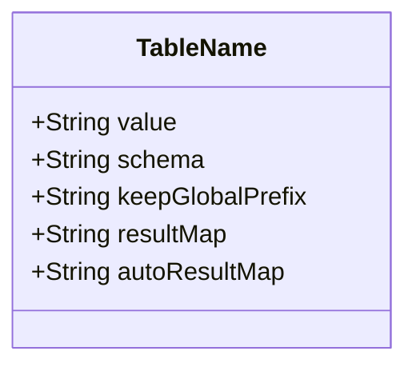

**注解参数说明：**
- `value`：指定数据库表名，如`@TableName("finance_general_ledger")`
- `schema`：指定数据库schema
- `keepGlobalPrefix`：是否保持全局表前缀
- `resultMap`：指定自定义resultMap
- `autoResultMap`：是否自动构建resultMap

**Diagram sources**
- [GeneralLedger.java](file://08-backend/src/main/java/com/enterprise/brain/modules/finance/entity/GeneralLedger.java#L17)

### @TableId注解

`@TableId`注解用于标识实体类中的主键字段，支持多种主键生成策略。

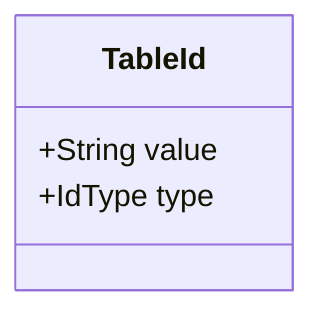

**注解参数说明：**
- `value`：指定数据库主键字段名
- `type`：指定主键生成策略，支持多种类型

**IdType枚举选项：**
- `AUTO`：数据库自增
- `NONE`：无状态
- `INPUT`：用户输入
- `ASSIGN_ID`：分配ID（雪花算法）
- `ASSIGN_UUID`：分配UUID

在GeneralLedger实体类中，`@TableId(value = "id", type = IdType.AUTO)`表示主键字段名为"id"，采用数据库自增策略。

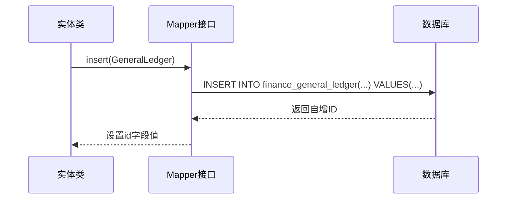

**Diagram sources**
- [GeneralLedger.java](file://08-backend/src/main/java/com/enterprise/brain/modules/finance/entity/GeneralLedger.java#L22)
- [AccountBalance.java](file://08-backend/src/main/java/com/enterprise/brain/modules/finance/entity/AccountBalance.java#L22)

**Section sources**
- [GeneralLedger.java](file://08-backend/src/main/java/com/enterprise/brain/modules/finance/entity/GeneralLedger.java#L21-L23)

### @TableField注解

`@TableField`注解用于指定实体类属性与数据库字段的映射关系，支持丰富的配置选项。

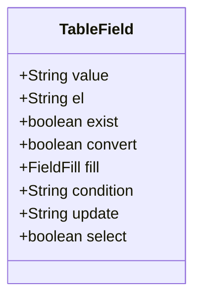

**注解参数说明：**
- `value`：指定数据库字段名
- `exist`：字段是否存在
- `fill`：字段填充策略
- `select`：查询时是否包含该字段

**FieldFill填充策略：**
- `DEFAULT`：默认不填充
- `INSERT`：插入时填充
- `UPDATE`：更新时填充
- `INSERT_UPDATE`：插入和更新时填充

在GeneralLedger实体类中，`@TableField("voucher_number")`表示将voucherNumber属性映射到数据库的voucher_number字段。

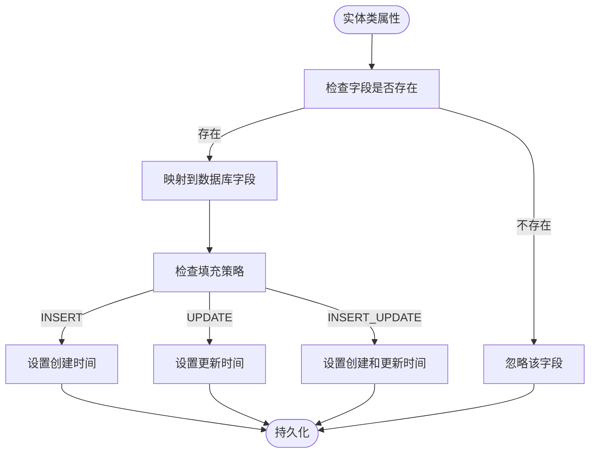

**Diagram sources**
- [GeneralLedger.java](file://08-backend/src/main/java/com/enterprise/brain/modules/finance/entity/GeneralLedger.java#L26)
- [SystemConfig.java](file://08-backend/src/main/java/com/enterprise/brain/modules/system/initialization/entity/SystemConfig.java#L69)

**Section sources**
- [GeneralLedger.java](file://08-backend/src/main/java/com/enterprise/brain/modules/finance/entity/GeneralLedger.java#L25-L27)

## 实体类映射实践

### 总账实体类映射

GeneralLedger实体类展示了MyBatis-Plus注解的典型用法，通过注解实现了实体与数据库表的完整映射。

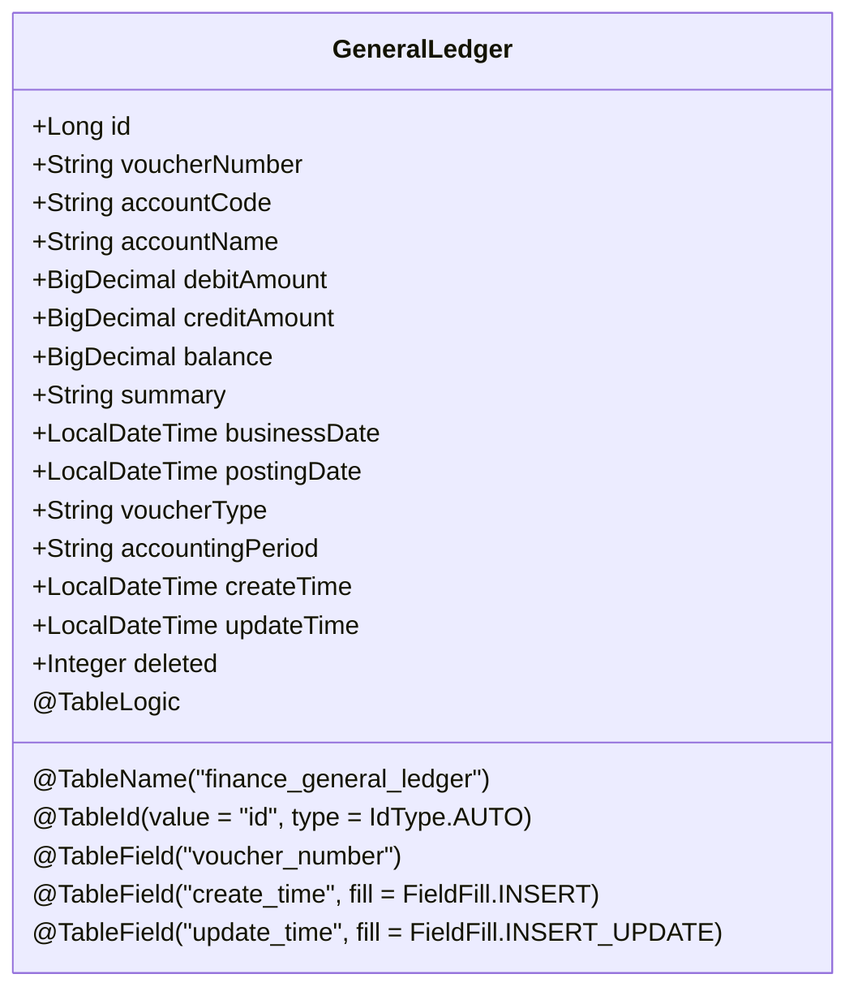

**关键注解配置：**
- `@TableName("finance_general_ledger")`：指定表名为finance_general_ledger
- `@TableId(value = "id", type = IdType.AUTO)`：主键为id，采用自增策略
- `@TableField("voucher_number")`：字段名映射
- `@TableField(fill = FieldFill.INSERT)`：创建时间自动填充
- `@TableLogic`：逻辑删除标识

**Diagram sources**
- [GeneralLedger.java](file://08-backend/src/main/java/com/enterprise/brain/modules/finance/entity/GeneralLedger.java#L17-L81)

**Section sources**
- [GeneralLedger.java](file://08-backend/src/main/java/com/enterprise/brain/modules/finance/entity/GeneralLedger.java#L1-L81)

### 其他财务实体类映射

系统中多个财务实体类采用了相似的注解配置模式，体现了统一的设计规范。

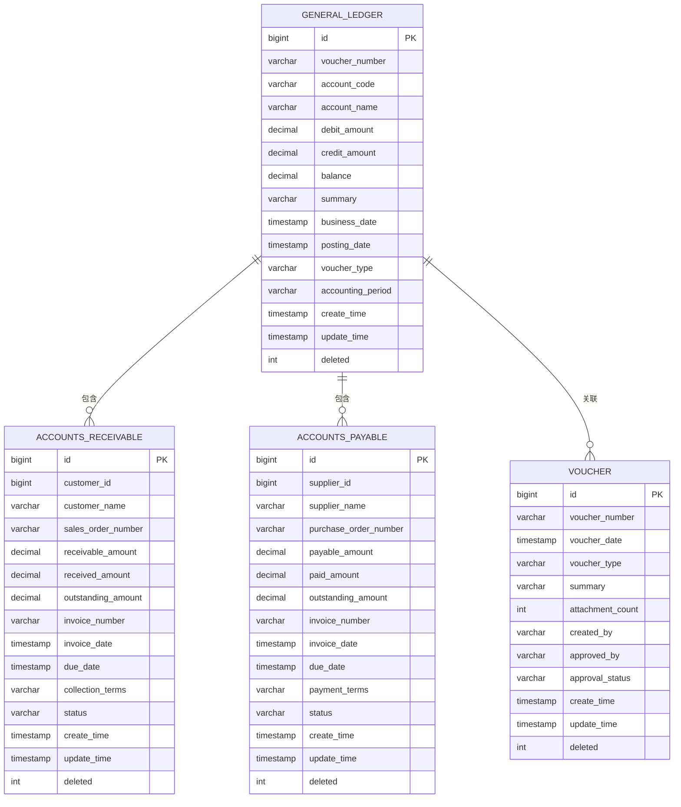

**Diagram sources**
- [GeneralLedger.java](file://08-backend/src/main/java/com/enterprise/brain/modules/finance/entity/GeneralLedger.java#L17)
- [AccountsReceivable.java](file://08-backend/src/main/java/com/enterprise/brain/modules/finance/entity/AccountsReceivable.java#L17)
- [AccountsPayable.java](file://08-backend/src/main/java/com/enterprise/brain/modules/finance/entity/AccountsPayable.java#L17)
- [Voucher.java](file://08-backend/src/main/java/com/enterprise/brain/modules/finance/entity/Voucher.java#L17)

**Section sources**
- [GeneralLedger.java](file://08-backend/src/main/java/com/enterprise/brain/modules/finance/entity/GeneralLedger.java#L1-L81)
- [AccountsReceivable.java](file://08-backend/src/main/java/com/enterprise/brain/modules/finance/entity/AccountsReceivable.java#L1-L81)
- [AccountsPayable.java](file://08-backend/src/main/java/com/enterprise/brain/modules/finance/entity/AccountsPayable.java#L1-L81)
- [Voucher.java](file://08-backend/src/main/java/com/enterprise/brain/modules/finance/entity/Voucher.java#L1-L69)

## 注解驱动机制分析

### 注解处理流程

MyBatis-Plus通过反射机制在启动时扫描实体类上的注解，构建元数据信息，实现自动映射。

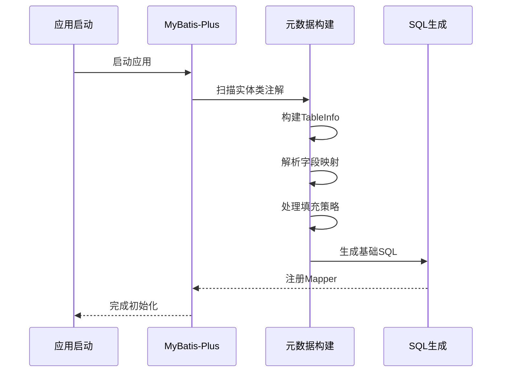

**Diagram sources**
- [MyBatisConfig.java](file://08-backend/src/main/java/com/enterprise/brain/config/MyBatisConfig.java#L1-L17)
- [BaseEntity.java](file://08-backend/src/main/java/com/enterprise/brain/common/base/BaseEntity.java#L1-L52)

### 字段填充机制

MyBatis-Plus提供了自动填充功能，可以在插入或更新时自动设置特定字段的值。

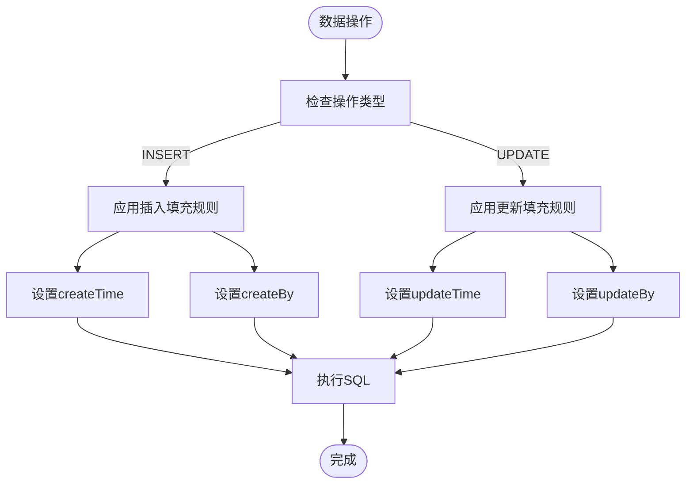

在BaseEntity基类中，通过`@TableField(fill = FieldFill.INSERT)`和`@TableField(fill = FieldFill.INSERT_UPDATE)`实现了创建时间和更新时间的自动填充。

**Diagram sources**
- [BaseEntity.java](file://08-backend/src/main/java/com/enterprise/brain/common/base/BaseEntity.java#L25-L44)
- [SystemConfig.java](file://08-backend/src/main/java/com/enterprise/brain/modules/system/initialization/entity/SystemConfig.java#L75-L93)

**Section sources**
- [BaseEntity.java](file://08-backend/src/main/java/com/enterprise/brain/common/base/BaseEntity.java#L1-L52)

## 与XML配置对比

### 注解方式优势

与传统的XML配置相比，注解方式具有明显的优势：

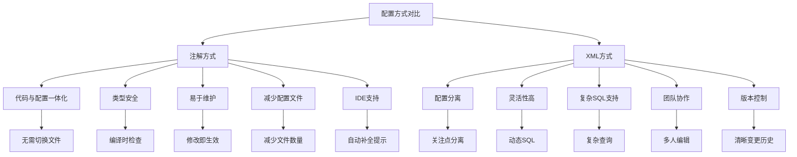

**Diagram sources**
- [GeneralLedger.java](file://08-backend/src/main/java/com/enterprise/brain/modules/finance/entity/GeneralLedger.java#L17)
- [AuditLogMapper.xml](file://08-backend/src/main/resources/mapper/system/audit/AuditLogMapper.xml#L1-L8)

### 混合使用场景

在实际项目中，可以结合使用注解和XML配置，发挥各自优势。

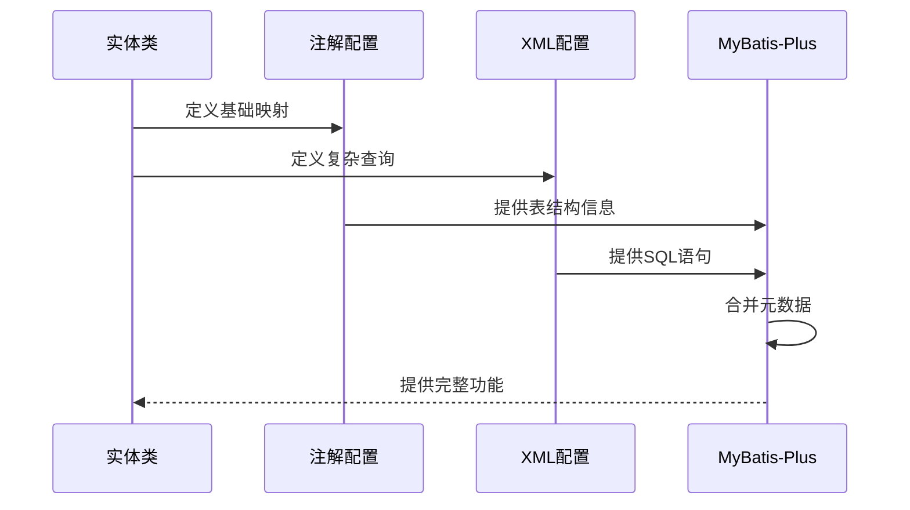

在项目中，基础的CRUD操作使用注解方式，而复杂的查询语句则通过XML配置实现，如AuditLogMapper.xml中的自定义查询。

**Diagram sources**
- [GeneralLedger.java](file://08-backend/src/main/java/com/enterprise/brain/modules/finance/entity/GeneralLedger.java#L17)
- [AuditLogMapper.xml](file://08-backend/src/main/resources/mapper/system/audit/AuditLogMapper.xml#L5-L7)

**Section sources**
- [GeneralLedger.java](file://08-backend/src/main/java/com/enterprise/brain/modules/finance/entity/GeneralLedger.java#L1-L81)
- [AuditLogMapper.xml](file://08-backend/src/main/resources/mapper/system/audit/AuditLogMapper.xml#L1-L8)

## 最佳实践与注意事项

### 注解组合使用规范

在实际开发中，应遵循统一的注解使用规范：

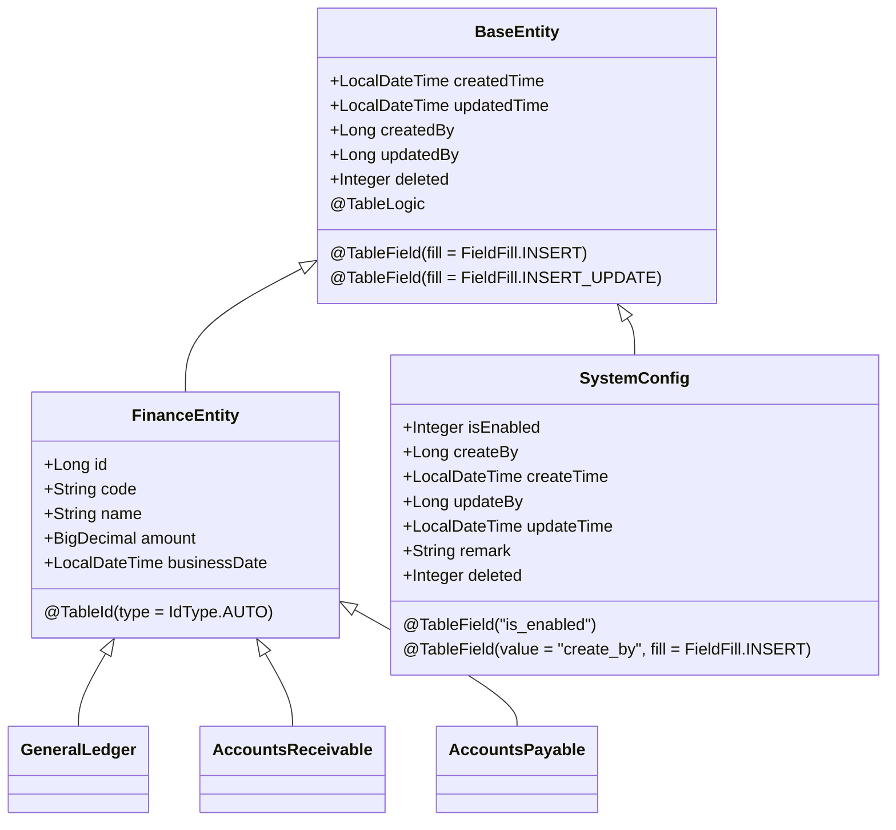

**最佳实践要点：**
1. 继承BaseEntity基类，统一管理公共字段
2. 主键统一使用`@TableId(type = IdType.AUTO)`
3. 创建时间和更新时间使用自动填充
4. 逻辑删除统一使用`@TableLogic`
5. 字段名使用下划线命名法

**Diagram sources**
- [BaseEntity.java](file://08-backend/src/main/java/com/enterprise/brain/common/base/BaseEntity.java#L1-L52)
- [GeneralLedger.java](file://08-backend/src/main/java/com/enterprise/brain/modules/finance/entity/GeneralLedger.java#L17)
- [SystemConfig.java](file://08-backend/src/main/java/com/enterprise/brain/modules/system/initialization/entity/SystemConfig.java#L69-L107)

**Section sources**
- [BaseEntity.java](file://08-backend/src/main/java/com/enterprise/brain/common/base/BaseEntity.java#L1-L52)
- [GeneralLedger.java](file://08-backend/src/main/java/com/enterprise/brain/modules/finance/entity/GeneralLedger.java#L1-L81)
- [SystemConfig.java](file://08-backend/src/main/java/com/enterprise/brain/modules/system/initialization/entity/SystemConfig.java#L66-L108)

### 常见问题与解决方案

在使用MyBatis-Plus注解时，可能会遇到一些常见问题：

```mermaid
flowchart TD
A[常见问题] --> B[字段映射错误]
A --> C[主键策略问题]
A --> D[自动填充失效]
A --> E[逻辑删除异常]
B --> F[检查@TableField value]
B --> G[确认字段存在]
B --> H[检查大小写]
C --> I[确认数据库支持自增]
C --> J[检查IdType配置]
C --> K[考虑使用ASSIGN_ID]
D --> L[检查fill属性]
D --> M[确认配置类]
D --> N[检查实现类]
E --> O[确认@TableLogic]
E --> P[检查deleted值]
E --> Q[确认查询条件]
F --> R[解决方案]
G --> R
H --> R
I --> R
J --> R
K --> R
L --> R
M --> R
N --> R
O --> R
P --> R
Q --> R
```

**注意事项：**
- 确保数据库字段与`@TableField`的value值完全匹配
- 使用`IdType.AUTO`时，确保数据库表主键设置为自增
- 自动填充功能需要配置MetaObjectHandler实现类
- 逻辑删除字段的默认值应为0（未删除）
- 复杂查询建议使用XML配置，保持SQL可读性

**Section sources**
- [GeneralLedger.java](file://08-backend/src/main/java/com/enterprise/brain/modules/finance/entity/GeneralLedger.java#L22-L80)
- [BaseEntity.java](file://08-backend/src/main/java/com/enterprise/brain/common/base/BaseEntity.java#L25-L51)
- [SystemConfig.java](file://08-backend/src/main/java/com/enterprise/brain/modules/system/initialization/entity/SystemConfig.java#L105-L107)

## 总结

MyBatis-Plus的注解映射机制通过`@TableName`、`@TableId`、`@TableField`等核心注解，极大地简化了实体类与数据库表的映射配置。通过在GeneralLedger等实体类中的实际应用，展示了注解驱动的映射方式在提高开发效率、保证代码一致性方面的优势。相比传统的XML配置，注解方式实现了代码与配置的一体化，提供了更好的类型安全和维护性。在实际项目中，建议结合使用注解和XML配置，发挥各自优势，同时遵循统一的注解使用规范，确保代码质量和可维护性。

[无来源，本节为总结性内容]