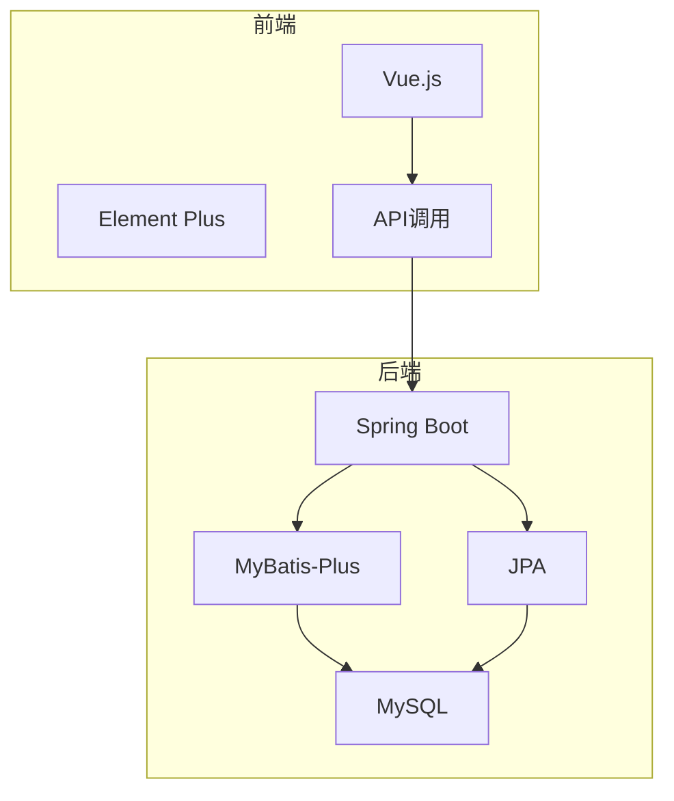
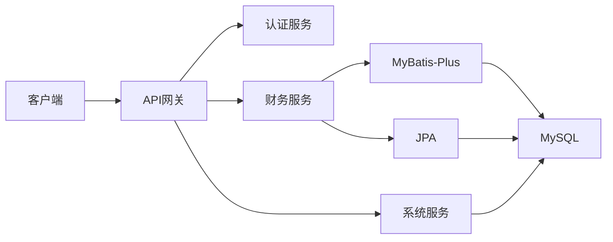
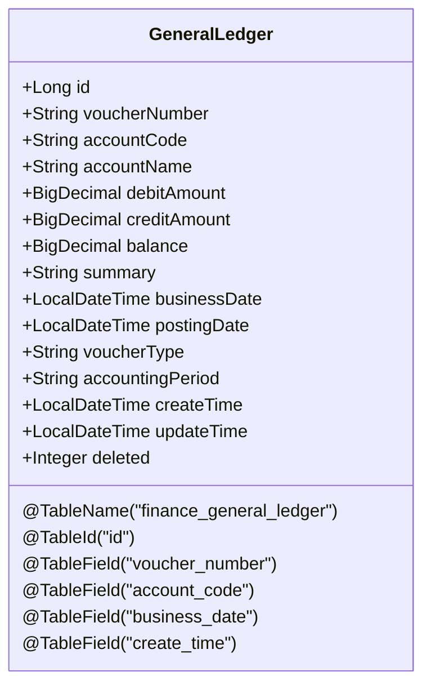
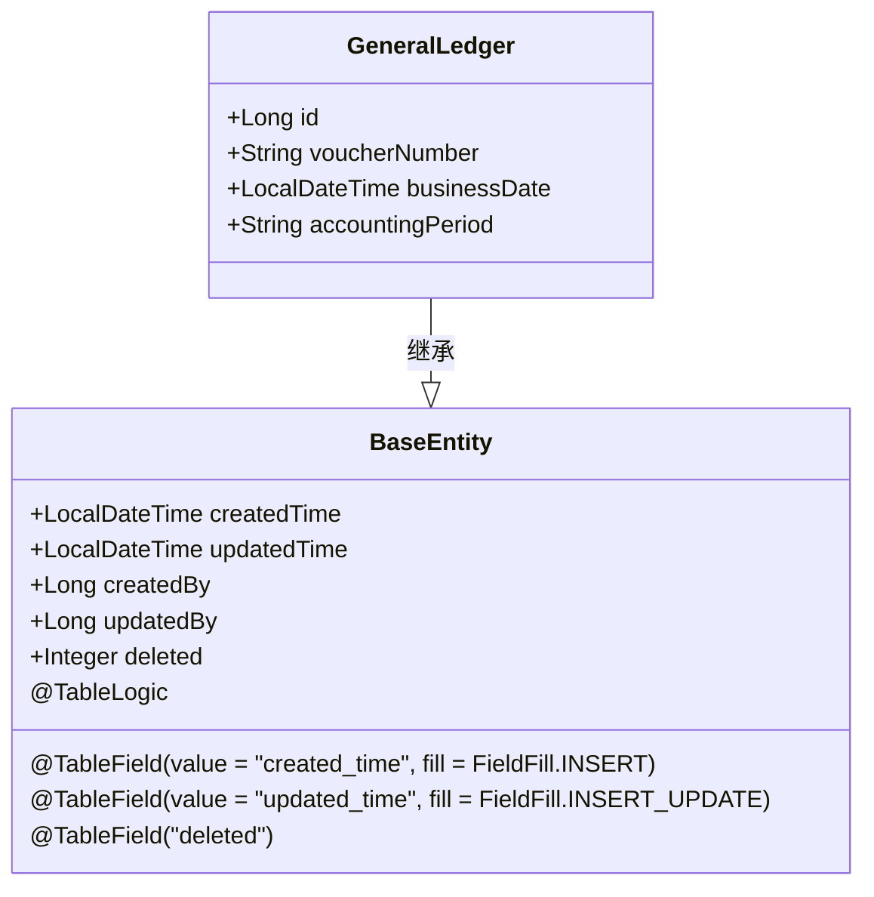
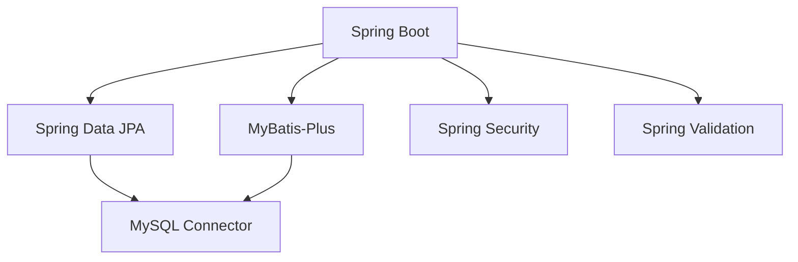

# 命名转换规则

<cite>
**本文档引用文件**   
- [GeneralLedger.java](file://08-backend/src/main/java/com/enterprise/brain/modules/finance/entity/GeneralLedger.java)
- [application.yml](file://08-backend/src/main/resources/application.yml)
- [MyBatisConfig.java](file://08-backend/src/main/java/com/enterprise/brain/config/MyBatisConfig.java)
- [BaseEntity.java](file://08-backend/src/main/java/com/enterprise/brain/common/base/BaseEntity.java)
- [SystemConfig.java](file://08-backend/src/main/java/com/enterprise/brain/modules/system/initialization/entity/SystemConfig.java)
- [SmartTable.java](file://08-backend/src/main/java/com/enterprise/brain/modules/smarttable/entity/SmartTable.java)
</cite>

## 目录
1. [引言](#引言)
2. [项目结构](#项目结构)
3. [核心组件](#核心组件)
4. [架构概述](#架构概述)
5. [详细组件分析](#详细组件分析)
6. [依赖分析](#依赖分析)
7. [性能考虑](#性能考虑)
8. [故障排除指南](#故障排除指南)
9. [结论](#结论)

## 引言
本文档详细分析了企业级应用中实体与数据库表之间的命名转换规则，重点探讨了MyBatis-Plus和JPA框架如何实现驼峰命名法（如businessDate）与数据库下划线命名法（business_date）之间的自动转换机制。文档还解释了如何通过注解进行显式字段映射，以及在复杂命名场景下的处理方案。

## 项目结构
本项目采用典型的分层架构，后端使用Spring Boot框架，包含实体层、数据访问层、服务层和控制器层。前端使用Vue.js框架，实现了现代化的用户界面。项目结构清晰，模块化程度高，便于维护和扩展。



**图示来源**
- [GeneralLedger.java](file://08-backend/src/main/java/com/enterprise/brain/modules/finance/entity/GeneralLedger.java)
- [SmartTable.java](file://08-backend/src/main/java/com/enterprise/brain/modules/smarttable/entity/SmartTable.java)

**章节来源**
- [GeneralLedger.java](file://08-backend/src/main/java/com/enterprise/brain/modules/finance/entity/GeneralLedger.java)
- [application.yml](file://08-backend/src/main/resources/application.yml)

## 核心组件
系统的核心组件包括实体类、数据访问层、服务层和控制器层。实体类定义了业务数据模型，数据访问层负责与数据库交互，服务层实现业务逻辑，控制器层处理HTTP请求。这些组件通过清晰的接口和注解进行通信，确保了代码的可读性和可维护性。

**章节来源**
- [GeneralLedger.java](file://08-backend/src/main/java/com/enterprise/brain/modules/finance/entity/GeneralLedger.java)
- [GeneralLedgerService.java](file://08-backend/src/main/java/com/enterprise/brain/modules/finance/service/GeneralLedgerService.java)

## 架构概述
系统采用微服务架构，各模块之间通过RESTful API进行通信。数据持久化层支持多种ORM框架，包括MyBatis-Plus和JPA，提供了灵活的数据访问方式。前端通过API网关与后端服务交互，实现了前后端分离的架构模式。



**图示来源**
- [GeneralLedgerController.java](file://08-backend/src/main/java/com/enterprise/brain/modules/finance/controller/GeneralLedgerController.java)
- [application.yml](file://08-backend/src/main/resources/application.yml)

## 详细组件分析

### 实体与数据库命名转换机制
在企业级Java应用中，实体类属性通常采用驼峰命名法（camelCase），而数据库字段则采用下划线命名法（snake_case）。这种命名差异需要通过ORM框架进行转换，以确保代码可读性与数据库规范性的统一。

#### MyBatis-Plus命名转换
MyBatis-Plus通过@TableField注解实现字段名映射。当实体类属性名与数据库字段名不一致时，可以使用@TableField注解指定对应的数据库字段名。例如，在GeneralLedger实体类中：

```java
@Schema(description = "业务日期")
@TableField("business_date")
private LocalDateTime businessDate;
```

这里，Java属性`businessDate`映射到数据库字段`business_date`。MyBatis-Plus还支持全局配置，可以在配置文件中设置自动转换规则。



**图示来源**
- [GeneralLedger.java](file://08-backend/src/main/java/com/enterprise/brain/modules/finance/entity/GeneralLedger.java)
- [BaseEntity.java](file://08-backend/src/main/java/com/enterprise/brain/common/base/BaseEntity.java)

**章节来源**
- [GeneralLedger.java](file://08-backend/src/main/java/com/enterprise/brain/modules/finance/entity/GeneralLedger.java)
- [MyBatisConfig.java](file://08-backend/src/main/java/com/enterprise/brain/config/MyBatisConfig.java)

#### JPA命名转换
JPA框架使用@Column注解进行字段映射。与MyBatis-Plus类似，当属性名与列名不一致时，可以通过@Column注解指定数据库列名。例如：

```java
@Column(name = "business_date")
private LocalDateTime businessDate;
```

JPA还支持命名策略配置，可以通过spring.jpa.hibernate.naming.physical-strategy等配置项定义全局的命名转换规则。

#### 复杂命名场景处理
对于复杂的命名场景，如缩写词或特殊字符，建议使用显式注解进行映射。例如：

```java
@TableField("api_key")
private String apiKey;
```

这样可以避免自动转换可能产生的歧义，确保映射的准确性。

### 基础实体类分析
BaseEntity类定义了所有实体类的公共字段，包括创建时间、更新时间、创建人、更新人和删除标识。这些字段通过@TableField注解的fill属性实现了自动填充功能。



**图示来源**
- [BaseEntity.java](file://08-backend/src/main/java/com/enterprise/brain/common/base/BaseEntity.java)
- [GeneralLedger.java](file://08-backend/src/main/java/com/enterprise/brain/modules/finance/entity/GeneralLedger.java)

**章节来源**
- [BaseEntity.java](file://08-backend/src/main/java/com/enterprise/brain/common/base/BaseEntity.java)
- [GeneralLedger.java](file://08-backend/src/main/java/com/enterprise/brain/modules/finance/entity/GeneralLedger.java)

## 依赖分析
项目依赖关系清晰，后端主要依赖Spring Boot、MyBatis-Plus、JPA和MySQL驱动。通过Maven进行依赖管理，确保了版本的一致性和兼容性。



**图示来源**
- [pom.xml](file://08-backend/pom.xml)
- [application.yml](file://08-backend/src/main/resources/application.yml)

**章节来源**
- [pom.xml](file://08-backend/pom.xml)
- [application.yml](file://08-backend/src/main/resources/application.yml)

## 性能考虑
在命名转换方面，建议在开发初期就确定统一的命名规范，减少后期重构的成本。对于高频访问的实体类，可以考虑使用缓存机制，减少数据库查询次数。同时，合理配置ORM框架的懒加载和急加载策略，优化查询性能。

## 故障排除指南
当遇到命名转换问题时，首先检查实体类的注解配置是否正确。常见的问题包括：
1. 忘记添加@TableField或@Column注解
2. 注解中的字段名拼写错误
3. 全局配置与局部注解冲突

可以通过启用SQL日志输出来调试，查看实际执行的SQL语句是否正确。

**章节来源**
- [GeneralLedger.java](file://08-backend/src/main/java/com/enterprise/brain/modules/finance/entity/GeneralLedger.java)
- [application.yml](file://08-backend/src/main/resources/application.yml)

## 结论
本文档详细分析了实体与数据库表命名转换的实现机制，涵盖了MyBatis-Plus和JPA两种主流ORM框架的使用方法。通过合理的注解配置和全局设置，可以有效解决驼峰命名法与下划线命名法之间的转换问题，提高代码的可读性和维护性。建议在项目开发中统一命名规范，并充分利用框架提供的自动转换功能，同时保留显式映射的灵活性以应对复杂场景。