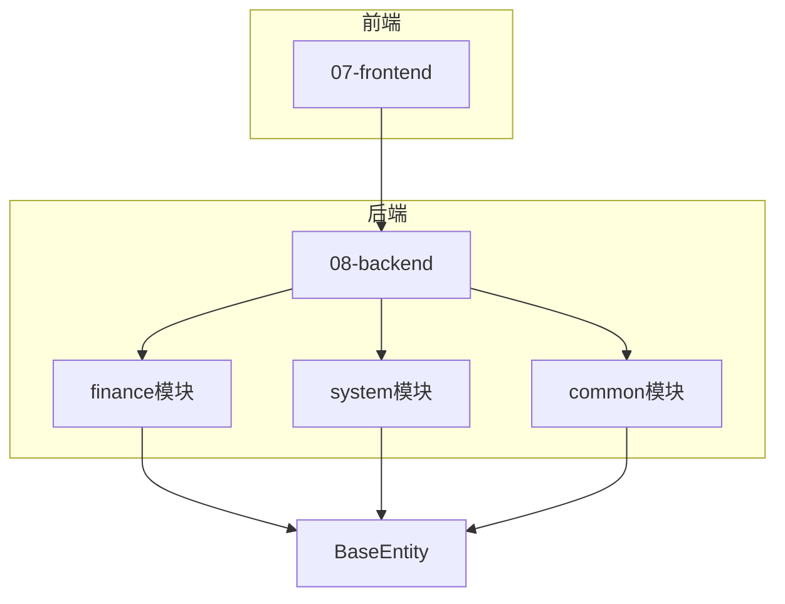
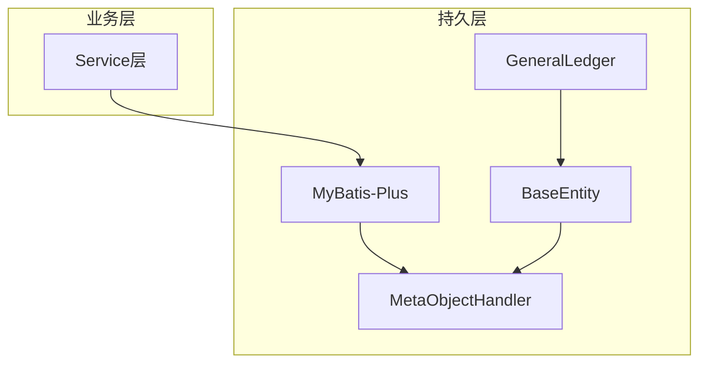
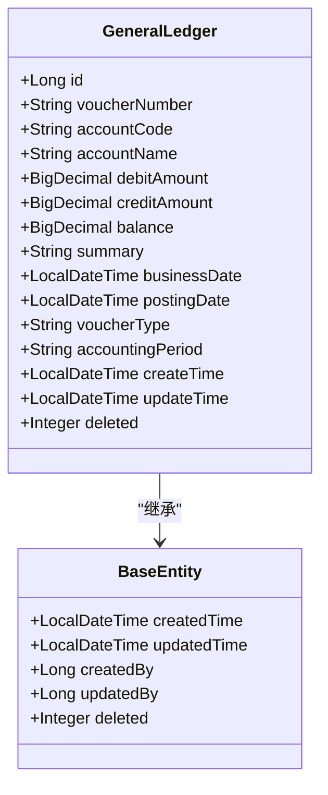
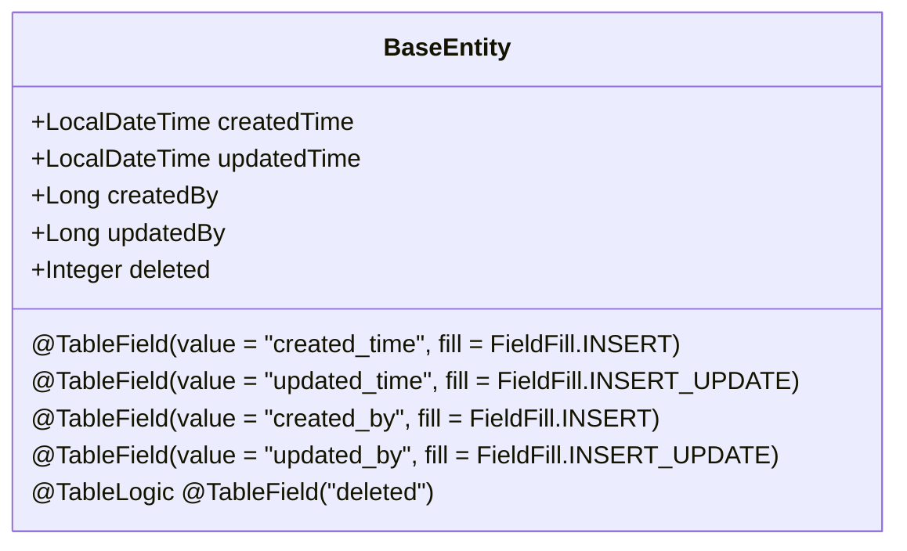

# 字段填充策略

<cite>
**本文档引用的文件**
- [GeneralLedger.java](file://08-backend/src/main/java/com/enterprise/brain/modules/finance/entity/GeneralLedger.java)
- [BaseEntity.java](file://08-backend/src/main/java/com/enterprise/brain/common/base/BaseEntity.java)
- [MyBatisConfig.java](file://08-backend/src/main/java/com/enterprise/brain/config/MyBatisConfig.java)
- [SystemConfig.java](file://08-backend/src/main/java/com/enterprise/brain/modules/system/initialization/entity/SystemConfig.java)
- [AccountBalance.java](file://08-backend/src/main/java/com/enterprise/brain/modules/finance/entity/AccountBalance.java)
- [InitializationLog.java](file://08-backend/src/main/java/com/enterprise/brain/modules/system/initialization/entity/InitializationLog.java)
</cite>

## 目录
1. [引言](#引言)
2. [项目结构](#项目结构)
3. [核心组件](#核心组件)
4. [架构概述](#架构概述)
5. [详细组件分析](#详细组件分析)
6. [依赖分析](#依赖分析)
7. [性能考虑](#性能考虑)
8. [故障排除指南](#故障排除指南)
9. [结论](#结论)

## 引言
本文档深入分析MyBatis-Plus框架中的字段自动填充机制，重点研究`GeneralLedger`实体类中`createTime`和`updateTime`字段的自动填充策略。通过分析`@TableField(fill = FieldFill.INSERT)`和`@TableField(fill = FieldFill.INSERT_UPDATE)`注解的使用，解释MyBatis-Plus如何实现公共字段的自动填充。文档还探讨了基于`BaseEntity`基类的通用字段管理策略，以及在不同业务场景下的最佳实践。

## 项目结构
本项目采用典型的分层架构设计，后端基于Spring Boot和MyBatis-Plus框架构建。核心业务逻辑位于`08-backend`目录下，按照模块化方式组织代码。财务模块（finance）包含总账（GeneralLedger）等核心实体类，这些实体类继承自通用的`BaseEntity`基类，实现了创建时间、更新时间等公共字段的统一管理。



**图表来源**
- [GeneralLedger.java](file://08-backend/src/main/java/com/enterprise/brain/modules/finance/entity/GeneralLedger.java)
- [BaseEntity.java](file://08-backend/src/main/java/com/enterprise/brain/common/base/BaseEntity.java)

**章节来源**
- [GeneralLedger.java](file://08-backend/src/main/java/com/enterprise/brain/modules/finance/entity/GeneralLedger.java)
- [BaseEntity.java](file://08-backend/src/main/java/com/enterprise/brain/common/base/BaseEntity.java)

## 核心组件
核心组件包括`GeneralLedger`实体类和`BaseEntity`基类。`GeneralLedger`类代表财务系统中的总账记录，包含凭证编号、会计科目、金额等业务字段，以及通过继承获得的创建时间、更新时间等审计字段。`BaseEntity`作为所有实体类的基类，定义了通用的审计字段和逻辑删除标记，实现了跨模块的数据一致性。

**章节来源**
- [GeneralLedger.java](file://08-backend/src/main/java/com/enterprise/brain/modules/finance/entity/GeneralLedger.java)
- [BaseEntity.java](file://08-backend/src/main/java/com/enterprise/brain/common/base/BaseEntity.java)

## 架构概述
系统采用基于MyBatis-Plus的持久层架构，通过注解驱动的方式实现数据库操作的自动化。字段自动填充功能是该架构的重要组成部分，它通过`MetaObjectHandler`接口的实现，在数据插入和更新时自动设置审计字段的值。这种设计模式将通用的审计逻辑从业务代码中分离出来，提高了代码的可维护性和一致性。



**图表来源**
- [GeneralLedger.java](file://08-backend/src/main/java/com/enterprise/brain/modules/finance/entity/GeneralLedger.java)
- [BaseEntity.java](file://08-backend/src/main/java/com/enterprise/brain/common/base/BaseEntity.java)
- [MyBatisConfig.java](file://08-backend/src/main/java/com/enterprise/brain/config/MyBatisConfig.java)

## 详细组件分析

### GeneralLedger实体类分析
`GeneralLedger`实体类是财务模块的核心数据模型，用于存储总账凭证信息。该类通过`@TableField`注解配置了字段自动填充策略，确保审计字段的值由框架自动管理。

#### 字段填充策略


**图表来源**
- [GeneralLedger.java](file://08-backend/src/main/java/com/enterprise/brain/modules/finance/entity/GeneralLedger.java)
- [BaseEntity.java](file://08-backend/src/main/java/com/enterprise/brain/common/base/BaseEntity.java)

**章节来源**
- [GeneralLedger.java](file://08-backend/src/main/java/com/enterprise/brain/modules/finance/entity/GeneralLedger.java)

### BaseEntity基类分析
`BaseEntity`基类为所有实体提供了统一的审计字段和逻辑删除功能。这种设计模式实现了代码复用，确保了跨模块数据结构的一致性。

#### 基类字段定义


**图表来源**
- [BaseEntity.java](file://08-backend/src/main/java/com/enterprise/brain/common/base/BaseEntity.java)

**章节来源**
- [BaseEntity.java](file://08-backend/src/main/java/com/enterprise/brain/common/base/BaseEntity.java)

## 依赖分析
通过分析代码库，可以发现多个实体类都继承了`BaseEntity`基类，形成了统一的审计字段管理机制。这种设计减少了重复代码，提高了系统的可维护性。

```mermaid
graph TD
BaseEntity[BaseEntity] --> GeneralLedger[GeneralLedger]
BaseEntity --> AccountBalance[AccountBalance]
BaseEntity --> SystemConfig[SystemConfig]
BaseEntity --> InitializationLog[InitializationLog]
GeneralLedger --> "create_time: INSERT"
GeneralLedger --> "update_time: INSERT_UPDATE"
AccountBalance --> "create_time: INSERT"
AccountBalance --> "update_time: INSERT_UPDATE"
SystemConfig --> "create_time: INSERT"
SystemConfig --> "update_time: INSERT_UPDATE"
InitializationLog --> "create_time: INSERT"
```

**图表来源**
- [GeneralLedger.java](file://08-backend/src/main/java/com/enterprise/brain/modules/finance/entity/GeneralLedger.java)
- [AccountBalance.java](file://08-backend/src/main/java/com/enterprise/brain/modules/finance/entity/AccountBalance.java)
- [SystemConfig.java](file://08-backend/src/main/java/com/enterprise/brain/modules/system/initialization/entity/SystemConfig.java)
- [InitializationLog.java](file://08-backend/src/main/java/com/enterprise/brain/modules/system/initialization/entity/InitializationLog.java)

**章节来源**
- [GeneralLedger.java](file://08-backend/src/main/java/com/enterprise/brain/modules/finance/entity/GeneralLedger.java)
- [BaseEntity.java](file://08-backend/src/main/java/com/enterprise/brain/common/base/BaseEntity.java)

## 性能考虑
字段自动填充机制对系统性能的影响主要体现在以下几个方面：首先，该机制在数据持久化过程中自动执行，避免了在业务代码中手动设置审计字段的开销；其次，由于填充逻辑由框架统一管理，减少了潜在的代码错误和数据不一致风险；最后，通过基类继承的方式实现代码复用，减少了重复的字段设置操作，提高了整体执行效率。

## 故障排除指南
当遇到字段自动填充不生效的问题时，应检查以下方面：确认实体类是否正确继承了`BaseEntity`基类；检查`MyBatis-Plus`配置是否正确加载；验证数据库字段名与实体类字段的映射关系是否正确；确保没有在业务代码中手动覆盖自动生成的字段值。

**章节来源**
- [GeneralLedger.java](file://08-backend/src/main/java/com/enterprise/brain/modules/finance/entity/GeneralLedger.java)
- [BaseEntity.java](file://08-backend/src/main/java/com/enterprise/brain/common/base/BaseEntity.java)
- [MyBatisConfig.java](file://08-backend/src/main/java/com/enterprise/brain/config/MyBatisConfig.java)

## 结论
MyBatis-Plus的字段自动填充机制通过`@TableField`注解和`MetaObjectHandler`接口的结合，实现了审计字段的自动化管理。`GeneralLedger`实体类通过继承`BaseEntity`基类，获得了创建时间、更新时间等公共字段的自动填充能力。这种设计模式不仅提高了代码的可维护性和一致性，还减少了潜在的错误风险。在实际应用中，应充分利用这一机制，确保所有实体类的审计字段都能得到统一和正确的管理。