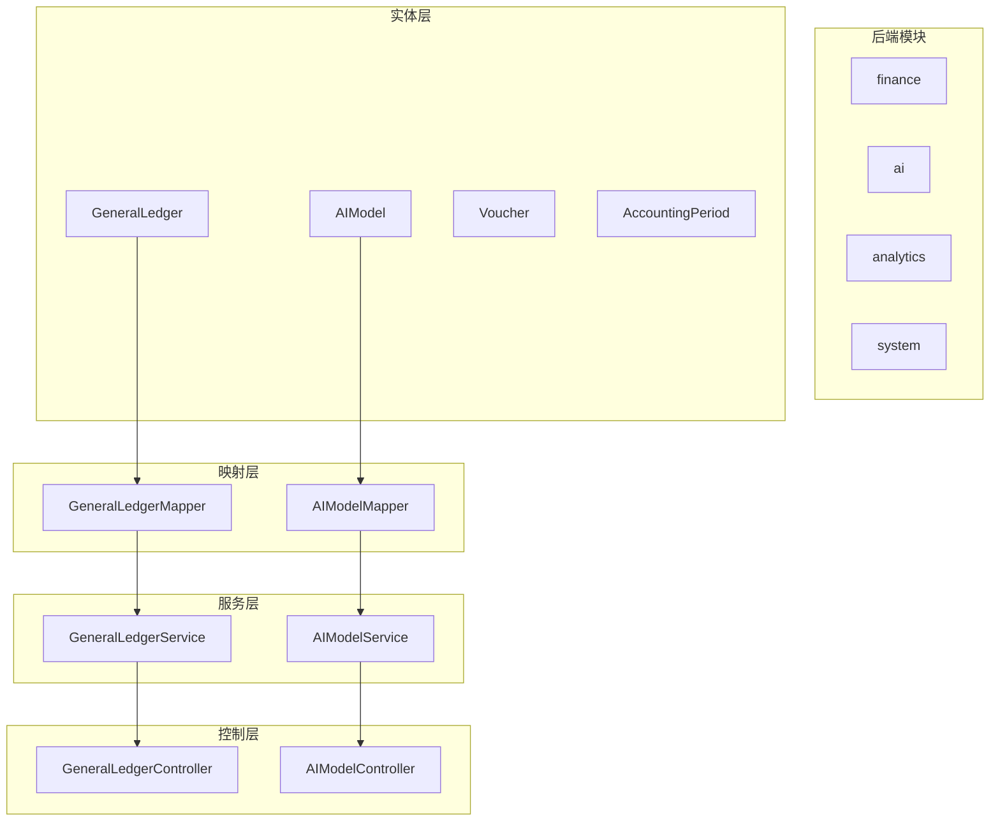
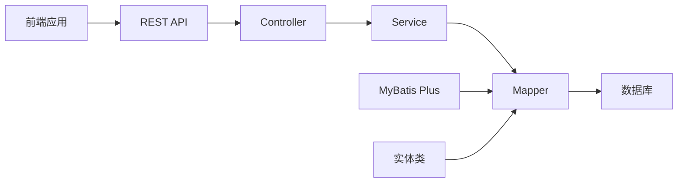
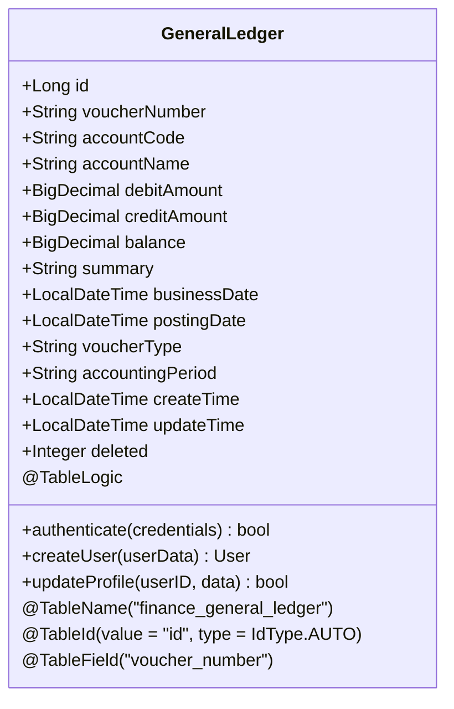
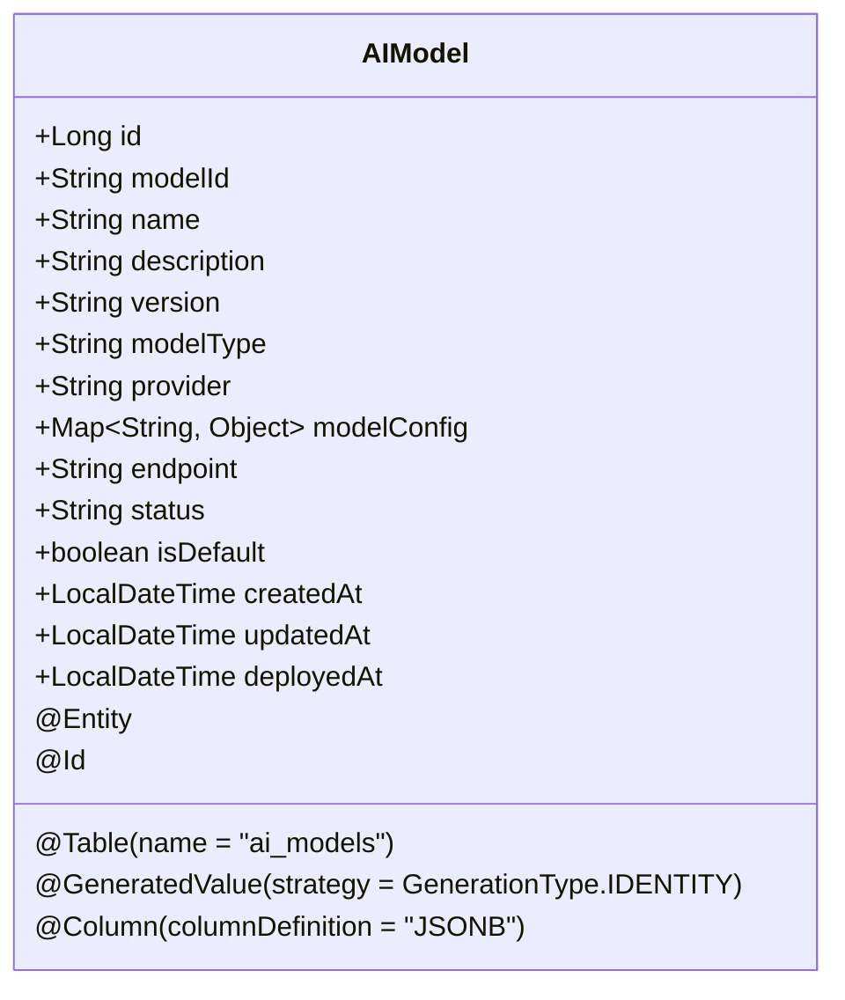
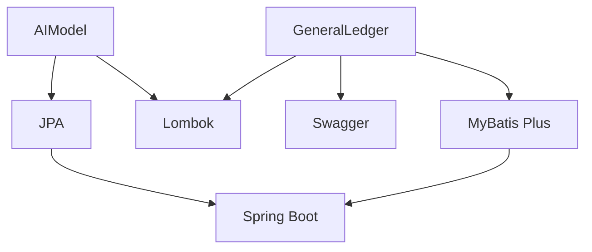

# 实体映射策略

<cite>
**本文档引用的文件**
- [GeneralLedger.java](file://08-backend/src/main/java/com/enterprise/brain/modules/finance/entity/GeneralLedger.java)
- [AIModel.java](file://08-backend/src/main/java/com/enterprise/brain/modules/ai/entity/AIModel.java)
- [Voucher.java](file://08-backend/src/main/java/com/enterprise/brain/modules/finance/entity/Voucher.java)
- [BaseEntity.java](file://08-backend/src/main/java/com/enterprise/brain/common/base/BaseEntity.java)
- [MyBatisConfig.java](file://08-backend/src/main/java/com/enterprise/brain/config/MyBatisConfig.java)
- [GeneralLedgerMapper.java](file://08-backend/src/main/java/com/enterprise/brain/modules/finance/mapper/GeneralLedgerMapper.java)
- [application.yml](file://08-backend/src/main/resources/application.yml)
</cite>

## 目录
1. [引言](#引言)
2. [项目结构](#项目结构)
3. [核心组件](#核心组件)
4. [架构概述](#架构概述)
5. [详细组件分析](#详细组件分析)
6. [依赖分析](#依赖分析)
7. [性能考虑](#性能考虑)
8. [故障排除指南](#故障排除指南)
9. [结论](#结论)

## 引言
本文档详细说明了企业级应用中实体类与数据库表的映射策略，重点分析了MyBatis Plus框架在财务和AI模块中的应用。文档涵盖了实体类如何通过注解与数据库表进行映射，包括字段定义、主键策略、字段填充等高级特性，并解释了命名转换规则和复杂映射场景的处理方案。

## 项目结构
项目采用分层架构设计，后端Java代码位于`08-backend`目录下，遵循典型的Spring Boot项目结构。实体类分布在各个业务模块的`entity`包中，通过MyBatis Plus实现与数据库的映射。



**Diagram sources**
- [GeneralLedger.java](file://08-backend/src/main/java/com/enterprise/brain/modules/finance/entity/GeneralLedger.java)
- [AIModel.java](file://08-backend/src/main/java/com/enterprise/brain/modules/ai/entity/AIModel.java)
- [GeneralLedgerMapper.java](file://08-backend/src/main/java/com/enterprise/brain/modules/finance/mapper/GeneralLedgerMapper.java)

**Section sources**
- [08-backend/src/main/java/com/enterprise/brain/modules](file://08-backend/src/main/java/com/enterprise/brain/modules)

## 核心组件
本文档的核心组件包括财务模块的`GeneralLedger`实体类和AI模块的`AIModel`实体类。这些实体类通过MyBatis Plus注解与数据库表进行映射，实现了对象关系映射（ORM）功能。

**Section sources**
- [GeneralLedger.java](file://08-backend/src/main/java/com/enterprise/brain/modules/finance/entity/GeneralLedger.java)
- [AIModel.java](file://08-backend/src/main/java/com/enterprise/brain/modules/ai/entity/AIModel.java)

## 架构概述
系统采用Spring Boot + MyBatis Plus技术栈，通过注解驱动的方式实现实体类与数据库表的映射。MyBatis Plus提供了丰富的注解来简化CRUD操作，同时保持了SQL的灵活性。



**Diagram sources**
- [GeneralLedgerController.java](file://08-backend/src/main/java/com/enterprise/brain/modules/finance/controller/GeneralLedgerController.java)
- [GeneralLedgerService.java](file://08-backend/src/main/java/com/enterprise/brain/modules/finance/service/GeneralLedgerService.java)
- [GeneralLedgerMapper.java](file://08-backend/src/main/java/com/enterprise/brain/modules/finance/mapper/GeneralLedgerMapper.java)

## 详细组件分析

### GeneralLedger实体类分析
`GeneralLedger`实体类代表财务模块中的总账记录，通过MyBatis Plus注解与`finance_general_ledger`表进行映射。

#### 类图


**Diagram sources**
- [GeneralLedger.java](file://08-backend/src/main/java/com/enterprise/brain/modules/finance/entity/GeneralLedger.java)

**Section sources**
- [GeneralLedger.java](file://08-backend/src/main/java/com/enterprise/brain/modules/finance/entity/GeneralLedger.java)

### AIModel实体类分析
`AIModel`实体类代表AI模块中的模型信息，使用JPA注解与`ai_models`表进行映射。

#### 类图


**Diagram sources**
- [AIModel.java](file://08-backend/src/main/java/com/enterprise/brain/modules/ai/entity/AIModel.java)

**Section sources**
- [AIModel.java](file://08-backend/src/main/java/com/enterprise/brain/modules/ai/entity/AIModel.java)

### 映射策略分析

#### 实体类与数据库表映射
实体类通过`@TableName`注解指定对应的数据库表名。例如，`GeneralLedger`类映射到`finance_general_ledger`表：

```java
@TableName("finance_general_ledger")
public class GeneralLedger {
    // 字段定义
}
```

#### 字段映射
使用`@TableField`注解将实体类字段映射到数据库表的列。当字段名与列名不一致时，需要显式指定列名：

```java
@TableField("voucher_number")
private String voucherNumber;
```

#### 主键策略
MyBatis Plus支持多种主键生成策略，通过`@TableId`注解的`type`属性指定：

- `IdType.AUTO`: 数据库自增
- `IdType.ASSIGN_ID`: 雪花算法生成ID
- `IdType.INPUT`: 用户输入

在`GeneralLedger`类中使用了数据库自增策略：

```java
@TableId(value = "id", type = IdType.AUTO)
private Long id;
```

#### 字段填充
通过`@TableField`注解的`fill`属性实现自动填充，常用于创建时间和更新时间字段：

```java
@TableField(value = "create_time", fill = FieldFill.INSERT)
private LocalDateTime createTime;

@TableField(value = "update_time", fill = FieldFill.INSERT_UPDATE)
private LocalDateTime updateTime;
```

#### 逻辑删除
使用`@TableLogic`注解实现逻辑删除功能，避免数据物理删除：

```java
@TableField("deleted")
@TableLogic
private Integer deleted;
```

#### 命名转换规则
系统遵循驼峰命名转下划线的转换规则。例如，Java中的`voucherNumber`字段对应数据库中的`voucher_number`列。这种转换由MyBatis Plus自动处理，无需额外配置。

**Section sources**
- [GeneralLedger.java](file://08-backend/src/main/java/com/enterprise/brain/modules/finance/entity/GeneralLedger.java)
- [Voucher.java](file://08-backend/src/main/java/com/enterprise/brain/modules/finance/entity/Voucher.java)
- [BaseEntity.java](file://08-backend/src/main/java/com/enterprise/brain/common/base/BaseEntity.java)

### 复杂映射场景处理

#### 枚举类型映射
虽然在当前代码库中未发现枚举类型的直接使用，但MyBatis Plus支持枚举类型的映射。可以通过`@EnumValue`注解指定枚举值的存储方式。

#### JSON字段处理
在AI模块中，`AIModel`类使用JPA的`@Column`注解处理JSON字段：

```java
@Column(columnDefinition = "JSONB")
private Map<String, Object> modelConfig;
```

这种方式允许在数据库中存储复杂的JSON结构，适合存储模型配置等非结构化数据。

#### 基类继承
实体类可以继承`BaseEntity`基类，复用通用字段如创建时间、更新时间、逻辑删除标记等：

```java
public class GeneralLedger extends BaseEntity {
    // 特有字段
}
```

**Section sources**
- [AIModel.java](file://08-backend/src/main/java/com/enterprise/brain/modules/ai/entity/AIModel.java)
- [BaseEntity.java](file://08-backend/src/main/java/com/enterprise/brain/common/base/BaseEntity.java)

## 依赖分析
系统依赖MyBatis Plus框架实现ORM功能，通过注解简化数据库操作。实体类依赖Lombok库减少样板代码，使用Swagger注解提供API文档支持。



**Diagram sources**
- [pom.xml](file://08-backend/pom.xml)
- [GeneralLedger.java](file://08-backend/src/main/java/com/enterprise/brain/modules/finance/entity/GeneralLedger.java)
- [AIModel.java](file://08-backend/src/main/java/com/enterprise/brain/modules/ai/entity/AIModel.java)

**Section sources**
- [pom.xml](file://08-backend/pom.xml)
- [MyBatisConfig.java](file://08-backend/src/main/java/com/enterprise/brain/config/MyBatisConfig.java)

## 性能考虑
实体类设计考虑了性能优化，如使用合适的数据类型、避免N+1查询问题。通过MyBatis Plus的分页插件实现高效的数据分页。

## 故障排除指南
当实体映射出现问题时，应检查注解配置是否正确，数据库表结构是否匹配，以及MyBatis Plus配置是否恰当。

**Section sources**
- [MyBatisConfig.java](file://08-backend/src/main/java/com/enterprise/brain/config/MyBatisConfig.java)
- [application.yml](file://08-backend/src/main/resources/application.yml)

## 结论
本文档详细介绍了项目中实体类与数据库表的映射策略，涵盖了MyBatis Plus注解的使用、字段映射规则、主键策略、字段填充等关键概念。通过合理的映射设计，实现了业务逻辑与数据存储的解耦，提高了代码的可维护性和可扩展性。