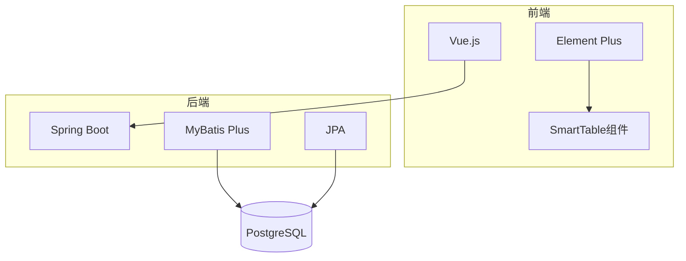
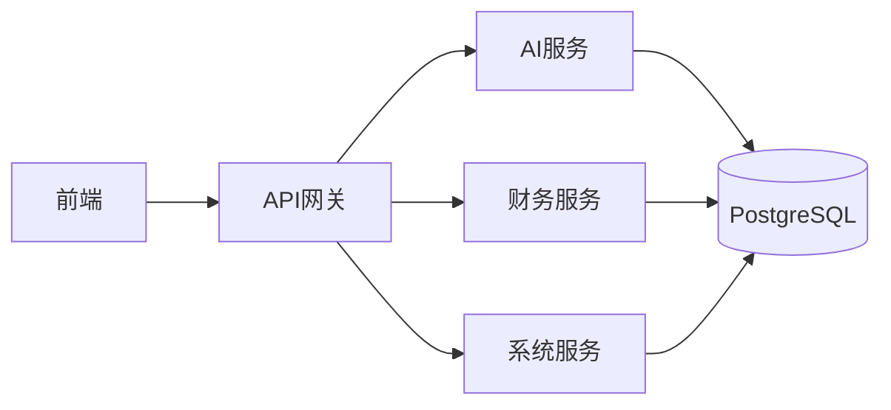
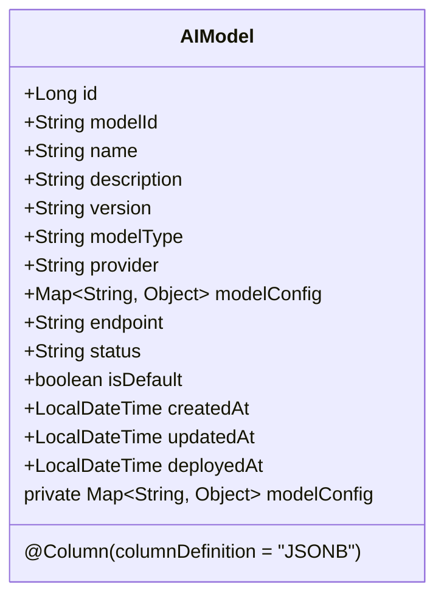
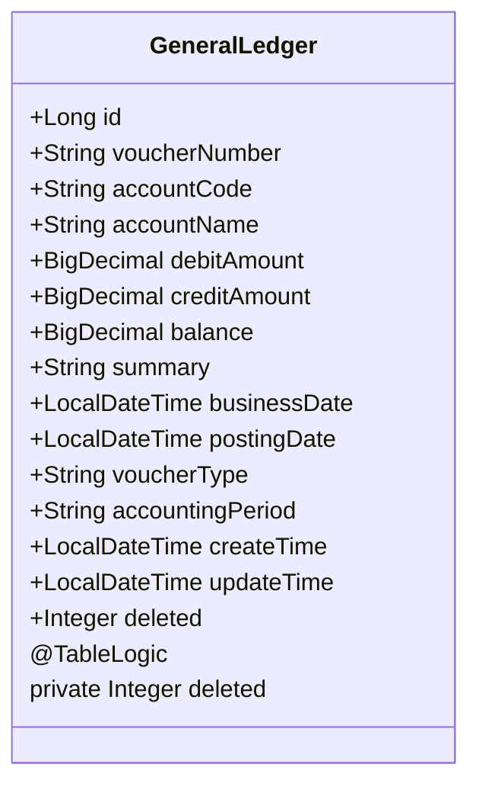
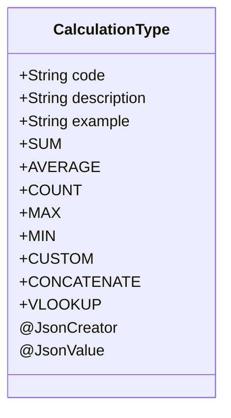
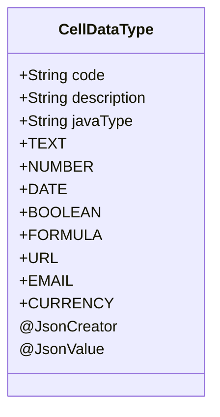
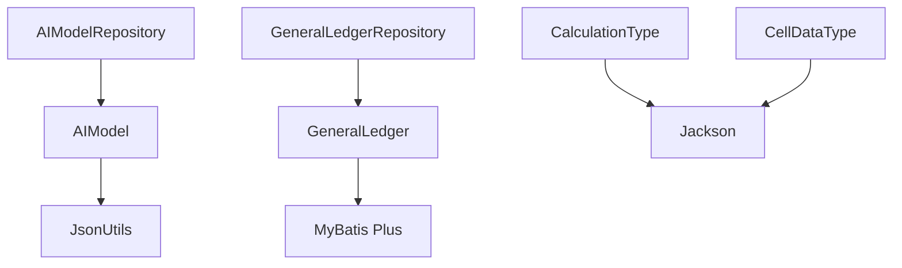

# 高级映射场景

<cite>
**本文档引用的文件**  
- [AIModel.java](file://08-backend/src/main/java/com/enterprise/brain/modules/ai/entity/AIModel.java)
- [GeneralLedger.java](file://08-backend/src/main/java/com/enterprise/brain/modules/finance/entity/GeneralLedger.java)
- [JsonUtils.java](file://08-backend/src/main/java/com/enterprise/brain/common/utils/JsonUtils.java)
- [CalculationType.java](file://08-backend/src/main/java/com/enterprise/brain/modules/smart-table/enums/CalculationType.java)
- [CellDataType.java](file://08-backend/src/main/java/com/enterprise/brain/modules/smart-table/enums/CellDataType.java)
- [MyBatisConfig.java](file://08-backend/src/main/java/com/enterprise/brain/config/MyBatisConfig.java)
- [application.yml](file://08-backend/src/main/resources/application.yml)
</cite>

## 目录
1. [引言](#引言)
2. [项目结构](#项目结构)
3. [核心组件](#核心组件)
4. [架构概述](#架构概述)
5. [详细组件分析](#详细组件分析)
6. [依赖分析](#依赖分析)
7. [性能考虑](#性能考虑)
8. [故障排除指南](#故障排除指南)
9. [结论](#结论)

## 引言
本文档详细说明了在企业级应用中处理复杂实体映射的高级技术方案。重点分析了JSONB字段的序列化/反序列化处理、枚举类型的映射以及逻辑删除功能的实现。通过AI模型管理和财务总账两个核心模块的实现，展示了如何在实际项目中处理这些复杂映射场景，确保数据完整性和系统稳定性。

## 项目结构
项目采用典型的分层架构设计，后端使用Java Spring Boot框架，前端使用Vue.js技术栈。核心业务逻辑集中在08-backend模块中，按照功能划分为ai、finance、system等子模块。

**图表来源**
- [application.yml](file://08-backend/src/main/resources/application.yml)

## 核心组件
本文档重点关注两个核心实体类：AIModel和GeneralLedger。AIModel实体类展示了如何处理JSONB类型的复杂数据存储，而GeneralLedger实体类则体现了逻辑删除和审计字段的实现。

**章节来源**
- [AIModel.java](file://08-backend/src/main/java/com/enterprise/brain/modules/ai/entity/AIModel.java)
- [GeneralLedger.java](file://08-backend/src/main/java/com/enterprise/brain/modules/finance/entity/GeneralLedger.java)

## 架构概述
系统采用微服务架构，数据访问层使用MyBatis Plus和JPA双框架支持。对于需要复杂查询的业务使用MyBatis Plus，而对于简单的CRUD操作则使用JPA。这种混合持久化策略提供了灵活性和性能的平衡。

**图表来源**
- [application.yml](file://08-backend/src/main/resources/application.yml)

## 详细组件分析

### AIModel实体分析
AIModel实体类用于管理AI模型的元数据和配置信息。其核心特性是使用JSONB字段存储模型的特定配置，这提供了极大的灵活性。

#### JSONB字段映射

**图表来源**
- [AIModel.java](file://08-backend/src/main/java/com/enterprise/brain/modules/ai/entity/AIModel.java)

**章节来源**
- [AIModel.java](file://08-backend/src/main/java/com/enterprise/brain/modules/ai/entity/AIModel.java)

### GeneralLedger实体分析
GeneralLedger实体类代表财务总账记录，实现了软删除功能和审计字段。

#### 逻辑删除实现

**图表来源**
- [GeneralLedger.java](file://08-backend/src/main/java/com/enterprise/brain/modules/finance/entity/GeneralLedger.java)

**章节来源**
- [GeneralLedger.java](file://08-backend/src/main/java/com/enterprise/brain/modules/finance/entity/GeneralLedger.java)

### 枚举类型分析
系统中使用了多种枚举类型来确保数据的一致性和完整性。这些枚举类型通过Jackson注解实现了JSON序列化和反序列化的支持。

#### 计算类型枚举

**图表来源**
- [CalculationType.java](file://08-backend/src/main/java/com/enterprise/brain/modules/smart-table/enums/CalculationType.java)

#### 单元格数据类型枚举

**图表来源**
- [CellDataType.java](file://08-backend/src/main/java/com/enterprise/brain/modules/smart-table/enums/CellDataType.java)

## 依赖分析
系统依赖关系清晰，各模块之间通过定义良好的接口进行通信。数据访问层与业务逻辑层分离，确保了代码的可维护性和可测试性。

**图表来源**
- [AIModel.java](file://08-backend/src/main/java/com/enterprise/brain/modules/ai/entity/AIModel.java)
- [GeneralLedger.java](file://08-backend/src/main/java/com/enterprise/brain/modules/finance/entity/GeneralLedger.java)
- [JsonUtils.java](file://08-backend/src/main/java/com/enterprise/brain/common/utils/JsonUtils.java)

**章节来源**
- [AIModel.java](file://08-backend/src/main/java/com/enterprise/brain/modules/ai/entity/AIModel.java)
- [GeneralLedger.java](file://08-backend/src/main/java/com/enterprise/brain/modules/finance/entity/GeneralLedger.java)

## 性能考虑
在处理JSONB字段时，需要注意查询性能。PostgreSQL提供了GIN索引支持JSONB字段的高效查询。对于频繁查询的JSON字段，建议创建适当的索引。

对于逻辑删除，虽然避免了数据的物理删除，但长期积累的"已删除"记录会影响查询性能。建议定期归档或清理历史数据。

## 故障排除指南
### JSONB序列化问题
当遇到JSONB字段序列化问题时，检查JsonUtils配置是否正确，特别是日期时间模块的注册。

### 逻辑删除失效
如果逻辑删除功能未按预期工作，检查@TableLogic注解是否正确配置，以及MyBatis Plus插件是否已正确初始化。

### 枚举类型转换错误
确保枚举类中的@JsonCreator和@JsonValue注解正确使用，避免序列化/反序列化时出现类型转换错误。

**章节来源**
- [JsonUtils.java](file://08-backend/src/main/java/com/enterprise/brain/common/utils/JsonUtils.java)
- [MyBatisConfig.java](file://08-backend/src/main/java/com/enterprise/brain/config/MyBatisConfig.java)

## 结论
本文档详细介绍了复杂实体映射场景的实现方案。通过AIModel的JSONB字段和GeneralLedger的逻辑删除功能，展示了如何在企业级应用中处理高级映射需求。这些技术方案不仅提高了系统的灵活性，还确保了数据的完整性和可追溯性。