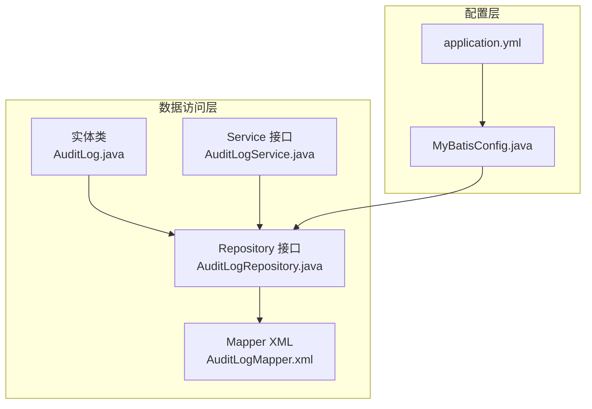
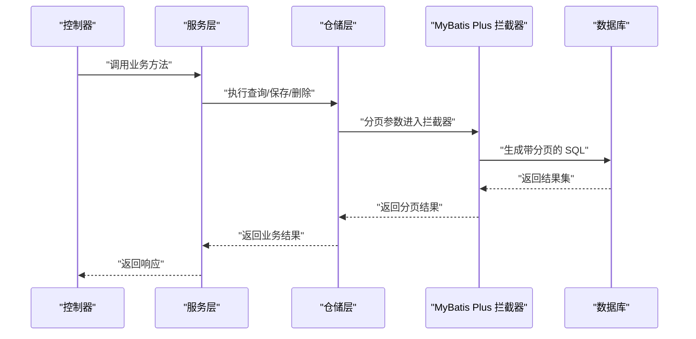
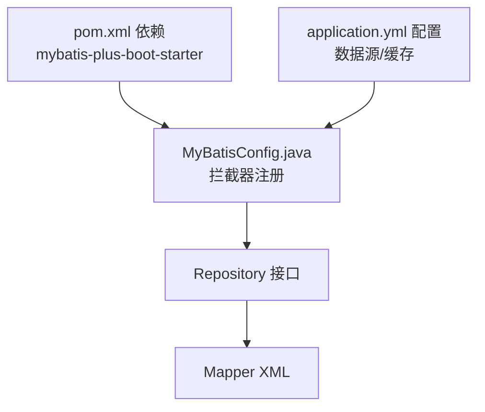

# 数据访问层设计

<cite>
**本文引用的文件**
- [BaseRepository.java](file://08-backend/src/main/java/com/enterprise/brain/common/base/BaseRepository.java)
- [BaseEntity.java](file://08-backend/src/main/java/com/enterprise/brain/common/base/BaseEntity.java)
- [BaseService.java](file://08-backend/src/main/java/com/enterprise/brain/common/base/BaseService.java)
- [MyBatisConfig.java](file://08-backend/src/main/java/com/enterprise/brain/config/MyBatisConfig.java)
- [AuditLogRepository.java](file://08-backend/src/main/java/com/enterprise/brain/modules/system/audit/repository/AuditLogRepository.java)
- [DataChangeRepository.java](file://08-backend/src/main/java/com/enterprise/brain/modules/system/audit/repository/DataChangeRepository.java)
- [AuditLog.java](file://08-backend/src/main/java/com/enterprise/brain/modules/system/audit/entity/AuditLog.java)
- [AuditLogMapper.xml](file://08-backend/src/main/resources/mapper/system/audit/AuditLogMapper.xml)
- [AuditLogService.java](file://08-backend/src/main/java/com/enterprise/brain/modules/system/audit/service/AuditLogService.java)
- [application.yml](file://08-backend/src/main/resources/application.yml)
- [pom.xml](file://08-backend/pom.xml)
</cite>

## 目录
1. [引言](#引言)
2. [项目结构](#项目结构)
3. [核心组件](#核心组件)
4. [架构总览](#架构总览)
5. [详细组件分析](#详细组件分析)
6. [依赖分析](#依赖分析)
7. [性能考虑](#性能考虑)
8. [故障排查指南](#故障排查指南)
9. [结论](#结论)
10. [附录](#附录)

## 引言
本文件聚焦于本项目的 MyBatis Plus 数据访问层设计，围绕以下目标展开：
- 解释 BaseRepository 抽象基类的设计意图与通用方法封装
- 分析 MyBatisConfig.java 中的 SQLSessionFactory 配置与 Mapper 扫描机制
- 说明实体类与数据库表的映射关系，以及复杂查询的 XML 配置方式（以 AuditLogMapper.xml 为例）
- 提供分页查询、动态 SQL、批量操作等高级特性的使用示例与性能优化建议

## 项目结构
后端采用 Spring Boot + MyBatis Plus 的分层架构，数据访问层由“实体 + Repository + Service + Controller”构成，其中：
- 实体类通过注解映射数据库表字段
- Repository 接口继承 MyBatis Plus 的 BaseMapper，天然具备 CRUD 能力
- Service 层封装业务逻辑，并可扩展通用能力（如逻辑删除）
- MyBatis Plus 配置通过拦截器启用分页功能

图表来源
- [AuditLog.java](file://08-backend/src/main/java/com/enterprise/brain/modules/system/audit/entity/AuditLog.java#L1-L22)
- [AuditLogRepository.java](file://08-backend/src/main/java/com/enterprise/brain/modules/system/audit/repository/AuditLogRepository.java#L1-L10)
- [AuditLogMapper.xml](file://08-backend/src/main/resources/mapper/system/audit/AuditLogMapper.xml#L1-L9)
- [AuditLogService.java](file://08-backend/src/main/java/com/enterprise/brain/modules/system/audit/service/AuditLogService.java#L1-L11)
- [MyBatisConfig.java](file://08-backend/src/main/java/com/enterprise/brain/config/MyBatisConfig.java#L1-L18)
- [application.yml](file://08-backend/src/main/resources/application.yml#L1-L42)

章节来源
- [application.yml](file://08-backend/src/main/resources/application.yml#L1-L42)
- [pom.xml](file://08-backend/pom.xml#L1-L115)

## 核心组件
- BaseRepository：统一的仓储接口，继承 MyBatis Plus 的 BaseMapper，提供通用 CRUD 能力；可在其上扩展通用方法
- BaseEntity：统一的实体基类，内置创建/更新时间、创建/更新人、逻辑删除等字段，便于审计与合规
- BaseService：统一的服务接口，继承 MyBatis Plus 的 IService，提供逻辑删除与批量逻辑删除等通用能力
- MyBatisConfig：注册 MyBatis Plus 拦截器，启用分页内核，为分页查询提供支持

章节来源
- [BaseRepository.java](file://08-backend/src/main/java/com/enterprise/brain/common/base/BaseRepository.java#L1-L16)
- [BaseEntity.java](file://08-backend/src/main/java/com/enterprise/brain/common/base/BaseEntity.java#L1-L53)
- [BaseService.java](file://08-backend/src/main/java/com/enterprise/brain/common/base/BaseService.java#L1-L34)
- [MyBatisConfig.java](file://08-backend/src/main/java/com/enterprise/brain/config/MyBatisConfig.java#L1-L18)

## 架构总览
下图展示从控制器到数据访问层的关键交互路径，以及分页拦截器如何贯穿请求生命周期：

图表来源
- [MyBatisConfig.java](file://08-backend/src/main/java/com/enterprise/brain/config/MyBatisConfig.java#L1-L18)
- [AuditLogService.java](file://08-backend/src/main/java/com/enterprise/brain/modules/system/audit/service/AuditLogService.java#L1-L11)

## 详细组件分析

### BaseRepository 抽象基类
- 设计意图
  - 统一仓储接口，继承 MyBatis Plus 的 BaseMapper，天然具备增删改查能力
  - 作为扩展点，可在其上声明通用方法，避免在各模块重复定义
- 通用方法封装
  - 基于 BaseMapper 已提供的 CRUD 方法，无需额外实现
  - 如需扩展通用方法（例如批量逻辑删除），可在该接口中声明，具体实现交由各模块 Repository

章节来源
- [BaseRepository.java](file://08-backend/src/main/java/com/enterprise/brain/common/base/BaseRepository.java#L1-L16)

### BaseEntity 实体基类
- 字段设计
  - 创建/更新时间：自动填充插入与插入更新
  - 创建/更新人：用于审计追踪
  - 逻辑删除：deleted 字段配合 MyBatis Plus 的逻辑删除策略
- 映射关系
  - 通过注解将 Java 字段映射到数据库列名，确保与数据库一致

章节来源
- [BaseEntity.java](file://08-backend/src/main/java/com/enterprise/brain/common/base/BaseEntity.java#L1-L53)

### AuditLog 实体与表映射
- 表名映射
  - 使用 @TableName 指定数据库表名为 sys_audit_log
- 主键策略
  - 使用 @TableId 并设置自增主键
- 字段映射
  - 将 Java 字段映射到表列，保证查询与持久化一致性

章节来源
- [AuditLog.java](file://08-backend/src/main/java/com/enterprise/brain/modules/system/audit/entity/AuditLog.java#L1-L22)

### AuditLogRepository 与 Mapper XML
- Repository 接口
  - 继承 BaseMapper，获得标准 CRUD 能力
  - 通过 @Mapper 注解启用 MyBatis 扫描
- Mapper XML
  - 命名空间指向对应的 Repository 接口
  - 定义自定义查询（如按模块查询），返回类型映射到实体类

章节来源
- [AuditLogRepository.java](file://08-backend/src/main/java/com/enterprise/brain/modules/system/audit/repository/AuditLogRepository.java#L1-L10)
- [AuditLogMapper.xml](file://08-backend/src/main/resources/mapper/system/audit/AuditLogMapper.xml#L1-L9)

### BaseService 通用能力
- 逻辑删除
  - 提供逻辑删除与批量逻辑删除默认实现，基于 removeById/removeByIds
- 适用场景
  - 需要保留历史记录或满足合规要求时，优先使用逻辑删除

章节来源
- [BaseService.java](file://08-backend/src/main/java/com/enterprise/brain/common/base/BaseService.java#L1-L34)

### MyBatisConfig 分页与拦截器
- 配置要点
  - 注册 MybatisPlusInterceptor
  - 添加 PaginationInnerInterceptor，启用分页内核
- 生效范围
  - 对所有使用 Page 的查询生效，无需在每个 Repository 中重复配置

章节来源
- [MyBatisConfig.java](file://08-backend/src/main/java/com/enterprise/brain/config/MyBatisConfig.java#L1-L18)

### AuditLogService 分页查询示例
- 方法签名
  - Page<AuditLogResponse> getAuditLogs(AuditQueryRequest request)
- 使用建议
  - 在 Service 层接收 Page 请求参数，调用 Repository 查询
  - 结合 Mapper XML 的自定义查询，实现复杂条件筛选
  - 返回 Page 对象，前端可直接消费分页信息

章节来源
- [AuditLogService.java](file://08-backend/src/main/java/com/enterprise/brain/modules/system/audit/service/AuditLogService.java#L1-L11)

### 复杂查询与动态 SQL
- XML 方式
  - 在 Mapper XML 中编写动态 SQL（如条件查询、联表查询、聚合统计）
  - 通过命名空间与接口绑定，实现强类型返回
- 示例参考
  - AuditLogMapper.xml 提供了按模块查询的示例，可在此基础上扩展 where 条件、排序、分页等

章节来源
- [AuditLogMapper.xml](file://08-backend/src/main/resources/mapper/system/audit/AuditLogMapper.xml#L1-L9)

### 批量操作
- 批量删除
  - BaseService 提供批量逻辑删除默认实现，适用于多 ID 删除
- 批量插入/更新
  - 可在 Repository 中扩展批量方法，结合 MyBatis Plus 的批量工具提升吞吐

章节来源
- [BaseService.java](file://08-backend/src/main/java/com/enterprise/brain/common/base/BaseService.java#L1-L34)

## 依赖分析
- MyBatis Plus 依赖
  - 通过 pom.xml 引入 mybatis-plus-boot-starter，启用自动配置与增强能力
- 数据源与缓存
  - application.yml 配置 MySQL 数据源、JPA Hibernate、Redis 缓存等
- 拦截器链路
  - MyBatisConfig 注册拦截器，影响所有分页查询

图表来源
- [pom.xml](file://08-backend/pom.xml#L1-L115)
- [application.yml](file://08-backend/src/main/resources/application.yml#L1-L42)
- [MyBatisConfig.java](file://08-backend/src/main/java/com/enterprise/brain/config/MyBatisConfig.java#L1-L18)
- [AuditLogRepository.java](file://08-backend/src/main/java/com/enterprise/brain/modules/system/audit/repository/AuditLogRepository.java#L1-L10)
- [AuditLogMapper.xml](file://08-backend/src/main/resources/mapper/system/audit/AuditLogMapper.xml#L1-L9)

章节来源
- [pom.xml](file://08-backend/pom.xml#L1-L115)
- [application.yml](file://08-backend/src/main/resources/application.yml#L1-L42)

## 性能考虑
- 分页优化
  - 使用 Page 参数进行分页，避免一次性加载大量数据
  - 合理设置每页大小，避免过小导致请求次数过多
- 动态 SQL
  - 在 Mapper XML 中使用 where/trim/choose 等标签，减少不必要的全表扫描
  - 为高频查询字段建立索引，提升过滤效率
- 批量操作
  - 批量插入/更新时控制批次大小，避免内存压力过大
  - 使用逻辑删除替代物理删除，降低锁竞争与日志开销
- 缓存策略
  - 利用 Redis 缓存热点数据，减少数据库压力
  - 对只读或低频变更的数据启用缓存，注意缓存失效策略

## 故障排查指南
- 分页不生效
  - 检查是否正确注入 MybatisPlusInterceptor
  - 确认 Service 层使用 Page 参数调用 Repository
- 自定义查询未命中
  - 核对 Mapper XML 命名空间与接口完全一致
  - 确认 resultType 与实体类路径正确
- 逻辑删除异常
  - 检查实体类是否包含逻辑删除字段与注解
  - 确认查询时未显式忽略逻辑删除条件
- 数据源连接问题
  - 校验 application.yml 中的数据库连接信息与驱动版本
  - 确认网络连通性与账号权限

章节来源
- [MyBatisConfig.java](file://08-backend/src/main/java/com/enterprise/brain/config/MyBatisConfig.java#L1-L18)
- [AuditLogMapper.xml](file://08-backend/src/main/resources/mapper/system/audit/AuditLogMapper.xml#L1-L9)
- [application.yml](file://08-backend/src/main/resources/application.yml#L1-L42)

## 结论
本项目通过 MyBatis Plus 实现了清晰、可扩展的数据访问层：
- 以 BaseRepository/BaseService 为基础，统一 CRUD 与通用能力
- 通过 MyBatisConfig 注入分页拦截器，简化分页查询
- 通过实体注解与 Mapper XML 实现强类型的表映射与复杂查询
- 建议在实际业务中结合动态 SQL、批量操作与缓存策略，持续优化性能与可维护性

## 附录
- 关键文件清单
  - [BaseRepository.java](file://08-backend/src/main/java/com/enterprise/brain/common/base/BaseRepository.java)
  - [BaseEntity.java](file://08-backend/src/main/java/com/enterprise/brain/common/base/BaseEntity.java)
  - [BaseService.java](file://08-backend/src/main/java/com/enterprise/brain/common/base/BaseService.java)
  - [MyBatisConfig.java](file://08-backend/src/main/java/com/enterprise/brain/config/MyBatisConfig.java)
  - [AuditLogRepository.java](file://08-backend/src/main/java/com/enterprise/brain/modules/system/audit/repository/AuditLogRepository.java)
  - [DataChangeRepository.java](file://08-backend/src/main/java/com/enterprise/brain/modules/system/audit/repository/DataChangeRepository.java)
  - [AuditLog.java](file://08-backend/src/main/java/com/enterprise/brain/modules/system/audit/entity/AuditLog.java)
  - [AuditLogMapper.xml](file://08-backend/src/main/resources/mapper/system/audit/AuditLogMapper.xml)
  - [AuditLogService.java](file://08-backend/src/main/java/com/enterprise/brain/modules/system/audit/service/AuditLogService.java)
  - [application.yml](file://08-backend/src/main/resources/application.yml)
  - [pom.xml](file://08-backend/pom.xml)