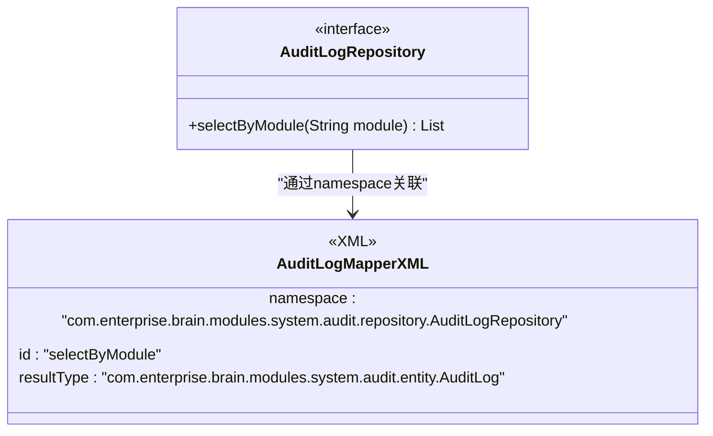
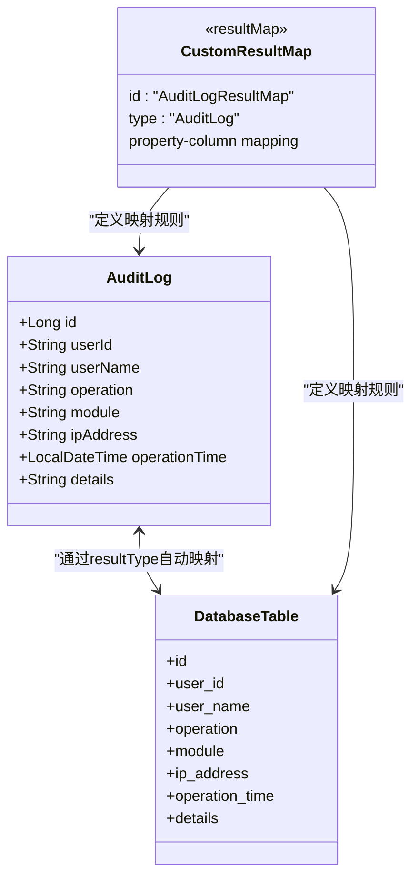
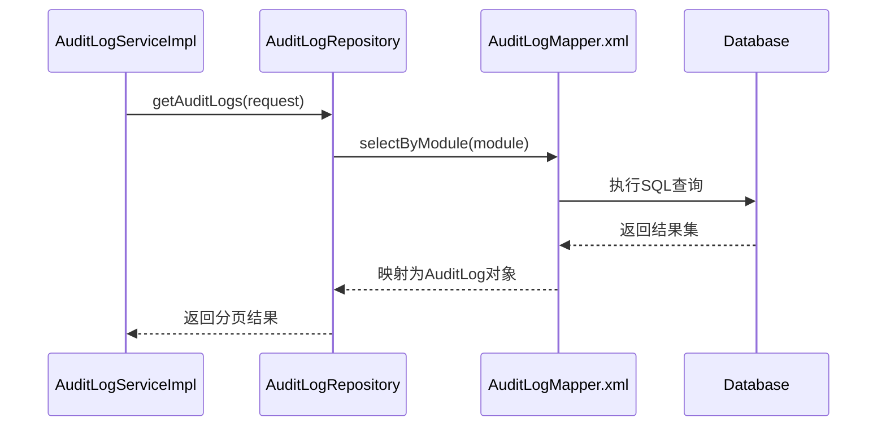
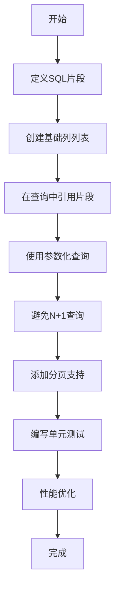

# XML映射配置

<cite>
**本文档中引用的文件**
- [AuditLogMapper.xml](file://08-backend/src/main/resources/mapper/system/audit/AuditLogMapper.xml)
- [AuditLogRepository.java](file://08-backend/src/main/java/com/enterprise/brain/modules/system/audit/repository/AuditLogRepository.java)
- [AuditLog.java](file://08-backend/src/main/java/com/enterprise/brain/modules/system/audit/entity/AuditLog.java)
- [MyBatisConfig.java](file://08-backend/src/main/java/com/enterprise/brain/config/MyBatisConfig.java)
- [application.yml](file://08-backend/src/main/resources/application.yml)
- [pom.xml](file://08-backend/pom.xml)
- [BaseRepository.java](file://08-backend/src/main/java/com/enterprise/brain/common/base/BaseRepository.java)
- [AuditLogServiceImpl.java](file://08-backend/src/main/java/com/enterprise/brain/modules/system/audit/service/impl/AuditLogServiceImpl.java)
</cite>

## 目录
1. [简介](#简介)
2. [XML映射文件基本结构](#xml映射文件基本结构)
3. [命名空间与接口关联](#命名空间与接口关联)
4. [SQL语句标签详解](#sql语句标签详解)
5. [结果映射：resultType与resultMap](#结果映射resulttype与resultmap)
6. [参数类型与方法绑定](#参数类型与方法绑定)
7. [最佳实践](#最佳实践)
8. [总结](#总结)

## 简介
本文档详细介绍了MyBatis框架中XML映射文件的配置方法，以`AuditLogMapper.xml`为例，深入解析XML文件的结构、标签使用、结果映射机制以及最佳实践。通过本指南，开发者可以全面掌握MyBatis XML映射文件的核心概念和实际应用。

## XML映射文件基本结构

MyBatis XML映射文件遵循标准的XML格式，包含文档声明、DOCTYPE定义和根元素`<mapper>`。文件的基本结构如下：

```xml
<?xml version="1.0" encoding="UTF-8"?>
<!DOCTYPE mapper PUBLIC "-//mybatis.org//DTD Mapper 3.0//EN" "http://mybatis.org/dtd/mybatis-3-mapper.dtd">
<mapper namespace="com.enterprise.brain.modules.system.audit.repository.AuditLogRepository">
    <!-- SQL语句定义 -->
</mapper>
```

其中：
- `<?xml version="1.0" encoding="UTF-8"?>`：XML文档声明，指定版本和编码
- `<!DOCTYPE mapper ...>`：DTD文档类型定义，确保XML结构符合MyBatis规范
- `<mapper>`：根元素，包含所有SQL映射语句

**文档来源**
- [AuditLogMapper.xml](file://08-backend/src/main/resources/mapper/system/audit/AuditLogMapper.xml)

## 命名空间与接口关联

`<mapper>`标签的`namespace`属性是XML映射文件的核心，它将XML文件与对应的Java接口进行关联。在本例中：

```xml
<mapper namespace="com.enterprise.brain.modules.system.audit.repository.AuditLogRepository">
```

`namespace`值必须与Java接口的全限定名完全一致。MyBatis通过此属性建立XML文件与接口之间的映射关系，使得接口中的方法能够调用XML中定义的SQL语句。

Java接口定义如下：

```java
@Mapper
public interface AuditLogRepository extends BaseMapper<AuditLog> {
}
```

当Spring Boot应用启动时，MyBatis会扫描带有`@Mapper`注解的接口，并根据`namespace`找到对应的XML文件，完成映射绑定。



**图示来源**
- [AuditLogMapper.xml](file://08-backend/src/main/resources/mapper/system/audit/AuditLogMapper.xml)
- [AuditLogRepository.java](file://08-backend/src/main/java/com/enterprise/brain/modules/system/audit/repository/AuditLogRepository.java)

**本节来源**
- [AuditLogMapper.xml](file://08-backend/src/main/resources/mapper/system/audit/AuditLogMapper.xml#L3)
- [AuditLogRepository.java](file://08-backend/src/main/java/com/enterprise/brain/modules/system/audit/repository/AuditLogRepository.java#L7-L9)

## SQL语句标签详解

MyBatis提供了多种SQL语句标签，用于定义不同类型的数据库操作。

### select标签
用于定义查询语句，是最常用的标签之一：

```xml
<select id="selectByModule" resultType="com.enterprise.brain.modules.system.audit.entity.AuditLog">
    SELECT * FROM sys_audit_log WHERE module = #{module}
</select>
```

- `id`：SQL语句的唯一标识，对应接口中的方法名
- `resultType`：返回结果的Java类型
- `#{module}`：参数占位符，实现SQL注入防护

### insert标签
用于定义插入语句：

```xml
<insert id="insertAuditLog" parameterType="com.enterprise.brain.modules.system.audit.entity.AuditLog">
    INSERT INTO sys_audit_log (user_id, user_name, operation, module, ip_address, operation_time, details)
    VALUES (#{userId}, #{userName}, #{operation}, #{module}, #{ipAddress}, #{operationTime}, #{details})
</insert>
```

### update标签
用于定义更新语句：

```xml
<update id="updateAuditLog" parameterType="com.enterprise.brain.modules.system.audit.entity.AuditLog">
    UPDATE sys_audit_log 
    SET user_name = #{userName}, operation = #{operation}, details = #{details}
    WHERE id = #{id}
</update>
```

### delete标签
用于定义删除语句：

```xml
<delete id="deleteById" parameterType="java.lang.Long">
    DELETE FROM sys_audit_log WHERE id = #{id}
</delete>
```

这些标签共同构成了MyBatis的数据操作基础，通过XML配置实现了SQL与Java代码的分离。

**本节来源**
- [AuditLogMapper.xml](file://08-backend/src/main/resources/mapper/system/audit/AuditLogMapper.xml#L5-L7)

## 结果映射：resultType与resultMap

### resultType
`resultType`适用于简单实体映射，当数据库字段名与Java实体属性名一致时使用。MyBatis会自动完成字段到属性的映射。

```xml
<select id="selectByModule" resultType="com.enterprise.brain.modules.system.audit.entity.AuditLog">
    SELECT * FROM sys_audit_log WHERE module = #{module}
</select>
```

对应的实体类：

```java
@Data
@TableName("sys_audit_log")
public class AuditLog {
    @TableId(type = IdType.AUTO)
    private Long id;
    private String userId;
    private String userName;
    private String operation;
    private String module;
    private String ipAddress;
    private LocalDateTime operationTime;
    private String details;
}
```

### resultMap
`resultMap`用于复杂关系的自定义映射，适用于以下场景：
- 数据库字段名与Java属性名不一致
- 一对一、一对多等关联关系映射
- 需要特殊类型转换

虽然本例中未使用`resultMap`，但其典型用法如下：

```xml
<resultMap id="AuditLogResultMap" type="com.enterprise.brain.modules.system.audit.entity.AuditLog">
    <id property="id" column="id"/>
    <result property="userId" column="user_id"/>
    <result property="userName" column="user_name"/>
    <result property="operation" column="operation"/>
    <result property="module" column="module"/>
    <result property="ipAddress" column="ip_address"/>
    <result property="operationTime" column="operation_time"/>
    <result property="details" column="details"/>
</resultMap>
```

`resultMap`提供了更灵活的映射配置，可以精确控制每个字段的映射关系。



**图示来源**
- [AuditLog.java](file://08-backend/src/main/java/com/enterprise/brain/modules/system/audit/entity/AuditLog.java#L1-L22)
- [AuditLogMapper.xml](file://08-backend/src/main/resources/mapper/system/audit/AuditLogMapper.xml#L5)

**本节来源**
- [AuditLog.java](file://08-backend/src/main/java/com/enterprise/brain/modules/system/audit/entity/AuditLog.java#L1-L22)
- [AuditLogMapper.xml](file://08-backend/src/main/resources/mapper/system/audit/AuditLogMapper.xml#L5)

## 参数类型与方法绑定

### parameterType
`parameterType`属性指定SQL语句的输入参数类型，可以是：
- 基本类型：`java.lang.String`、`java.lang.Long`等
- 自定义实体类：`com.enterprise.brain.modules.system.audit.entity.AuditLog`
- 集合类型：`java.util.List`、`java.util.Map`等

```xml
<select id="selectByModule" parameterType="java.lang.String" resultType="AuditLog">
    SELECT * FROM sys_audit_log WHERE module = #{module}
</select>
```

### 方法绑定机制
MyBatis通过`namespace`和`id`的组合实现XML语句与接口方法的绑定：

1. `namespace`对应接口的全限定名
2. `id`对应接口方法名
3. 参数类型通过`parameterType`指定
4. 返回类型通过`resultType`或`resultMap`指定

在服务层中使用：

```java
@Service
public class AuditLogServiceImpl implements AuditLogService {
    @Resource
    private AuditLogRepository auditLogRepository;

    @Override
    public Page<AuditLogResponse> getAuditLogs(AuditQueryRequest request) {
        LambdaQueryWrapper<AuditLog> queryWrapper = new LambdaQueryWrapper<>();
        queryWrapper.eq(AuditLog::getModule, request.getModule());
        Page<AuditLog> auditLogPage = auditLogRepository.page(page, queryWrapper);
        // ...
    }
}
```

这里`auditLogRepository`会调用XML中定义的SQL语句，实现数据访问。



**图示来源**
- [AuditLogMapper.xml](file://08-backend/src/main/resources/mapper/system/audit/AuditLogMapper.xml#L5)
- [AuditLogRepository.java](file://08-backend/src/main/java/com/enterprise/brain/modules/system/audit/repository/AuditLogRepository.java#L8)
- [AuditLogServiceImpl.java](file://08-backend/src/main/java/com/enterprise/brain/modules/system/audit/service/impl/AuditLogServiceImpl.java#L20-L21)

**本节来源**
- [AuditLogMapper.xml](file://08-backend/src/main/resources/mapper/system/audit/AuditLogMapper.xml#L5)
- [AuditLogRepository.java](file://08-backend/src/main/java/com/enterprise/brain/modules/system/audit/repository/AuditLogRepository.java#L8)
- [AuditLogServiceImpl.java](file://08-backend/src/main/java/com/enterprise/brain/modules/system/audit/service/impl/AuditLogServiceImpl.java#L20-L21)

## 最佳实践

### 命名规范
- XML文件名：`实体名Mapper.xml`（如`AuditLogMapper.xml`）
- namespace：接口的全限定名
- SQL id：动词+名词的驼峰命名（如`selectByModule`、`insertAuditLog`）

### SQL片段复用
使用`<sql>`标签定义可复用的SQL片段：

```xml
<sql id="baseColumnList">
    id, user_id, user_name, operation, module, ip_address, operation_time, details
</sql>

<select id="selectAll" resultType="AuditLog">
    SELECT <include refid="baseColumnList"/> FROM sys_audit_log
</select>
```

### 避免N+1查询
N+1查询问题是ORM框架的常见性能问题。避免方法：

1. 使用`<resultMap>`的`collection`或`association`标签进行关联查询
2. 使用MyBatis Plus的`@Select`注解编写JOIN查询
3. 合理使用缓存机制

### 其他最佳实践
- 使用`#{}`而非`${}`防止SQL注入
- 合理使用MyBatis Plus提供的通用CRUD方法
- 为复杂查询编写单元测试
- 使用分页插件避免全表扫描
- 定期审查SQL执行计划



**图示来源**
- [AuditLogMapper.xml](file://08-backend/src/main/resources/mapper/system/audit/AuditLogMapper.xml)

**本节来源**
- [AuditLogMapper.xml](file://08-backend/src/main/resources/mapper/system/audit/AuditLogMapper.xml)
- [MyBatisConfig.java](file://08-backend/src/main/java/com/enterprise/brain/config/MyBatisConfig.java#L11-L17)

## 总结
MyBatis XML映射文件是Java应用与数据库交互的重要桥梁。通过`namespace`与Java接口关联，使用`select`、`insert`、`update`、`delete`等标签定义SQL语句，配合`resultType`和`resultMap`实现结果映射，以及`parameterType`指定参数类型，构成了完整的数据访问解决方案。遵循命名规范、SQL片段复用、避免N+1查询等最佳实践，可以构建高效、安全、可维护的数据访问层。

**本节来源**
- [AuditLogMapper.xml](file://08-backend/src/main/resources/mapper/system/audit/AuditLogMapper.xml)
- [AuditLogRepository.java](file://08-backend/src/main/java/com/enterprise/brain/modules/system/audit/repository/AuditLogRepository.java)
- [AuditLog.java](file://08-backend/src/main/java/com/enterprise/brain/modules/system/audit/entity/AuditLog.java)