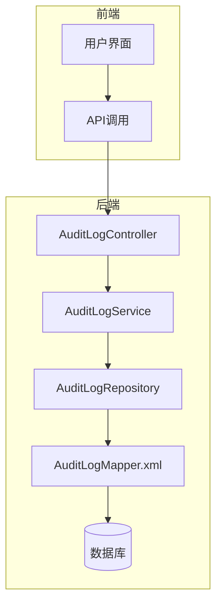
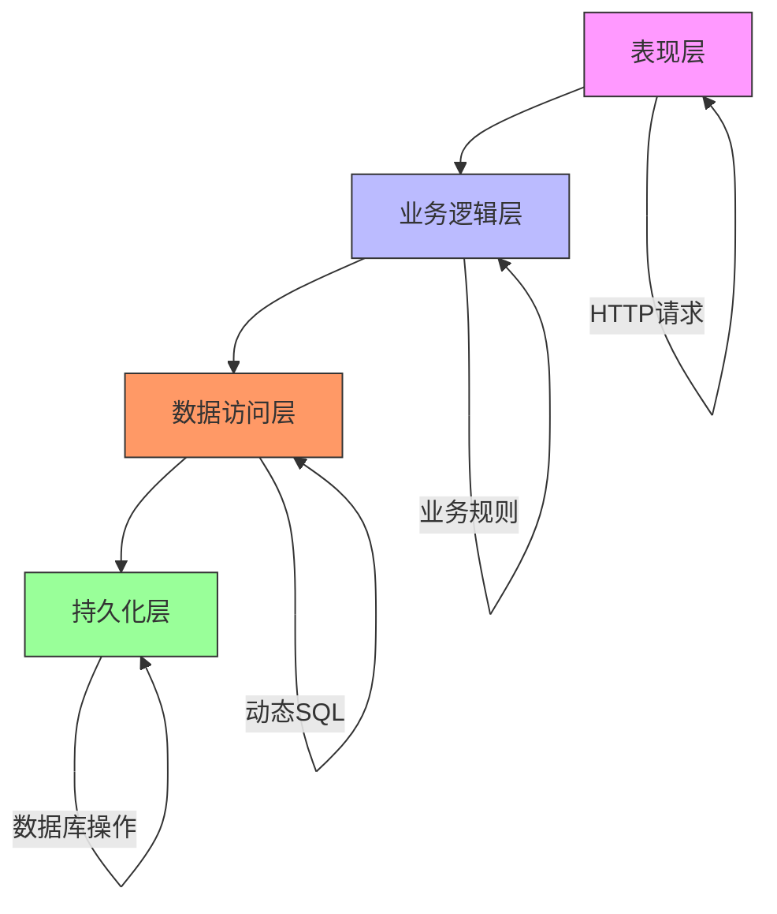
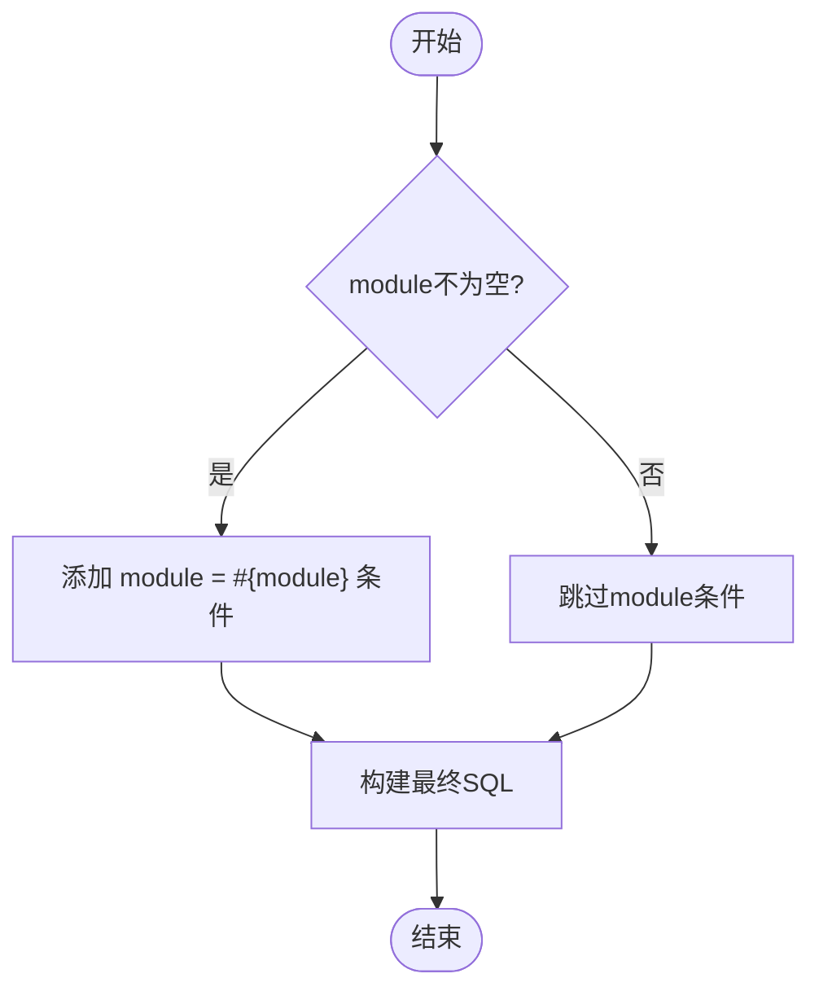
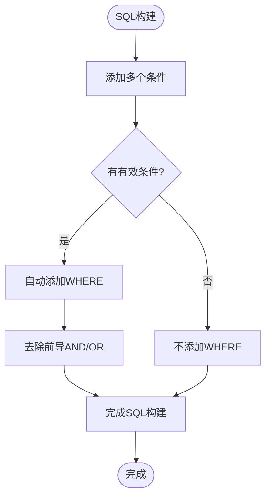
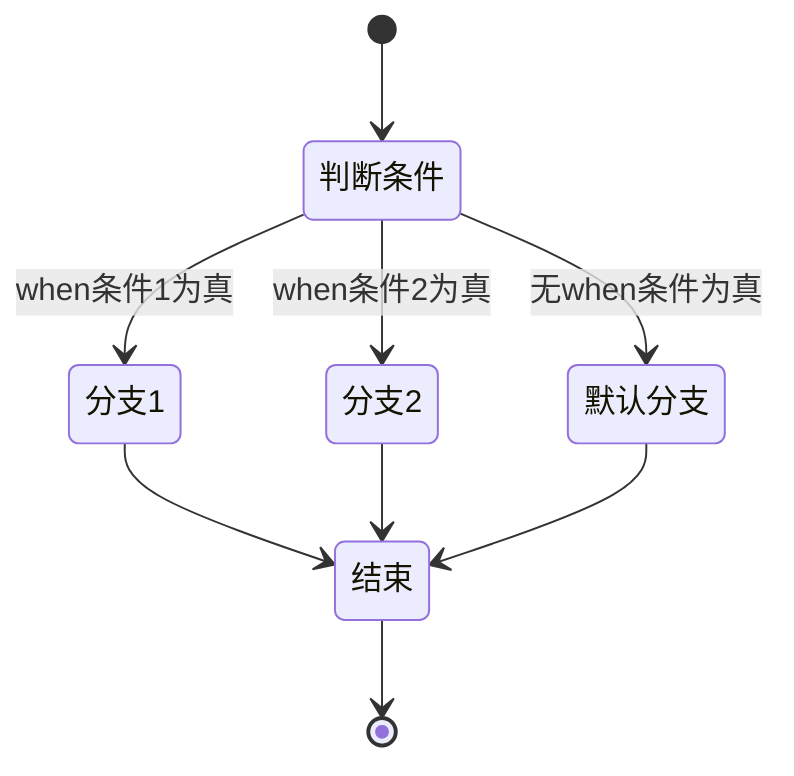
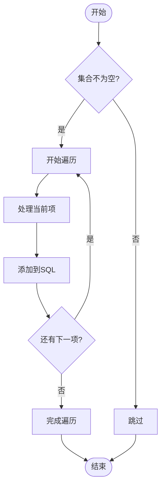
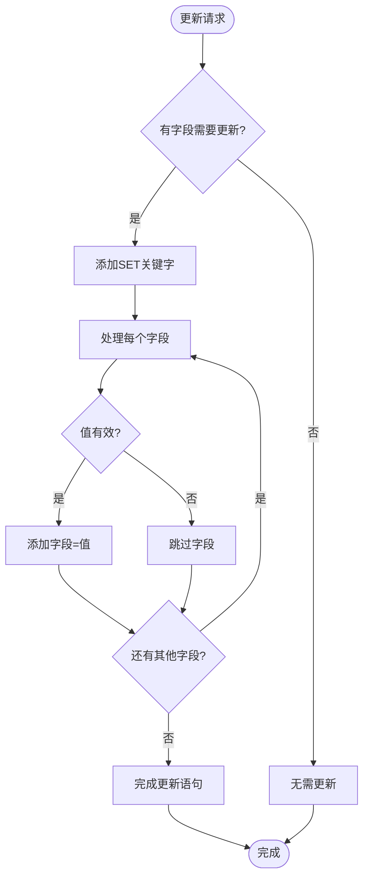
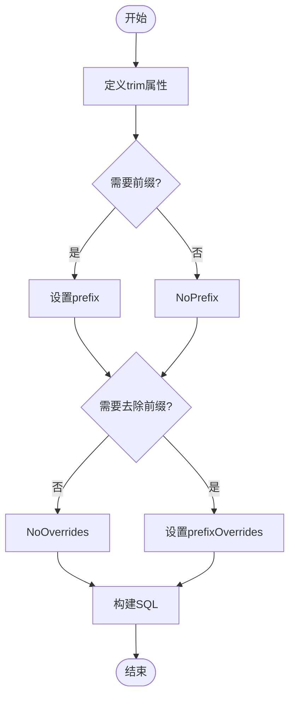
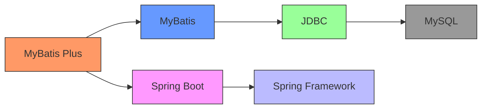

# 动态SQL技术

<cite>
**本文档引用的文件**   
- [AuditLogMapper.xml](file://08-backend/src/main/resources/mapper/system/audit/AuditLogMapper.xml)
- [AuditQueryRequest.java](file://08-backend/src/main/java/com/enterprise/brain/modules/system/audit/dto/request/AuditQueryRequest.java)
- [AuditLog.java](file://08-backend/src/main/java/com/enterprise/brain/modules/system/audit/entity/AuditLog.java)
- [AuditLogServiceImpl.java](file://08-backend/src/main/java/com/enterprise/brain/modules/system/audit/service/impl/AuditLogServiceImpl.java)
- [MyBatisConfig.java](file://08-backend/src/main/java/com/enterprise/brain/config/MyBatisConfig.java)
</cite>

## 目录
1. [引言](#引言)
2. [项目结构](#项目结构)
3. [核心组件](#核心组件)
4. [架构概述](#架构概述)
5. [详细组件分析](#详细组件分析)
6. [依赖分析](#依赖分析)
7. [性能考虑](#性能考虑)
8. [故障排除指南](#故障排除指南)
9. [结论](#结论)

## 引言
本文档深入探讨MyBatis动态SQL技术，基于项目中审计日志模块的实际实现。重点分析if、where、choose/when/otherwise、foreach、set等动态标签的使用方法，以及如何通过这些标签构建灵活、安全的数据库查询。文档结合审计日志的多条件组合查询业务场景，提供完整的使用示例和最佳实践。

## 项目结构
本项目采用典型的前后端分离架构，后端使用Spring Boot框架，通过MyBatis Plus实现数据访问层。审计日志功能位于后端模块的system/audit包中，包含实体类、DTO、Repository、Service和Controller等完整组件。

**图示来源**
- [AuditLogMapper.xml](file://08-backend/src/main/resources/mapper/system/audit/AuditLogMapper.xml)
- [AuditLogServiceImpl.java](file://08-backend/src/main/java/com/enterprise/brain/modules/system/audit/service/impl/AuditLogServiceImpl.java)

**本节来源**
- [AuditLogMapper.xml](file://08-backend/src/main/resources/mapper/system/audit/AuditLogMapper.xml)
- [application.yml](file://08-backend/src/main/resources/application.yml)

## 核心组件
核心组件包括审计日志实体类AuditLog、查询请求DTO AuditQueryRequest、服务实现类AuditLogServiceImpl以及MyBatis映射文件AuditLogMapper.xml。这些组件协同工作，实现了灵活的审计日志查询功能。

**本节来源**
- [AuditLog.java](file://08-backend/src/main/java/com/enterprise/brain/modules/system/audit/entity/AuditLog.java)
- [AuditQueryRequest.java](file://08-backend/src/main/java/com/enterprise/brain/modules/system/audit/dto/request/AuditQueryRequest.java)
- [AuditLogServiceImpl.java](file://08-backend/src/main/java/com/enterprise/brain/modules/system/audit/service/impl/AuditLogServiceImpl.java)

## 架构概述
系统采用分层架构设计，从上到下分别为表现层、业务逻辑层、数据访问层和持久化层。MyBatis动态SQL在数据访问层发挥关键作用，允许根据运行时条件动态构建SQL语句，提高了查询的灵活性和安全性。

**图示来源**
- [AuditLogServiceImpl.java](file://08-backend/src/main/java/com/enterprise/brain/modules/system/audit/service/impl/AuditLogServiceImpl.java)
- [MyBatisConfig.java](file://08-backend/src/main/java/com/enterprise/brain/config/MyBatisConfig.java)

## 详细组件分析

### 动态SQL标签详解

#### if标签
if标签用于实现条件过滤，只有当test属性中的表达式为true时，包含的SQL片段才会被添加到最终的SQL语句中。在审计日志查询中，可以根据module字段进行条件查询。

**图示来源**
- [AuditLogMapper.xml](file://08-backend/src/main/resources/mapper/system/audit/AuditLogMapper.xml)
- [AuditQueryRequest.java](file://08-backend/src/main/java/com/enterprise/brain/modules/system/audit/dto/request/AuditQueryRequest.java)

#### where标签
where标签智能处理AND/OR前缀，自动去除多余的前导AND或OR，并在必要时添加WHERE关键字。这解决了动态条件组合时可能出现的SQL语法错误问题。

**图示来源**
- [AuditLogMapper.xml](file://08-backend/src/main/resources/mapper/system/audit/AuditLogMapper.xml)
- [AuditLogServiceImpl.java](file://08-backend/src/main/java/com/enterprise/brain/modules/system/audit/service/impl/AuditLogServiceImpl.java)

#### choose/when/otherwise标签
choose标签类似于Java中的switch语句，提供多条件分支选择。when标签定义各个分支条件，otherwise标签定义默认情况。

**图示来源**
- [AuditLogMapper.xml](file://08-backend/src/main/resources/mapper/system/audit/AuditLogMapper.xml)

#### foreach标签
foreach标签用于遍历集合，常用于IN查询。可以遍历数组、List、Set等集合类型，通过item、index、collection等属性控制遍历过程。

**图示来源**
- [AuditLogMapper.xml](file://08-backend/src/main/resources/mapper/system/audit/AuditLogMapper.xml)

#### set标签
set标签用于构建动态更新语句，自动处理多余的逗号，并在必要时添加SET关键字。这使得部分字段更新变得简单而安全。

**图示来源**
- [AuditLogMapper.xml](file://08-backend/src/main/resources/mapper/system/audit/AuditLogMapper.xml)

#### trim标签
trim标签是更通用的标签，可以替代where和set标签。通过设置prefix、suffix、prefixOverrides、suffixOverrides属性，可以精确控制SQL片段的添加和去除。

**图示来源**
- [AuditLogMapper.xml](file://08-backend/src/main/resources/mapper/system/audit/AuditLogMapper.xml)

**本节来源**
- [AuditLogMapper.xml](file://08-backend/src/main/resources/mapper/system/audit/AuditLogMapper.xml)
- [AuditQueryRequest.java](file://08-backend/src/main/java/com/enterprise/brain/modules/system/audit/dto/request/AuditQueryRequest.java)
- [AuditLog.java](file://08-backend/src/main/java/com/enterprise/brain/modules/system/audit/entity/AuditLog.java)

## 依赖分析
项目依赖MyBatis Plus框架实现数据访问功能，通过pom.xml文件中的依赖声明引入。MyBatis Plus提供了丰富的CRUD操作和分页功能，同时保留了MyBatis的灵活性。

**图示来源**
- [pom.xml](file://08-backend/pom.xml)
- [MyBatisConfig.java](file://08-backend/src/main/java/com/enterprise/brain/config/MyBatisConfig.java)

**本节来源**
- [pom.xml](file://08-backend/pom.xml)
- [MyBatisConfig.java](file://08-backend/src/main/java/com/enterprise/brain/config/MyBatisConfig.java)

## 性能考虑
动态SQL在提高查询灵活性的同时，也需要注意性能影响。建议合理使用索引、避免N+1查询问题，并利用MyBatis的缓存机制提高查询效率。对于复杂的查询，可以考虑使用数据库视图或存储过程。

## 故障排除指南
常见问题包括动态条件为空导致的SQL语法错误、集合为空时的IN查询问题等。解决方案包括使用where标签智能处理前缀、在foreach前检查集合是否为空、使用trim标签精确控制SQL结构等。

**本节来源**
- [AuditLogMapper.xml](file://08-backend/src/main/resources/mapper/system/audit/AuditLogMapper.xml)
- [AuditLogServiceImpl.java](file://08-backend/src/main/java/com/enterprise/brain/modules/system/audit/service/impl/AuditLogServiceImpl.java)

## 结论
MyBatis动态SQL为构建灵活、安全的数据库查询提供了强大支持。通过合理使用if、where、choose、foreach、set等标签，可以有效处理复杂的业务查询需求。在实际应用中，应结合具体业务场景，权衡灵活性和性能，遵循最佳实践原则。