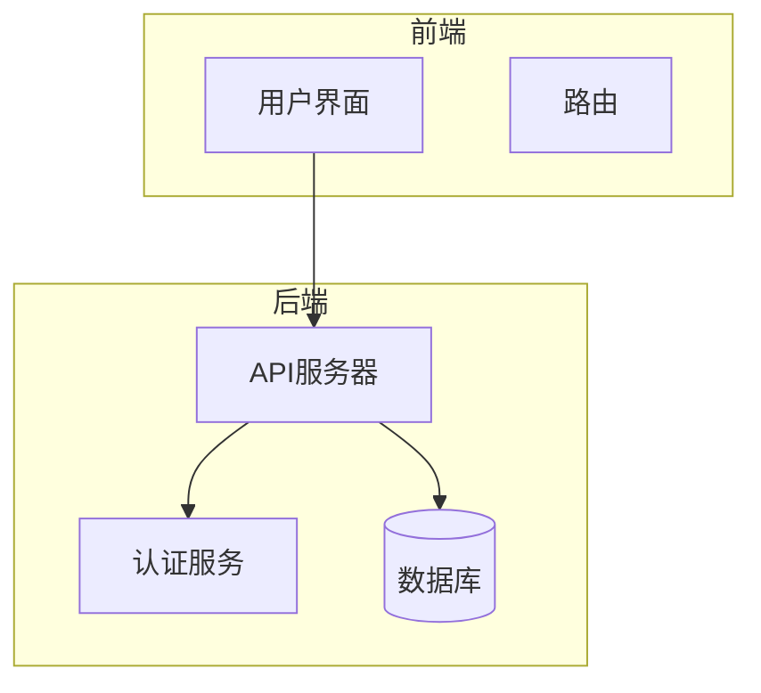
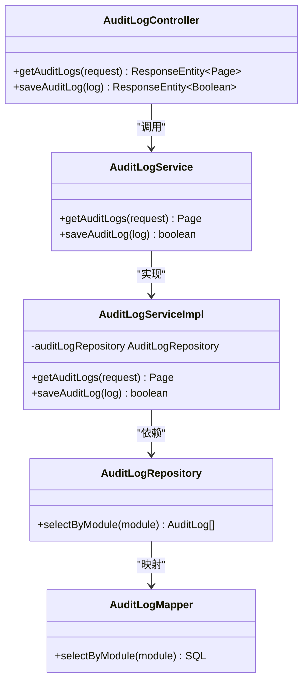
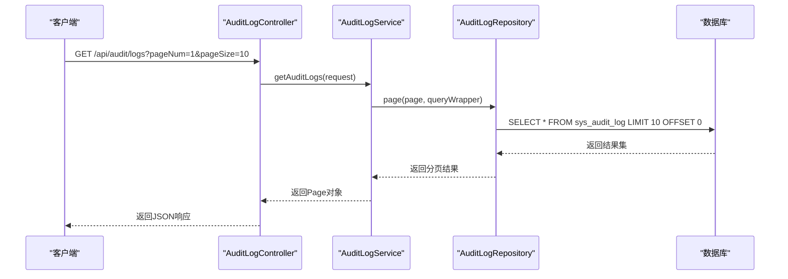
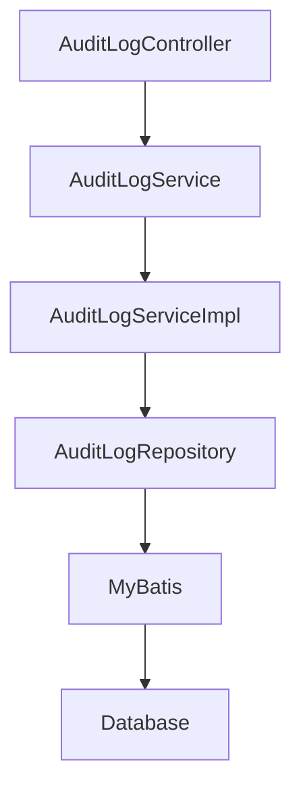

# 复杂SQL查询模式

<cite>
**本文档引用的文件**
- [AuditLogMapper.xml](file://08-backend/src/main/resources/mapper/system/audit/AuditLogMapper.xml)
- [AuditLog.java](file://08-backend/src/main/java/com/enterprise/brain/modules/system/audit/entity/AuditLog.java)
- [AuditLogServiceImpl.java](file://08-backend/src/main/java/com/enterprise/brain/modules/system/audit/service/impl/AuditLogServiceImpl.java)
- [AuditQueryRequest.java](file://08-backend/src/main/java/com/enterprise/brain/modules/system/audit/dto/request/AuditQueryRequest.java)
- [AuditLogResponse.java](file://08-backend/src/main/java/com/enterprise/brain/modules/system/audit/dto/response/AuditLogResponse.java)
- [AuditLogRepository.java](file://08-backend/src/main/java/com/enterprise/brain/modules/system/audit/repository/AuditLogRepository.java)
- [DATABASE_GUIDE.md](file://DATABASE_GUIDE.md)
</cite>

## 目录
1. [引言](#引言)
2. [项目结构](#项目结构)
3. [核心组件](#核心组件)
4. [架构概述](#架构概述)
5. [详细组件分析](#详细组件分析)
6. [依赖分析](#依赖分析)
7. [性能考虑](#性能考虑)
8. [故障排除指南](#故障排除指南)
9. [结论](#结论)

## 引言
本文档旨在深入探讨复杂SQL查询的设计与实现，以审计日志模块为案例，展示分页查询、多表关联、子查询等高级SQL技术在MyBatis XML中的实现方式。通过实际代码示例，说明如何在resultMap中配置关联映射（association、collection）以支持对象关系映射，并提供性能优化建议。

## 项目结构
本项目采用前后端分离架构，后端使用Java Spring Boot框架，前端使用Vue.js。审计日志模块位于后端的`08-backend/src/main/java/com/enterprise/brain/modules/system/audit`目录下，包含实体类、服务层、控制器和MyBatis映射文件。



**图示来源**
- [DATABASE_GUIDE.md](file://DATABASE_GUIDE.md#L7-L18)

## 核心组件
审计日志模块的核心组件包括：
- `AuditLog`实体类：映射数据库表`sys_audit_log`
- `AuditLogRepository`：MyBatis Mapper接口
- `AuditLogService`：服务接口
- `AuditLogServiceImpl`：服务实现
- `AuditLogController`：REST控制器
- `AuditLogMapper.xml`：MyBatis XML映射文件

**组件来源**
- [AuditLog.java](file://08-backend/src/main/java/com/enterprise/brain/modules/system/audit/entity/AuditLog.java#L1-L21)
- [AuditLogRepository.java](file://08-backend/src/main/java/com/enterprise/brain/modules/system/audit/repository/AuditLogRepository.java#L1-L10)

## 架构概述
系统采用典型的三层架构：表现层（Controller）、业务逻辑层（Service）和数据访问层（Repository）。MyBatis作为ORM框架，通过XML配置实现SQL查询与Java对象的映射。



**图示来源**
- [AuditLogController.java](file://08-backend/src/main/java/com/enterprise/brain/modules/system/audit/controller/AuditLogController.java#L1-L31)
- [AuditLogService.java](file://08-backend/src/main/java/com/enterprise/brain/modules/system/audit/service/AuditLogService.java#L1-L11)
- [AuditLogServiceImpl.java](file://08-backend/src/main/java/com/enterprise/brain/modules/system/audit/service/impl/AuditLogServiceImpl.java#L1-L65)

## 详细组件分析

### 分页查询实现
在MyBatis中，分页查询通过`Page`对象和`LIMIT/OFFSET`实现。服务层使用`Page`对象封装分页参数，MyBatis自动将其转换为SQL的`LIMIT`和`OFFSET`。



**图示来源**
- [AuditLogServiceImpl.java](file://08-backend/src/main/java/com/enterprise/brain/modules/system/audit/service/impl/AuditLogServiceImpl.java#L23-L55)
- [AuditLogMapper.xml](file://08-backend/src/main/resources/mapper/system/audit/AuditLogMapper.xml#L5-L7)

### 多表关联查询
虽然当前审计日志模块未直接展示多表关联，但可以通过扩展`AuditLogMapper.xml`实现。例如，关联用户表获取用户详细信息：

```xml
<select id="selectWithUserDetails" resultType="map">
    SELECT 
        al.*, 
        u.username as user_username,
        u.email as user_email
    FROM sys_audit_log al
    LEFT JOIN sys_user u ON al.user_id = u.id
    WHERE al.module = #{module}
</select>
```

### 子查询实现
在MyBatis XML中，子查询可用于复杂过滤逻辑。例如，查询某个用户最近的操作：

```xml
<select id="selectRecentOperations" resultType="AuditLog">
    SELECT * FROM sys_audit_log 
    WHERE user_id = #{userId} 
    AND operation_time > (
        SELECT MAX(operation_time) - INTERVAL 1 HOUR 
        FROM sys_audit_log 
        WHERE user_id = #{userId}
    )
</select>
```

### resultMap关联映射
在`resultMap`中配置`association`和`collection`可以实现对象关系映射。例如：

```xml
<resultMap id="AuditLogWithUser" type="map">
    <id property="id" column="id"/>
    <result property="operation" column="operation"/>
    <result property="module" column="module"/>
    <association property="user" javaType="map">
        <id property="id" column="user_id"/>
        <result property="username" column="user_username"/>
        <result property="email" column="user_email"/>
    </association>
</resultMap>
```

**组件来源**
- [AuditLogMapper.xml](file://08-backend/src/main/resources/mapper/system/audit/AuditLogMapper.xml#L5-L8)

## 依赖分析
审计日志模块依赖于MyBatis框架和Spring Boot生态系统。通过`@Mapper`注解和Spring的依赖注入机制，实现组件间的松耦合。



**图示来源**
- [AuditLogRepository.java](file://08-backend/src/main/java/com/enterprise/brain/modules/system/audit/repository/AuditLogRepository.java#L7-L9)
- [AuditLogServiceImpl.java](file://08-backend/src/main/java/com/enterprise/brain/modules/system/audit/service/impl/AuditLogServiceImpl.java#L20-L21)

## 性能考虑
1. **索引优化**：为常用查询字段（如`module`、`user_name`、`operation_time`）创建索引
2. **避免SELECT ***：只查询需要的字段，减少数据传输量
3. **合理使用分页**：避免一次性查询大量数据
4. **缓存机制**：对于不经常变化的数据，使用Redis等缓存
5. **连接池配置**：合理配置数据库连接池参数

## 故障排除指南
1. **分页查询结果不正确**：检查`pageNum`和`pageSize`参数是否正确传递
2. **关联查询性能差**：检查是否缺少必要的索引
3. **MyBatis映射错误**：确保XML中的`resultType`和`parameterType`与Java类匹配
4. **空指针异常**：检查对象是否正确初始化，特别是关联对象

**组件来源**
- [AuditQueryRequest.java](file://08-backend/src/main/java/com/enterprise/brain/modules/system/audit/dto/request/AuditQueryRequest.java#L1-L15)
- [AuditLogResponse.java](file://08-backend/src/main/java/com/enterprise/brain/modules/system/audit/dto/response/AuditLogResponse.java#L1-L16)

## 结论
通过审计日志模块的分析，我们展示了复杂SQL查询在MyBatis中的实现方式。分页查询、多表关联、子查询等技术可以有效提升数据查询的灵活性和效率。合理的resultMap配置和性能优化策略对于构建高性能的应用系统至关重要。