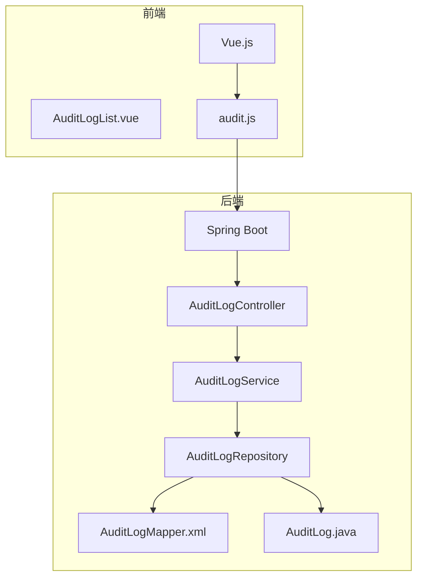
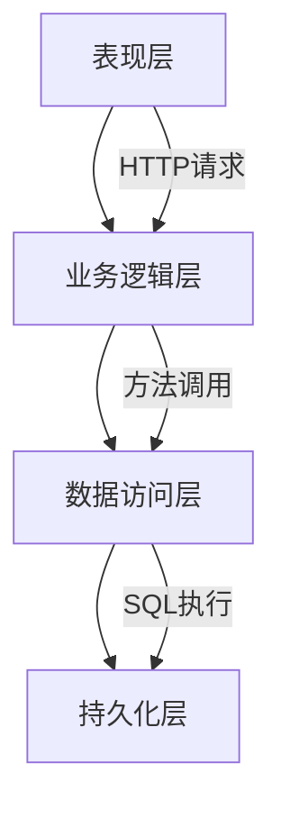
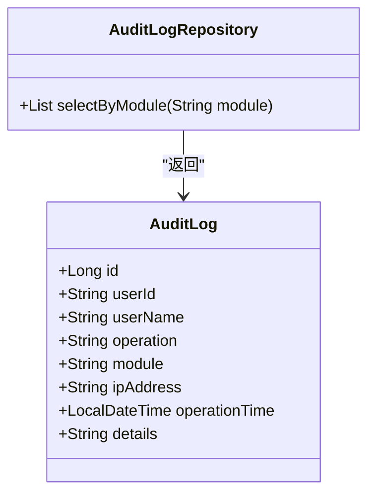
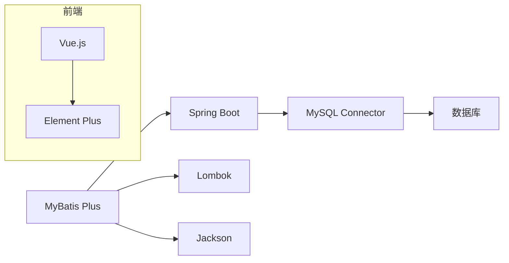

# 高级SQL技术

<cite>
**本文档中引用的文件**  
- [AuditLogMapper.xml](file://08-backend/src/main/resources/mapper/system/audit/AuditLogMapper.xml)
- [AuditLogRepository.java](file://08-backend/src/main/java/com/enterprise/brain/modules/system/audit/repository/AuditLogRepository.java)
- [AuditLog.java](file://08-backend/src/main/java/com/enterprise/brain/modules/system/audit/entity/AuditLog.java)
- [MyBatisConfig.java](file://08-backend/src/main/java/com/enterprise/brain/config/MyBatisConfig.java)
- [EnterpriseBrainApplication.java](file://08-backend/src/main/java/com/enterprise/brain/EnterpriseBrainApplication.java)
- [pom.xml](file://08-backend/pom.xml)
- [AuditLogList.vue](file://07-frontend/src/pages/system/audit-management/AuditLogList.vue)
- [audit.js](file://07-frontend/src/api/system/audit.js)
</cite>

## 目录
1. [引言](#引言)
2. [项目结构](#项目结构)
3. [核心组件](#核心组件)
4. [架构概述](#架构概述)
5. [详细组件分析](#详细组件分析)
6. [依赖分析](#依赖分析)
7. [性能考虑](#性能考虑)
8. [故障排除指南](#故障排除指南)
9. [结论](#结论)

## 引言
本文档旨在深入解析基于MyBatis框架的复杂SQL查询与XML映射文件的使用方法，以`AuditLogMapper.xml`为具体案例，全面阐述如何在XML中编写自定义SQL语句，特别是动态SQL标签（如if、where、foreach）的应用技巧。同时，文档将解释namespace属性如何与Java接口关联，id属性如何对应接口方法，以及resultType与resultMap的区别和使用场景。此外，还将提供分页查询、多表关联、子查询等复杂SQL的XML配置最佳实践，并结合项目中的实际用例进行说明。

## 项目结构
本项目采用典型的前后端分离架构，后端使用Spring Boot + MyBatis Plus技术栈，前端使用Vue.js框架。审计日志功能位于系统模块中，其数据访问层通过XML映射文件实现复杂的查询逻辑。

**图示来源**  
- [AuditLogList.vue](file://07-frontend/src/pages/system/audit-management/AuditLogList.vue)
- [audit.js](file://07-frontend/src/api/system/audit.js)
- [AuditLogMapper.xml](file://08-backend/src/main/resources/mapper/system/audit/AuditLogMapper.xml)
- [AuditLog.java](file://08-backend/src/main/java/com/enterprise/brain/modules/system/audit/entity/AuditLog.java)

**章节来源**  
- [AuditLogMapper.xml](file://08-backend/src/main/resources/mapper/system/audit/AuditLogMapper.xml)
- [AuditLogList.vue](file://07-frontend/src/pages/system/audit-management/AuditLogList.vue)

## 核心组件
核心组件包括XML映射文件、Java实体类、数据访问接口、服务层和控制器。其中，`AuditLogMapper.xml`是实现复杂SQL查询的关键文件，它通过MyBatis框架与`AuditLogRepository`接口建立映射关系。

**章节来源**  
- [AuditLogMapper.xml](file://08-backend/src/main/resources/mapper/system/audit/AuditLogMapper.xml)
- [AuditLogRepository.java](file://08-backend/src/main/java/com/enterprise/brain/modules/system/audit/repository/AuditLogRepository.java)
- [AuditLog.java](file://08-backend/src/main/java/com/enterprise/brain/modules/system/audit/entity/AuditLog.java)

## 架构概述
系统采用分层架构设计，从上至下分别为表现层、业务逻辑层、数据访问层和持久化层。XML映射文件作为数据访问层的重要组成部分，负责将Java方法调用转换为具体的SQL语句执行。

**图示来源**  
- [AuditLogRepository.java](file://08-backend/src/main/java/com/enterprise/brain/modules/system/audit/repository/AuditLogRepository.java)
- [AuditLogMapper.xml](file://08-backend/src/main/resources/mapper/system/audit/AuditLogMapper.xml)

## 详细组件分析

### XML映射文件分析
`AuditLogMapper.xml`文件定义了针对审计日志表的自定义查询语句。该文件通过namespace属性与`AuditLogRepository`接口建立关联，使得接口中的每个方法都能找到对应的SQL语句。

#### namespace与接口关联
namespace属性的值必须与对应的数据访问接口全限定名完全一致。在本例中，`com.enterprise.brain.modules.system.audit.repository.AuditLogRepository`正是`AuditLogRepository`接口的完整路径，这确保了MyBatis能够正确地将接口方法与XML中的SQL语句进行绑定。

#### id属性与方法对应
XML文件中的每个SQL语句都有一个唯一的id属性，这个id需要与接口中声明的方法名相匹配。例如，如果在`AuditLogRepository`接口中定义了一个名为`selectByModule`的方法，那么在XML文件中就需要有一个id为`selectByModule`的`<select>`元素。

#### resultType与resultMap区别
- **resultType**: 当查询结果可以直接映射到某个Java类时使用。MyBatis会自动根据列名与属性名的对应关系完成映射。
- **resultMap**: 当需要更复杂的映射规则时使用，比如列名与属性名不一致、需要处理嵌套对象等情况。

**图示来源**  
- [AuditLog.java](file://08-backend/src/main/java/com/enterprise/brain/modules/system/audit/entity/AuditLog.java)
- [AuditLogRepository.java](file://08-backend/src/main/java/com/enterprise/brain/modules/system/audit/repository/AuditLogRepository.java)

**章节来源**  
- [AuditLogMapper.xml](file://08-backend/src/main/resources/mapper/system/audit/AuditLogMapper.xml)
- [AuditLogRepository.java](file://08-backend/src/main/java/com/enterprise/brain/modules/system/audit/repository/AuditLogRepository.java)

### 动态SQL使用技巧
虽然当前`AuditLogMapper.xml`文件中的SQL较为简单，但在实际应用中，经常需要使用动态SQL来构建灵活的查询条件。

#### if标签使用
`<if>`标签用于条件判断，只有当test属性中的表达式为true时，其包含的内容才会被添加到最终的SQL语句中。

#### where标签使用
`<where>`标签可以智能地处理WHERE关键字和AND/OR连接符，避免了手动处理连接符带来的语法错误。

#### foreach标签使用
`<foreach>`标签用于遍历集合，常用于IN查询等场景。

## 依赖分析
项目依赖主要分为以下几个方面：

**图示来源**  
- [pom.xml](file://08-backend/pom.xml)
- [package.json](file://07-frontend/package.json)

**章节来源**  
- [pom.xml](file://08-backend/pom.xml)
- [package.json](file://07-frontend/package.json)

## 性能考虑
在编写复杂SQL查询时，需要注意以下几点以保证系统性能：
1. 合理使用索引，特别是在经常作为查询条件的字段上创建索引。
2. 避免全表扫描，尽量利用索引提高查询效率。
3. 对于大数据量的查询，应考虑分页处理，避免一次性加载过多数据。
4. 使用MyBatis Plus提供的分页插件，简化分页逻辑的实现。

## 故障排除指南
常见问题及解决方案：
1. **SQL语法错误**：检查XML文件中的SQL语句是否符合数据库语法规范。
2. **映射失败**：确认resultType或resultMap的配置是否正确，列名与属性名是否匹配。
3. **找不到映射文件**：检查MyBatis配置中是否正确设置了mapper文件的扫描路径。
4. **参数传递问题**：确保接口方法参数与XML中使用的参数名称一致。

**章节来源**  
- [MyBatisConfig.java](file://08-backend/src/main/java/com/enterprise/brain/config/MyBatisConfig.java)
- [EnterpriseBrainApplication.java](file://08-backend/src/main/java/com/enterprise/brain/EnterpriseBrainApplication.java)

## 结论
通过对`AuditLogMapper.xml`文件的分析，我们深入了解了MyBatis框架下XML映射文件的工作原理和最佳实践。合理运用动态SQL标签、正确配置namespace和id属性、恰当选择resultType与resultMap，能够有效提升复杂SQL查询的开发效率和系统性能。未来可进一步探索更多高级特性，如缓存机制、插件扩展等，以满足日益增长的业务需求。