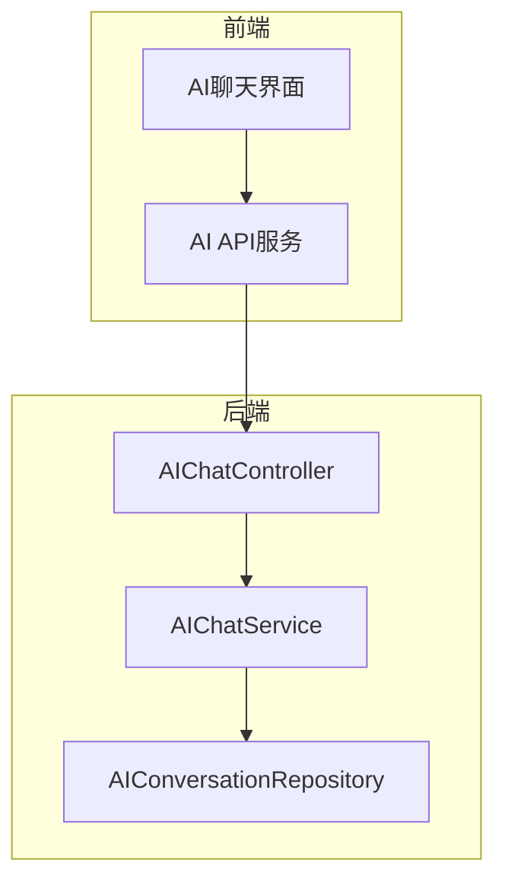
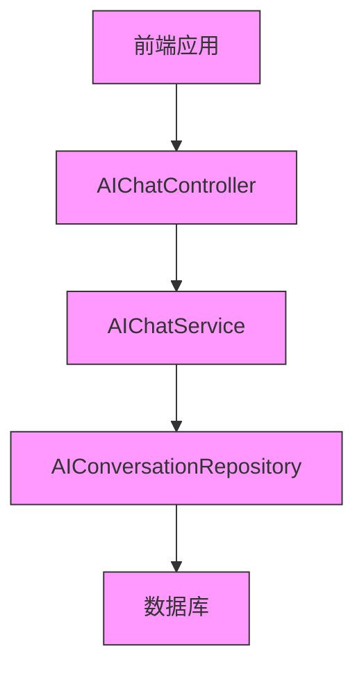
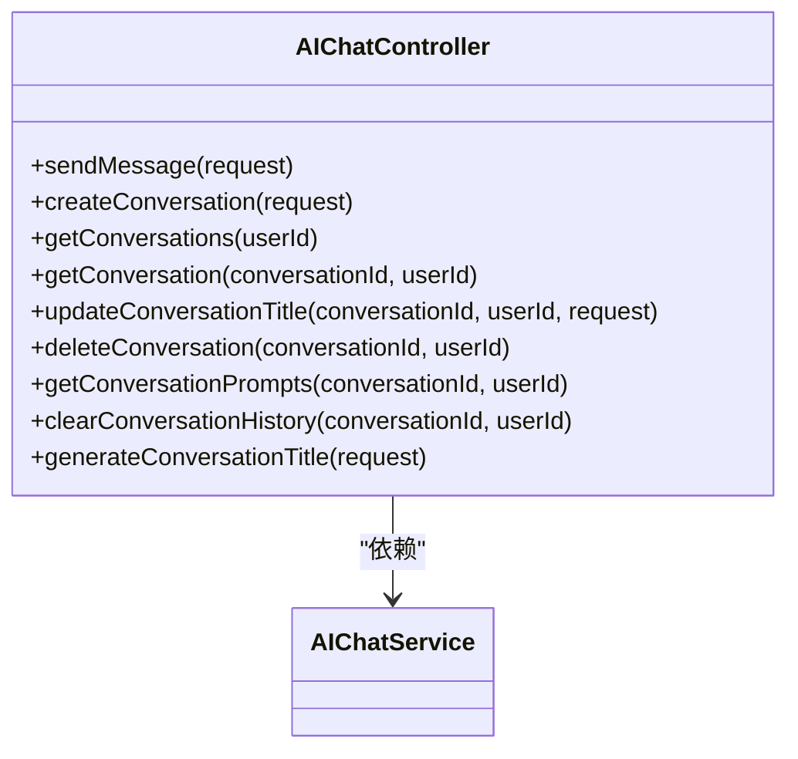
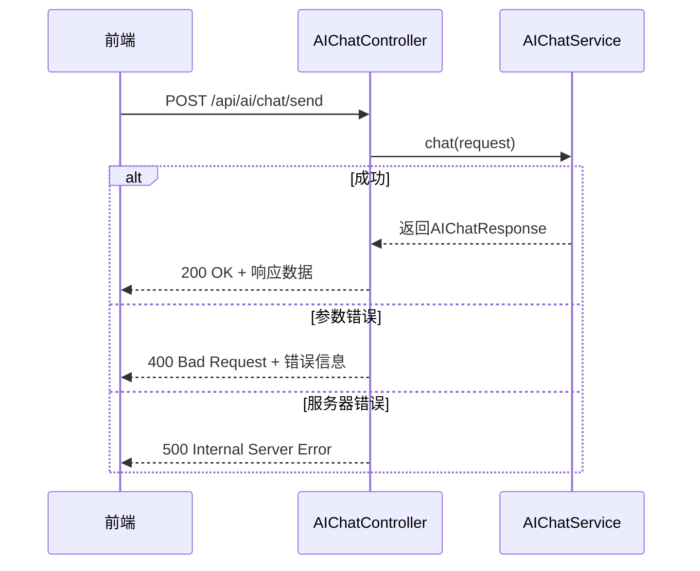
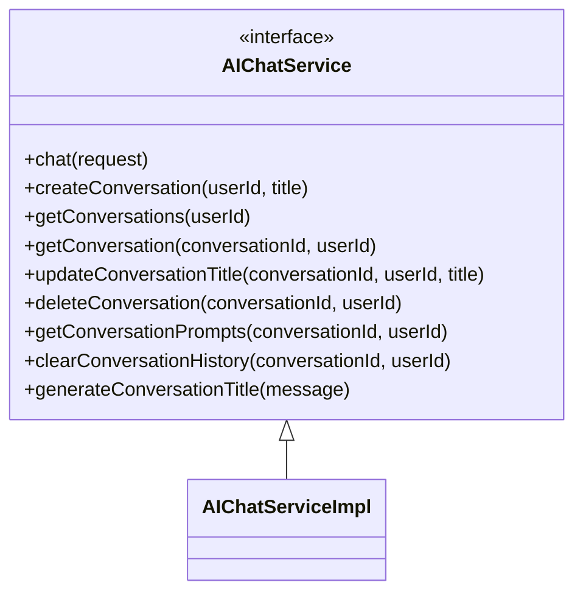
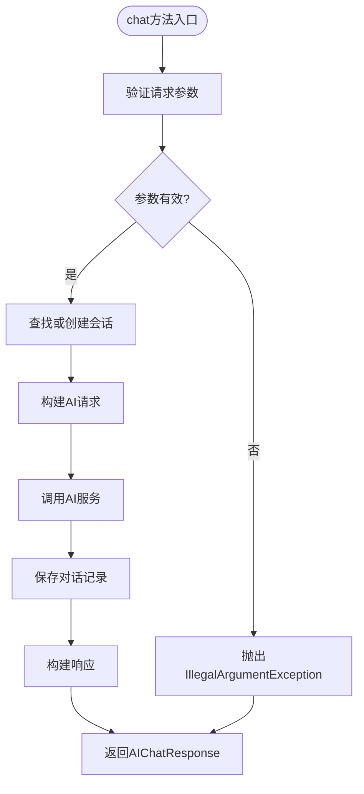
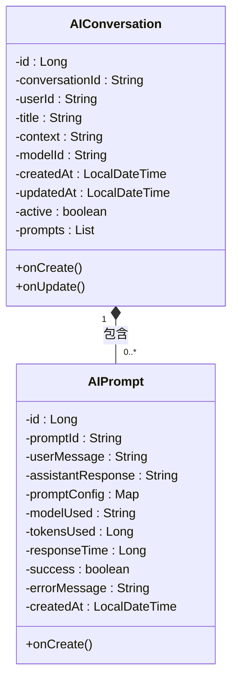
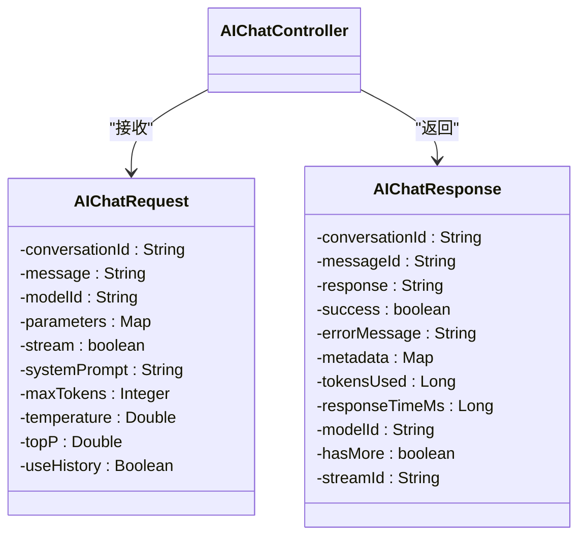

# AI智能分析模块架构

<cite>
**本文档引用文件**  
- [AIChatController.java](file://08-backend/src/main/java/com/enterprise/brain/modules/ai/controller/AIChatController.java)
- [AIChatService.java](file://08-backend/src/main/java/com/enterprise/brain/modules/ai/service/AIChatService.java)
- [AIChatServiceImpl.java](file://08-backend/src/main/java/com/enterprise/brain/modules/ai/service/impl/AIChatServiceImpl.java)
- [AIConversation.java](file://08-backend/src/main/java/com/enterprise/brain/modules/ai/entity/AIConversation.java)
- [AIPrompt.java](file://08-backend/src/main/java/com/enterprise/brain/modules/ai/entity/AIPrompt.java)
- [AIChatRequest.java](file://08-backend/src/main/java/com/enterprise/brain/modules/ai/dto/request/AIChatRequest.java)
- [AIChatResponse.java](file://08-backend/src/main/java/com/enterprise/brain/modules/ai/dto/response/AIChatResponse.java)
- [AIConversationRepository.java](file://08-backend/src/main/java/com/enterprise/brain/modules/ai/repository/AIConversationRepository.java)
- [ai-api.js](file://07-frontend/src/services/api/ai-api.js)
</cite>

## 目录
1. [简介](#简介)
2. [项目结构](#项目结构)
3. [核心组件](#核心组件)
4. [架构概述](#架构概述)
5. [详细组件分析](#详细组件分析)
6. [依赖分析](#依赖分析)
7. [性能考虑](#性能考虑)
8. [故障排除指南](#故障排除指南)
9. [结论](#结论)

## 简介
AI智能分析模块是企业智脑系统的核心功能组件，采用典型的三层架构设计，实现了AI聊天功能的完整生命周期管理。该模块通过RESTful API提供服务，支持聊天会话创建、消息发送、历史记录管理等核心功能，为前端AI聊天界面提供强大的后端支持。

## 项目结构
AI智能分析模块采用标准的Spring Boot项目结构，遵循MVC设计模式，分为controller、service、entity、dto和repository等层次。模块位于`08-backend/src/main/java/com/enterprise/brain/modules/ai`目录下，包含完整的前后端交互实现。



**图示来源**
- [AIChatController.java](file://08-backend/src/main/java/com/enterprise/brain/modules/ai/controller/AIChatController.java)
- [ai-api.js](file://07-frontend/src/services/api/ai-api.js)

**本节来源**
- [AIChatController.java](file://08-backend/src/main/java/com/enterprise/brain/modules/ai/controller/AIChatController.java)
- [ai-api.js](file://07-frontend/src/services/api/ai-api.js)

## 核心组件
AI智能分析模块的核心组件包括AIChatController、AIChatService、AIConversation实体类以及相关的数据传输对象。这些组件共同构成了AI聊天功能的基础架构，实现了从前端请求处理到后端业务逻辑执行的完整流程。

**本节来源**
- [AIChatController.java](file://08-backend/src/main/java/com/enterprise/brain/modules/ai/controller/AIChatController.java)
- [AIChatService.java](file://08-backend/src/main/java/com/enterprise/brain/modules/ai/service/AIChatService.java)
- [AIConversation.java](file://08-backend/src/main/java/com/enterprise/brain/modules/ai/entity/AIConversation.java)

## 架构概述
AI智能分析模块采用典型的三层架构设计：表现层（Controller）、业务逻辑层（Service）和数据访问层（Repository）。这种分层架构实现了关注点分离，提高了代码的可维护性和可测试性。



**图示来源**
- [AIChatController.java](file://08-backend/src/main/java/com/enterprise/brain/modules/ai/controller/AIChatController.java)
- [AIChatService.java](file://08-backend/src/main/java/com/enterprise/brain/modules/ai/service/AIChatService.java)
- [AIConversationRepository.java](file://08-backend/src/main/java/com/enterprise/brain/modules/ai/repository/AIConversationRepository.java)

## 详细组件分析

### AIChatController分析
AIChatController是AI聊天功能的表现层组件，负责处理所有与AI聊天相关的HTTP请求。它通过@RestController注解声明为REST控制器，并使用@RequestMapping指定了基础路径为"/api/ai/chat"。

#### RESTful API设计


**图示来源**
- [AIChatController.java](file://08-backend/src/main/java/com/enterprise/brain/modules/ai/controller/AIChatController.java)
- [AIChatService.java](file://08-backend/src/main/java/com/enterprise/brain/modules/ai/service/AIChatService.java)

#### 异常处理机制


**图示来源**
- [AIChatController.java](file://08-backend/src/main/java/com/enterprise/brain/modules/ai/controller/AIChatController.java)

**本节来源**
- [AIChatController.java](file://08-backend/src/main/java/com/enterprise/brain/modules/ai/controller/AIChatController.java)

### AIChatService分析
AIChatService是AI聊天功能的业务逻辑层接口，定义了所有核心业务操作的契约。

#### 业务契约定义


**图示来源**
- [AIChatService.java](file://08-backend/src/main/java/com/enterprise/brain/modules/ai/service/AIChatService.java)
- [AIChatServiceImpl.java](file://08-backend/src/main/java/com/enterprise/brain/modules/ai/service/impl/AIChatServiceImpl.java)

#### 实现逻辑分析


**图示来源**
- [AIChatServiceImpl.java](file://08-backend/src/main/java/com/enterprise/brain/modules/ai/service/impl/AIChatServiceImpl.java)

**本节来源**
- [AIChatService.java](file://08-backend/src/main/java/com/enterprise/brain/modules/ai/service/AIChatService.java)
- [AIChatServiceImpl.java](file://08-backend/src/main/java/com/enterprise/brain/modules/ai/service/impl/AIChatServiceImpl.java)

### AIConversation实体类分析
AIConversation实体类代表一个AI聊天会话，是数据持久化的核心模型。

#### 数据结构与会话管理


**图示来源**
- [AIConversation.java](file://08-backend/src/main/java/com/enterprise/brain/modules/ai/entity/AIConversation.java)
- [AIPrompt.java](file://08-backend/src/main/java/com/enterprise/brain/modules/ai/entity/AIPrompt.java)

**本节来源**
- [AIConversation.java](file://08-backend/src/main/java/com/enterprise/brain/modules/ai/entity/AIConversation.java)
- [AIPrompt.java](file://08-backend/src/main/java/com/enterprise/brain/modules/ai/entity/AIPrompt.java)

### 数据传输对象分析
AIChatRequest和AIChatResponse是前后端交互的核心数据传输对象，定义了API的输入输出规范。

#### 前后端数据交互规范


**图示来源**
- [AIChatRequest.java](file://08-backend/src/main/java/com/enterprise/brain/modules/ai/dto/request/AIChatRequest.java)
- [AIChatResponse.java](file://08-backend/src/main/java/com/enterprise/brain/modules/ai/dto/response/AIChatResponse.java)

**本节来源**
- [AIChatRequest.java](file://08-backend/src/main/java/com/enterprise/brain/modules/ai/dto/request/AIChatRequest.java)
- [AIChatResponse.java](file://08-backend/src/main/java/com/enterprise/brain/modules/ai/dto/response/AIChatResponse.java)

## 依赖分析
AI智能分析模块通过Spring依赖注入实现服务解耦，各组件之间通过接口进行通信，降低了耦合度。

```mermaid
graph TD
AIChatController --> AIChatService
AIChatService --> AIConversationRepository
AIChatServiceImpl --> AIConversationRepository
AIChatServiceImpl --> AIConfig
AIChatServiceImpl --> ModelConfig
AIChatServiceImpl --> RestTemplate
class AIChatController, AIChatService, AIChatServiceImpl, AIConversationRepository, AIConfig, ModelConfig, RestTemplate component;
classDef component fill:#f9f,stroke:#333,stroke-width:1px;
```

**图示来源**
- [AIChatController.java](file://08-backend/src/main/java/com/enterprise/brain/modules/ai/controller/AIChatController.java)
- [AIChatServiceImpl.java](file://08-backend/src/main/java/com/enterprise/brain/modules/ai/service/impl/AIChatServiceImpl.java)
- [AIConversationRepository.java](file://08-backend/src/main/java/com/enterprise/brain/modules/ai/repository/AIConversationRepository.java)

**本节来源**
- [AIChatController.java](file://08-backend/src/main/java/com/enterprise/brain/modules/ai/controller/AIChatController.java)
- [AIChatServiceImpl.java](file://08-backend/src/main/java/com/enterprise/brain/modules/ai/service/impl/AIChatServiceImpl.java)
- [AIConversationRepository.java](file://08-backend/src/main/java/com/enterprise/brain/modules/ai/repository/AIConversationRepository.java)

## 性能考虑
AI智能分析模块在设计时考虑了多项性能优化策略：

1. **数据库查询优化**：AIConversationRepository使用JPA的findBy方法，Spring Data JPA会自动优化查询性能
2. **对象关系映射**：使用@OneToMany和@ManyToOne注解正确配置实体关系，避免N+1查询问题
3. **缓存机制**：虽然当前实现未显示使用缓存，但架构设计支持通过Spring Cache添加缓存层
4. **连接池**：通过RestTemplate和JPA配置，支持HTTP和数据库连接池，提高资源利用率

**本节来源**
- [AIChatServiceImpl.java](file://08-backend/src/main/java/com/enterprise/brain/modules/ai/service/impl/AIChatServiceImpl.java)
- [AIConversationRepository.java](file://08-backend/src/main/java/com/enterprise/brain/modules/ai/repository/AIConversationRepository.java)

## 故障排除指南
当AI智能分析模块出现问题时，可以参考以下排查步骤：

1. **检查API端点**：确认前端调用的API路径是否正确
2. **验证请求参数**：确保AIChatRequest中的必要字段不为空
3. **查看服务状态**：检查后端服务是否正常运行
4. **检查数据库连接**：确认数据库连接配置正确
5. **查看日志信息**：检查应用日志中的错误信息

**本节来源**
- [AIChatController.java](file://08-backend/src/main/java/com/enterprise/brain/modules/ai/controller/AIChatController.java)
- [AIChatServiceImpl.java](file://08-backend/src/main/java/com/enterprise/brain/modules/ai/service/impl/AIChatServiceImpl.java)

## 结论
AI智能分析模块通过清晰的三层架构设计，实现了高内聚、低耦合的系统结构。模块采用Spring框架的依赖注入机制，确保了组件间的松耦合。RESTful API设计规范，异常处理机制完善，数据传输对象定义清晰。该模块为AI聊天功能提供了稳定可靠的基础架构，支持聊天会话的全生命周期管理，包括创建、消息发送、历史记录查询和会话删除等功能。通过与前端AI聊天界面的集成，为用户提供流畅的AI交互体验。