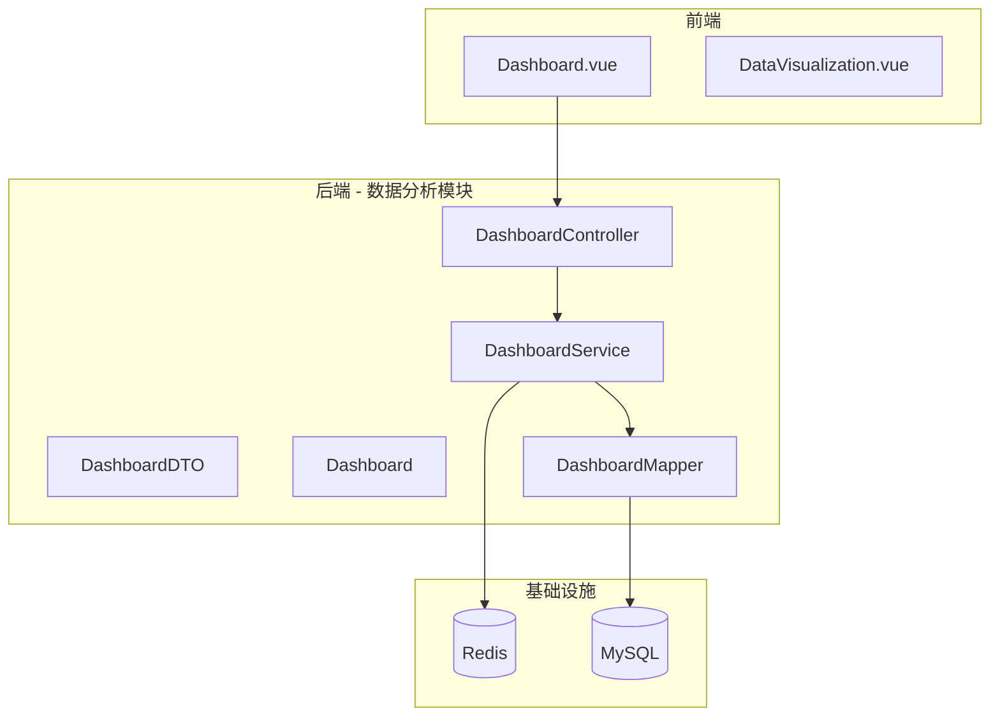
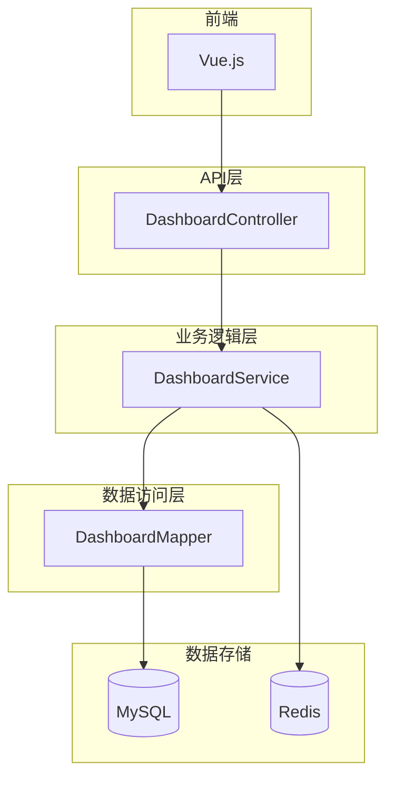
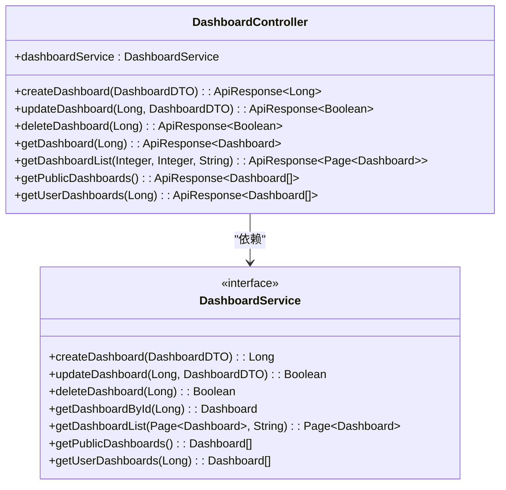
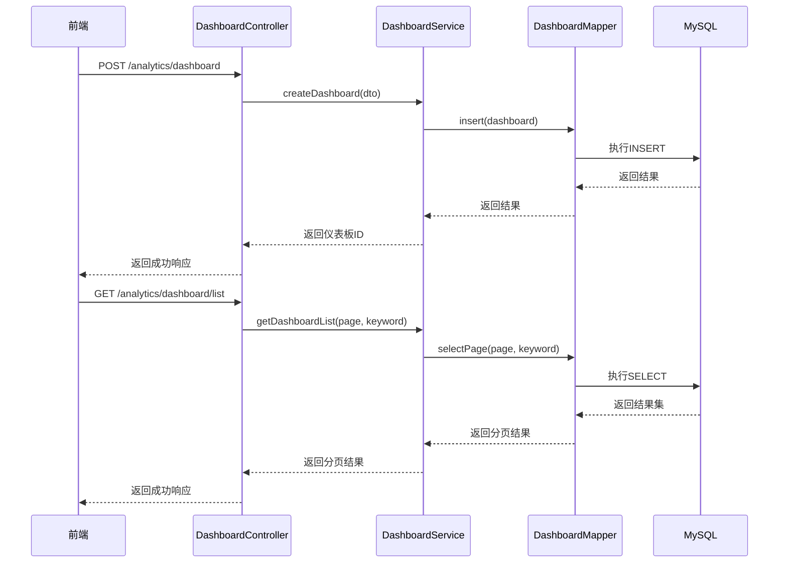
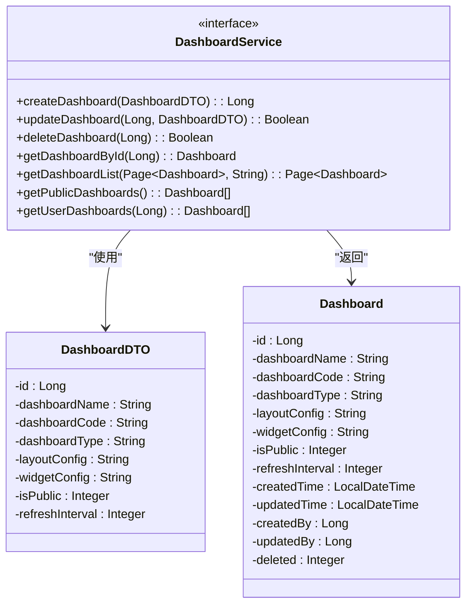
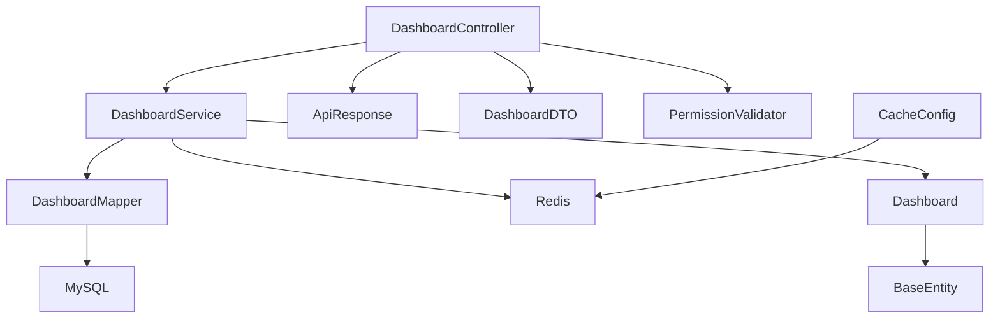
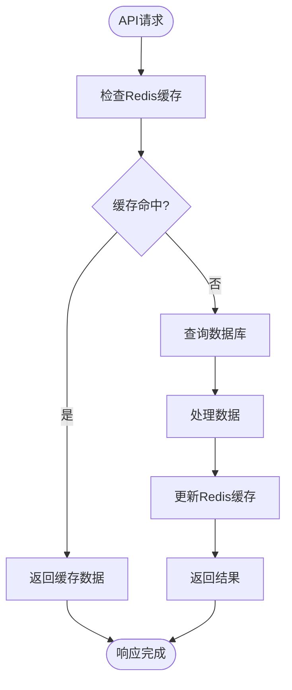

# 数据分析模块架构

<cite>
**本文档引用的文件**
- [DashboardController.java](file://08-backend/src/main/java/com/enterprise/brain/modules/analytics/controller/DashboardController.java)
- [DashboardService.java](file://08-backend/src/main/java/com/enterprise/brain/modules/analytics/service/DashboardService.java)
- [DashboardDTO.java](file://08-backend/src/main/java/com/enterprise/brain/modules/analytics/dto/DashboardDTO.java)
- [Dashboard.java](file://08-backend/src/main/java/com/enterprise/brain/modules/analytics/entity/Dashboard.java)
- [ApiResponse.java](file://08-backend/src/main/java/com/enterprise/brain/common/response/ApiResponse.java)
- [DashboardMapper.java](file://08-backend/src/main/java/com/enterprise/brain/modules/analytics/repository/DashboardMapper.java)
- [CacheConfig.java](file://08-backend/src/main/java/com/enterprise/brain/common/cache/CacheConfig.java)
- [PermissionValidator.java](file://08-backend/src/main/java/com/enterprise/brain/common/security/PermissionValidator.java)
- [application.yml](file://08-backend/src/main/resources/application.yml)
</cite>

## 目录
1. [项目结构](#项目结构)
2. [核心组件](#核心组件)
3. [架构概述](#架构概述)
4. [详细组件分析](#详细组件分析)
5. [依赖分析](#依赖分析)
6. [性能考虑](#性能考虑)
7. [故障排除指南](#故障排除指南)

## 项目结构

数据分析模块采用典型的分层架构设计，包含controller、service、dto、entity和repository五个核心包。这种分层结构实现了关注点分离，提高了代码的可维护性和可测试性。



**图表来源**
- [DashboardController.java](file://08-backend/src/main/java/com/enterprise/brain/modules/analytics/controller/DashboardController.java)
- [DashboardService.java](file://08-backend/src/main/java/com/enterprise/brain/modules/analytics/service/DashboardService.java)
- [DashboardMapper.java](file://08-backend/src/main/java/com/enterprise/brain/modules/analytics/repository/DashboardMapper.java)

**章节来源**
- [DashboardController.java](file://08-backend/src/main/java/com/enterprise/brain/modules/analytics/controller/DashboardController.java)
- [application.yml](file://08-backend/src/main/resources/application.yml)

## 核心组件

数据分析模块的核心组件包括仪表板管理控制器、服务接口、数据传输对象和实体类。这些组件协同工作，提供完整的仪表板管理功能，包括创建、更新、删除和查询操作。统一响应封装确保了API返回格式的一致性，而权限控制机制保障了数据安全。

**章节来源**
- [DashboardController.java](file://08-backend/src/main/java/com/enterprise/brain/modules/analytics/controller/DashboardController.java)
- [DashboardService.java](file://08-backend/src/main/java/com/enterprise/brain/modules/analytics/service/DashboardService.java)

## 架构概述

数据分析模块采用Spring Boot框架构建，基于MVC架构模式。前端通过RESTful API与后端交互，后端通过MyBatis Plus与MySQL数据库通信。Redis被用作缓存层，提高数据访问性能。整个系统通过Swagger提供API文档，便于前后端协作开发。



**图表来源**
- [DashboardController.java](file://08-backend/src/main/java/com/enterprise/brain/modules/analytics/controller/DashboardController.java)
- [DashboardService.java](file://08-backend/src/main/java/com/enterprise/brain/modules/analytics/service/DashboardService.java)
- [DashboardMapper.java](file://08-backend/src/main/java/com/enterprise/brain/modules/analytics/repository/DashboardMapper.java)

## 详细组件分析

### DashboardController分析

DashboardController是仪表板管理的入口点，提供了创建、更新、删除和查询仪表板的RESTful API。每个API方法都有清晰的职责划分，通过Swagger注解提供详细的API文档。

#### 控制器类图


**图表来源**
- [DashboardController.java](file://08-backend/src/main/java/com/enterprise/brain/modules/analytics/controller/DashboardController.java)
- [DashboardService.java](file://08-backend/src/main/java/com/enterprise/brain/modules/analytics/service/DashboardService.java)

#### API调用序列图


**图表来源**
- [DashboardController.java](file://08-backend/src/main/java/com/enterprise/brain/modules/analytics/controller/DashboardController.java)
- [DashboardService.java](file://08-backend/src/main/java/com/enterprise/brain/modules/analytics/service/DashboardService.java)
- [DashboardMapper.java](file://08-backend/src/main/java/com/enterprise/brain/modules/analytics/repository/DashboardMapper.java)

**章节来源**
- [DashboardController.java](file://08-backend/src/main/java/com/enterprise/brain/modules/analytics/controller/DashboardController.java)

### DashboardService分析

DashboardService接口定义了仪表板管理的核心业务契约，包括创建、更新、删除和查询等操作。这些方法为上层控制器提供了清晰的业务逻辑抽象。

#### 服务接口类图


**图表来源**
- [DashboardService.java](file://08-backend/src/main/java/com/enterprise/brain/modules/analytics/service/DashboardService.java)
- [DashboardDTO.java](file://08-backend/src/main/java/com/enterprise/brain/modules/analytics/dto/DashboardDTO.java)
- [Dashboard.java](file://08-backend/src/main/java/com/enterprise/brain/modules/analytics/entity/Dashboard.java)

**章节来源**
- [DashboardService.java](file://08-backend/src/main/java/com/enterprise/brain/modules/analytics/service/DashboardService.java)

### DashboardDTO与Dashboard实体分析

DashboardDTO作为数据传输对象，负责在API层和业务逻辑层之间传递数据。Dashboard实体类则代表数据库中的仪表板定义表，包含完整的持久化属性。

#### DTO与实体映射关系
```mermaid
classDiagram
class DashboardDTO {
-id : Long
-dashboardName : String
-dashboardCode : String
-dashboardType : String
-layoutConfig : String
-widgetConfig : String
-isPublic : Integer
-refreshInterval : Integer
}
class Dashboard {
-id : Long
-dashboardName : String
-dashboardCode : String
-dashboardType : String
-layoutConfig : String
-widgetConfig : String
-isPublic : Integer
-refreshInterval : Integer
-createdTime : LocalDateTime
-updatedTime : LocalDateTime
-createdBy : Long
-updatedBy : Long
-deleted : Integer
}
DashboardDTO --> Dashboard : "映射"
note right of DashboardDTO
用于API请求和响应的数据传输
包含基本的仪表板配置信息
end note
note left of Dashboard
用于数据库持久化的实体类
包含审计字段和逻辑删除标记
end note
```

**图表来源**
- [DashboardDTO.java](file://08-backend/src/main/java/com/enterprise/brain/modules/analytics/dto/DashboardDTO.java)
- [Dashboard.java](file://08-backend/src/main/java/com/enterprise/brain/modules/analytics/entity/Dashboard.java)

**章节来源**
- [DashboardDTO.java](file://08-backend/src/main/java/com/enterprise/brain/modules/analytics/dto/DashboardDTO.java)
- [Dashboard.java](file://08-backend/src/main/java/com/enterprise/brain/modules/analytics/entity/Dashboard.java)

### ApiResponse统一响应分析

ApiResponse类提供了统一的API响应封装，确保所有接口返回格式一致，便于前端处理和错误管理。

#### 统一响应类图
```mermaid
classDiagram
class ApiResponse~T~ {
-code : String
-message : String
-data : T
-timestamp : Long
-success : Boolean
+success() : ApiResponse~T~
+success(T) : ApiResponse~T~
+success(String, T) : ApiResponse~T~
+fail(String) : ApiResponse~T~
+fail(String, String) : ApiResponse~T~
+custom(String, String, T, Boolean) : ApiResponse~T~
}
class DashboardController {
+createDashboard(DashboardDTO) : ApiResponse~Long~
+getDashboardList(Integer, Integer, String) : ApiResponse~Page~Dashboard~~
}
ApiResponse~T~ <|-- DashboardController : "返回类型"
note right of ApiResponse~T~
通用响应封装
包含状态码、消息、数据和时间戳
提供静态工厂方法创建成功/失败响应
end note
```

**图表来源**
- [ApiResponse.java](file://08-backend/src/main/java/com/enterprise/brain/common/response/ApiResponse.java)
- [DashboardController.java](file://08-backend/src/main/java/com/enterprise/brain/modules/analytics/controller/DashboardController.java)

**章节来源**
- [ApiResponse.java](file://08-backend/src/main/java/com/enterprise/brain/common/response/ApiResponse.java)

## 依赖分析

数据分析模块依赖于多个核心组件和外部服务，形成了清晰的依赖关系网络。这些依赖关系确保了模块的功能完整性和系统集成性。



**图表来源**
- [DashboardController.java](file://08-backend/src/main/java/com/enterprise/brain/modules/analytics/controller/DashboardController.java)
- [DashboardService.java](file://08-backend/src/main/java/com/enterprise/brain/modules/analytics/service/DashboardService.java)
- [DashboardMapper.java](file://08-backend/src/main/java/com/enterprise/brain/modules/analytics/repository/DashboardMapper.java)
- [CacheConfig.java](file://08-backend/src/main/java/com/enterprise/brain/common/cache/CacheConfig.java)

**章节来源**
- [pom.xml](file://08-backend/pom.xml)
- [application.yml](file://08-backend/src/main/resources/application.yml)

## 性能考虑

数据分析模块在性能优化方面采用了多种策略，包括分页查询、缓存机制和数据库索引优化。这些策略共同作用，确保了系统在高并发场景下的响应性能。

### 数据加载性能优化流程


**图表来源**
- [CacheConfig.java](file://08-backend/src/main/java/com/enterprise/brain/common/cache/CacheConfig.java)
- [DashboardService.java](file://08-backend/src/main/java/com/enterprise/brain/modules/analytics/service/DashboardService.java)

**章节来源**
- [CacheConfig.java](file://08-backend/src/main/java/com/enterprise/brain/common/cache/CacheConfig.java)
- [application.yml](file://08-backend/src/main/resources/application.yml)

## 故障排除指南

当遇到数据分析模块相关问题时，可以按照以下步骤进行排查：

1. 检查API端点是否正确
2. 验证请求参数是否符合DTO定义
3. 查看日志文件中的错误信息
4. 检查数据库连接状态
5. 验证Redis缓存服务是否正常运行
6. 确认用户权限是否足够

**章节来源**
- [DashboardController.java](file://08-backend/src/main/java/com/enterprise/brain/modules/analytics/controller/DashboardController.java)
- [PermissionValidator.java](file://08-backend/src/main/java/com/enterprise/brain/common/security/PermissionValidator.java)
- [application.yml](file://08-backend/src/main/resources/application.yml)