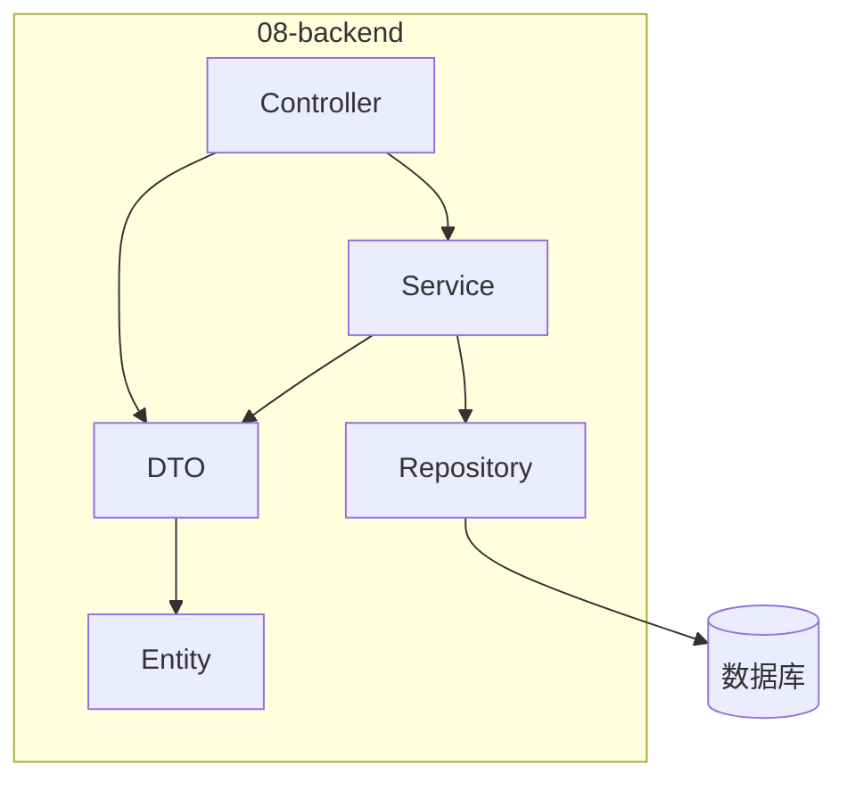
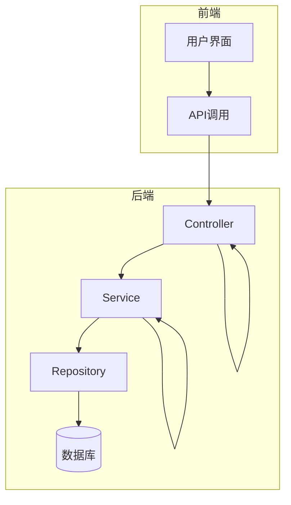
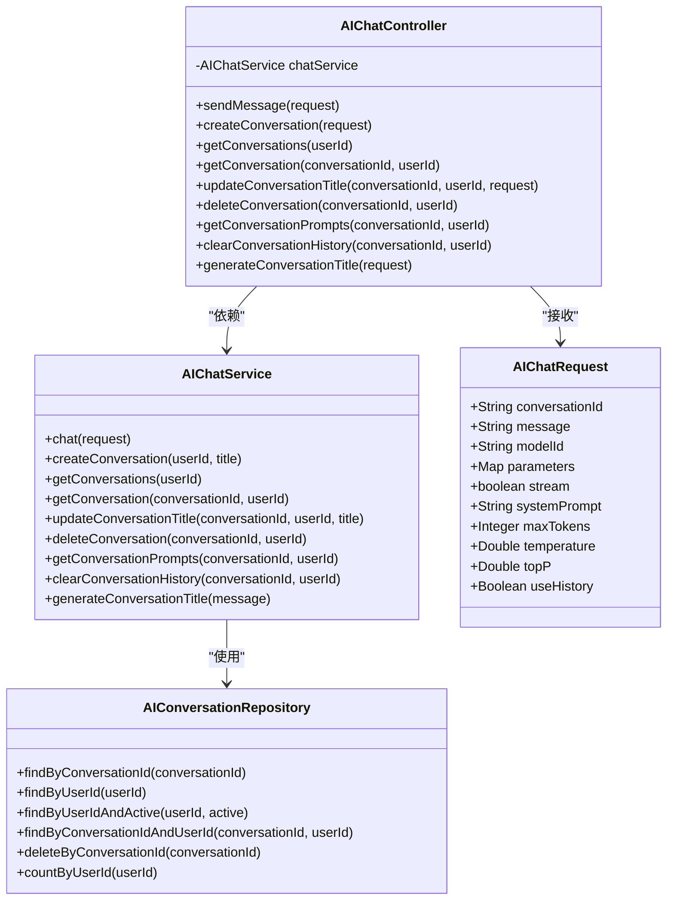
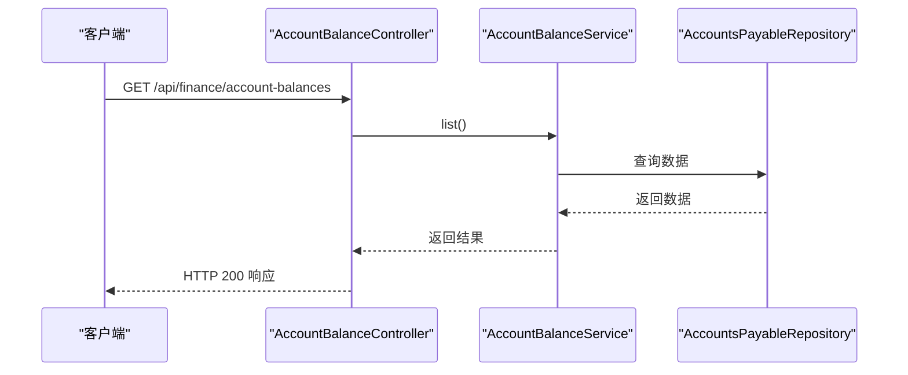
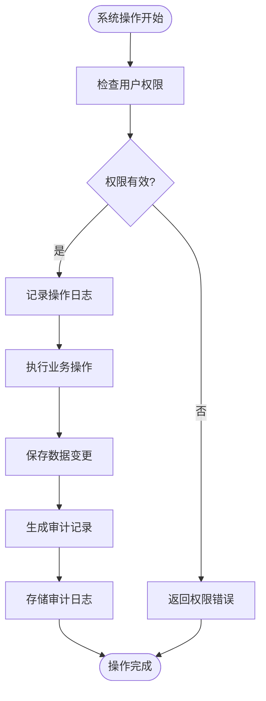
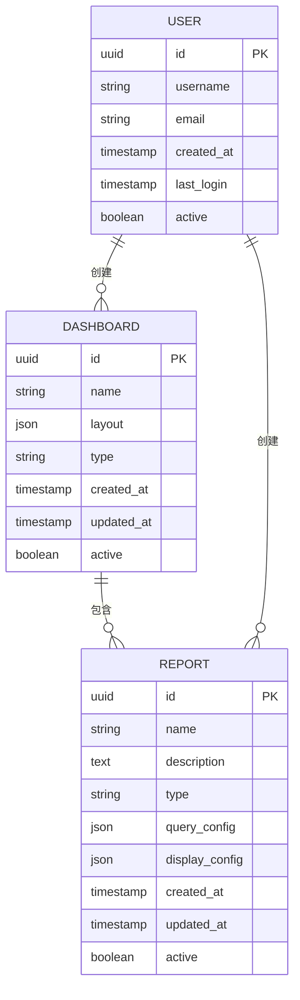
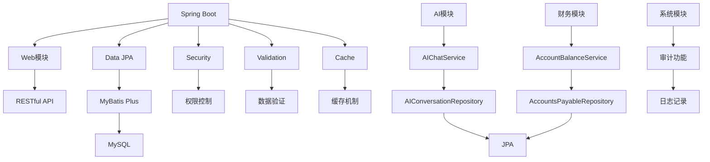

# 模块化架构设计

<cite>
**本文档引用文件**  
- [EnterpriseBrainApplication.java](file://08-backend/src/main/java/com/enterprise/brain/EnterpriseBrainApplication.java)
- [BaseController.java](file://08-backend/src/main/java/com/enterprise/brain/common/base/BaseController.java)
- [BaseService.java](file://08-backend/src/main/java/com/enterprise/brain/common/base/BaseService.java)
- [BaseRepository.java](file://08-backend/src/main/java/com/enterprise/brain/common/base/BaseRepository.java)
- [ApiResponse.java](file://08-backend/src/main/java/com/enterprise/brain/common/response/ApiResponse.java)
- [AIChatController.java](file://08-backend/src/main/java/com/enterprise/brain/modules/ai/controller/AIChatController.java)
- [AIChatService.java](file://08-backend/src/main/java/com/enterprise/brain/modules/ai/service/AIChatService.java)
- [AIConversationRepository.java](file://08-backend/src/main/java/com/enterprise/brain/modules/ai/repository/AIConversationRepository.java)
- [AccountBalanceController.java](file://08-backend/src/main/java/com/enterprise/brain/modules/finance/controller/AccountBalanceController.java)
- [AccountBalanceService.java](file://08-backend/src/main/java/com/enterprise/brain/modules/finance/service/AccountBalanceService.java)
- [AccountsPayableRepository.java](file://08-backend/src/main/java/com/enterprise/brain/modules/finance/repository/AccountsPayableRepository.java)
- [AIChatRequest.java](file://08-backend/src/main/java/com/enterprise/brain/modules/ai/dto/request/AIChatRequest.java)
- [pom.xml](file://08-backend/pom.xml)
</cite>

## 目录
1. [简介](#简介)
2. [项目结构](#项目结构)
3. [核心组件](#核心组件)
4. [架构概览](#架构概览)
5. [详细组件分析](#详细组件分析)
6. [依赖分析](#依赖分析)
7. [性能考虑](#性能考虑)
8. [故障排除指南](#故障排除指南)
9. [结论](#结论)

## 简介
本项目是一个企业级智能管理系统，采用Spring Boot框架构建，实现了AI智能分析、财务系统、系统审计、数据分析等核心业务模块。系统采用典型的三层架构设计（Controller-Service-Repository），通过Spring的依赖注入实现松耦合，提供了RESTful API接口。

## 项目结构

**图示来源**  
- [EnterpriseBrainApplication.java](file://08-backend/src/main/java/com/enterprise/brain/EnterpriseBrainApplication.java#L20-L60)

**本节来源**  
- [EnterpriseBrainApplication.java](file://08-backend/src/main/java/com/enterprise/brain/EnterpriseBrainApplication.java#L1-L60)

## 核心组件

系统采用标准的三层架构模式，包含Controller、Service、Repository三个核心层次，以及DTO数据传输对象用于层间数据传递。

**本节来源**  
- [BaseController.java](file://08-backend/src/main/java/com/enterprise/brain/common/base/BaseController.java#L1-L90)
- [BaseService.java](file://08-backend/src/main/java/com/enterprise/brain/common/base/BaseService.java#L1-L33)
- [BaseRepository.java](file://08-backend/src/main/java/com/enterprise/brain/common/base/BaseRepository.java#L1-L15)

## 架构概览

**图示来源**  
- [EnterpriseBrainApplication.java](file://08-backend/src/main/java/com/enterprise/brain/EnterpriseBrainApplication.java#L20-L60)
- [pom.xml](file://08-backend/pom.xml#L30-L103)

**本节来源**  
- [pom.xml](file://08-backend/pom.xml#L1-L115)

## 详细组件分析

### AI智能分析模块分析

AI智能分析模块实现了企业级AI对话功能，包括对话管理、聊天交互、历史记录等功能。

#### 对象导向组件：

**图示来源**  
- [AIChatController.java](file://08-backend/src/main/java/com/enterprise/brain/modules/ai/controller/AIChatController.java#L1-L150)
- [AIChatService.java](file://08-backend/src/main/java/com/enterprise/brain/modules/ai/service/AIChatService.java#L1-L56)
- [AIConversationRepository.java](file://08-backend/src/main/java/com/enterprise/brain/modules/ai/repository/AIConversationRepository.java#L1-L23)
- [AIChatRequest.java](file://08-backend/src/main/java/com/enterprise/brain/modules/ai/dto/request/AIChatRequest.java#L1-L17)

**本节来源**  
- [AIChatController.java](file://08-backend/src/main/java/com/enterprise/brain/modules/ai/controller/AIChatController.java#L1-L150)
- [AIChatService.java](file://08-backend/src/main/java/com/enterprise/brain/modules/ai/service/AIChatService.java#L1-L56)
- [AIConversationRepository.java](file://08-backend/src/main/java/com/enterprise/brain/modules/ai/repository/AIConversationRepository.java#L1-L23)

### 财务系统模块分析

财务系统模块负责企业财务管理功能，包括账户余额、应收应付账款等核心财务业务。

#### 服务组件：

**图示来源**  
- [AccountBalanceController.java](file://08-backend/src/main/java/com/enterprise/brain/modules/finance/controller/AccountBalanceController.java#L1-L21)
- [AccountBalanceService.java](file://08-backend/src/main/java/com/enterprise/brain/modules/finance/service/AccountBalanceService.java#L1-L12)
- [AccountsPayableRepository.java](file://08-backend/src/main/java/com/enterprise/brain/modules/finance/repository/AccountsPayableRepository.java#L1-L14)

**本节来源**  
- [AccountBalanceController.java](file://08-backend/src/main/java/com/enterprise/brain/modules/finance/controller/AccountBalanceController.java#L1-L21)
- [AccountBalanceService.java](file://08-backend/src/main/java/com/enterprise/brain/modules/finance/service/AccountBalanceService.java#L1-L12)

### 系统审计模块分析

系统审计模块负责记录和追踪系统操作日志，确保系统的安全性和可追溯性。

**本节来源**  
- [EnterpriseBrainApplication.java](file://08-backend/src/main/java/com/enterprise/brain/EnterpriseBrainApplication.java#L1-L60)

### 数据分析模块分析

数据分析模块提供企业数据可视化和分析功能，支持决策制定。

**本节来源**  
- [EnterpriseBrainApplication.java](file://08-backend/src/main/java/com/enterprise/brain/EnterpriseBrainApplication.java#L1-L60)

## 依赖分析

**图示来源**  
- [pom.xml](file://08-backend/pom.xml#L30-L103)
- [EnterpriseBrainApplication.java](file://08-backend/src/main/java/com/enterprise/brain/EnterpriseBrainApplication.java#L20-L60)

**本节来源**  
- [pom.xml](file://08-backend/pom.xml#L1-L115)

## 性能考虑
系统通过MyBatis Plus和Spring Data JPA实现高效的数据访问，利用Spring Cache提供缓存机制。RESTful API设计遵循最佳实践，使用统一的响应格式ApiResponse，支持分页和批量操作以提高性能。

## 故障排除指南
当API调用出现问题时，首先检查请求参数是否符合DTO定义，然后查看服务层日志。对于数据库相关问题，检查Repository接口定义和实体映射关系。权限问题需要检查Security配置和用户角色设置。

**本节来源**  
- [ApiResponse.java](file://08-backend/src/main/java/com/enterprise/brain/common/response/ApiResponse.java#L1-L106)
- [BaseController.java](file://08-backend/src/main/java/com/enterprise/brain/common/base/BaseController.java#L1-L90)

## 结论
该系统采用现代化的Java企业级架构，通过清晰的分层设计实现了高内聚低耦合。各业务模块遵循统一的设计规范，使用Spring生态系统的最佳实践，确保了系统的可维护性和可扩展性。