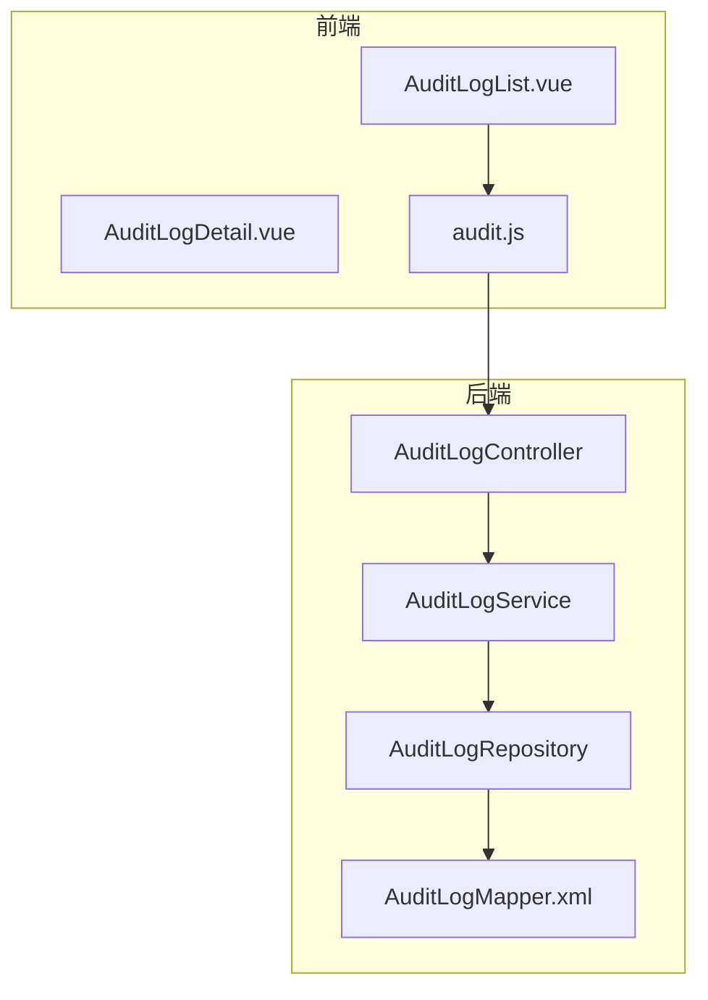
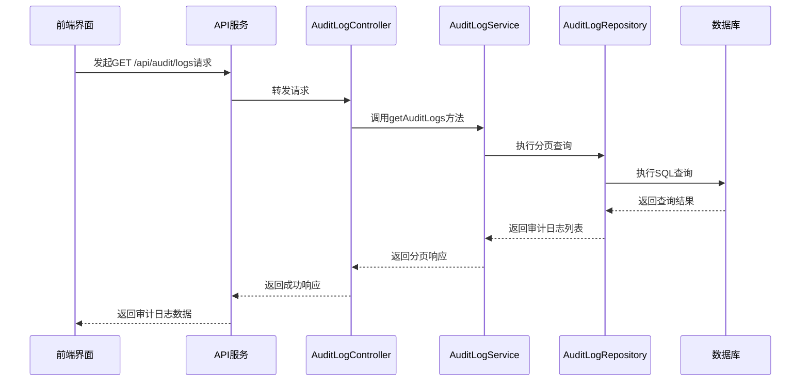
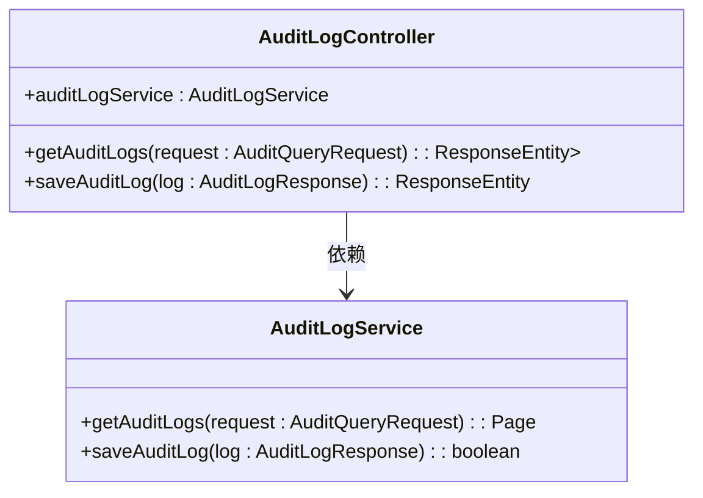
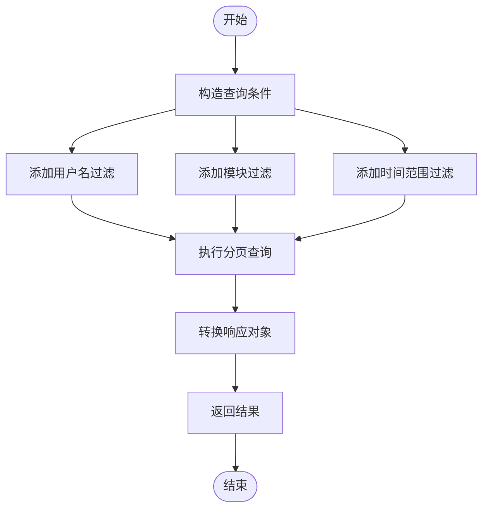
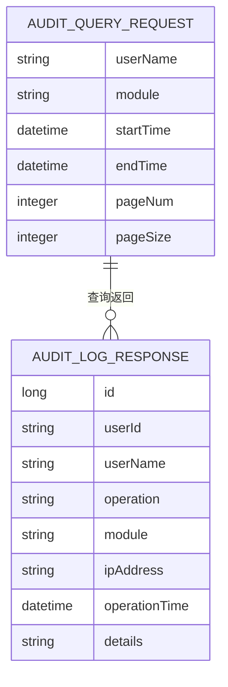
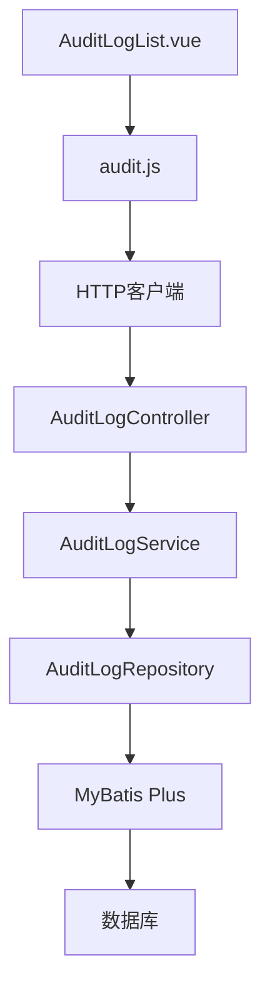

# 系统审计模块架构

<cite>
**本文档引用文件**  
- [AuditLogController.java](file://08-backend/src/main/java/com/enterprise/brain/modules/system/audit/controller/AuditLogController.java)
- [AuditLogService.java](file://08-backend/src/main/java/com/enterprise/brain/modules/system/audit/service/AuditLogService.java)
- [AuditLogServiceImpl.java](file://08-backend/src/main/java/com/enterprise/brain/modules/system/audit/service/impl/AuditLogServiceImpl.java)
- [AuditQueryRequest.java](file://08-backend/src/main/java/com/enterprise/brain/modules/system/audit/dto/request/AuditQueryRequest.java)
- [AuditLogResponse.java](file://08-backend/src/main/java/com/enterprise/brain/modules/system/audit/dto/response/AuditLogResponse.java)
- [AuditLog.java](file://08-backend/src/main/java/com/enterprise/brain/modules/system/audit/entity/AuditLog.java)
- [AuditLogMapper.xml](file://08-backend/src/main/resources/mapper/system/audit/AuditLogMapper.xml)
- [AuditLogList.vue](file://07-frontend/src/pages/system/audit-management/AuditLogList.vue)
- [audit.js](file://07-frontend/src/api/system/audit.js)
- [auditService.ts](file://07-frontend/src/services/api/auditService.ts)
</cite>

## 目录
1. [项目结构](#项目结构)
2. [核心组件](#核心组件)
3. [架构概览](#架构概览)
4. [详细组件分析](#详细组件分析)
5. [依赖分析](#依赖分析)
6. [性能考虑](#性能考虑)
7. [故障排除指南](#故障排除指南)

## 项目结构

系统审计模块采用前后端分离架构，后端基于Spring Boot框架实现，前端使用Vue.js构建。模块主要包含审计日志、数据变更和操作轨迹三大功能。

**图表来源**  
- [AuditLogList.vue](file://07-frontend/src/pages/system/audit-management/AuditLogList.vue)
- [audit.js](file://07-frontend/src/api/system/audit.js)
- [AuditLogController.java](file://08-backend/src/main/java/com/enterprise/brain/modules/system/audit/controller/AuditLogController.java)
- [AuditLogService.java](file://08-backend/src/main/java/com/enterprise/brain/modules/system/audit/service/AuditLogService.java)
- [AuditLogMapper.xml](file://08-backend/src/main/resources/mapper/system/audit/AuditLogMapper.xml)

**章节来源**  
- [AuditLogList.vue](file://07-frontend/src/pages/system/audit-management/AuditLogList.vue)
- [AuditLogController.java](file://08-backend/src/main/java/com/enterprise/brain/modules/system/audit/controller/AuditLogController.java)

## 核心组件

系统审计模块的核心组件包括审计日志控制器、服务接口、实体类和前端组件。后端采用典型的三层架构：Controller层处理HTTP请求，Service层实现业务逻辑，Repository层负责数据访问。

**章节来源**  
- [AuditLogController.java](file://08-backend/src/main/java/com/enterprise/brain/modules/system/audit/controller/AuditLogController.java)
- [AuditLogService.java](file://08-backend/src/main/java/com/enterprise/brain/modules/system/audit/service/AuditLogService.java)
- [AuditLog.java](file://08-backend/src/main/java/com/enterprise/brain/modules/system/audit/entity/AuditLog.java)

## 架构概览

系统审计模块采用分层架构设计，从前端到后端形成完整的调用链路。用户通过前端界面发起审计日志查询请求，经过API网关到达后端控制器，由服务层处理业务逻辑，最终通过数据访问层与数据库交互。

**图表来源**  
- [AuditLogController.java](file://08-backend/src/main/java/com/enterprise/brain/modules/system/audit/controller/AuditLogController.java)
- [AuditLogService.java](file://08-backend/src/main/java/com/enterprise/brain/modules/system/audit/service/AuditLogService.java)
- [AuditLogRepository.java](file://08-backend/src/main/java/com/enterprise/brain/modules/system/audit/repository/AuditLogRepository.java)

## 详细组件分析

### 审计日志控制器分析

AuditLogController是审计模块的入口点，负责处理所有与审计日志相关的HTTP请求。该控制器提供了两个核心接口：GET方法用于查询审计日志，POST方法用于保存审计记录。

#### 控制器接口

**图表来源**  
- [AuditLogController.java](file://08-backend/src/main/java/com/enterprise/brain/modules/system/audit/controller/AuditLogController.java)
- [AuditLogService.java](file://08-backend/src/main/java/com/enterprise/brain/modules/system/audit/service/AuditLogService.java)

**章节来源**  
- [AuditLogController.java](file://08-backend/src/main/java/com/enterprise/brain/modules/system/audit/controller/AuditLogController.java)

### 审计日志服务分析

AuditLogService接口定义了审计日志的核心契约，其实现类AuditLogServiceImpl提供了具体的业务逻辑。服务层负责处理分页查询、条件过滤和数据持久化等操作。

#### 服务实现

**图表来源**  
- [AuditLogServiceImpl.java](file://08-backend/src/main/java/com/enterprise/brain/modules/system/audit/service/impl/AuditLogServiceImpl.java)
- [AuditQueryRequest.java](file://08-backend/src/main/java/com/enterprise/brain/modules/system/audit/dto/request/AuditQueryRequest.java)

**章节来源**  
- [AuditLogServiceImpl.java](file://08-backend/src/main/java/com/enterprise/brain/modules/system/audit/service/impl/AuditLogServiceImpl.java)

### 请求响应对象分析

审计模块定义了清晰的请求和响应数据结构，确保前后端数据交互的一致性和可预测性。

#### 数据模型

**图表来源**  
- [AuditQueryRequest.java](file://08-backend/src/main/java/com/enterprise/brain/modules/system/audit/dto/request/AuditQueryRequest.java)
- [AuditLogResponse.java](file://08-backend/src/main/java/com/enterprise/brain/modules/system/audit/dto/response/AuditLogResponse.java)

**章节来源**  
- [AuditQueryRequest.java](file://08-backend/src/main/java/com/enterprise/brain/modules/system/audit/dto/request/AuditQueryRequest.java)
- [AuditLogResponse.java](file://08-backend/src/main/java/com/enterprise/brain/modules/system/audit/dto/response/AuditLogResponse.java)

## 依赖分析

审计模块的依赖关系清晰明确，遵循了依赖倒置原则。高层模块依赖于抽象接口，而不是具体实现，提高了系统的可维护性和可测试性。

**图表来源**  
- [AuditLogController.java](file://08-backend/src/main/java/com/enterprise/brain/modules/system/audit/controller/AuditLogController.java)
- [AuditLogService.java](file://08-backend/src/main/java/com/enterprise/brain/modules/system/audit/service/AuditLogService.java)
- [AuditLogRepository.java](file://08-backend/src/main/java/com/enterprise/brain/modules/system/audit/repository/AuditLogRepository.java)
- [audit.js](file://07-frontend/src/api/system/audit.js)

**章节来源**  
- [AuditLogController.java](file://08-backend/src/main/java/com/enterprise/brain/modules/system/audit/controller/AuditLogController.java)
- [AuditLogService.java](file://08-backend/src/main/java/com/enterprise/brain/modules/system/audit/service/AuditLogService.java)
- [audit.js](file://07-frontend/src/api/system/audit.js)

## 性能考虑

审计模块在设计时充分考虑了性能优化，主要体现在以下几个方面：

1. **分页查询**：默认采用分页机制，避免一次性加载大量数据
2. **索引优化**：在数据库的用户名、模块和操作时间字段上建立索引
3. **条件查询**：支持多条件组合查询，提高查询效率
4. **缓存机制**：高频查询结果可缓存，减少数据库压力

**章节来源**  
- [AuditLogServiceImpl.java](file://08-backend/src/main/java/com/enterprise/brain/modules/system/audit/service/impl/AuditLogServiceImpl.java)
- [AuditLogMapper.xml](file://08-backend/src/main/resources/mapper/system/audit/AuditLogMapper.xml)

## 故障排除指南

当审计模块出现问题时，可以按照以下步骤进行排查：

1. 检查前端请求参数是否正确
2. 验证后端服务是否正常运行
3. 查看数据库连接状态
4. 检查日志文件中的错误信息
5. 验证查询条件是否符合预期

**章节来源**  
- [AuditLogController.java](file://08-backend/src/main/java/com/enterprise/brain/modules/system/audit/controller/AuditLogController.java)
- [AuditLogServiceImpl.java](file://08-backend/src/main/java/com/enterprise/brain/modules/system/audit/service/impl/AuditLogServiceImpl.java)
- [AuditLogList.vue](file://07-frontend/src/pages/system/audit-management/AuditLogList.vue)