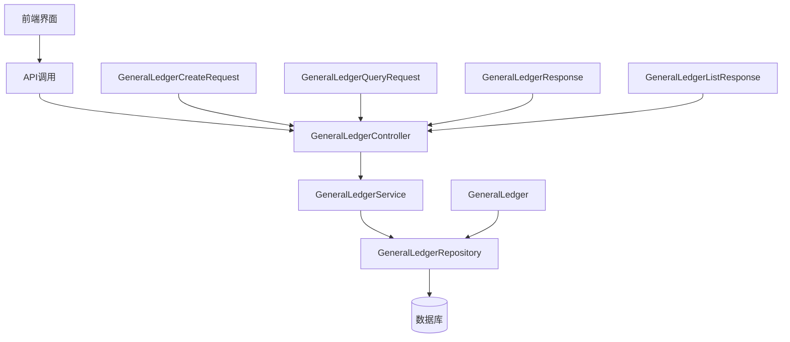
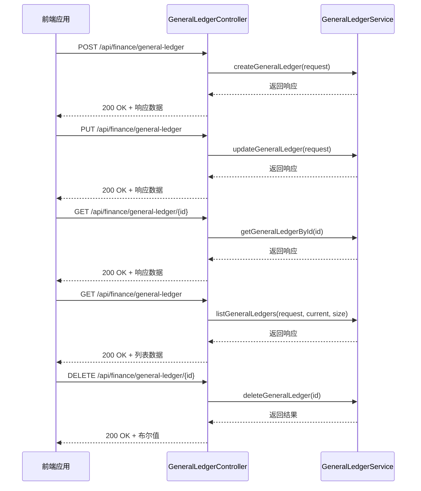
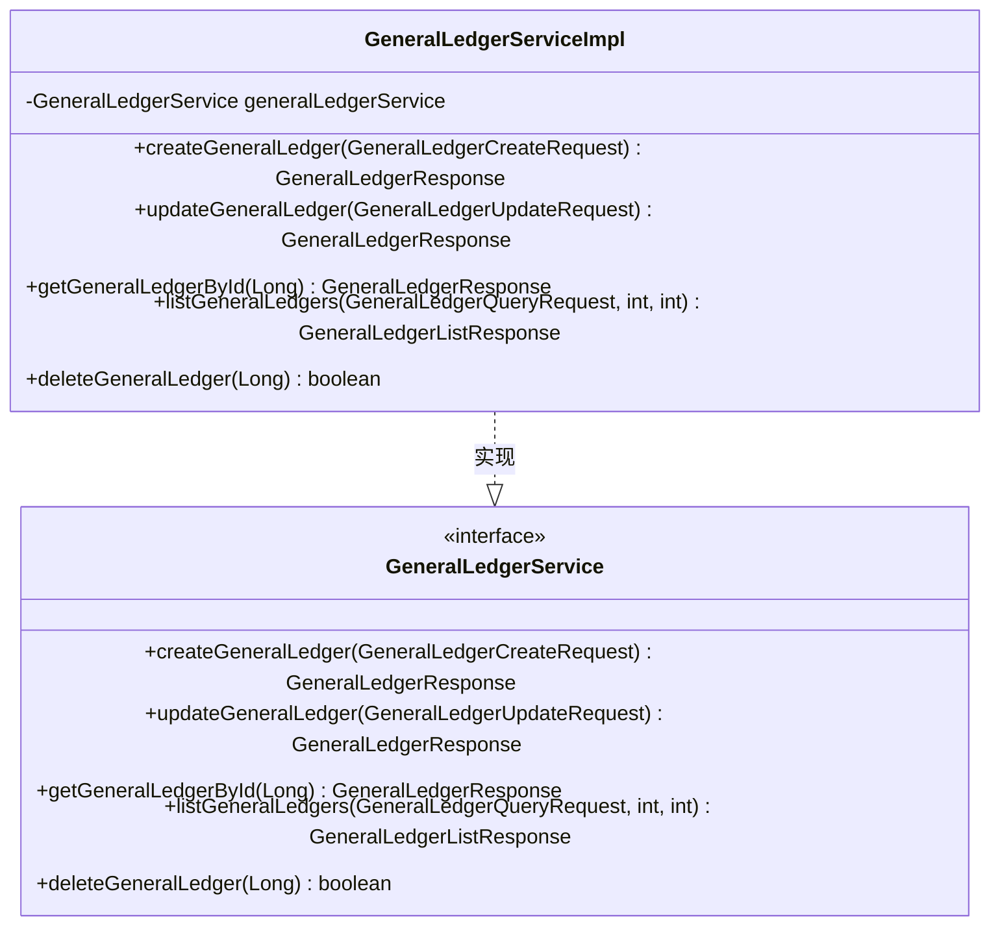
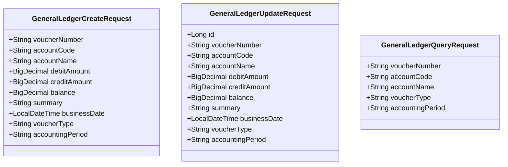
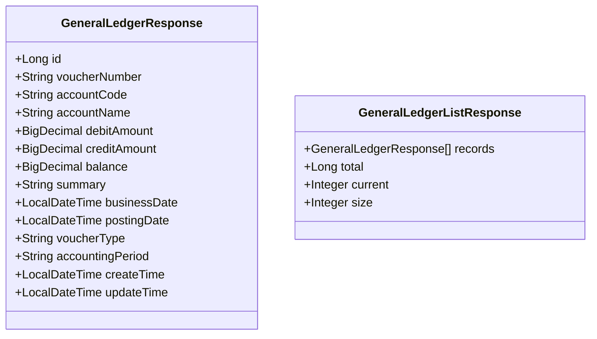
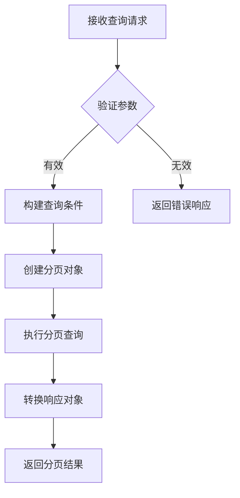
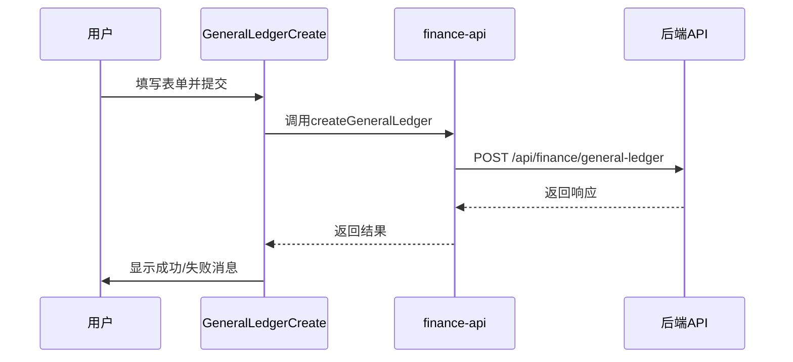

# 财务系统模块架构

<cite>
**本文档引用的文件**   
- [GeneralLedgerController.java](file://08-backend/src/main/java/com/enterprise/brain/modules/finance/controller/GeneralLedgerController.java)
- [GeneralLedgerService.java](file://08-backend/src/main/java/com/enterprise/brain/modules/finance/service/GeneralLedgerService.java)
- [GeneralLedgerServiceImpl.java](file://08-backend/src/main/java/com/enterprise/brain/modules/finance/service/impl/GeneralLedgerServiceImpl.java)
- [GeneralLedgerCreateRequest.java](file://08-backend/src/main/java/com/enterprise/brain/modules/finance/dto/request/GeneralLedgerCreateRequest.java)
- [GeneralLedgerQueryRequest.java](file://08-backend/src/main/java/com/enterprise/brain/modules/finance/dto/request/GeneralLedgerQueryRequest.java)
- [GeneralLedgerResponse.java](file://08-backend/src/main/java/com/enterprise/brain/modules/finance/dto/response/GeneralLedgerResponse.java)
- [GeneralLedgerListResponse.java](file://08-backend/src/main/java/com/enterprise/brain/modules/finance/dto/response/GeneralLedgerListResponse.java)
- [GeneralLedger.java](file://08-backend/src/main/java/com/enterprise/brain/modules/finance/entity/GeneralLedger.java)
- [GeneralLedgerMapper.java](file://08-backend/src/main/java/com/enterprise/brain/modules/finance/mapper/GeneralLedgerMapper.java)
- [GeneralLedgerRepository.java](file://08-backend/src/main/java/com/enterprise/brain/modules/finance/repository/GeneralLedgerRepository.java)
- [GeneralLedgerCreate.vue](file://07-frontend/src/pages/finance/general-ledger/GeneralLedgerCreate.vue)
- [GeneralLedgerList.vue](file://07-frontend/src/pages/finance/general-ledger/GeneralLedgerList.vue)
- [finance-api.js](file://07-frontend/src/services/api/finance-api.js)
</cite>

## 目录
1. [总账管理功能架构概述](#总账管理功能架构概述)
2. [RESTful API设计规范](#restful-api设计规范)
3. [业务服务接口与实现](#业务服务接口与实现)
4. [请求对象数据验证机制](#请求对象数据验证机制)
5. [响应对象封装规范](#响应对象封装规范)
6. [分页查询功能实现](#分页查询功能实现)
7. [数据一致性与事务管理](#数据一致性与事务管理)
8. [前端集成模式](#前端集成模式)

## 总账管理功能架构概述

财务系统模块中的总账管理功能采用典型的分层架构设计，包含控制器层、服务层、数据访问层和实体层。该功能通过RESTful API提供标准接口，支持总账记录的创建、更新、查询和删除操作。系统采用MyBatis-Plus作为持久层框架，实现了数据访问的简化和优化。

**架构特点**：
- 前后端分离设计，通过API接口进行数据交互
- 采用DTO（数据传输对象）模式隔离领域模型与外部接口
- 实现软删除机制，通过deleted字段标识记录状态
- 支持分页查询和多条件过滤
- 集成Swagger文档，提供API可视化

**图示来源**
- [GeneralLedgerController.java](file://08-backend/src/main/java/com/enterprise/brain/modules/finance/controller/GeneralLedgerController.java)
- [GeneralLedgerService.java](file://08-backend/src/main/java/com/enterprise/brain/modules/finance/service/GeneralLedgerService.java)
- [GeneralLedgerRepository.java](file://08-backend/src/main/java/com/enterprise/brain/modules/finance/repository/GeneralLedgerRepository.java)
- [GeneralLedger.java](file://08-backend/src/main/java/com/enterprise/brain/modules/finance/entity/GeneralLedger.java)

**本节来源**
- [GeneralLedgerController.java](file://08-backend/src/main/java/com/enterprise/brain/modules/finance/controller/GeneralLedgerController.java)
- [GeneralLedger.java](file://08-backend/src/main/java/com/enterprise/brain/modules/finance/entity/GeneralLedger.java)

## RESTful API设计规范

总账管理功能的RESTful API设计遵循HTTP标准方法和语义，提供清晰的资源操作接口。API端点统一以`/api/finance/general-ledger`为前缀，确保接口的组织性和可发现性。

### HTTP方法映射

**图示来源**
- [GeneralLedgerController.java](file://08-backend/src/main/java/com/enterprise/brain/modules/finance/controller/GeneralLedgerController.java)

### API端点详细说明

| HTTP方法 | 路径 | 功能描述 | 请求参数 | 响应类型 |
|---------|------|---------|---------|---------|
| POST | /api/finance/general-ledger | 创建总账记录 | GeneralLedgerCreateRequest | GeneralLedgerResponse |
| PUT | /api/finance/general-ledger | 更新总账记录 | GeneralLedgerUpdateRequest | GeneralLedgerResponse |
| GET | /api/finance/general-ledger/{id} | 根据ID获取总账记录 | 路径参数id | GeneralLedgerResponse |
| GET | /api/finance/general-ledger | 分页查询总账记录 | 查询参数和分页参数 | GeneralLedgerListResponse |
| DELETE | /api/finance/general-ledger/{id} | 删除总账记录 | 路径参数id | boolean |

**本节来源**
- [GeneralLedgerController.java](file://08-backend/src/main/java/com/enterprise/brain/modules/finance/controller/GeneralLedgerController.java)

## 业务服务接口与实现

总账管理功能的核心业务逻辑通过服务层接口和实现类进行封装，遵循面向接口编程的原则，提高了代码的可维护性和可测试性。

### 服务接口定义

GeneralLedgerService接口定义了总账管理的核心业务方法契约，继承自MyBatis-Plus的IService接口，获得了基础的CRUD操作能力。

**图示来源**
- [GeneralLedgerService.java](file://08-backend/src/main/java/com/enterprise/brain/modules/finance/service/GeneralLedgerService.java)
- [GeneralLedgerServiceImpl.java](file://08-backend/src/main/java/com/enterprise/brain/modules/finance/service/impl/GeneralLedgerServiceImpl.java)

### 服务实现逻辑

GeneralLedgerServiceImpl类提供了服务接口的具体实现，采用BeanUtils工具进行对象属性复制，简化了数据转换过程。

#### 创建操作实现
创建总账记录时，将请求对象的属性复制到实体对象，设置记账日期为业务日期，保存到数据库后返回响应对象。

#### 更新操作实现
更新操作首先根据ID查询现有记录，若记录不存在则返回null；否则将请求对象的属性复制到现有记录，更新数据库。

#### 查询操作实现
分页查询构建LambdaQueryWrapper查询条件，支持凭证编号、会计科目代码、科目名称、凭证类型和会计期间等条件的模糊或精确匹配。

**本节来源**
- [GeneralLedgerService.java](file://08-backend/src/main/java/com/enterprise/brain/modules/finance/service/GeneralLedgerService.java)
- [GeneralLedgerServiceImpl.java](file://08-backend/src/main/java/com/enterprise/brain/modules/finance/service/impl/GeneralLedgerServiceImpl.java)

## 请求对象数据验证机制

总账管理功能通过Java Bean Validation注解实现请求对象的数据验证，确保输入数据的完整性和正确性。

### GeneralLedgerCreateRequest验证

创建请求对象包含以下验证规则：
- 凭证编号：@NotBlank，不能为空
- 会计科目代码：@NotBlank，不能为空
- 会计科目名称：@NotBlank，不能为空
- 业务日期：@NotNull，不能为空

### GeneralLedgerUpdateRequest验证

更新请求对象包含以下验证规则：
- 主键ID：@NotNull，不能为空

### GeneralLedgerQueryRequest验证

查询请求对象不包含强制验证注解，所有字段均为可选查询条件。

**图示来源**
- [GeneralLedgerCreateRequest.java](file://08-backend/src/main/java/com/enterprise/brain/modules/finance/dto/request/GeneralLedgerCreateRequest.java)
- [GeneralLedgerUpdateRequest.java](file://08-backend/src/main/java/com/enterprise/brain/modules/finance/dto/request/GeneralLedgerUpdateRequest.java)
- [GeneralLedgerQueryRequest.java](file://08-backend/src/main/java/com/enterprise/brain/modules/finance/dto/request/GeneralLedgerQueryRequest.java)

**本节来源**
- [GeneralLedgerCreateRequest.java](file://08-backend/src/main/java/com/enterprise/brain/modules/finance/dto/request/GeneralLedgerCreateRequest.java)
- [GeneralLedgerUpdateRequest.java](file://08-backend/src/main/java/com/enterprise/brain/modules/finance/dto/request/GeneralLedgerUpdateRequest.java)
- [GeneralLedgerQueryRequest.java](file://08-backend/src/main/java/com/enterprise/brain/modules/finance/dto/request/GeneralLedgerQueryRequest.java)

## 响应对象封装规范

总账管理功能定义了标准化的响应对象，用于封装API返回的数据，确保接口的一致性和可预测性。

### GeneralLedgerResponse

单个总账记录的响应对象包含所有相关字段，包括主键ID、凭证信息、会计科目信息、金额信息、摘要、日期信息和时间戳。

### GeneralLedgerListResponse

总账列表响应对象包含分页信息和记录列表，遵循标准的分页响应格式。

**图示来源**
- [GeneralLedgerResponse.java](file://08-backend/src/main/java/com/enterprise/brain/modules/finance/dto/response/GeneralLedgerResponse.java)
- [GeneralLedgerListResponse.java](file://08-backend/src/main/java/com/enterprise/brain/modules/finance/dto/response/GeneralLedgerListResponse.java)

**本节来源**
- [GeneralLedgerResponse.java](file://08-backend/src/main/java/com/enterprise/brain/modules/finance/dto/response/GeneralLedgerResponse.java)
- [GeneralLedgerListResponse.java](file://08-backend/src/main/java/com/enterprise/brain/modules/finance/dto/response/GeneralLedgerListResponse.java)

## 分页查询功能实现

分页查询功能基于MyBatis-Plus的分页插件实现，支持灵活的查询条件和标准的分页参数。

### 分页参数处理

API接口接收两个分页参数：
- current：当前页码，默认值为1
- size：每页大小，默认值为20

### 查询条件构建

查询条件通过GeneralLedgerQueryRequest对象传递，系统根据非空字段动态构建查询条件：
- 凭证编号：模糊匹配
- 会计科目代码：模糊匹配
- 会计科目名称：模糊匹配
- 凭证类型：精确匹配
- 会计期间：精确匹配

### 查询执行流程

**图示来源**
- [GeneralLedgerServiceImpl.java](file://08-backend/src/main/java/com/enterprise/brain/modules/finance/service/impl/GeneralLedgerServiceImpl.java)

**本节来源**
- [GeneralLedgerServiceImpl.java](file://08-backend/src/main/java/com/enterprise/brain/modules/finance/service/impl/GeneralLedgerServiceImpl.java)
- [GeneralLedgerQueryRequest.java](file://08-backend/src/main/java/com/enterprise/brain/modules/finance/dto/request/GeneralLedgerQueryRequest.java)

## 数据一致性与事务管理

总账管理功能通过以下机制保障数据一致性：

### 软删除机制

实体类GeneralLedger包含deleted字段，使用@TableLogic注解实现软删除。删除操作实际上是将deleted字段更新为1，而不是物理删除记录。

### 自动时间戳

createTime和updateTime字段使用FieldFill.INSERT和FieldFill.INSERT_UPDATE填充策略，确保时间戳的准确性和一致性。

### 事务管理

虽然代码中未显式声明事务注解，但MyBatis-Plus的ServiceImpl提供了基础的事务支持。对于复杂的业务操作，建议在服务方法上添加@Transactional注解以确保事务完整性。

**本节来源**
- [GeneralLedger.java](file://08-backend/src/main/java/com/enterprise/brain/modules/finance/entity/GeneralLedger.java)
- [GeneralLedgerServiceImpl.java](file://08-backend/src/main/java/com/enterprise/brain/modules/finance/service/impl/GeneralLedgerServiceImpl.java)

## 前端集成模式

总账管理功能的前端通过Vue.js组件和API服务进行集成，实现了用户友好的界面和流畅的交互体验。

### 前端组件

- GeneralLedgerCreate.vue：总账创建表单组件
- GeneralLedgerList.vue：总账列表展示组件
- finance-api.js：财务API服务定义

### API调用流程

前端通过finance-api.js中的generalLedgerApi服务调用后端API，实现数据的创建、查询和管理。

**图示来源**
- [GeneralLedgerCreate.vue](file://07-frontend/src/pages/finance/general-ledger/GeneralLedgerCreate.vue)
- [finance-api.js](file://07-frontend/src/services/api/finance-api.js)

**本节来源**
- [GeneralLedgerCreate.vue](file://07-frontend/src/pages/finance/general-ledger/GeneralLedgerCreate.vue)
- [GeneralLedgerList.vue](file://07-frontend/src/pages/finance/general-ledger/GeneralLedgerList.vue)
- [finance-api.js](file://07-frontend/src/services/api/finance-api.js)