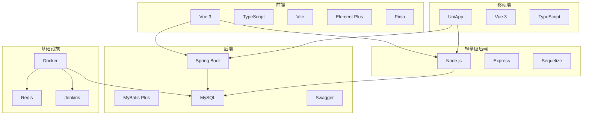
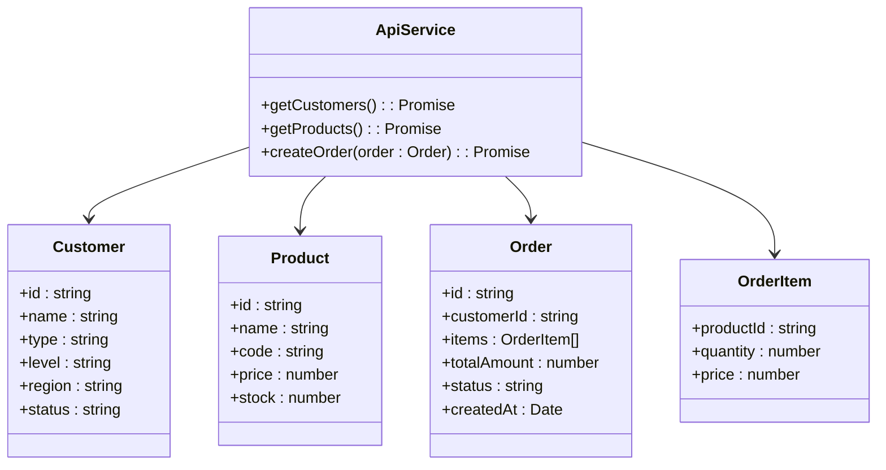
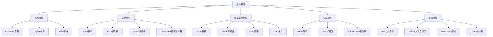
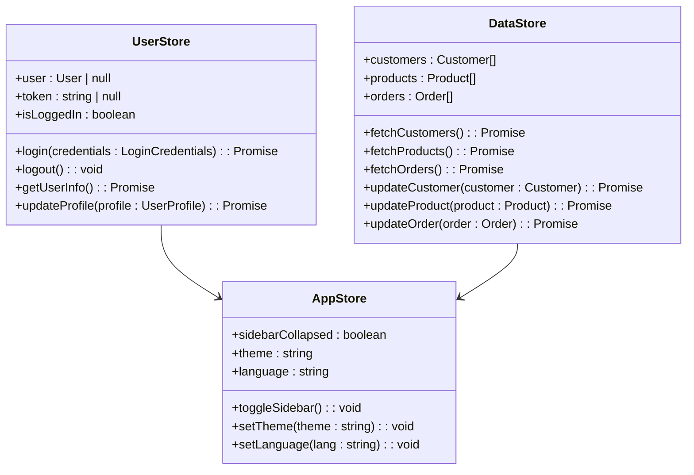
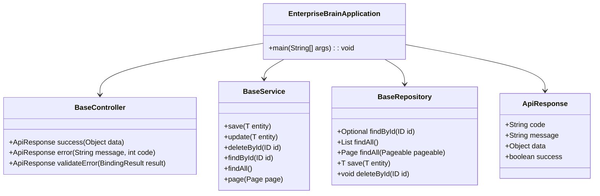
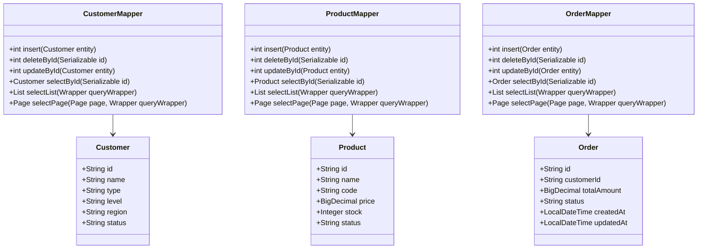
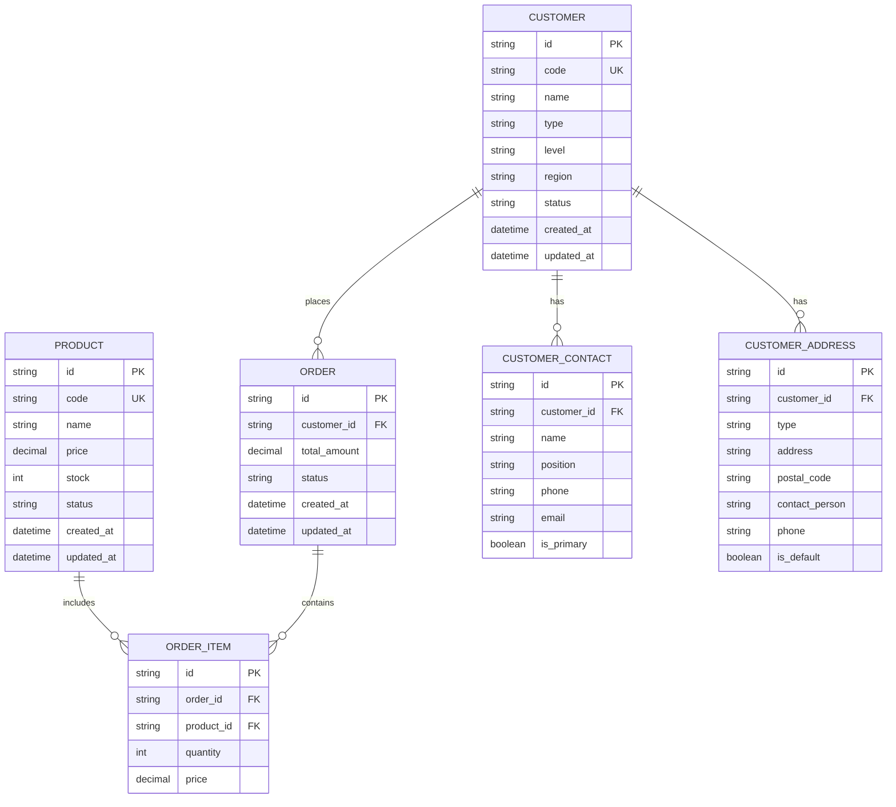
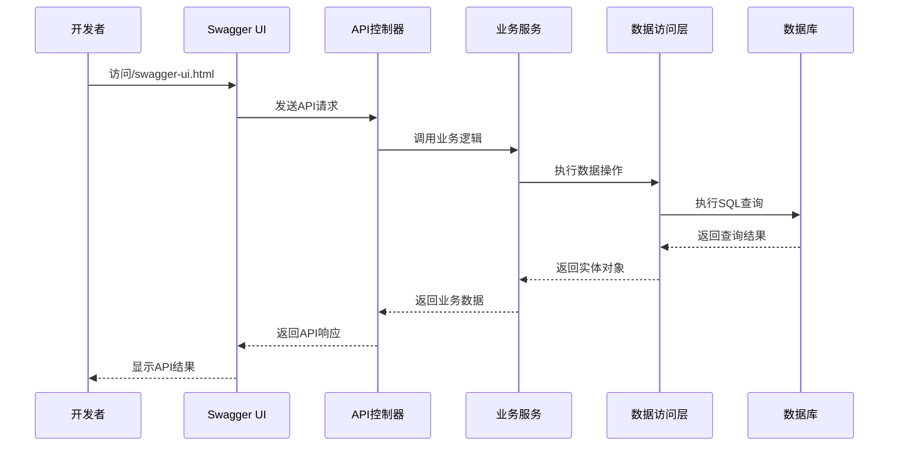
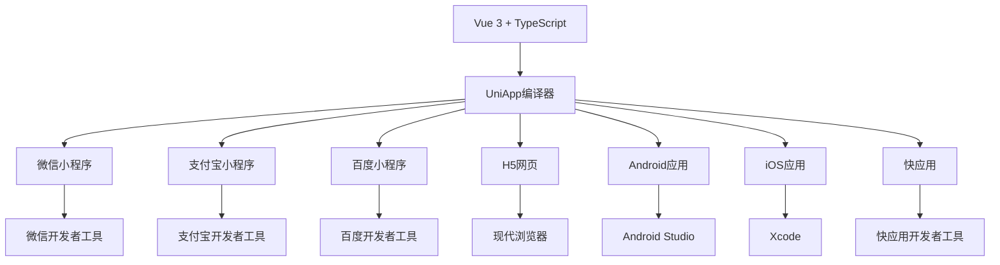
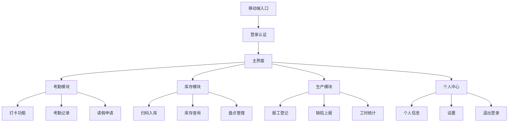

# 技术栈与依赖

<cite>
**本文档引用的文件**  
- [package.json](file://package.json)
- [07-frontend/package.json](file://07-frontend/package.json)
- [08-backend/pom.xml](file://08-backend/pom.xml)
- [backend/server.js](file://backend/server.js)
- [08-backend/src/main/resources/application.yml](file://08-backend/src/main/resources/application.yml)
- [docker/docker-compose.yml](file://docker/docker-compose.yml)
- [src/manifest.json](file://src/manifest.json)
- [08-backend/src/main/java/com/enterprise/brain/EnterpriseBrainApplication.java](file://08-backend/src/main/java/com/enterprise/brain/EnterpriseBrainApplication.java)
- [08-backend/src/main/java/com/enterprise/brain/common/config/SwaggerConfig.java](file://08-backend/src/main/java/com/enterprise/brain/common/config/SwaggerConfig.java)
- [07-frontend/vite.config.js](file://07-frontend/vite.config.js)
- [tsconfig.json](file://tsconfig.json)
</cite>

## 目录
1. [技术栈全景](#技术栈全景)  
2. [前端技术栈分析](#前端技术栈分析)  
3. [后端技术栈分析](#后端技术栈分析)  
4. [移动端技术栈分析](#移动端技术栈分析)  
5. [关键依赖库说明](#关键依赖库说明)  
6. [技术选型权衡分析](#技术选型权衡分析)  
7. [开发环境搭建指南](#开发环境搭建指南)  
8. [容器化部署方案](#容器化部署方案)

## 技术栈全景

ai_desktop_3项目采用多技术栈融合的架构设计，形成了完整的全栈解决方案。项目技术栈分为四个主要部分：前端Web应用、Java后端服务、Node.js轻量级后端和移动端应用。



**图示来源**  
- [package.json](file://package.json)
- [07-frontend/package.json](file://07-frontend/package.json)
- [08-backend/pom.xml](file://08-backend/pom.xml)
- [docker/docker-compose.yml](file://docker/docker-compose.yml)

## 前端技术栈分析

项目前端采用Vue 3 + TypeScript + Vite + Element Plus的技术组合，构建现代化的企业级Web应用。

### Vue 3与Composition API

前端核心框架采用Vue 3，充分利用其Composition API带来的代码组织优势。通过`setup`函数和响应式API，实现了更灵活的逻辑复用和代码组织方式。项目中的`composables`目录下存放了多个可复用的组合式函数，如`useRealTimeSales`，体现了Vue 3的组合式编程理念。

### TypeScript类型系统

项目全面采用TypeScript作为开发语言，提供了完整的类型安全保证。通过`tsconfig.json`配置文件，项目启用了严格的类型检查，包括`strict: true`和`noImplicitAny: true`等选项，确保代码质量和开发体验。



**图示来源**  
- [tsconfig.json](file://tsconfig.json)
- [07-frontend/src/api/index.ts](file://07-frontend/src/api/index.ts)
- [07-frontend/src/api/product.ts](file://07-frontend/src/api/product.ts)

### Vite构建工具

项目采用Vite作为前端构建工具，替代传统的Webpack，显著提升了开发体验和构建性能。Vite利用现代浏览器的ES模块原生支持，实现了闪电般的冷启动和热模块替换（HMR）。

```javascript
// vite.config.js 配置要点
export default defineConfig({
  plugins: [vue()],
  resolve: {
    alias: {
      '@': path.resolve(__dirname, 'src')
    }
  },
  server: {
    port: 3001,
    host: '0.0.0.0',
    open: '/auth/login',
    proxy: {
      '/api': {
        target: 'http://localhost:8080',
        changeOrigin: true,
        rewrite: (path) => path.replace(/^\/api/, '')
      }
    }
  }
});
```

**图示来源**  
- [07-frontend/vite.config.js](file://07-frontend/vite.config.js)
- [07-frontend/package.json](file://07-frontend/package.json)

### Element Plus组件库

UI组件库采用Element Plus，为项目提供了丰富的企业级UI组件。Element Plus是Element UI的Vue 3版本，完全重写以适应Vue 3的新特性，包括Composition API和Teleport等。



**图示来源**  
- [07-frontend/package.json](file://07-frontend/package.json)
- [07-frontend/src/components/common/forms/BaseForm.vue](file://07-frontend/src/components/common/forms/BaseForm.vue)
- [07-frontend/src/components/common/tables/BaseTable.vue](file://07-frontend/src/components/common/tables/BaseTable.vue)

### Pinia状态管理

状态管理采用Pinia替代Vuex，利用其更简洁的API和TypeScript支持，提供了更好的开发体验。Pinia的store是响应式的，可以直接在组件中使用，无需映射。



**图示来源**  
- [07-frontend/package.json](file://07-frontend/package.json)
- [07-frontend/src/stores/user.js](file://07-frontend/src/stores/user.js)
- [07-frontend/src/stores/app.js](file://07-frontend/src/stores/app.js)

## 后端技术栈分析

后端采用Spring Boot + MyBatis Plus + MySQL的Java技术生态，构建稳定可靠的企业级服务。

### Spring Boot框架

后端核心采用Spring Boot 3.1.0，基于Spring Framework 6.x构建，充分利用了Spring生态的成熟稳定性和丰富的功能特性。通过`@SpringBootApplication`注解，实现了自动配置、组件扫描和配置管理。



**图示来源**  
- [08-backend/pom.xml](file://08-backend/pom.xml)
- [08-backend/src/main/java/com/enterprise/brain/EnterpriseBrainApplication.java](file://08-backend/src/main/java/com/enterprise/brain/EnterpriseBrainApplication.java)
- [08-backend/src/main/java/com/enterprise/brain/common/base/BaseController.java](file://08-backend/src/main/java/com/enterprise/brain/common/base/BaseController.java)

### MyBatis Plus增强

数据访问层采用MyBatis Plus，作为MyBatis的增强工具，提供了丰富的CRUD操作和代码生成能力。通过`@MapperScan`注解，自动扫描Mapper接口，简化了配置。



**图示来源**  
- [08-backend/pom.xml](file://08-backend/pom.xml)
- [08-backend/src/main/java/com/enterprise/brain/modules/finance/mapper/CustomerMapper.java](file://08-backend/src/main/java/com/enterprise/brain/modules/finance/mapper/CustomerMapper.java)
- [08-backend/src/main/java/com/enterprise/brain/modules/finance/entity/Customer.java](file://08-backend/src/main/java/com/enterprise/brain/modules/finance/entity/Customer.java)

### 数据库设计与连接

数据库采用MySQL 8.0，通过JDBC连接，配置了连接池和事务管理。`application.yml`文件中定义了完整的数据库连接配置，包括URL、用户名、密码和驱动类。



**图示来源**  
- [08-backend/src/main/resources/application.yml](file://08-backend/src/main/resources/application.yml)
- [08-backend/src/main/java/com/enterprise/brain/modules/finance/entity/Customer.java](file://08-backend/src/main/java/com/enterprise/brain/modules/finance/entity/Customer.java)
- [08-backend/src/main/java/com/enterprise/brain/modules/finance/entity/Order.java](file://08-backend/src/main/java/com/enterprise/brain/modules/finance/entity/Order.java)

### Swagger API文档

API文档采用SpringDoc OpenAPI（Swagger的Spring Boot实现），自动生成RESTful API文档，提供交互式API测试界面。通过`@OpenAPI`注解配置文档元信息，包括标题、描述、版本和联系信息。



**图示来源**  
- [08-backend/pom.xml](file://08-backend/pom.xml)
- [08-backend/src/main/java/com/enterprise/brain/common/config/SwaggerConfig.java](file://08-backend/src/main/java/com/enterprise/brain/common/config/SwaggerConfig.java)
- [08-backend/src/main/resources/application.yml](file://08-backend/src/main/resources/application.yml)

## 移动端技术栈分析

移动端采用UniApp框架，实现一次开发、多端适配的技术目标。

### UniApp多端适配原理

UniApp基于Vue.js框架，通过编译器将同一套代码编译为多个平台的原生应用，包括微信小程序、H5、Android和iOS等。项目通过`manifest.json`配置文件定义应用的基本信息和平台特定配置。



**图示来源**  
- [src/manifest.json](file://src/manifest.json)
- [package.json](file://package.json)
- [src/pages/index/index.vue](file://src/pages/index/index.vue)

### 移动端功能实现

移动端实现了核心业务功能，包括考勤打卡、库存扫描和生产报工等。通过`pages.json`配置文件定义页面路由和导航，确保多端一致的用户体验。



**图示来源**  
- [src/manifest.json](file://src/manifest.json)
- [src/pages/index/index.vue](file://src/pages/index/index.vue)
- [src/pages/attendance/ClockIn.vue](file://src/pages/attendance/ClockIn.vue)

## 关键依赖库说明

### 前端依赖库

| 依赖库 | 版本 | 用途 |
|-------|------|------|
| vue | ^3.3.0 | 核心框架，提供响应式数据绑定和组件系统 |
| typescript | ^5.0.0 | 类型系统，提供静态类型检查和开发时类型提示 |
| vite | ^4.3.0 | 构建工具，提供快速的开发服务器和高效的生产构建 |
| element-plus | ^2.3.0 | UI组件库，提供丰富的企业级UI组件 |
| pinia | ^2.1.0 | 状态管理，替代Vuex的轻量级状态管理方案 |
| axios | ^1.13.2 | HTTP客户端，用于与后端API通信 |
| vue-router | ^4.2.0 | 路由管理，实现单页应用的路由控制 |
| xlsx | ^0.18.5 | Excel文件处理，支持导入导出功能 |

### 后端依赖库

| 依赖库 | 版本 | 用途 |
|-------|------|------|
| spring-boot-starter-web | 3.1.0 | Web应用基础，提供Spring MVC和嵌入式Tomcat |
| mybatis-plus-boot-starter | 3.5.3.1 | MyBatis增强，提供CRUD操作和代码生成 |
| mysql-connector-java | 8.0.33 | MySQL数据库连接驱动 |
| springdoc-openapi-starter-webmvc-ui | 2.1.0 | Swagger实现，自动生成API文档 |
| spring-boot-starter-security | 3.1.0 | 安全框架，提供认证和授权功能 |
| spring-boot-starter-validation | 3.1.0 | 数据验证，支持Bean Validation |
| commons-lang3 | - | Apache工具库，提供字符串、集合等实用工具 |
| jackson-databind | - | JSON处理，用于对象序列化和反序列化 |
| lombok | - | 代码生成，减少样板代码，如getter/setter |

### 轻量级后端依赖库

| 依赖库 | 版本 | 用途 |
|-------|------|------|
| express | ^5.1.0 | Web框架，提供路由和中间件支持 |
| cors | ^2.8.5 | 跨域资源共享，解决前端开发中的跨域问题 |
| sequelize | ^6.37.3 | ORM框架，提供数据库操作的抽象层 |
| mysql2 | ^3.9.7 | MySQL驱动，提供异步数据库操作支持 |
| nodemon | ^3.1.11 | 开发工具，自动重启服务器以提高开发效率 |
| better-sqlite3 | ^12.5.0 | SQLite数据库，用于轻量级数据存储 |

## 技术选型权衡分析

### TypeScript vs JavaScript

TypeScript为项目带来了显著的优势：

1. **类型安全**：在编译时捕获类型错误，减少运行时错误
2. **开发体验**：提供更好的代码补全、导航和重构支持
3. **文档化**：类型定义本身就是一种文档，提高代码可读性
4. **团队协作**：统一的类型系统有助于团队成员理解代码意图

尽管TypeScript增加了学习成本和编译步骤，但其带来的长期收益远超成本，特别是在大型企业级应用中。

### Vite vs Webpack

Vite作为新一代构建工具，相比Webpack有以下优势：

1. **启动速度**：利用浏览器原生ES模块，实现毫秒级冷启动
2. **热更新**：基于ESBuild的HMR，更新速度更快
3. **配置简化**：默认配置合理，减少配置复杂度
4. **现代标准**：原生支持TypeScript、JSX、CSS Modules等

对于新项目，Vite是更优的选择，特别是当项目基于现代浏览器时。

### Element Plus vs 其他UI库

Element Plus相比其他UI库的优势：

1. **企业级特性**：专为企业应用设计，提供丰富的表格、表单和数据展示组件
2. **Vue 3原生支持**：完全重写以适应Vue 3的新特性
3. **主题定制**：支持深度主题定制，满足企业品牌需求
4. **国际化**：内置多语言支持，便于全球化部署

### Spring Boot vs 其他Java框架

Spring Boot在企业级应用中的优势：

1. **生态成熟**：庞大的社区和丰富的第三方库支持
2. **自动配置**：减少样板代码，提高开发效率
3. **生产就绪**：内置监控、健康检查和外部化配置
4. **微服务友好**：天然支持微服务架构，易于扩展

### UniApp vs 原生开发

UniApp的多端适配优势：

1. **开发效率**：一次开发，多端部署，减少重复工作
2. **成本节约**：减少多端开发团队的人员成本
3. **维护统一**：代码统一维护，问题修复同步到所有平台
4. **技术栈统一**：前后端技术栈一致，降低学习成本

## 开发环境搭建指南

### 前端开发环境

1. **Node.js版本**：建议使用Node.js 16.x或18.x LTS版本
2. **安装依赖**：
   ```bash
   cd 07-frontend
   npm install
   ```
3. **启动开发服务器**：
   ```bash
   npm run dev
   ```
4. **构建生产版本**：
   ```bash
   npm run build
   ```

### 后端开发环境

1. **Java版本**：需要Java 17或更高版本
2. **Maven配置**：确保Maven已正确安装和配置
3. **数据库准备**：启动MySQL服务并创建app_db数据库
4. **启动应用**：
   ```bash
   cd 08-backend
   mvn spring-boot:run
   ```

### 轻量级后端环境

1. **Node.js版本**：与前端一致，使用Node.js 16.x或18.x
2. **安装依赖**：
   ```bash
   npm install
   ```
3. **启动服务**：
   ```bash
   npm run backend
   ```

### 移动端开发环境

1. **HBuilderX**：推荐使用DCloud官方IDE进行UniApp开发
2. **云开发**：配置腾讯云开发环境，用于云函数和云数据库
3. **真机调试**：通过扫码在真实设备上调试应用

## 容器化部署方案

项目提供完整的Docker容器化部署方案，通过`docker-compose.yml`文件定义了多容器应用。

```mermaid
graph TD
A[Docker Compose] --> B[MySQL]
A --> C[Redis]
A --> D[Jenkins]
B --> E[数据持久化]
C --> F[缓存服务]
D --> G[CI/CD]
E --> H[/home/sardenesy/mysql_data]
F --> I[/home/sardenesy/redis_data]
G --> J[/home/sardenesy/jenkins_home]
D --> K[Docker Socket]
K --> L[宿主机Docker]
```

**图示来源**  
- [docker/docker-compose.yml](file://docker/docker-compose.yml)

### 容器化部署步骤

1. **准备环境**：确保Docker和Docker Compose已安装
2. **启动服务**：
   ```bash
   docker-compose up -d
   ```
3. **验证服务**：
   - MySQL: 3306端口
   - Redis: 6379端口
   - Jenkins: 8080端口
4. **配置Jenkins**：通过Web界面完成初始配置，设置CI/CD流水线

容器化部署方案确保了开发、测试和生产环境的一致性，提高了部署效率和可靠性。