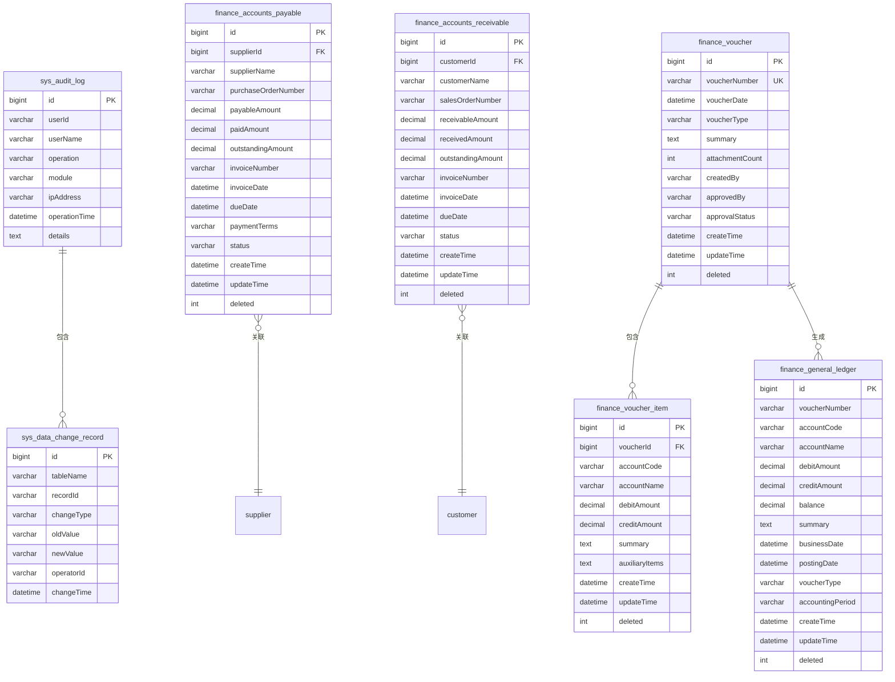

# 数据模型

<cite>
**本文档引用的文件**  
- [AuditLog.java](file://08-backend/src/main/java/com/enterprise/brain/modules/system/audit/entity/AuditLog.java)
- [DataChangeRecord.java](file://08-backend/src/main/java/com/enterprise/brain/modules/system/audit/entity/DataChangeRecord.java)
- [OperationTrace.java](file://08-backend/src/main/java/com/enterprise/brain/modules/system/audit/entity/OperationTrace.java)
- [GeneralLedger.java](file://08-backend/src/main/java/com/enterprise/brain/modules/finance/entity/GeneralLedger.java)
- [AccountsPayable.java](file://08-backend/src/main/java/com/enterprise/brain/modules/finance/entity/AccountsPayable.java)
- [AccountsReceivable.java](file://08-backend/src/main/java/com/enterprise/brain/modules/finance/entity/AccountsReceivable.java)
- [Voucher.java](file://08-backend/src/main/java/com/enterprise/brain/modules/finance/entity/Voucher.java)
- [VoucherItem.java](file://08-backend/src/main/java/com/enterprise/brain/modules/finance/entity/VoucherItem.java)
- [AuditLogMapper.xml](file://08-backend/src/main/resources/mapper/system/audit/AuditLogMapper.xml)
- [application.yml](file://08-backend/src/main/resources/application.yml)
</cite>

## 目录
1. [引言](#引言)
2. [核心业务实体](#核心业务实体)
3. [实体关系与数据库约束](#实体关系与数据库约束)
4. [对象关系映射(ORM)实现](#对象关系映射orm实现)
5. [ER图与表结构](#er图与表结构)
6. [数据生命周期管理](#数据生命周期管理)
7. [数据完整性与业务规则](#数据完整性与业务规则)

## 引言
本文档详细解析企业智能系统中的核心数据模型，重点关注审计日志、总账、应付账款等关键业务实体的字段定义、数据类型和业务含义。文档深入分析实体间的关联关系、数据库约束以及对象关系映射(ORM)的实现细节，并提供ER图展示主要表结构及其关联。同时，文档涵盖数据生命周期管理策略、数据完整性约束和业务规则验证机制。

## 核心业务实体

### 审计日志(AuditLog)
审计日志实体用于记录系统中所有关键操作的审计信息，确保操作的可追溯性和安全性。

**字段定义：**
- **id**: 主键ID，自增长整型，唯一标识每条审计记录
- **userId**: 用户ID，字符串类型，记录执行操作的用户标识
- **userName**: 用户名称，字符串类型，记录执行操作的用户名
- **operation**: 操作类型，字符串类型，如"创建"、"更新"、"删除"等
- **module**: 模块名称，字符串类型，标识操作所属的业务模块
- **ipAddress**: IP地址，字符串类型，记录操作来源的IP地址
- **operationTime**: 操作时间，LocalDateTime类型，记录操作发生的具体时间
- **details**: 详细信息，字符串类型，包含操作的详细描述或参数

**业务含义：**
审计日志是系统安全和合规性的核心组件，用于追踪所有敏感操作，支持故障排查、安全审计和责任追溯。

### 数据变更记录(DataChangeRecord)
数据变更记录实体用于跟踪系统中关键数据的变更历史，提供数据变更的完整审计轨迹。

**字段定义：**
- **id**: 主键ID，自增长整型，唯一标识每条变更记录
- **tableName**: 表名，字符串类型，记录被变更数据所属的数据库表
- **recordId**: 记录ID，字符串类型，标识被变更的具体记录
- **changeType**: 变更类型，字符串类型，如"INSERT"、"UPDATE"、"DELETE"
- **oldValue**: 旧值，字符串类型，记录变更前的数据内容
- **newValue**: 新值，字符串类型，记录变更后的数据内容
- **operatorId**: 操作人ID，字符串类型，记录执行变更的用户标识
- **changeTime**: 变更时间，LocalDateTime类型，记录变更发生的具体时间

**业务含义：**
数据变更记录提供了数据变更的完整历史，支持数据恢复、变更追踪和合规性审计，是数据治理的重要组成部分。

### 总账(GeneralLedger)
总账实体是财务系统的核心，记录企业所有会计科目的借贷发生额和余额信息。

**字段定义：**
- **id**: 主键ID，自增长整型，唯一标识每条总账记录
- **voucherNumber**: 凭证编号，字符串类型，关联的会计凭证编号
- **accountCode**: 会计科目代码，字符串类型，标识会计科目
- **accountName**: 会计科目名称，字符串类型，会计科目的中文名称
- **debitAmount**: 借方金额，BigDecimal类型，记录借方发生额
- **creditAmount**: 贷方金额，BigDecimal类型，记录贷方发生额
- **balance**: 余额，BigDecimal类型，记录当前余额
- **summary**: 摘要，字符串类型，记录业务摘要信息
- **businessDate**: 业务日期，LocalDateTime类型，记录业务发生的日期
- **postingDate**: 记账日期，LocalDateTime类型，记录记账的日期
- **voucherType**: 凭证类型，字符串类型，如"收款凭证"、"付款凭证"等
- **accountingPeriod**: 会计期间，字符串类型，如"2023-01"
- **createTime**: 创建时间，LocalDateTime类型，记录数据创建时间
- **updateTime**: 更新时间，LocalDateTime类型，记录数据最后更新时间
- **deleted**: 删除标识，整型，逻辑删除标记(0:未删除, 1:已删除)

**业务含义：**
总账是财务核算的基础，用于记录企业所有经济业务的会计信息，支持财务报表生成、财务分析和审计。

### 应付账款(AccountsPayable)
应付账款实体用于管理企业对供应商的付款义务，跟踪采购相关的财务往来。

**字段定义：**
- **id**: 主键ID，自增长整型，唯一标识每条应付账款记录
- **supplierId**: 供应商ID，长整型，关联的供应商标识
- **supplierName**: 供应商名称，字符串类型，供应商的中文名称
- **purchaseOrderNumber**: 采购订单编号，字符串类型，关联的采购订单
- **payableAmount**: 应付金额，BigDecimal类型，总应付金额
- **paidAmount**: 已付金额，BigDecimal类型，已支付的金额
- **outstandingAmount**: 未付金额，BigDecimal类型，剩余未支付金额
- **invoiceNumber**: 发票编号，字符串类型，关联的发票编号
- **invoiceDate**: 发票日期，LocalDateTime类型，发票开具日期
- **dueDate**: 到期日期，LocalDateTime类型，付款到期日
- **paymentTerms**: 付款条件，字符串类型，如"30天付款"
- **status**: 状态，字符串类型，如"待付款"、"部分付款"、"已结清"
- **createTime**: 创建时间，LocalDateTime类型，记录数据创建时间
- **updateTime**: 更新时间，LocalDateTime类型，记录数据最后更新时间
- **deleted**: 删除标识，整型，逻辑删除标记(0:未删除, 1:已删除)

**业务含义：**
应付账款管理企业对供应商的债务，支持采购付款计划、现金流预测和供应商关系管理。

### 应收账款(AccountsReceivable)
应收账款实体用于管理企业对客户的收款权利，跟踪销售相关的财务往来。

**字段定义：**
- **id**: 主键ID，自增长整型，唯一标识每条应收账款记录
- **customerId**: 客户ID，长整型，关联的客户标识
- **customerName**: 客户名称，字符串类型，客户的中文名称
- **salesOrderNumber**: 销售订单编号，字符串类型，关联的销售订单
- **receivableAmount**: 应收金额，BigDecimal类型，总应收金额
- **receivedAmount**: 已收金额，BigDecimal类型，已收到的金额
- **outstandingAmount**: 未收金额，BigDecimal类型，剩余未收金额
- **invoiceNumber**: 发票编号，字符串类型，关联的发票编号
- **invoiceDate**: 发票日期，LocalDateTime类型，发票开具日期
- **dueDate**: 到期日期，LocalDateTime类型，收款到期日
- **status**: 状态，字符串类型，如"待收款"、"部分收款"、"已结清"
- **createTime**: 创建时间，LocalDateTime类型，记录数据创建时间
- **updateTime**: 更新时间，LocalDateTime类型，记录数据最后更新时间
- **deleted**: 删除标识，整型，逻辑删除标记(0:未删除, 1:已删除)

**业务含义：**
应收账款管理企业对客户的债权，支持销售回款跟踪、现金流预测和客户信用管理。

### 凭证(Voucher)
凭证实体是财务核算的基本单位，记录单笔经济业务的完整会计信息。

**字段定义：**
- **id**: 主键ID，自增长整型，唯一标识每张凭证
- **voucherNumber**: 凭证编号，字符串类型，凭证的唯一编号
- **voucherDate**: 凭证日期，LocalDateTime类型，凭证编制日期
- **voucherType**: 凭证类型，字符串类型，如"收款凭证"、"付款凭证"、"转账凭证"
- **summary**: 摘要，字符串类型，业务摘要信息
- **attachmentCount**: 附件数量，整型，关联的附件数量
- **createdBy**: 制单人，字符串类型，编制凭证的用户
- **approvedBy**: 审核人，字符串类型，审核凭证的用户
- **approvalStatus**: 审核状态，字符串类型，如"待审核"、"已审核"、"已驳回"
- **createTime**: 创建时间，LocalDateTime类型，记录数据创建时间
- **updateTime**: 更新时间，LocalDateTime类型，记录数据最后更新时间
- **deleted**: 删除标识，整型，逻辑删除标记(0:未删除, 1:已删除)

**业务含义：**
凭证是财务核算的原始依据，每张凭证记录一笔完整的经济业务，支持财务审计和合规性检查。

### 凭证明细(VoucherItem)
凭证明细实体是凭证的组成部分，记录凭证中每个会计科目的具体借贷信息。

**字段定义：**
- **id**: 主键ID，自增长整型，唯一标识每条凭证明细
- **voucherId**: 凭证ID，长整型，关联的凭证标识
- **accountCode**: 会计科目代码，字符串类型，标识会计科目
- **accountName**: 会计科目名称，字符串类型，会计科目的中文名称
- **debitAmount**: 借方金额，BigDecimal类型，记录借方发生额
- **creditAmount**: 贷方金额，BigDecimal类型，记录贷方发生额
- **summary**: 摘要，字符串类型，业务摘要信息
- **auxiliaryItems**: 辅助核算项，字符串类型，如部门、项目、客户等辅助核算信息
- **createTime**: 创建时间，LocalDateTime类型，记录数据创建时间
- **updateTime**: 更新时间，LocalDateTime类型，记录数据最后更新时间
- **deleted**: 删除标识，整型，逻辑删除标记(0:未删除, 1:已删除)

**业务含义：**
凭证明细提供了凭证的详细构成，支持精细化的财务核算和多维度的财务分析。

**Section sources**
- [AuditLog.java](file://08-backend/src/main/java/com/enterprise/brain/modules/system/audit/entity/AuditLog.java)
- [DataChangeRecord.java](file://08-backend/src/main/java/com/enterprise/brain/modules/system/audit/entity/DataChangeRecord.java)
- [GeneralLedger.java](file://08-backend/src/main/java/com/enterprise/brain/modules/finance/entity/GeneralLedger.java)
- [AccountsPayable.java](file://08-backend/src/main/java/com/enterprise/brain/modules/finance/entity/AccountsPayable.java)
- [AccountsReceivable.java](file://08-backend/src/main/java/com/enterprise/brain/modules/finance/entity/AccountsReceivable.java)
- [Voucher.java](file://08-backend/src/main/java/com/enterprise/brain/modules/finance/entity/Voucher.java)
- [VoucherItem.java](file://08-backend/src/main/java/com/enterprise/brain/modules/finance/entity/VoucherItem.java)

## 实体关系与数据库约束

### 实体关联关系
系统中的核心业务实体通过多种关联关系相互连接，形成完整的业务数据模型。

**一对一关系：**
- **凭证(Voucher)与总账(GeneralLedger)**：每张凭证对应一条或多条总账记录，但每条总账记录只属于一张凭证。这种关系通过凭证编号(voucherNumber)字段建立关联。
- **凭证(Voucher)与凭证明细(VoucherItem)**：每张凭证包含多条凭证明细，但每条凭证明细只属于一张凭证。这种关系通过凭证ID(voucherId)外键建立关联。

**一对多关系：**
- **供应商(Supplier)与应付账款(AccountsPayable)**：一个供应商可以有多个应付账款记录，但每个应付账款记录只属于一个供应商。这种关系通过供应商ID(supplierId)外键建立关联。
- **客户(Customer)与应收账款(AccountsReceivable)**：一个客户可以有多个应收账款记录，但每个应收账款记录只属于一个客户。这种关系通过客户ID(customerId)外键建立关联。
- **会计科目(Account)与总账(GeneralLedger)**：一个会计科目可以有多个总账记录，但每个总账记录只属于一个会计科目。这种关系通过会计科目代码(accountCode)字段建立关联。

**多对多关系：**
- **用户(User)与审计日志(AuditLog)**：一个用户可以产生多条审计日志，而审计日志中的操作可能涉及多个用户（如审批流程）。这种关系通过用户ID(userId)字段建立关联。
- **业务模块(Module)与审计日志(AuditLog)**：一个业务模块可以产生多条审计日志，而一条审计日志只属于一个业务模块。这种关系通过模块名称(module)字段建立关联。

### 数据库约束
数据库通过多种约束机制确保数据的完整性和一致性。

**主键约束：**
所有核心实体表都定义了主键约束，使用自增ID作为主键：
- `sys_audit_log` 表的 `id` 字段为主键
- `sys_data_change_record` 表的 `id` 字段为主键
- `finance_general_ledger` 表的 `id` 字段为主键
- `finance_accounts_payable` 表的 `id` 字段为主键
- `finance_accounts_receivable` 表的 `id` 字段为主键
- `finance_voucher` 表的 `id` 字段为主键
- `finance_voucher_item` 表的 `id` 字段为主键

**外键约束：**
系统通过外键约束维护实体间的引用完整性：
- `finance_voucher_item` 表的 `voucher_id` 字段引用 `finance_voucher` 表的 `id` 字段
- `finance_accounts_payable` 表的 `supplier_id` 字段引用供应商表的主键
- `finance_accounts_receivable` 表的 `customer_id` 字段引用客户表的主键

**唯一约束：**
为确保关键字段的唯一性，系统定义了以下唯一约束：
- `finance_voucher` 表的 `voucher_number` 字段具有唯一性约束，确保凭证编号不重复
- `finance_general_ledger` 表的 `voucher_number` 和 `account_code` 组合具有业务唯一性，防止重复记账

**非空约束：**
关键业务字段定义了非空约束，确保数据完整性：
- 所有实体的 `id` 字段为非空
- `AuditLog` 的 `userId`、`operation`、`module`、`operationTime` 字段为非空
- `GeneralLedger` 的 `voucherNumber`、`accountCode`、`accountName`、`businessDate` 字段为非空
- `AccountsPayable` 的 `supplierId`、`payableAmount`、`invoiceDate`、`dueDate` 字段为非空

**检查约束：**
系统通过检查约束确保数据的业务合理性：
- `AccountsPayable` 表中 `paidAmount` ≤ `payableAmount`，确保已付金额不超过应付金额
- `AccountsReceivable` 表中 `receivedAmount` ≤ `receivableAmount`，确保已收金额不超过应收金额
- `GeneralLedger` 表中 `debitAmount` 和 `creditAmount` 至少有一个大于0，确保记账金额有效

**Section sources**
- [GeneralLedger.java](file://08-backend/src/main/java/com/enterprise/brain/modules/finance/entity/GeneralLedger.java)
- [AccountsPayable.java](file://08-backend/src/main/java/com/enterprise/brain/modules/finance/entity/AccountsPayable.java)
- [AccountsReceivable.java](file://08-backend/src/main/java/com/enterprise/brain/modules/finance/entity/AccountsReceivable.java)
- [Voucher.java](file://08-backend/src/main/java/com/enterprise/brain/modules/finance/entity/Voucher.java)
- [VoucherItem.java](file://08-backend/src/main/java/com/enterprise/brain/modules/finance/entity/VoucherItem.java)

## 对象关系映射(ORM)实现

### MyBatis映射配置
系统使用MyBatis作为ORM框架，通过XML映射文件和注解方式实现Java对象与数据库表的映射。

**实体类注解：**
所有实体类使用MyBatis-Plus注解进行表映射配置：
- `@TableName` 注解指定实体类对应的数据库表名
- `@TableId` 注解标识主键字段，并配置自增策略
- `@TableField` 注解映射字段名，支持字段名与属性名不一致的情况
- `@TableLogic` 注解实现逻辑删除功能，将物理删除转换为状态更新

```java
@TableName("sys_audit_log")
public class AuditLog {
    @TableId(type = IdType.AUTO)
    private Long id;
    
    @TableField("user_id")
    private String userId;
    
    @TableField("operation_time")
    private LocalDateTime operationTime;
}
```

### AuditLogMapper.xml详解
`AuditLogMapper.xml` 文件定义了审计日志的自定义查询语句，展示了MyBatis XML映射的实现细节。

```xml
<mapper namespace="com.enterprise.brain.modules.system.audit.repository.AuditLogRepository">
    <!-- 根据模块查询审计日志 -->
    <select id="selectByModule" resultType="com.enterprise.brain.modules.system.audit.entity.AuditLog">
        SELECT * FROM sys_audit_log WHERE module = #{module}
    </select>
</mapper>
```

**映射文件解析：**
- **namespace**: 指定Mapper接口的全限定名，建立XML文件与Java接口的关联
- **select元素**: 定义查询语句，`id`属性对应Mapper接口中的方法名
- **resultType**: 指定查询结果映射的Java实体类
- **参数绑定**: 使用`#{module}`语法实现参数绑定，防止SQL注入
- **SQL语句**: 标准的SELECT查询，从`sys_audit_log`表中根据模块名称查询记录

**ORM实现优势：**
1. **灵活性**: XML映射文件支持复杂的SQL查询，便于实现分页、多表关联等复杂查询
2. **可维护性**: SQL语句与Java代码分离，便于数据库优化和维护
3. **类型安全**: 通过resultType指定返回类型，确保类型安全
4. **性能优化**: 支持自定义SQL，便于进行数据库性能优化

### 动态SQL支持
MyBatis支持动态SQL，允许根据条件构建不同的查询语句。虽然当前`AuditLogMapper.xml`只包含简单查询，但系统设计支持更复杂的动态查询：

```xml
<select id="selectByConditions" resultType="AuditLog">
    SELECT * FROM sys_audit_log
    <where>
        <if test="module != null">
            AND module = #{module}
        </if>
        <if test="startTime != null">
            AND operation_time >= #{startTime}
        </if>
        <if test="endTime != null">
            AND operation_time &lt;= #{endTime}
        </if>
    </where>
    ORDER BY operation_time DESC
</select>
```

这种动态SQL机制支持构建灵活的查询条件，满足不同场景的查询需求。

**Section sources**
- [AuditLogMapper.xml](file://08-backend/src/main/resources/mapper/system/audit/AuditLogMapper.xml)
- [AuditLog.java](file://08-backend/src/main/java/com/enterprise/brain/modules/system/audit/entity/AuditLog.java)

## ER图与表结构



**Diagram sources**
- [AuditLog.java](file://08-backend/src/main/java/com/enterprise/brain/modules/system/audit/entity/AuditLog.java)
- [DataChangeRecord.java](file://08-backend/src/main/java/com/enterprise/brain/modules/system/audit/entity/DataChangeRecord.java)
- [GeneralLedger.java](file://08-backend/src/main/java/com/enterprise/brain/modules/finance/entity/GeneralLedger.java)
- [AccountsPayable.java](file://08-backend/src/main/java/com/enterprise/brain/modules/finance/entity/AccountsPayable.java)
- [AccountsReceivable.java](file://08-backend/src/main/java/com/enterprise/brain/modules/finance/entity/AccountsReceivable.java)
- [Voucher.java](file://08-backend/src/main/java/com/enterprise/brain/modules/finance/entity/Voucher.java)
- [VoucherItem.java](file://08-backend/src/main/java/com/enterprise/brain/modules/finance/entity/VoucherItem.java)

### 关键索引与性能优化
为提高查询性能，系统在关键字段上创建了适当的索引：

**单列索引：**
- `sys_audit_log` 表的 `module` 字段索引，加速按模块查询审计日志
- `sys_audit_log` 表的 `operationTime` 字段索引，加速按时间范围查询
- `finance_general_ledger` 表的 `accountCode` 字段索引，加速按会计科目查询
- `finance_general_ledger` 表的 `businessDate` 字段索引，加速按业务日期查询
- `finance_accounts_payable` 表的 `supplierId` 字段索引，加速按供应商查询
- `finance_accounts_receivable` 表的 `customerId` 字段索引，加速按客户查询

**复合索引：**
- `finance_general_ledger` 表的 `(accountCode, businessDate)` 复合索引，支持按会计科目和时间范围的联合查询
- `finance_accounts_payable` 表的 `(supplierId, status)` 复合索引，支持按供应商和状态的联合查询
- `finance_accounts_receivable` 表的 `(customerId, dueDate)` 复合索引，支持按客户和到期日的联合查询

**唯一索引：**
- `finance_voucher` 表的 `voucherNumber` 字段唯一索引，确保凭证编号的唯一性
- `finance_general_ledger` 表的 `(voucherNumber, accountCode)` 业务唯一索引，防止重复记账

**性能优化策略：**
1. **分区表**: 对于审计日志等大数据量表，建议按时间分区，提高查询性能
2. **读写分离**: 对于高并发场景，建议配置读写分离，将查询请求分发到只读副本
3. **缓存机制**: 对于频繁查询但不常变更的数据，如会计科目，建议使用Redis缓存
4. **查询优化**: 避免SELECT *，只查询需要的字段；合理使用分页，避免一次性查询大量数据

## 数据生命周期管理

### 审计日志保留策略
审计日志作为系统安全和合规性的关键数据，采用分级保留策略：

**保留周期：**
- **在线保留**: 180天，存储在主数据库中，支持实时查询和分析
- **归档保留**: 5年，从主数据库归档到专用的归档存储，支持合规性审计
- **永久保留**: 关键安全事件（如登录失败、权限变更）永久保留，满足长期合规要求

**归档机制：**
系统定期执行归档任务，将超过180天的审计日志从`sys_audit_log`表移动到`sys_audit_log_archive`表。归档过程包括：
1. 按时间范围查询需要归档的记录
2. 将记录插入归档表
3. 验证数据完整性
4. 从原表删除已归档记录

**清理策略：**
为控制存储成本，系统实施自动清理策略：
- 每月执行一次清理任务
- 删除超过180天且已成功归档的记录
- 记录清理日志，确保操作可追溯

### 财务数据归档规则
财务数据作为企业核心资产，采用严格的归档和保留规则：

**会计年度归档：**
- 每个会计年度结束后，将该年度的财务数据归档
- 归档范围包括总账、凭证、应付账款、应收账款等所有财务数据
- 归档数据存储在专用的财务归档数据库中

**归档流程：**
1. **准备阶段**: 检查数据完整性，确保所有业务已结账
2. **冻结阶段**: 设置数据为只读状态，防止修改
3. **归档阶段**: 将数据从生产库复制到归档库
4. **验证阶段**: 核对归档数据的完整性和准确性
5. **清理阶段**: 在生产库中将归档数据标记为归档状态

**保留期限：**
根据财务法规要求，财务数据保留期限如下：
- **法定最低期限**: 7年，满足税务和审计要求
- **建议保留期限**: 10年，支持长期财务分析
- **特殊数据**: 上市公司财务报表永久保留

**数据恢复：**
归档数据支持按需恢复，恢复流程包括：
- 提交数据恢复申请
- 审批通过后，从归档存储恢复数据
- 恢复数据到指定的恢复环境
- 验证恢复数据的完整性和准确性

**Section sources**
- [application.yml](file://08-backend/src/main/resources/application.yml)

## 数据完整性与业务规则

### 数据完整性约束
系统通过多层次的约束机制确保数据的完整性和一致性：

**数据库层约束：**
- **主键约束**: 确保每条记录的唯一性
- **外键约束**: 维护实体间的引用完整性
- **唯一约束**: 防止关键字段重复
- **非空约束**: 确保关键字段有值
- **检查约束**: 验证数据的业务合理性

**应用层验证：**
在业务逻辑层实施更复杂的验证规则：
- **金额验证**: 借方金额和贷方金额不能同时为0
- **余额验证**: 总账余额必须等于期初余额加本期发生额
- **日期验证**: 业务日期不能晚于当前日期
- **状态转换验证**: 付款状态只能按预设流程转换

### 业务规则验证机制
系统实现了一套完整的业务规则验证机制，确保业务操作的合规性：

**凭证平衡规则：**
每张凭证必须满足借贷平衡原则：
- 所有凭证明细的借方金额总和等于贷方金额总和
- 系统在保存凭证时自动验证此规则
- 不平衡的凭证无法保存

**付款规则：**
应付账款付款需遵守以下规则：
- 付款金额不能超过未付金额
- 付款日期不能早于发票日期
- 付款后更新应付账款的已付金额和未付金额
- 当未付金额为0时，自动更新状态为"已结清"

**信用控制规则：**
应收账款管理实施信用控制：
- 新销售订单需检查客户信用额度
- 应收账款余额不能超过信用额度
- 超过信用额度的订单需特殊审批

**审批流程规则：**
关键财务操作需经过审批流程：
- 大额付款需多级审批
- 凭证修改需原制单人和审核人共同确认
- 审批流程支持并行审批和串行审批

**数据变更审计：**
所有数据变更都需记录变更历史：
- 变更前后的值都需记录
- 变更人和变更时间需记录
- 变更原因需提供说明
- 关键数据变更需经过审批

**Section sources**
- [GeneralLedger.java](file://08-backend/src/main/java/com/enterprise/brain/modules/finance/entity/GeneralLedger.java)
- [AccountsPayable.java](file://08-backend/src/main/java/com/enterprise/brain/modules/finance/entity/AccountsPayable.java)
- [AccountsReceivable.java](file://08-backend/src/main/java/com/enterprise/brain/modules/finance/entity/AccountsReceivable.java)