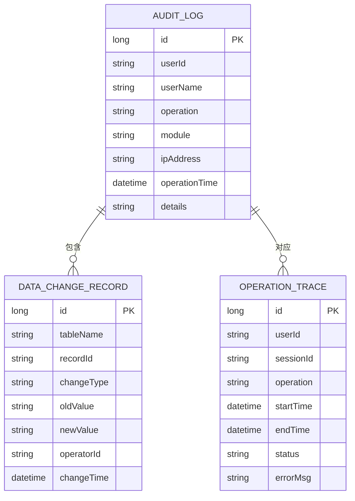
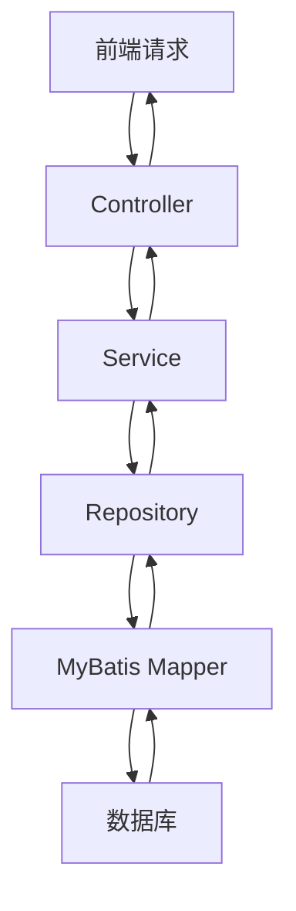

# 系统审计数据模型

<cite>
**本文档引用文件**   
- [AuditLog.java](file://08-backend/src/main/java/com/enterprise/brain/modules/system/audit/entity/AuditLog.java)
- [DataChangeRecord.java](file://08-backend/src/main/java/com/enterprise/brain/modules/system/audit/entity/DataChangeRecord.java)
- [OperationTrace.java](file://08-backend/src/main/java/com/enterprise/brain/modules/system/audit/entity/OperationTrace.java)
- [AuditLogMapper.xml](file://08-backend/src/main/resources/mapper/system/audit/AuditLogMapper.xml)
- [DataChangeQueryRequest.java](file://08-backend/src/main/java/com/enterprise/brain/modules/system/audit/dto/request/DataChangeQueryRequest.java)
- [DataChangeResponse.java](file://08-backend/src/main/java/com/enterprise/brain/modules/system/audit/dto/response/DataChangeResponse.java)
- [AuditLogResponse.java](file://08-backend/src/main/java/com/enterprise/brain/modules/system/audit/dto/response/AuditLogResponse.java)
- [AuditLogList.vue](file://07-frontend/src/pages/system/audit-management/AuditLogList.vue)
- [DataChangeList.vue](file://07-frontend/src/pages/system/audit-management/DataChangeList.vue)
- [OperationTrace.vue](file://07-frontend/src/pages/system/audit-management/OperationTrace.vue)
</cite>

## 目录
1. [引言](#引言)
2. [核心实体模型](#核心实体模型)
3. [AuditLog 操作审计日志](#auditlog-操作审计日志)
4. [DataChangeRecord 数据变更记录](#datachangerecord-数据变更记录)
5. [OperationTrace 操作追踪](#operationtrace-操作追踪)
6. [实体关系与ER图](#实体关系与er图)
7. [数据查询接口设计](#数据查询接口设计)
8. [MyBatis映射配置](#mybatis映射配置)
9. [前端组件集成](#前端组件集成)

## 引言
本系统审计数据模型文档详细解析了三个核心审计实体：AuditLog（操作审计日志）、DataChangeRecord（数据变更记录）和OperationTrace（操作追踪）。这些实体共同构成了企业级系统的完整审计体系，分别负责记录用户操作行为、数据变更详情和系统性能轨迹。通过这三个维度的审计数据，系统能够实现全面的操作追溯、数据变更追踪和性能分析能力。

## 核心实体模型
系统审计模块由三个核心实体构成，每个实体都有明确的职责边界和数据结构设计。AuditLog记录用户在系统中的所有操作行为，包括操作内容、操作模块、操作时间等关键信息；DataChangeRecord专注于记录数据层面的变更，通过旧值和新值的对比实现完整的变更追溯；OperationTrace则用于记录操作的性能轨迹，包括开始时间、结束时间和执行状态，为系统性能分析提供数据支持。

**Section sources**
- [AuditLog.java](file://08-backend/src/main/java/com/enterprise/brain/modules/system/audit/entity/AuditLog.java)
- [DataChangeRecord.java](file://08-backend/src/main/java/com/enterprise/brain/modules/system/audit/entity/DataChangeRecord.java)
- [OperationTrace.java](file://08-backend/src/main/java/com/enterprise/brain/modules/system/audit/entity/OperationTrace.java)

## AuditLog 操作审计日志

### 实体结构与字段说明
AuditLog实体是系统操作审计的核心，记录了用户在系统中的所有关键操作。该实体通过多个字段全面描述操作的上下文信息：

- **id**: 主键，自增长类型，唯一标识每条审计日志
- **userId**: 操作用户ID，标识执行操作的用户
- **userName**: 操作用户名，记录用户的显示名称
- **operation**: 操作内容，描述具体执行的操作，如"创建用户"、"修改配置"等
- **module**: 操作模块，标识操作所属的功能模块，如"用户管理"、"权限配置"等
- **ipAddress**: IP地址，记录执行操作的客户端IP地址
- **operationTime**: 操作时间，记录操作发生的具体时间戳
- **details**: 操作详情，以JSON格式存储操作的详细参数和上下文信息

其中，operation和module字段是审计分析的关键维度，通过这两个字段的组合可以精确识别操作类型和所属功能域。operationTime字段采用LocalDateTime类型，确保时间记录的精度和时区正确性。

### 业务含义与应用场景
AuditLog主要用于安全审计和操作追溯，当系统发生异常或需要审查用户行为时，可以通过该日志快速定位相关操作。例如，在用户权限被异常修改的场景中，可以通过查询AuditLog中"权限管理"模块的"修改权限"操作，结合操作时间和操作人信息，快速确定问题根源。details字段存储的JSON格式详情支持复杂数据结构的记录，能够完整保存操作时的请求参数和状态信息。

**Section sources**
- [AuditLog.java](file://08-backend/src/main/java/com/enterprise/brain/modules/system/audit/entity/AuditLog.java)
- [AuditLogResponse.java](file://08-backend/src/main/java/com/enterprise/brain/modules/system/audit/dto/response/AuditLogResponse.java)
- [AuditLogList.vue](file://07-frontend/src/pages/system/audit-management/AuditLogList.vue)

## DataChangeRecord 数据变更记录

### 实体结构与字段说明
DataChangeRecord实体专门用于记录系统中关键数据的变更历史，通过对比变更前后的值实现完整的数据追溯。其核心字段包括：

- **id**: 主键，自增长类型，唯一标识每条变更记录
- **tableName**: 表名，标识发生变更的数据表
- **recordId**: 记录ID，标识具体被修改的数据记录
- **changeType**: 变更类型，标识变更操作的类型，如"INSERT"、"UPDATE"、"DELETE"
- **oldValue**: 旧值，记录变更前的数据内容，以JSON字符串形式存储
- **newValue**: 新值，记录变更后的数据内容，以JSON字符串形式存储
- **operatorId**: 操作人ID，标识执行变更操作的用户
- **changeTime**: 变更时间，记录变更发生的具体时间

### 变更追溯机制
DataChangeRecord的核心价值在于oldValue和newValue字段的设计，这两个字段以JSON格式存储变更前后的完整数据对象，使得系统能够精确还原数据在任何时间点的状态。当需要追溯某条记录的历史变更时，系统可以按changeTime排序获取该记录的所有变更历史，通过逐条应用oldValue到newValue的变更，重建完整的数据演变过程。

这种设计特别适用于需要严格数据审计的场景，如财务系统中的账目变更、医疗系统中的病历修改等。通过对比oldValue和newValue，审计人员可以清晰地看到哪些字段被修改、修改前后的具体值是什么，从而确保数据变更的透明性和可追溯性。

**Section sources**
- [DataChangeRecord.java](file://08-backend/src/main/java/com/enterprise/brain/modules/system/audit/entity/DataChangeRecord.java)
- [DataChangeResponse.java](file://08-backend/src/main/java/com/enterprise/brain/modules/system/audit/dto/response/DataChangeResponse.java)
- [DataChangeList.vue](file://07-frontend/src/pages/system/audit-management/DataChangeList.vue)

## OperationTrace 操作追踪

### 实体结构与字段说明
OperationTrace实体用于记录系统操作的性能轨迹，为系统性能分析和故障排查提供数据支持。其主要字段包括：

- **id**: 主键，自增长类型，唯一标识每条操作追踪记录
- **userId**: 用户ID，标识执行操作的用户
- **sessionId**: 会话ID，标识用户会话，用于关联同一会话中的多个操作
- **operation**: 操作名称，描述被追踪的具体操作
- **startTime**: 开始时间，记录操作开始执行的时间戳
- **endTime**: 结束时间，记录操作执行完成的时间戳
- **status**: 状态，标识操作执行结果，如"SUCCESS"、"FAIL"
- **errorMsg**: 错误信息，当操作失败时记录具体的错误详情

### 性能分析应用
OperationTrace通过记录操作的开始和结束时间，可以精确计算操作的执行耗时（endTime - startTime），为系统性能监控提供基础数据。系统可以通过分析OperationTrace数据，识别执行时间过长的操作，发现性能瓶颈。例如，可以设置阈值，当某个操作的执行时间超过预设值时触发告警，提醒运维人员关注。

此外，status和errorMsg字段提供了操作执行结果的完整视图。通过统计不同状态的操作比例，可以评估系统稳定性；通过分析错误信息，可以快速定位和解决系统故障。sessionId字段的设计使得系统能够追踪用户会话中的操作序列，分析用户行为路径和操作习惯。

**Section sources**
- [OperationTrace.java](file://08-backend/src/main/java/com/enterprise/brain/modules/system/audit/entity/OperationTrace.java)
- [OperationTrace.vue](file://07-frontend/src/pages/system/audit-management/OperationTrace.vue)

## 实体关系与ER图

**Diagram sources**
- [AuditLog.java](file://08-backend/src/main/java/com/enterprise/brain/modules/system/audit/entity/AuditLog.java)
- [DataChangeRecord.java](file://08-backend/src/main/java/com/enterprise/brain/modules/system/audit/entity/DataChangeRecord.java)
- [OperationTrace.java](file://08-backend/src/main/java/com/enterprise/brain/modules/system/audit/entity/OperationTrace.java)

## 数据查询接口设计

### DataChangeQueryRequest 查询请求
DataChangeQueryRequest类定义了数据变更记录的查询条件，支持多维度的精确查询：

- **tableName**: 表名过滤条件，用于查询特定数据表的变更记录
- **recordId**: 记录ID过滤条件，用于查询特定记录的变更历史
- **startTime**: 开始时间范围，查询在此时间之后的变更记录
- **endTime**: 结束时间范围，查询在此时间之前的变更记录
- **pageNum**: 分页页码，默认值为1
- **pageSize**: 分页大小，默认值为10

该查询设计支持灵活的组合查询，用户可以根据需要单独或组合使用这些条件。例如，可以查询某个特定记录在指定时间范围内的所有变更，或者查询某个数据表在最近24小时内的所有变更。

### DataChangeResponse 查询响应
DataChangeResponse类定义了数据变更记录查询的响应结构，与DataChangeRecord实体对应，包含所有必要的字段信息，确保前端能够完整展示变更记录的详细信息。

**Section sources**
- [DataChangeQueryRequest.java](file://08-backend/src/main/java/com/enterprise/brain/modules/system/audit/dto/request/DataChangeQueryRequest.java)
- [DataChangeResponse.java](file://08-backend/src/main/java/com/enterprise/brain/modules/system/audit/dto/response/DataChangeResponse.java)

## MyBatis映射配置

### AuditLogMapper.xml 映射文件
MyBatis映射配置文件AuditLogMapper.xml定义了数据库操作与Java实体之间的映射关系。该文件通过XML配置实现了自定义查询逻辑，其中定义了selectByModule查询方法，可以根据操作模块查询审计日志。

映射配置将数据库表sys_audit_log的字段与AuditLog实体的属性自动对应，MyBatis框架负责处理数据库记录到Java对象的转换。对于复杂查询，可以通过XML配置SQL语句，实现灵活的数据检索逻辑。

**Diagram sources**
- [AuditLogMapper.xml](file://08-backend/src/main/resources/mapper/system/audit/AuditLogMapper.xml)
- [AuditLogRepository.java](file://08-backend/src/main/java/com/enterprise/brain/modules/system/audit/repository/AuditLogRepository.java)

**Section sources**
- [AuditLogMapper.xml](file://08-backend/src/main/resources/mapper/system/audit/AuditLogMapper.xml)

## 前端组件集成

### 审计日志前端展示
前端通过AuditLogList.vue组件展示审计日志列表，提供用户友好的查询界面。组件包含操作人、操作模块和时间范围等查询条件，支持分页显示和详情查看功能。通过el-popover组件实现操作详情的悬浮展示，提升用户体验。

### 数据变更记录前端展示
DataChangeList.vue组件用于展示数据变更记录，提供表名、记录ID和时间范围等查询条件。组件通过表格形式展示变更记录的关键信息，并支持点击查看详情，查看变更前后的完整数据对比。

### 操作追踪前端展示
OperationTrace.vue组件展示操作追踪信息，提供用户ID、会话ID、操作状态和时间范围等查询条件。通过表格展示操作的执行时间、状态和错误信息，帮助运维人员快速识别系统性能问题和故障。

**Section sources**
- [AuditLogList.vue](file://07-frontend/src/pages/system/audit-management/AuditLogList.vue)
- [DataChangeList.vue](file://07-frontend/src/pages/system/audit-management/DataChangeList.vue)
- [OperationTrace.vue](file://07-frontend/src/pages/system/audit-management/OperationTrace.vue)