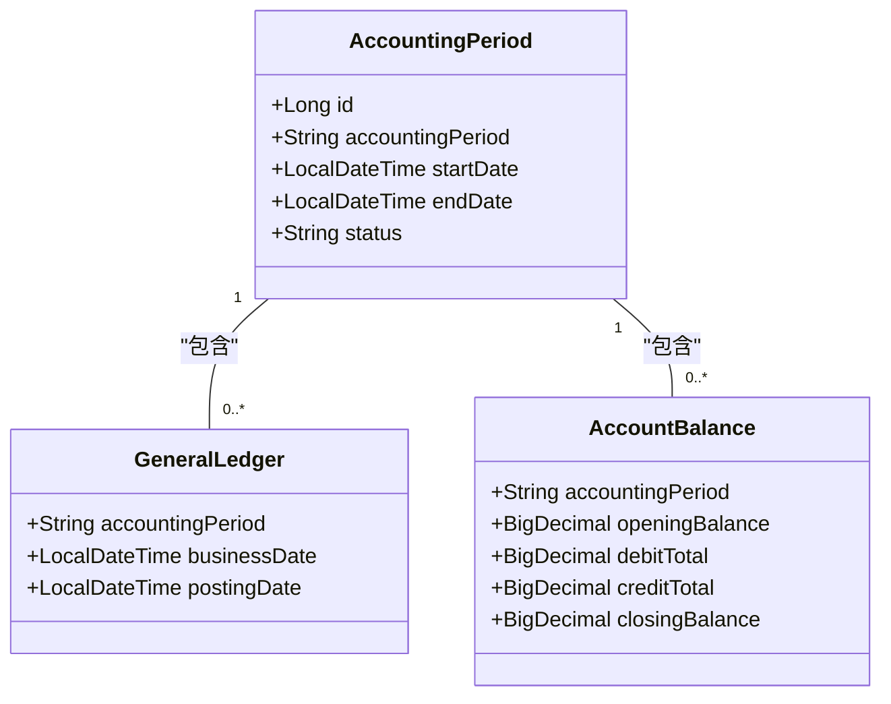
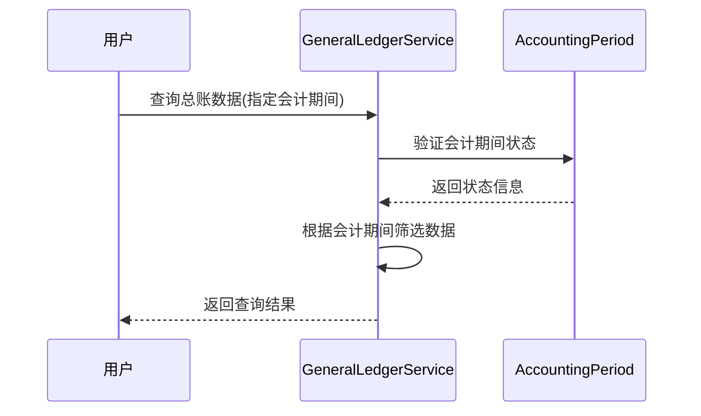

# 会计期间数据模型

<cite>
**本文档中引用的文件**   
- [AccountingPeriod.java](file://08-backend/src/main/java/com/enterprise/brain/modules/finance/entity/AccountingPeriod.java)
- [GeneralLedger.java](file://08-backend/src/main/java/com/enterprise/brain/modules/finance/entity/GeneralLedger.java)
- [AccountBalance.java](file://08-backend/src/main/java/com/enterprise/brain/modules/finance/entity/AccountBalance.java)
- [GeneralLedgerQueryRequest.java](file://08-backend/src/main/java/com/enterprise/brain/modules/finance/dto/request/GeneralLedgerQueryRequest.java)
- [VoucherQueryRequest.java](file://08-backend/src/main/java/com/enterprise/brain/modules/finance/dto/request/VoucherQueryRequest.java)
- [GeneralLedgerServiceImpl.java](file://08-backend/src/main/java/com/enterprise/brain/modules/finance/service/impl/GeneralLedgerServiceImpl.java)
</cite>

## 目录
1. [引言](#引言)
2. [核心数据结构](#核心数据结构)
3. [会计期间与财务实体的关系](#会计期间与财务实体的关系)
4. [关键业务流程中的应用](#关键业务流程中的应用)
5. [时间维度关联分析](#时间维度关联分析)
6. [结论](#结论)

## 引言
会计期间（AccountingPeriod）是企业财务系统中的核心时间维度实体，用于定义财务数据的时间边界和处理规则。该数据模型为总账、账户余额等财务实体提供了统一的时间基准，确保了财务数据的一致性和可追溯性。本文档详细阐述会计期间数据模型的设计与实现，包括其字段定义、状态控制、编码规则以及在关键财务流程中的应用。

## 核心数据结构

会计期间数据模型通过`AccountingPeriod`实体类实现，包含以下关键字段：

- **startDate和endDate字段**：这两个字段定义了一个完整的会计周期的时间范围。`startDate`表示会计期间的开始日期，`endDate`表示会计期间的结束日期，两者共同确定了该期间的有效时间跨度。系统通过这两个字段来验证交易日期是否属于有效的会计期间。

- **status字段**：该字段控制会计期间的可记账状态，包含"OPEN"（开启）和"CLOSED"（关闭）两种状态。当期间状态为"OPEN"时，允许进行记账操作；当状态为"CLOSED"时，禁止任何记账操作，确保已关闭期间的财务数据完整性。

- **accountingPeriod字段**：该字段采用YYYYMM格式的编码规则，如"202312"表示2023年12月。这种编码方式便于数据查询和排序，系统可以通过简单的字符串比较来确定期间的先后顺序。

**Section sources**
- [AccountingPeriod.java](file://08-backend/src/main/java/com/enterprise/brain/modules/finance/entity/AccountingPeriod.java#L24-L38)

## 会计期间与财务实体的关系

会计期间作为时间维度基础，与多个财务实体建立了关联关系：

**Diagram sources **
- [AccountingPeriod.java](file://08-backend/src/main/java/com/enterprise/brain/modules/finance/entity/AccountingPeriod.java#L18-L52)
- [GeneralLedger.java](file://08-backend/src/main/java/com/enterprise/brain/modules/finance/entity/GeneralLedger.java#L65-L67)
- [AccountBalance.java](file://08-backend/src/main/java/com/enterprise/brain/modules/finance/entity/AccountBalance.java#L50-L51)

**Section sources**
- [AccountingPeriod.java](file://08-backend/src/main/java/com/enterprise/brain/modules/finance/entity/AccountingPeriod.java#L18-L52)
- [GeneralLedger.java](file://08-backend/src/main/java/com/enterprise/brain/modules/finance/entity/GeneralLedger.java#L65-L67)
- [AccountBalance.java](file://08-backend/src/main/java/com/enterprise/brain/modules/finance/entity/AccountBalance.java#L50-L51)

## 关键业务流程中的应用

会计期间在系统初始化、期末结账和报表生成等关键流程中发挥着重要作用：

### 系统初始化
在系统初始化阶段，需要创建初始的会计期间配置。系统根据企业设置的会计年度规则，自动生成相应的月度或季度会计期间，并将初始期间的状态设置为"OPEN"，以便进行初始数据录入。

### 期末结账
期末结账流程中，系统会检查当前会计期间的状态。只有当期间状态为"OPEN"时，才能执行结账操作。结账完成后，系统自动将该期间状态更新为"CLOSED"，并创建下一个会计期间，确保财务周期的连续性。

### 报表生成
在报表生成过程中，会计期间的编码规则（YYYYMM）发挥了重要作用。系统可以通过会计期间字段快速筛选和聚合数据，生成月度、季度或年度财务报表。例如，通过查询会计期间以"2023"开头的所有记录，可以生成2023年度的财务报表。

**Diagram sources **
- [GeneralLedgerServiceImpl.java](file://08-backend/src/main/java/com/enterprise/brain/modules/finance/service/impl/GeneralLedgerServiceImpl.java#L66-L108)
- [GeneralLedgerQueryRequest.java](file://08-backend/src/main/java/com/enterprise/brain/modules/finance/dto/request/GeneralLedgerQueryRequest.java#L27-L28)

**Section sources**
- [GeneralLedgerServiceImpl.java](file://08-backend/src/main/java/com/enterprise/brain/modules/finance/service/impl/GeneralLedgerServiceImpl.java#L66-L108)
- [GeneralLedgerQueryRequest.java](file://08-backend/src/main/java/com/enterprise/brain/modules/finance/dto/request/GeneralLedgerQueryRequest.java#L27-L28)
- [VoucherQueryRequest.java](file://08-backend/src/main/java/com/enterprise/brain/modules/finance/dto/request/VoucherQueryRequest.java#L28-L29)

## 时间维度关联分析

会计期间实体与日历日期建立了精确的映射关系，系统在处理闰年、节假日等特殊情况时采用以下策略：

- **闰年处理**：系统根据公历规则自动识别闰年，在生成2月份的会计期间时，会正确设置29天的结束日期。
- **节假日处理**：虽然会计期间的划分基于日历日期，但系统不直接考虑节假日因素。节假日的影响主要体现在业务操作的时间安排上，而会计期间本身保持连续性。
- **期间连续性**：系统确保会计期间的连续性，每个期间的开始日期等于前一个期间的结束日期加一天，避免了时间间隙或重叠。

这种设计确保了财务数据的时间维度完整性，为财务分析和审计提供了可靠的基础。

**Section sources**
- [AccountingPeriod.java](file://08-backend/src/main/java/com/enterprise/brain/modules/finance/entity/AccountingPeriod.java#L28-L34)

## 结论
会计期间数据模型通过startDate和endDate字段定义了会计周期的时间范围，通过status字段控制期间的可记账状态，通过YYYYMM编码规则实现了高效的查询和排序。该实体作为总账、账户余额等财务实体的时间维度关联基础，在系统初始化、期末结账和报表生成等关键流程中发挥着核心作用。其与日历日期的精确映射关系确保了财务数据的时间连续性和完整性，为企业的财务管理和决策提供了可靠的数据支持。