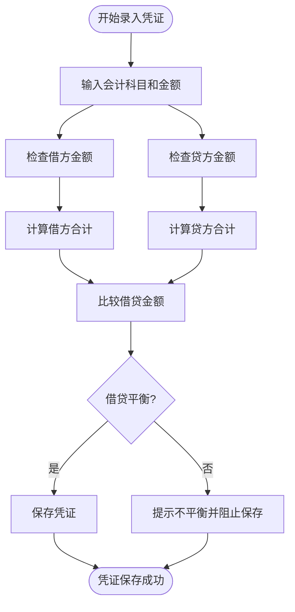
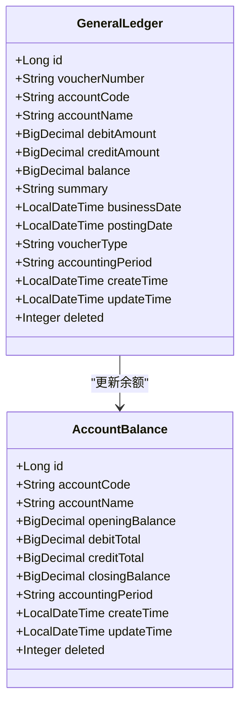
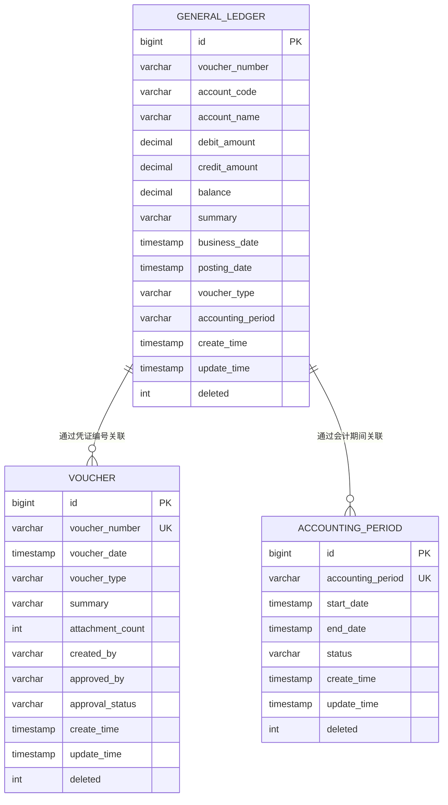
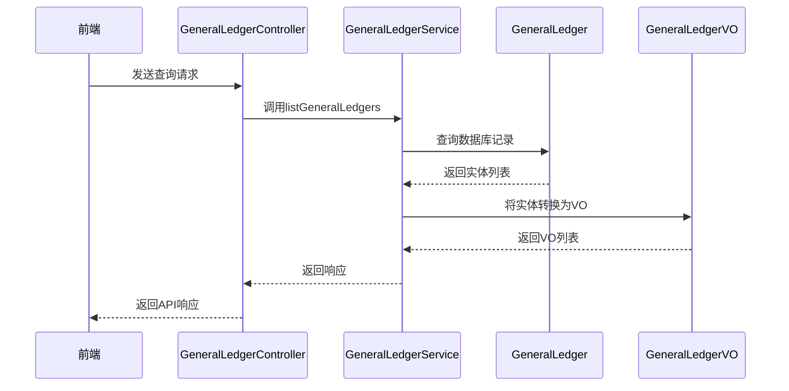

# 总账数据模型

<cite>
**本文档引用的文件**  
- [GeneralLedger.java](file://08-backend/src/main/java/com/enterprise/brain/modules/finance/entity/GeneralLedger.java)
- [GeneralLedgerVO.java](file://08-backend/src/main/java/com/enterprise/brain/modules/finance/vo/GeneralLedgerVO.java)
- [GeneralLedgerServiceImpl.java](file://08-backend/src/main/java/com/enterprise/brain/modules/finance/service/impl/GeneralLedgerServiceImpl.java)
- [AccountingPeriod.java](file://08-backend/src/main/java/com/enterprise/brain/modules/finance/entity/AccountingPeriod.java)
- [AccountBalance.java](file://08-backend/src/main/java/com/enterprise/brain/modules/finance/entity/AccountBalance.java)
- [Voucher.java](file://08-backend/src/main/java/com/enterprise/brain/modules/finance/entity/Voucher.java)
- [VoucherTable.vue](file://07-frontend/src/pages/finance/general-ledger/components/VoucherTable.vue)
- [VoucherEntry.vue](file://07-frontend/src/pages/finance/general-ledger/VoucherEntry.vue)
</cite>

## 目录
1. [总账核心数据模型概述](#总账核心数据模型概述)
2. [字段定义与会计业务逻辑](#字段定义与会计业务逻辑)
3. [凭证编号生成规则](#凭证编号生成规则)
4. [会计科目层级结构与编码规范](#会计科目层级结构与编码规范)
5. [借贷记账规则](#借贷记账规则)
6. [余额动态计算逻辑](#余额动态计算逻辑)
7. [会计期间与原始凭证关联机制](#会计期间与原始凭证关联机制)
8. [实体到视图对象的转换](#实体到视图对象的转换)
9. [数据库表结构](#数据库表结构)
10. [典型数据访问模式](#典型数据访问模式)

## 总账核心数据模型概述

总账核心数据模型`GeneralLedger`是财务系统的核心实体，用于记录企业所有会计科目的详细交易信息。该模型通过凭证编号、会计科目、借贷金额等字段实现复式记账法的完整记录，支持总账查询、凭证审核、期末结转等关键财务业务。

**本节来源**
- [GeneralLedger.java](file://08-backend/src/main/java/com/enterprise/brain/modules/finance/entity/GeneralLedger.java#L1-L19)

## 字段定义与会计业务逻辑

`GeneralLedger`实体包含以下核心字段，每个字段都对应特定的会计业务含义：

- **id**: 主键ID，系统自动生成的唯一标识
- **voucherNumber**: 凭证编号，关联原始会计凭证
- **accountCode**: 会计科目代码，遵循特定编码规范的层级结构
- **accountName**: 会计科目名称，与代码对应的人类可读名称
- **debitAmount**: 借方金额，记录资金流入或资产增加的金额
- **creditAmount**: 贷方金额，记录资金流出或负债增加的金额
- **balance**: 余额，根据借贷方向动态计算的账户余额
- **summary**: 摘要，对交易内容的简要描述
- **businessDate**: 业务日期，交易发生的实际日期
- **postingDate**: 记账日期，凭证正式记账的日期
- **voucherType**: 凭证类型，区分收款、付款、转账等不同业务类型
- **accountingPeriod**: 会计期间，关联特定的会计周期
- **createTime**: 创建时间，记录数据创建的时间戳
- **updateTime**: 更新时间，记录数据最后修改的时间戳
- **deleted**: 删除标识，软删除标记（0:未删除, 1:已删除）

**本节来源**
- [GeneralLedger.java](file://08-backend/src/main/java/com/enterprise/brain/modules/finance/entity/GeneralLedger.java#L21-L81)

## 凭证编号生成规则

凭证编号`voucherNumber`是总账记录与原始凭证关联的关键字段。系统通过`Voucher`实体管理凭证的完整生命周期，凭证编号遵循"会计期间+凭证类型+序列号"的复合编码规则。

凭证编号在`Voucher`实体中生成和管理，当凭证审核通过后，其编号被同步到`GeneralLedger`记录中，确保每笔总账记录都能追溯到具体的会计凭证。这种设计实现了总账记录与原始凭证的一对一或多对一关联，保证了会计信息的完整性和可追溯性。

**本节来源**
- [Voucher.java](file://08-backend/src/main/java/com/enterprise/brain/modules/finance/entity/Voucher.java#L25-L27)
- [GeneralLedger.java](file://08-backend/src/main/java/com/enterprise/brain/modules/finance/entity/GeneralLedger.java#L25-L27)

## 会计科目层级结构与编码规范

会计科目通过`accountCode`和`accountName`字段实现层级化管理。系统采用标准的会计科目编码体系，通常为4-2-2-2的层级结构：

- 第一层级（4位）：一级科目，如1001现金、1122应收账款
- 第二层级（2位）：二级科目，细化一级科目的分类
- 第三层级（2位）：三级科目，进一步细分会计核算维度
- 第四层级（2位）：四级科目，最细粒度的核算单元

这种层级编码规范支持财务报表的自动汇总和分级查询，确保会计核算的系统性和一致性。科目代码与名称的对应关系存储在会计科目字典中，保证了数据的一致性和准确性。

**本节来源**
- [GeneralLedger.java](file://08-backend/src/main/java/com/enterprise/brain/modules/finance/entity/GeneralLedger.java#L29-L35)

## 借贷记账规则

借贷记账遵循复式记账法的基本原则，每笔交易必须同时记录借方和贷方，且借贷金额必须相等。系统通过以下规则确保记账的准确性：

1. 每笔交易至少包含一个借方分录和一个贷方分录
2. 所有借方金额之和必须等于所有贷方金额之和
3. 资产类科目增加记借方，减少记贷方
4. 负债和权益类科目增加记贷方，减少记借方
5. 收入类科目增加记贷方，费用类科目增加记借方

前端组件`VoucherTable.vue`实现了借贷平衡的实时校验，当用户输入凭证分录时，系统会自动计算借方合计和贷方合计，并显示平衡状态提示。



**本节来源**
- [GeneralLedger.java](file://08-backend/src/main/java/com/enterprise/brain/modules/finance/entity/GeneralLedger.java#L37-L43)
- [VoucherTable.vue](file://07-frontend/src/pages/finance/general-ledger/components/VoucherTable.vue#L185-L198)

## 余额动态计算逻辑

余额`balance`字段的计算遵循会计恒等式原则，根据会计科目的性质和借贷方向动态计算。系统采用以下算法：

对于资产类科目：
- 余额 = 期初余额 + 借方累计 - 贷方累计

对于负债和权益类科目：
- 余额 = 期初余额 + 贷方累计 - 借方累计

余额计算与`AccountBalance`实体紧密关联，该实体记录每个会计期间每个科目的期初余额、借方累计、贷方累计和期末余额。当新的总账记录生成时，系统会更新相应会计期间的账户余额，确保余额数据的实时性和准确性。



**本节来源**
- [GeneralLedger.java](file://08-backend/src/main/java/com/enterprise/brain/modules/finance/entity/GeneralLedger.java#L45-L47)
- [AccountBalance.java](file://08-backend/src/main/java/com/enterprise/brain/modules/finance/entity/AccountBalance.java#L33-L47)

## 会计期间与原始凭证关联机制

总账记录通过两个关键字段实现与会计期间和原始凭证的关联：

1. **会计期间关联**：通过`accountingPeriod`字段关联`AccountingPeriod`实体。会计期间实体定义了每个会计周期的开始日期、结束日期和状态（开启/关闭），确保所有总账记录都在有效的会计期间内。

2. **原始凭证关联**：通过`voucherNumber`字段关联`Voucher`实体。每张凭证包含多个分录，每个分录对应一条总账记录，实现了凭证与总账的一对多关系。

这种双重关联机制确保了会计信息的完整性和合规性，支持按会计期间进行财务报表编制和按凭证进行审计追溯。



**本节来源**
- [GeneralLedger.java](file://08-backend/src/main/java/com/enterprise/brain/modules/finance/entity/GeneralLedger.java#L64-L67)
- [AccountingPeriod.java](file://08-backend/src/main/java/com/enterprise/brain/modules/finance/entity/AccountingPeriod.java#L24-L38)
- [Voucher.java](file://08-backend/src/main/java/com/enterprise/brain/modules/finance/entity/Voucher.java#L25-L35)

## 实体到视图对象的转换

后端通过`GeneralLedgerVO`视图对象将`GeneralLedger`实体数据转换为前端所需格式，实现数据聚合和权限过滤：

1. **字段映射**：`GeneralLedgerServiceImpl`使用`BeanUtils.copyProperties`方法将实体字段映射到VO对象，确保数据一致性。

2. **数据聚合**：在查询场景下，服务层将多个总账记录聚合为`GeneralLedgerListResponse`，包含分页信息和记录列表。

3. **权限过滤**：系统在数据访问层实现权限控制，根据用户角色过滤敏感数据，确保数据安全。

4. **响应封装**：所有API响应都封装在`ApiResponse`中，包含状态码、消息和数据体，提供统一的接口规范。



**本节来源**
- [GeneralLedgerVO.java](file://08-backend/src/main/java/com/enterprise/brain/modules/finance/vo/GeneralLedgerVO.java#L1-L58)
- [GeneralLedgerServiceImpl.java](file://08-backend/src/main/java/com/enterprise/brain/modules/finance/service/impl/GeneralLedgerServiceImpl.java#L66-L107)

## 数据库表结构

`finance_general_ledger`表是总账数据的持久化存储，其结构设计遵循会计信息系统的要求：

```sql
CREATE TABLE finance_general_ledger (
    id BIGINT AUTO_INCREMENT PRIMARY KEY,
    voucher_number VARCHAR(50) NOT NULL COMMENT '凭证编号',
    account_code VARCHAR(20) NOT NULL COMMENT '会计科目代码',
    account_name VARCHAR(100) NOT NULL COMMENT '会计科目名称',
    debit_amount DECIMAL(18,2) DEFAULT 0.00 COMMENT '借方金额',
    credit_amount DECIMAL(18,2) DEFAULT 0.00 COMMENT '贷方金额',
    balance DECIMAL(18,2) DEFAULT 0.00 COMMENT '余额',
    summary VARCHAR(200) COMMENT '摘要',
    business_date DATETIME NOT NULL COMMENT '业务日期',
    posting_date DATETIME COMMENT '记账日期',
    voucher_type VARCHAR(20) COMMENT '凭证类型',
    accounting_period VARCHAR(10) COMMENT '会计期间',
    create_time DATETIME DEFAULT CURRENT_TIMESTAMP COMMENT '创建时间',
    update_time DATETIME DEFAULT CURRENT_TIMESTAMP ON UPDATE CURRENT_TIMESTAMP COMMENT '更新时间',
    deleted INT DEFAULT 0 COMMENT '删除标识(0:未删除, 1:已删除)',
    
    INDEX idx_voucher_number (voucher_number),
    INDEX idx_account_code (account_code),
    INDEX idx_accounting_period (accounting_period),
    INDEX idx_business_date (business_date),
    INDEX idx_create_time (create_time)
) COMMENT='总账表';
```

**本节来源**
- [GeneralLedger.java](file://08-backend/src/main/java/com/enterprise/brain/modules/finance/entity/GeneralLedger.java#L17-L81)

## 典型数据访问模式

总账系统在不同业务场景下表现出特定的数据访问模式：

1. **总账查询场景**：
   - 按会计期间、会计科目代码、凭证编号等条件进行复合查询
   - 需要分页返回大量记录
   - 常见于月度财务报表编制

2. **凭证审核场景**：
   - 按凭证编号精确查询单条或多条总账记录
   - 需要验证借贷平衡和科目合规性
   - 实时性要求高

3. **期末结转场景**：
   - 按会计期间批量查询所有总账记录
   - 计算各科目期末余额
   - 生成结转凭证并更新账户余额

4. **审计追溯场景**：
   - 按业务日期范围查询交易记录
   - 关联原始凭证和审批流程
   - 需要完整的操作日志

这些访问模式决定了数据库索引的设计和查询优化策略，确保系统在高并发场景下的性能表现。

**本节来源**
- [GeneralLedgerQueryRequest.java](file://08-backend/src/main/java/com/enterprise/brain/modules/finance/dto/request/GeneralLedgerQueryRequest.java#L1-L29)
- [GeneralLedgerServiceImpl.java](file://08-backend/src/main/java/com/enterprise/brain/modules/finance/service/impl/GeneralLedgerServiceImpl.java#L66-L91)
- [VoucherTable.vue](file://07-frontend/src/pages/finance/general-ledger/components/VoucherTable.vue#L104-L241)