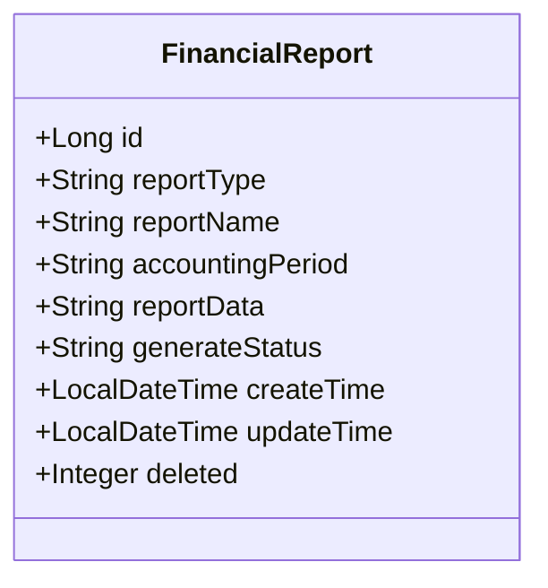
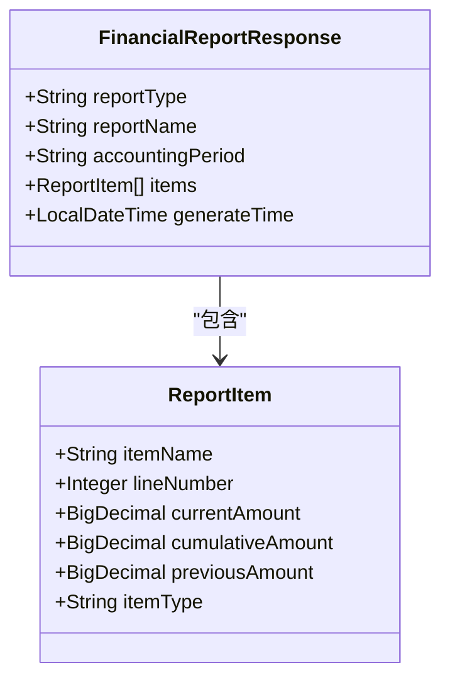
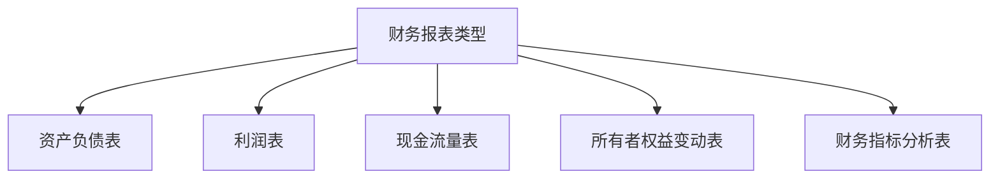
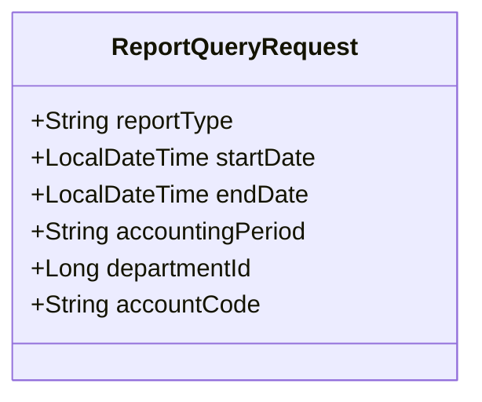
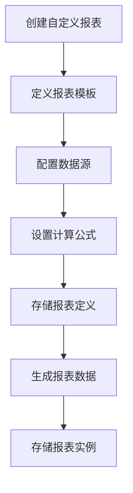
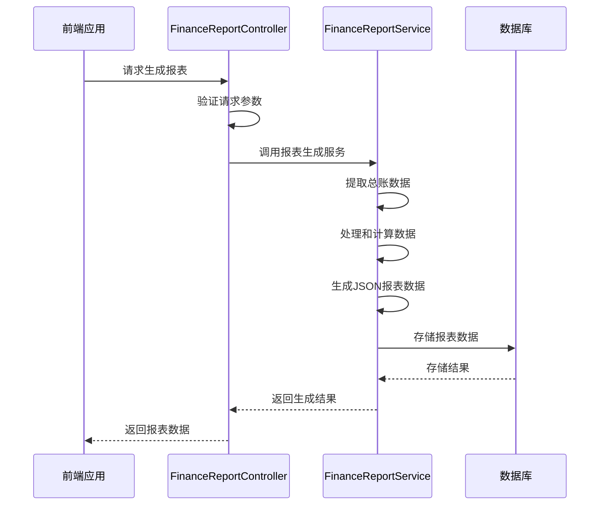
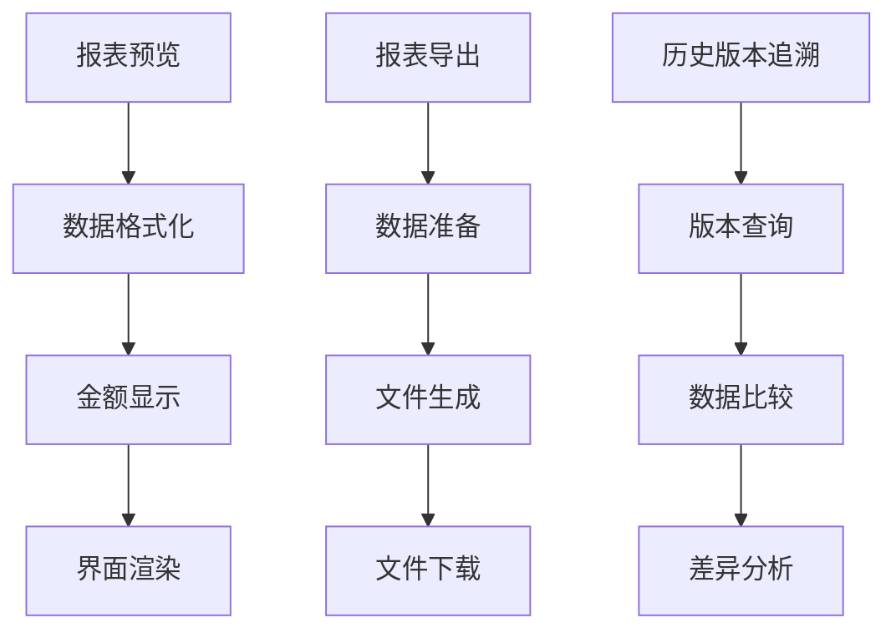

# 财务报表数据模型

<cite>
**本文档引用的文件**
- [FinancialReport.java](file://08-backend/src/main/java/com/enterprise/brain/modules/finance/entity/FinancialReport.java)
- [FinancialReportResponse.java](file://08-backend/src/main/java/com/enterprise/brain/modules/finance/dto/response/FinancialReportResponse.java)
- [ReportQueryRequest.java](file://08-backend/src/main/java/com/enterprise/brain/modules/finance/dto/request/ReportQueryRequest.java)
- [finance-api.js](file://07-frontend/src/services/api/finance-api.js)
- [FinanceReportController.java](file://08-backend/src/main/java/com/enterprise/brain/modules/finance/controller/FinanceReportController.java)
</cite>

## 目录
1. [引言](#引言)
2. [财务报表数据模型结构](#财务报表数据模型结构)
3. [报表数据存储机制](#报表数据存储机制)
4. [报表类型分类体系](#报表类型分类体系)
5. [会计期间关联](#会计期间关联)
6. [自定义报表支持](#自定义报表支持)
7. [报表生成流程](#报表生成流程)
8. [报表功能应用案例](#报表功能应用案例)
9. [结论](#结论)

## 引言
财务报表数据模型是企业财务管理系统的核心组成部分，负责存储和管理各类财务报表的结构化数据。该模型设计旨在支持资产负债表、利润表、现金流量表等标准财务报表以及自定义报表的创建、存储和展示。通过JSON格式存储复杂的报表数据，系统能够灵活地处理各种财务数据结构，并支持基于预设模板和总账数据的动态报表生成。

## 财务报表数据模型结构
财务报表数据模型主要由`FinancialReport`实体类定义，该类映射到数据库中的`finance_financial_report`表。模型包含以下核心字段：

- **id**: 主键ID，自动生成
- **reportType**: 报表类型，标识报表的种类
- **reportName**: 报表名称，用户可读的报表标题
- **accountingPeriod**: 会计期间，标识报表所属的会计周期
- **reportData**: 报表数据，以JSON格式存储的复杂报表内容
- **generateStatus**: 生成状态，标识报表的生成状态
- **createTime**: 创建时间，记录报表创建的时间戳
- **updateTime**: 更新时间，记录报表最后更新的时间戳
- **deleted**: 删除标识，软删除标记



**图表来源**
- [FinancialReport.java](file://08-backend/src/main/java/com/enterprise/brain/modules/finance/entity/FinancialReport.java#L21-L57)

**本节来源**
- [FinancialReport.java](file://08-backend/src/main/java/com/enterprise/brain/modules/finance/entity/FinancialReport.java#L1-L57)

## 报表数据存储机制
报表数据通过`reportData`字段以JSON格式存储，这种设计允许灵活地表示复杂的财务报表结构。JSON格式能够有效存储行标题、列标题、单元格数值及计算公式等信息。

`FinancialReportResponse`类定义了报表数据的响应结构，其中`items`字段包含报表项列表，每个报表项包含以下信息：

- **itemName**: 项目名称，表示报表中的行标题
- **lineNumber**: 行次，标识项目在报表中的位置
- **currentAmount**: 本期金额，当前会计期间的金额
- **cumulativeAmount**: 累计金额，累计到当前期间的金额
- **previousAmount**: 上年金额，上年同期的金额
- **itemType**: 项目类型，标识项目的分类



**图表来源**
- [FinancialReportResponse.java](file://08-backend/src/main/java/com/enterprise/brain/modules/finance/dto/response/FinancialReportResponse.java#L18-L58)

**本节来源**
- [FinancialReportResponse.java](file://08-backend/src/main/java/com/enterprise/brain/modules/finance/dto/response/FinancialReportResponse.java#L1-L58)

## 报表类型分类体系
报表类型通过`reportType`字段进行分类管理，系统支持多种标准财务报表类型：

- **资产负债表**: 反映企业在特定日期的财务状况
- **利润表**: 展示企业在一定期间内的经营成果
- **现金流量表**: 记录企业在一定期间内的现金流入和流出情况
- **所有者权益变动表**: 显示所有者权益各组成部分的变动情况
- **财务指标分析表**: 提供各种财务比率和指标的分析

这些类型在系统中通过枚举或常量定义，确保报表类型的统一管理和验证。前端通过`finance-api.js`中的API接口访问不同类型的报表：

```javascript
// 财务报表API
report: {
    // 获取资产负债表
    getBalanceSheet: (params) => {
        return request.get('/finance/reports/balance-sheet', params)
    },
    
    // 获取利润表
    getIncomeStatement: (params) => {
        return request.get('/finance/reports/income-statement', params)
    },
    
    // 获取现金流量表
    getCashFlowStatement: (params) => {
        return request.get('/finance/reports/cash-flow', params)
    },
    
    // 获取所有者权益变动表
    getEquityStatement: (params) => {
        return request.get('/finance/reports/equity', params)
    }
}
```



**图表来源**
- [finance-api.js](file://07-frontend/src/services/api/finance-api.js#L110-L135)
- [FinancialReport.java](file://08-backend/src/main/java/com/enterprise/brain/modules/finance/entity/FinancialReport.java#L25-L28)

**本节来源**
- [finance-api.js](file://07-frontend/src/services/api/finance-api.js#L110-L135)
- [FinancialReport.java](file://08-backend/src/main/java/com/enterprise/brain/modules/finance/entity/FinancialReport.java#L25-L28)

## 会计期间关联
会计期间通过`accountingPeriod`字段与报表关联，该字段标识报表所属的会计周期。系统支持多种会计期间格式，包括：

- 年度期间（如"2023"）
- 月度期间（如"2023-01"）
- 季度期间（如"2023-Q1"）
- 自定义期间（如"2023-01-01至2023-12-31"）

`ReportQueryRequest`类定义了报表查询请求，其中包含会计期间查询参数：

```java
public class ReportQueryRequest {
    @Schema(description = "报表类型", required = true)
    @NotNull(message = "报表类型不能为空")
    private String reportType;

    @Schema(description = "开始日期")
    private LocalDateTime startDate;

    @Schema(description = "结束日期")
    private LocalDateTime endDate;

    @Schema(description = "会计期间")
    private String accountingPeriod;
}
```

系统通过会计期间字段实现报表的历史版本追溯和跨期间比较分析功能。



**图表来源**
- [ReportQueryRequest.java](file://08-backend/src/main/java/com/enterprise/brain/modules/finance/dto/request/ReportQueryRequest.java#L17-L35)

**本节来源**
- [ReportQueryRequest.java](file://08-backend/src/main/java/com/enterprise/brain/modules/finance/dto/request/ReportQueryRequest.java#L1-L35)

## 自定义报表支持
系统通过灵活的数据模型设计支持自定义报表的创建与存储。用户可以根据业务需求创建个性化的报表模板，系统将这些模板和生成的数据统一存储在`FinancialReport`模型中。

自定义报表的核心特性包括：

1. **模板定义**: 用户可以定义报表的结构、行标题、列标题和计算公式
2. **数据源配置**: 支持从总账、明细账等不同数据源提取数据
3. **公式计算**: 支持在报表中定义复杂的计算公式
4. **样式设置**: 允许用户自定义报表的显示样式

前端通过`finance-api.js`中的通用报表API接口支持自定义报表的访问：

```javascript
// 财务报表
report: {
    // 导出报表
    export: (type, params) => {
        return request.download(`/finance/reports/export/${type}`, params, `${type}-report.xlsx`)
    }
}
```



**图表来源**
- [finance-api.js](file://07-frontend/src/services/api/finance-api.js#L136-L139)
- [FinancialReport.java](file://08-backend/src/main/java/com/enterprise/brain/modules/finance/entity/FinancialReport.java#L37-L39)

**本节来源**
- [finance-api.js](file://07-frontend/src/services/api/finance-api.js#L110-L139)
- [FinancialReport.java](file://08-backend/src/main/java/com/enterprise/brain/modules/finance/entity/FinancialReport.java#L37-L39)

## 报表生成流程
系统根据预设模板和总账数据动态生成报表的`reportData`内容。报表生成流程如下：

1. **请求接收**: `FinanceReportController`接收报表生成请求
2. **参数验证**: 验证报表类型、会计期间等查询参数
3. **数据提取**: 从总账系统提取相关财务数据
4. **数据处理**: 根据报表模板处理和计算数据
5. **结果生成**: 生成JSON格式的报表数据
6. **数据存储**: 将生成的报表数据存储到数据库



**图表来源**
- [FinanceReportController.java](file://08-backend/src/main/java/com/enterprise/brain/modules/finance/controller/FinanceReportController.java#L1-L22)
- [FinancialReport.java](file://08-backend/src/main/java/com/enterprise/brain/modules/finance/entity/FinancialReport.java#L37-L39)

**本节来源**
- [FinanceReportController.java](file://08-backend/src/main/java/com/enterprise/brain/modules/finance/controller/FinanceReportController.java#L1-L22)

## 报表功能应用案例
财务报表数据模型在多个功能场景中发挥关键作用：

### 报表预览
用户可以通过系统预览生成的财务报表。前端页面如`BalanceSheet.vue`实现了资产负债表的预览功能，包括金额格式化和数据展示。

```javascript
const formatAmount = (amount) => {
    return `¥${(amount || 0).toLocaleString('zh-CN', { minimumFractionDigits: 2, maximumFractionDigits: 2 })}`
}
```

### 报表导出
系统支持将报表导出为Excel等格式，方便用户进行离线分析和分享。

```javascript
const handleExport = async () => {
    try {
        await balanceSheetApi.exportBalanceSheet(queryForm)
        ElMessage.success('导出成功')
    } catch (error) {
        ElMessage.error('导出失败')
    }
}
```

### 历史版本追溯
通过`createTime`和`updateTime`字段，系统支持报表的历史版本管理，用户可以查看和比较不同时间点的报表数据。



**图表来源**
- [BalanceSheet.vue](file://07-frontend/src/pages/finance/general-ledger/BalanceSheet.vue#L182-L193)
- [finance-api.js](file://07-frontend/src/services/api/finance-api.js#L136-L139)

**本节来源**
- [BalanceSheet.vue](file://07-frontend/src/pages/finance/general-ledger/BalanceSheet.vue#L182-L193)
- [finance-api.js](file://07-frontend/src/services/api/finance-api.js#L136-L139)

## 结论
财务报表数据模型通过`FinancialReport`实体类实现了对各类财务报表的统一管理。模型采用JSON格式存储复杂的报表数据，支持灵活的行标题、列标题、单元格数值及计算公式的表示。`reportType`字段建立了清晰的报表分类体系，涵盖资产负债表、利润表、现金流量表等标准报表类型。`accountingPeriod`字段有效关联报表与会计期间，支持跨期间分析和历史版本追溯。

系统通过预设模板和总账数据的结合，实现了报表的动态生成。前端通过API接口与后端交互，支持报表的预览、导出等功能。自定义报表功能允许用户根据特定业务需求创建个性化报表，增强了系统的灵活性和实用性。整体设计体现了高内聚、低耦合的原则，为财务管理系统提供了稳定可靠的数据基础。