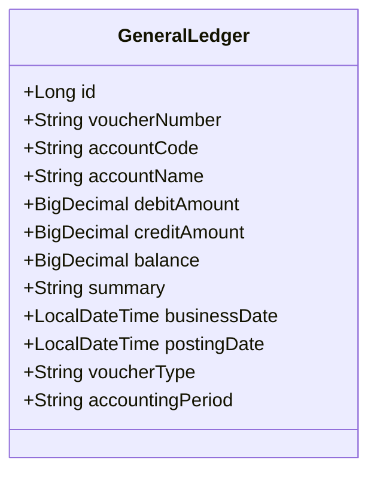
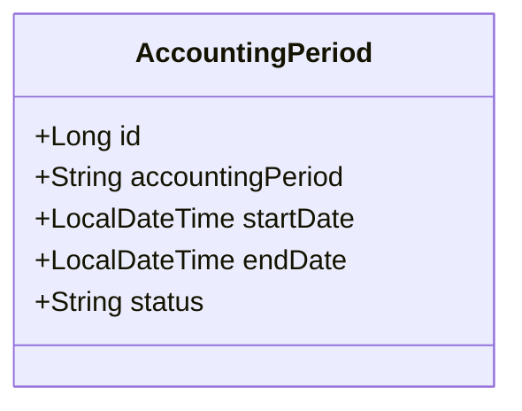
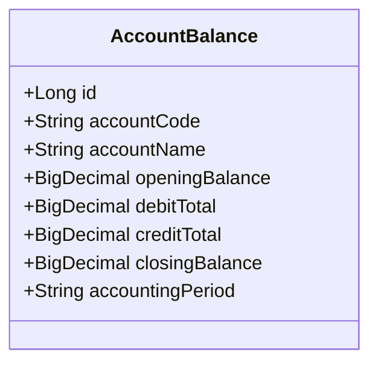
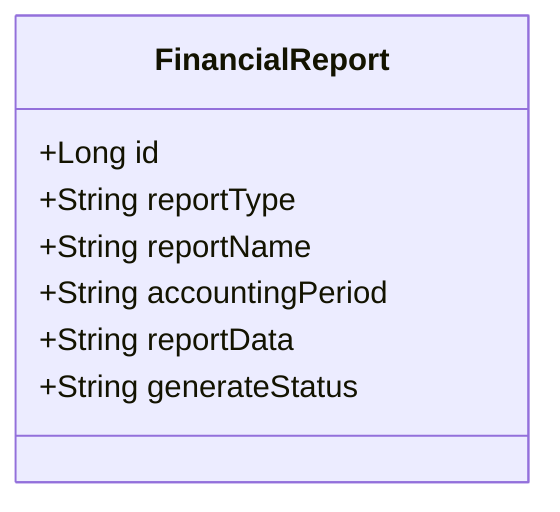
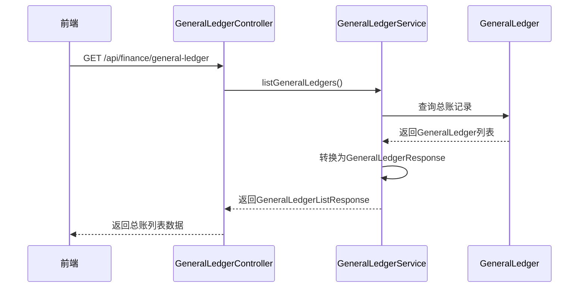
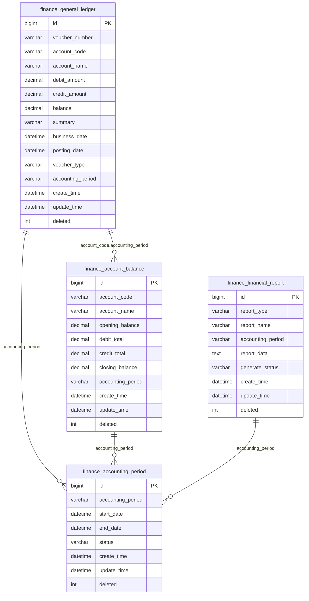

# 财务数据模型

<cite>
**本文档引用的文件**
- [GeneralLedger.java](file://08-backend/src/main/java/com/enterprise/brain/modules/finance/entity/GeneralLedger.java)
- [AccountingPeriod.java](file://08-backend/src/main/java/com/enterprise/brain/modules/finance/entity/AccountingPeriod.java)
- [AccountBalance.java](file://08-backend/src/main/java/com/enterprise/brain/modules/finance/entity/AccountBalance.java)
- [FinancialReport.java](file://08-backend/src/main/java/com/enterprise/brain/modules/finance/entity/FinancialReport.java)
- [GeneralLedgerVO.java](file://08-backend/src/main/java/com/enterprise/brain/modules/finance/vo/GeneralLedgerVO.java)
- [GeneralLedgerController.java](file://08-backend/src/main/java/com/enterprise/brain/modules/finance/controller/GeneralLedgerController.java)
- [GeneralLedgerServiceImpl.java](file://08-backend/src/main/java/com/enterprise/brain/modules/finance/service/impl/GeneralLedgerServiceImpl.java)
- [finance.js](file://07-frontend/src/router/modules/finance.js)
</cite>

## 目录
1. [引言](#引言)
2. [核心数据模型](#核心数据模型)
3. [总账实体分析](#总账实体分析)
4. [会计期间实体分析](#会计期间实体分析)
5. [账户余额实体分析](#账户余额实体分析)
6. [财务报表实体分析](#财务报表实体分析)
7. [视图对象转换](#视图对象转换)
8. [数据库表结构](#数据库表结构)

## 引言
本文档深入解析财务领域的核心数据模型，包括总账（GeneralLedger）、会计期间（AccountingPeriod）、账户余额（AccountBalance）和财务报表（FinancialReport）。详细说明各实体的字段定义、业务逻辑和相互关系，为财务系统的开发和维护提供参考。

## 核心数据模型
财务系统的核心数据模型由四个主要实体构成：总账、会计期间、账户余额和财务报表。这些实体共同构成了财务核算的基础，支持凭证处理、账务查询、报表生成等核心功能。

**核心实体关系**
- 总账记录是财务核算的基本单位，包含凭证编号、会计科目、借贷金额等信息
- 会计期间定义了财务核算的时间范围，用于控制账务处理的时间边界
- 账户余额记录了各会计科目在特定会计期间的期初余额、期末余额和累计发生额
- 财务报表存储了各种财务报表的结构化数据，支持资产负债表、利润表等报表的生成和查询

**Section sources**
- [GeneralLedger.java](file://08-backend/src/main/java/com/enterprise/brain/modules/finance/entity/GeneralLedger.java)
- [AccountingPeriod.java](file://08-backend/src/main/java/com/enterprise/brain/modules/finance/entity/AccountingPeriod.java)
- [AccountBalance.java](file://08-backend/src/main/java/com/enterprise/brain/modules/finance/entity/AccountBalance.java)
- [FinancialReport.java](file://08-backend/src/main/java/com/enterprise/brain/modules/finance/entity/FinancialReport.java)

## 总账实体分析
总账实体（GeneralLedger）是财务核算的核心，记录了每一笔经济业务的详细信息。

### 会计业务逻辑
总账实体中的关键字段具有特定的会计业务逻辑：

- **凭证编号(voucherNumber)**：唯一标识每一笔凭证，用于追踪和审计。凭证编号通常遵循特定的编码规则，如年份+月份+序列号的组合
- **会计科目(accountCode/name)**：标识经济业务所属的会计科目，accountCode是科目的唯一编码，accountName是科目的中文名称。科目代码遵循会计准则的编码体系
- **借方/贷方金额(debit/creditAmount)**：记录经济业务的金额，遵循"有借必有贷，借贷必相等"的记账规则。在单条总账记录中，借方金额和贷方金额有且仅有一个不为零
- **余额(balance)**：反映会计科目在该笔业务发生后的最新余额。余额的计算遵循"上期余额 + 本期借方发生额 - 本期贷方发生额"的规则

**Diagram sources**
- [GeneralLedger.java](file://08-backend/src/main/java/com/enterprise/brain/modules/finance/entity/GeneralLedger.java)

**Section sources**
- [GeneralLedger.java](file://08-backend/src/main/java/com/enterprise/brain/modules/finance/entity/GeneralLedger.java)

## 会计期间实体分析
会计期间实体（AccountingPeriod）定义了财务核算的时间范围，是财务数据组织和查询的重要维度。

### 会计期间定义
会计期间通过以下字段定义：

- **startDate和endDate**：定义了会计期间的起止日期。系统根据这些日期判断业务日期是否属于该会计期间，从而控制账务处理的时间边界
- **会计期间(accountingPeriod)**：会计期间的标识，通常采用"YYYYMM"格式，如"202312"表示2023年12月
- **状态(status)**：表示会计期间的状态，包括"OPEN"(开启)和"CLOSED"(关闭)。只有开启状态的会计期间才能进行账务处理

会计期间与总账数据的关联通过accountingPeriod字段实现。在创建总账记录时，系统根据业务日期自动确定所属的会计期间，并将会计期间代码存储在总账记录中。

**Diagram sources**
- [AccountingPeriod.java](file://08-backend/src/main/java/com/enterprise/brain/modules/finance/entity/AccountingPeriod.java)

**Section sources**
- [AccountingPeriod.java](file://08-backend/src/main/java/com/enterprise/brain/modules/finance/entity/AccountingPeriod.java)

## 账户余额实体分析
账户余额实体（AccountBalance）记录了各会计科目在特定会计期间的余额信息。

### 余额计算逻辑
账户余额实体存储了以下关键余额信息：

- **期初余额(openingBalance)**：会计期间开始时账户的余额，通常等于上一期的期末余额
- **借方累计(debitTotal)**：会计期间内所有借方发生额的累计值
- **贷方累计(creditTotal)**：会计期间内所有贷方发生额的累计值
- **期末余额(closingBalance)**：会计期间结束时账户的余额，计算公式为：期初余额 + 借方累计 - 贷方累计

账户余额实体通过accountCode和accountingPeriod字段与总账数据关联。系统在期末结账时，根据该期间内所有总账记录计算各账户的累计发生额和期末余额，并更新账户余额表。

**Diagram sources**
- [AccountBalance.java](file://08-backend/src/main/java/com/enterprise/brain/modules/finance/entity/AccountBalance.java)

**Section sources**
- [AccountBalance.java](file://08-backend/src/main/java/com/enterprise/brain/modules/finance/entity/AccountBalance.java)

## 财务报表实体分析
财务报表实体（FinancialReport）用于存储各种财务报表的数据。

### 报表数据存储
财务报表实体的关键字段包括：

- **reportType**：报表类型，如"balance_sheet"(资产负债表)、"profit_statement"(利润表)等
- **reportName**：报表名称，用于标识报表的用途或版本
- **accountingPeriod**：报表所属的会计期间
- **reportData**：报表数据，以JSON格式存储。这种设计提供了灵活性，可以存储不同结构的报表数据，而无需为每种报表类型创建单独的表结构

JSON格式的reportData字段可以存储复杂的报表结构，包括报表标题、表头、数据行、合计行等信息，支持动态报表的生成和展示。

**Diagram sources**
- [FinancialReport.java](file://08-backend/src/main/java/com/enterprise/brain/modules/finance/entity/FinancialReport.java)

**Section sources**
- [FinancialReport.java](file://08-backend/src/main/java/com/enterprise/brain/modules/finance/entity/FinancialReport.java)

## 视图对象转换
后端通过视图对象（VO）将实体转换为前端所需的格式，实现数据的适配和传输。

### GeneralLedgerVO转换
GeneralLedgerVO是总账实体的视图对象，用于向前端传输总账数据。转换过程在GeneralLedgerServiceImpl中实现，主要通过BeanUtils.copyProperties方法将GeneralLedger实体的属性复制到GeneralLedgerVO对象中。

这种转换模式实现了以下优势：
- 解耦后端实体和前端接口，避免实体变更影响前端
- 可以在VO中添加前端需要的计算字段或格式化字段
- 可以对敏感字段进行过滤或脱敏处理
- 支持不同前端需求的定制化数据结构

前端通过finance.js中的路由配置访问总账相关功能，如总账列表、总账详情、凭证审核等。

**Diagram sources**
- [GeneralLedgerVO.java](file://08-backend/src/main/java/com/enterprise/brain/modules/finance/vo/GeneralLedgerVO.java)
- [GeneralLedgerController.java](file://08-backend/src/main/java/com/enterprise/brain/modules/finance/controller/GeneralLedgerController.java)
- [GeneralLedgerServiceImpl.java](file://08-backend/src/main/java/com/enterprise/brain/modules/finance/service/impl/GeneralLedgerServiceImpl.java)
- [finance.js](file://07-frontend/src/router/modules/finance.js)

**Section sources**
- [GeneralLedgerVO.java](file://08-backend/src/main/java/com/enterprise/brain/modules/finance/vo/GeneralLedgerVO.java)
- [GeneralLedgerController.java](file://08-backend/src/main/java/com/enterprise/brain/modules/finance/controller/GeneralLedgerController.java)
- [GeneralLedgerServiceImpl.java](file://08-backend/src/main/java/com/enterprise/brain/modules/finance/service/impl/GeneralLedgerServiceImpl.java)

## 数据库表结构
财务核心数据模型对应的数据库表结构如下：

**Diagram sources**
- [GeneralLedger.java](file://08-backend/src/main/java/com/enterprise/brain/modules/finance/entity/GeneralLedger.java)
- [AccountingPeriod.java](file://08-backend/src/main/java/com/enterprise/brain/modules/finance/entity/AccountingPeriod.java)
- [AccountBalance.java](file://08-backend/src/main/java/com/enterprise/brain/modules/finance/entity/AccountBalance.java)
- [FinancialReport.java](file://08-backend/src/main/java/com/enterprise/brain/modules/finance/entity/FinancialReport.java)

**Section sources**
- [GeneralLedger.java](file://08-backend/src/main/java/com/enterprise/brain/modules/finance/entity/GeneralLedger.java)
- [AccountingPeriod.java](file://08-backend/src/main/java/com/enterprise/brain/modules/finance/entity/AccountingPeriod.java)
- [AccountBalance.java](file://08-backend/src/main/java/com/enterprise/brain/modules/finance/entity/AccountBalance.java)
- [FinancialReport.java](file://08-backend/src/main/java/com/enterprise/brain/modules/finance/entity/FinancialReport.java)