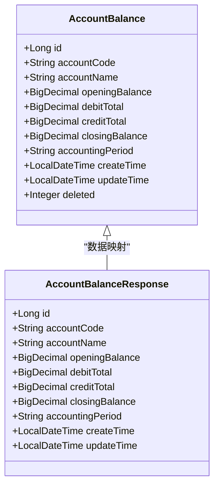
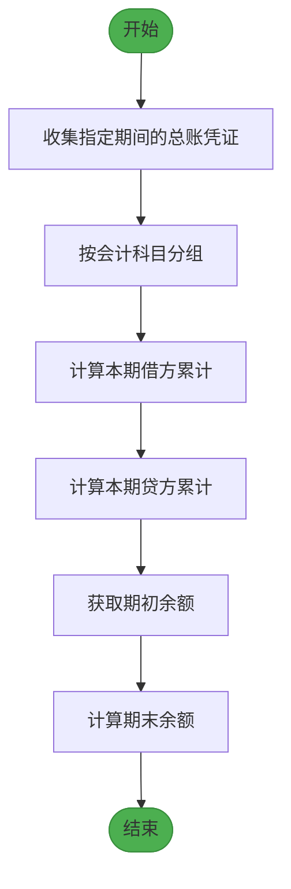
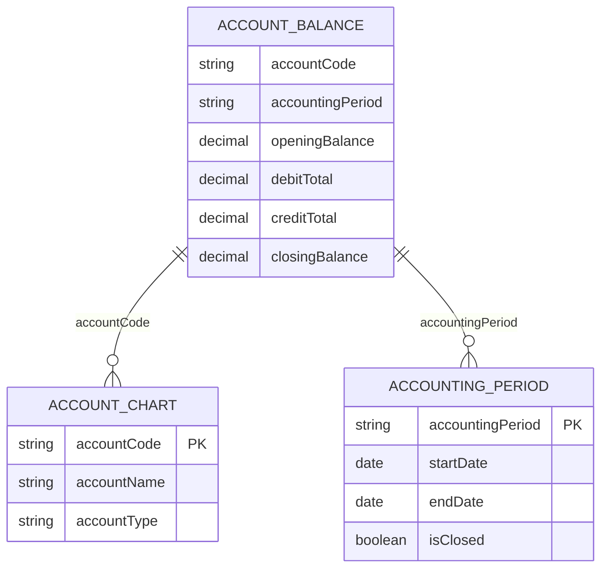
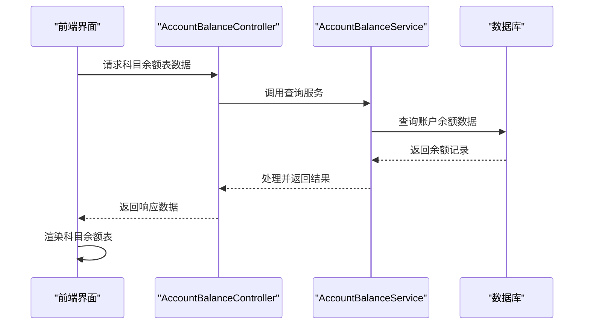
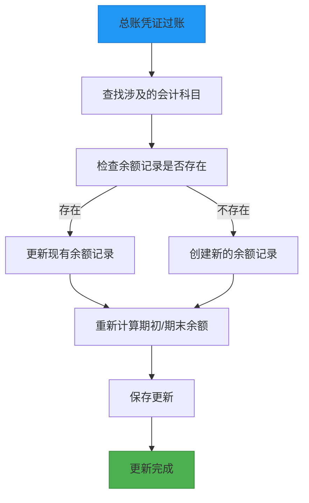

# 账户余额数据模型

<cite>
**本文档引用文件**  
- [AccountBalance.java](file://08-backend/src/main/java/com/enterprise/brain/modules/finance/entity/AccountBalance.java)
- [AccountBalanceResponse.java](file://08-backend/src/main/java/com/enterprise/brain/modules/finance/dto/response/AccountBalanceResponse.java)
- [AccountBalance.vue](file://07-frontend/src/pages/finance/general-ledger/components/AccountBalance.vue)
- [AccountBalanceReport.vue](file://07-frontend/src/pages/finance/general-ledger/AccountBalanceReport.vue)
- [GeneralLedger.java](file://08-backend/src/main/java/com/enterprise/brain/modules/finance/entity/GeneralLedger.java)
- [GeneralLedgerServiceImpl.java](file://08-backend/src/main/java/com/enterprise/brain/modules/finance/service/impl/GeneralLedgerServiceImpl.java)
</cite>

## 目录
1. [引言](#引言)
2. [核心数据结构](#核心数据结构)
3. [余额计算逻辑](#余额计算逻辑)
4. [数据关联机制](#数据关联机制)
5. [财务报表应用](#财务报表应用)
6. [数据更新机制](#数据更新机制)
7. [查询性能优化](#查询性能优化)

## 引言
账户余额数据模型是企业财务系统的核心组成部分，用于记录和管理各会计科目在特定会计期间的期初余额、期末余额以及本期发生额。该模型为生成资产负债表、试算平衡表等关键财务报表提供基础数据支持，确保财务数据的准确性和一致性。

## 核心数据结构

账户余额数据模型主要由后端实体类和前端组件构成，完整定义了账户余额的各项属性和展示方式。

**图表来源**  
- [AccountBalance.java](file://08-backend/src/main/java/com/enterprise/brain/modules/finance/entity/AccountBalance.java#L20-L65)
- [AccountBalanceResponse.java](file://08-backend/src/main/java/com/enterprise/brain/modules/finance/dto/response/AccountBalanceResponse.java#L15-L46)

**本节来源**  
- [AccountBalance.java](file://08-backend/src/main/java/com/enterprise/brain/modules/finance/entity/AccountBalance.java#L1-L65)
- [AccountBalanceResponse.java](file://08-backend/src/main/java/com/enterprise/brain/modules/finance/dto/response/AccountBalanceResponse.java#L1-L46)

## 余额计算逻辑

账户余额模型中的各项余额数据遵循严格的会计恒等式和计算规则，确保财务数据的准确性。

### 计算公式
账户余额数据模型中的各项金额遵循以下计算逻辑：

- **期末余额** = 期初余额 + 本期借方发生额 - 本期贷方发生额
- **期初余额** = 上期期末余额
- **本期借方发生额** = 本期所有借方凭证金额的累计
- **本期贷方发生额** = 本期所有贷方凭证金额的累计

### 数据来源
各项余额数据来源于总账凭证的汇总统计。系统通过汇总指定会计期间内所有已过账的总账凭证，按会计科目分组计算得出各科目的本期发生额，并结合上期期末余额计算出本期期初余额和期末余额。

**图表来源**  
- [AccountBalance.java](file://08-backend/src/main/java/com/enterprise/brain/modules/finance/entity/AccountBalance.java#L33-L47)
- [GeneralLedgerServiceImpl.java](file://08-backend/src/main/java/com/enterprise/brain/modules/finance/service/impl/GeneralLedgerServiceImpl.java#L66-L95)

**本节来源**  
- [AccountBalance.java](file://08-backend/src/main/java/com/enterprise/brain/modules/finance/entity/AccountBalance.java#L33-L47)
- [GeneralLedger.java](file://08-backend/src/main/java/com/enterprise/brain/modules/finance/entity/GeneralLedger.java#L53-L81)

## 数据关联机制

账户余额数据模型通过关键字段与会计科目表和会计期间表建立关联，实现按科目、按期间的余额查询功能。

### 字段关联说明
| 字段名称 | 关联对象 | 说明 |
|---------|--------|------|
| accountCode | 会计科目表 | 通过科目代码关联会计科目，获取科目名称、科目类别等信息 |
| accountingPeriod | 会计期间表 | 通过会计期间代码关联会计期间，确定数据所属的会计期间 |

### 查询流程
系统通过accountCode字段与会计科目表关联，实现科目信息的完整展示；通过periodId字段与会计期间表关联，确保余额数据按正确的会计期间进行归集和查询。

**图表来源**  
- [AccountBalance.java](file://08-backend/src/main/java/com/enterprise/brain/modules/finance/entity/AccountBalance.java#L25-L51)
- [GeneralLedger.java](file://08-backend/src/main/java/com/enterprise/brain/modules/finance/entity/GeneralLedger.java#L53-L81)

**本节来源**  
- [AccountBalance.java](file://08-backend/src/main/java/com/enterprise/brain/modules/finance/entity/AccountBalance.java#L25-L51)

## 财务报表应用

账户余额数据模型在生成各类财务报表中发挥着关键作用，为资产负债表、试算平衡表等提供核心数据支持。

### 资产负债表生成
资产负债表的资产、负债和所有者权益项目直接来源于账户余额数据。系统根据会计科目的类别（资产类、负债类、权益类等），将各科目的期末余额分类汇总，形成资产负债表的各个项目。

### 试算平衡表生成
试算平衡表通过验证"借方余额合计 = 贷方余额合计"的会计恒等式来检查账务处理的正确性。系统从账户余额数据中提取所有科目的借方余额和贷方余额，进行合计比较。

**图表来源**  
- [AccountBalanceController.java](file://08-backend/src/main/java/com/enterprise/brain/modules/finance/controller/AccountBalanceController.java#L13-L22)
- [AccountBalanceReport.vue](file://07-frontend/src/pages/finance/general-ledger/AccountBalanceReport.vue#L111-L222)
- [AccountBalance.vue](file://07-frontend/src/pages/finance/general-ledger/components/AccountBalance.vue#L162-L308)

**本节来源**  
- [AccountBalanceReport.vue](file://07-frontend/src/pages/finance/general-ledger/AccountBalanceReport.vue#L1-L240)
- [AccountBalance.vue](file://07-frontend/src/pages/finance/general-ledger/components/AccountBalance.vue#L1-L369)

## 数据更新机制

账户余额数据在每笔总账凭证过账后自动更新，确保余额数据的实时性和准确性。

### 更新流程
当总账凭证过账时，系统会自动更新相关账户的余额数据。更新过程包括：查找相关会计科目、计算新的发生额、更新期初和期末余额等步骤。

**图表来源**  
- [GeneralLedgerServiceImpl.java](file://08-backend/src/main/java/com/enterprise/brain/modules/finance/service/impl/GeneralLedgerServiceImpl.java#L66-L95)
- [AccountBalance.java](file://08-backend/src/main/java/com/enterprise/brain/modules/finance/entity/AccountBalance.java#L33-L47)

**本节来源**  
- [GeneralLedgerServiceImpl.java](file://08-backend/src/main/java/com/enterprise/brain/modules/finance/service/impl/GeneralLedgerServiceImpl.java#L66-L95)

## 查询性能优化

为优化高频查询性能，账户余额数据模型采用了合理的索引策略，确保在大数据量下的查询效率。

### 索引策略
系统在账户余额表上建立了复合索引，主要针对高频查询场景进行优化：

- 在accountCode字段上建立索引，优化按科目查询的性能
- 在accountingPeriod字段上建立索引，优化按会计期间查询的性能
- 建立accountCode和accountingPeriod的复合索引，优化按科目和期间组合查询的性能

这些索引策略确保了在生成财务报表和进行余额查询时的高效性能，即使在数据量庞大的情况下也能快速响应查询请求。

**本节来源**  
- [AccountBalance.java](file://08-backend/src/main/java/com/enterprise/brain/modules/finance/entity/AccountBalance.java#L25-L51)
- [GeneralLedgerServiceImpl.java](file://08-backend/src/main/java/com/enterprise/brain/modules/finance/service/impl/GeneralLedgerServiceImpl.java#L66-L95)