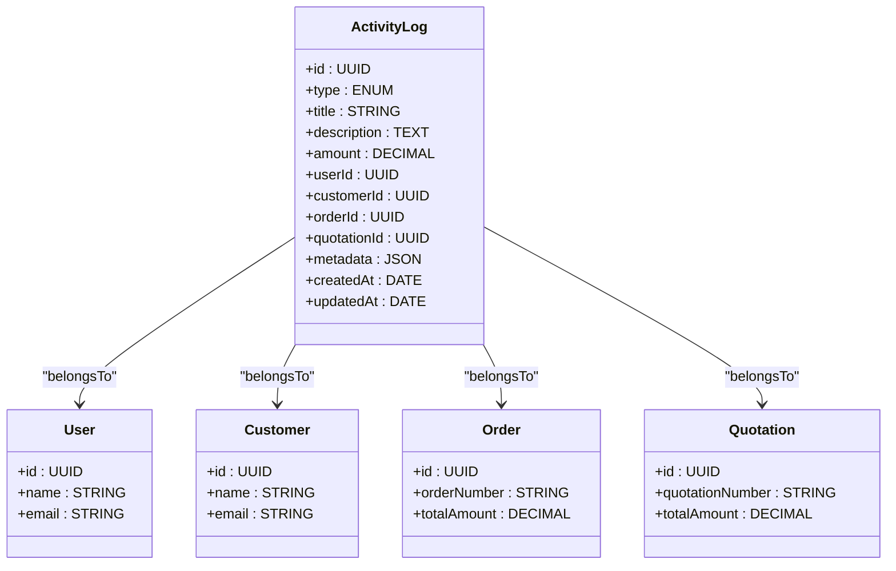

# 活动日志模型

<cite>
**本文档引用的文件**   
- [sales.js](file://backend/models/sales.js)
- [005_create_sales_tables.js](file://backend/migrations/005_create_sales_tables.js)
- [sales.ts](file://07-frontend/src/api/sales.ts)
- [salesController.js](file://backend/controllers/salesController.js)
- [salesService.js](file://backend/services/salesService.js)
</cite>

## 目录
1. [简介](#简介)
2. [模型设计与字段说明](#模型设计与字段说明)
3. [数据库表结构](#数据库表结构)
4. [多态关联设计](#多态关联设计)
5. [前端接口与渲染](#前端接口与渲染)
6. [查询与过滤实现](#查询与过滤实现)
7. [分页与归档策略](#分页与归档策略)
8. [问题排查指南](#问题排查指南)

## 简介
活动日志模型（ActivityLog）是销售系统中的核心组件，用于记录用户在销售流程中的各种操作事件。该模型不仅跟踪订单变更、客户互动等关键业务活动，还为审计、分析和监控提供数据支持。通过统一的日志记录机制，系统能够完整地追踪销售过程中的所有重要事件，确保数据的可追溯性和透明度。

## 模型设计与字段说明
活动日志模型的设计旨在灵活记录多种类型的销售相关活动。其核心字段包括：

- **type（类型）**：枚举类型，表示活动的类别，如订单、报价单、客户、付款、退款、发货等。该字段用于分类和过滤日志记录。
- **title（标题）**：活动的简短描述，便于用户快速理解日志内容。
- **description（描述）**：对活动的详细说明，提供上下文信息。
- **amount（金额）**：与活动相关的财务金额，如订单金额或付款金额。
- **userId（用户ID）**：执行操作的用户标识，用于追踪操作者。
- **customerId（客户ID）**：关联的客户标识，用于关联客户相关的活动。
- **orderId（订单ID）**：关联的订单标识，用于追踪订单生命周期中的变更。
- **quotationId（报价单ID）**：关联的报价单标识，用于记录报价相关活动。
- **metadata（元数据）**：JSON格式的额外信息，用于存储特定于活动类型的详细数据。
- **createdAt（创建时间）**：记录活动发生的时间戳，用于排序和时间范围查询。

这些字段共同构成了一个灵活且可扩展的日志记录系统，能够适应不同的业务需求。

**Section sources**
- [sales.js](file://backend/models/sales.js#L87-L163)

## 数据库表结构
活动日志表（activity_logs）的结构在数据库迁移文件中定义，确保了表的创建和约束的一致性。表结构包括以下关键元素：

- **主键**：使用UUID作为主键，确保全局唯一性。
- **外键约束**：
  - `userId` 引用 `users` 表的 `id` 字段，级联删除和更新。
  - `customerId` 引用 `customers` 表的 `id` 字段，删除时设为NULL，更新时级联。
  - `orderId` 引用 `orders` 表的 `id` 字段，删除时设为NULL，更新时级联。
  - `quotationId` 引用 `quotations` 表的 `id` 字段，删除时设为NULL，更新时级联。
- **索引**：为提高查询性能，创建了多个索引，包括 `(userId, createdAt)`、`customerId`、`orderId`、`quotationId`、`type` 和 `createdAt`。

这些设计确保了数据的完整性和查询效率。

**Section sources**
- [005_create_sales_tables.js](file://backend/migrations/005_create_sales_tables.js#L74-L128)

## 多态关联设计
活动日志模型通过多态关联设计，能够灵活地关联到不同类型的业务实体。在Sequelize模型定义中，`ActivityLog` 模型通过 `belongsTo` 关系与 `User`、`Customer`、`Order` 和 `Quotation` 模型建立关联。这种设计允许单个日志记录引用多个不同类型的实体，而无需为每种实体类型创建单独的日志表。

例如，一个订单变更的日志记录可以通过 `orderId` 字段关联到具体的订单，同时通过 `userId` 字段记录操作者。这种设计不仅简化了数据模型，还提高了系统的可维护性和扩展性。

**Diagram sources**
- [sales.js](file://backend/models/sales.js#L87-L163)
- [005_create_sales_tables.js](file://backend/migrations/005_create_sales_tables.js#L74-L128)

**Section sources**
- [sales.js](file://backend/models/sales.js#L261-L278)

## 前端接口与渲染
前端通过 `sales.ts` 文件中的 `SalesApi` 类与后端进行交互，获取和展示活动日志。`getActivities` 方法用于获取销售活动日志，支持多种查询参数，如活动类型、用户ID、客户ID、时间范围等。前端组件通过调用此API获取数据，并在UI中渲染日志列表和详情。

日志列表通常以表格形式展示，包含标题、类型、操作者、时间和相关实体等列。详情页面则提供更详细的信息，包括描述和元数据。前端还实现了分页和过滤功能，提升用户体验。

**Section sources**
- [sales.ts](file://07-frontend/src/api/sales.ts#L315-L331)

## 查询与过滤实现
活动日志的查询和过滤功能通过后端控制器和服务层实现。`SalesController` 中的 `getActivities` 方法处理HTTP请求，验证查询参数，并调用 `salesService.getActivities` 方法获取数据。服务层根据查询条件构建数据库查询，支持按类型、用户、客户、时间范围等条件过滤日志记录。

例如，查询特定用户在某段时间内的所有订单相关活动，可以通过传递 `userId`、`type` 和 `startDate`、`endDate` 参数实现。后端使用Sequelize的查询构建器生成SQL语句，确保查询的灵活性和安全性。

**Section sources**
- [salesController.js](file://backend/controllers/salesController.js#L284-L328)
- [salesService.js](file://backend/services/salesService.js)

## 分页与归档策略
为应对大量日志数据，系统实现了分页和归档策略。分页通过查询参数 `limit` 和 `before` 实现，允许前端按需加载日志记录，避免一次性加载过多数据。归档策略则通过定期任务将旧的日志记录移动到归档表或历史数据库，减少主表的数据量，提高查询性能。

此外，系统还建议对日志数据进行分区，按时间（如每月）创建分区表，进一步优化查询效率。归档和分区策略的结合使用，确保了系统在处理大规模日志数据时的稳定性和性能。

## 问题排查指南
当遇到日志丢失或信息不全的问题时，可以按照以下步骤进行排查：

1. **检查日志记录逻辑**：确保在业务逻辑中正确调用了日志记录方法，且所有必要字段都已填充。
2. **验证数据库约束**：检查外键约束是否导致记录被拒绝或设为NULL，特别是 `customerId`、`orderId` 和 `quotationId` 字段。
3. **审查查询条件**：确认前端传递的查询参数是否正确，避免因过滤条件过严导致日志记录未被返回。
4. **查看系统日志**：检查后端日志，查找是否有异常或错误信息，特别是数据库操作失败的记录。
5. **验证数据完整性**：通过直接查询数据库，确认日志记录是否确实存在，排除缓存或前端渲染问题。

通过以上步骤，可以有效定位和解决日志相关的问题，确保系统的可靠性和数据的完整性。

**Section sources**
- [sales.js](file://backend/models/sales.js#L87-L163)
- [005_create_sales_tables.js](file://backend/migrations/005_create_sales_tables.js#L74-L128)
- [sales.ts](file://07-frontend/src/api/sales.ts#L315-L331)
- [salesController.js](file://backend/controllers/salesController.js#L284-L328)
- [salesService.js](file://backend/services/salesService.js)