# 销售指标模型

<cite>
**本文档引用的文件**   
- [sales.js](file://backend/models/sales.js)
- [005_create_sales_tables.js](file://backend/migrations/005_create_sales_tables.js)
- [sales.ts](file://07-frontend/src/api/sales.ts)
- [salesController.js](file://backend/controllers/salesController.js)
- [salesService.js](file://backend/services/salesService.js)
</cite>

## 目录
1. [引言](#引言)
2. [核心指标设计与实现](#核心指标设计与实现)
3. [数据库结构分析](#数据库结构分析)
4. [前后端数据契约一致性](#前后端数据契约一致性)
5. [实际使用场景示例](#实际使用场景示例)
6. [常见问题排查](#常见问题排查)
7. [性能优化建议](#性能优化建议)
8. [结论](#结论)

## 引言
销售指标模型是企业数据分析系统的核心组成部分，用于衡量和监控销售团队的业绩表现。该模型通过聚合订单、客户、报价等业务数据，生成关键绩效指标（KPI），为管理层提供决策支持。本文档详细阐述SalesMetrics模型的设计与实现，重点说明totalRevenue（总收入）、totalOrders（总订单数）、conversionRate（转化率）、averageOrderValue（客单价）等核心指标的字段定义、数据类型及业务计算逻辑。

**Section sources**
- [sales.js](file://backend/models/sales.js#L165-L221)

## 核心指标设计与实现

### 字段定义与数据类型
SalesMetrics模型在`backend/models/sales.js`中定义，其核心指标字段如下：

- **totalRevenue**：总收入，数据类型为DECIMAL(15, 2)，默认值为0，表示统计周期内的总销售额。
- **totalOrders**：总订单数，数据类型为INTEGER，默认值为0，表示统计周期内的订单总数。
- **conversionRate**：转化率，数据类型为DECIMAL(5, 2)，默认值为0，表示订单数与报价单数量的比率，以百分比形式存储。
- **averageOrderValue**：平均订单价值，数据类型为DECIMAL(15, 2)，默认值为0，表示每个订单的平均金额。

这些字段通过Sequelize ORM框架定义，确保了数据的精度和一致性。

### 业务计算逻辑
核心指标的计算逻辑主要在`backend/services/salesService.js`中实现。`getSalesMetrics`方法负责聚合数据并计算指标：

- **totalRevenue** 和 **totalOrders** 通过查询订单表（Order）并使用`SUM`和`COUNT`聚合函数计算得出。
- **conversionRate** 的计算公式为：`convertedOrders / quotationCount * 100`，其中`convertedOrders`是成功转化为订单的报价数量，`quotationCount`是总报价数量。
- **averageOrderValue** 的计算公式为：`totalRevenue / totalOrders`，即总收入除以总订单数。


**Diagram sources **
- [salesService.js](file://backend/services/salesService.js#L16-L95)

**Section sources**
- [sales.js](file://backend/models/sales.js#L165-L221)
- [salesService.js](file://backend/services/salesService.js#L16-L95)

## 数据库结构分析

### sales_metrics表结构
`005_create_sales_tables.js`迁移文件定义了`sales_metrics`表的结构。该表是SalesMetrics模型的物理实现，包含以下字段：

- **id**：主键，UUID类型，唯一标识每条记录。
- **date**：日期，DATEONLY类型，表示统计的日期。
- **period**：统计周期，ENUM类型，可选值包括daily、weekly、monthly、quarterly、yearly。
- **totalRevenue**、**totalOrders**、**conversionRate**、**averageOrderValue**：核心指标字段，数据类型与模型定义一致。
- **userId**：外键，UUID类型，关联到`users`表，表示销售人员ID。
- **regionId**：外键，UUID类型，关联到`regions`表，表示区域ID。

### 主键与索引
- **主键**：`id`字段是主键，确保每条记录的唯一性。
- **索引**：为提高查询性能，创建了多个索引：
  - `date`和`period`字段的复合索引，用于按时间范围查询。
  - `userId`字段的索引，用于按销售人员查询。
  - `regionId`字段的索引，用于按区域查询。

### 外键关联
`sales_metrics`表通过`userId`字段与`users`表建立外键关联，确保数据的完整性和一致性。外键约束定义在迁移文件中，`onDelete`和`onUpdate`行为设置为`CASCADE`，表示当用户被删除或更新时，相关的销售指标记录也会被级联删除或更新。

```mermaid
erDiagram
sales_metrics {
uuid id PK
date date
enum period
decimal totalRevenue
integer totalOrders
decimal conversionRate
decimal averageOrderValue
uuid userId FK
uuid regionId FK
}
users {
uuid id PK
string name
string email
}
regions {
uuid id PK
string name
string code
}
sales_metrics ||--o{ users : "销售人员"
sales_metrics ||--o{ regions : "区域"
```



**Diagram sources **
- [005_create_sales_tables.js](file://backend/migrations/005_create_sales_tables.js#L130-L203)

**Section sources**
- [005_create_sales_tables.js](file://backend/migrations/005_create_sales_tables.js#L130-L203)

## 前后端数据契约一致性

### 前端SalesMetrics接口
`07-frontend/src/api/sales.ts`中定义了`SalesMetrics`接口，用于描述前端接收的销售指标数据结构。该接口与后端模型保持高度一致：

```typescript
export interface SalesMetrics {
  revenue: {
    value: number
    compareValue: number
    trend: 'up' | 'down' | 'stable'
    trendPercentage: number
  }
  orders: {
    value: number
    compareValue: number
    trend: 'up' | 'down' | 'stable'
    trendPercentage: number
  }
  conversion: {
    value: number
    compareValue: number
    trend: 'up' | 'down' | 'stable'
    trendPercentage: number
  }
  averageOrderValue: number
  averageCustomerValue: number
}
```

### 数据契约设计
- **字段映射**：前端接口中的`revenue.value`对应后端的`totalRevenue`，`orders.value`对应`totalOrders`，`conversion.value`对应`conversionRate`，`averageOrderValue`直接对应。
- **扩展属性**：前端接口增加了`compareValue`、`trend`和`trendPercentage`等属性，用于展示与上期数据的比较结果和趋势分析，这些数据由后端在`getSalesMetrics`方法中计算并返回。
- **类型安全**：使用TypeScript的强类型系统，确保前后端数据类型一致，减少运行时错误。


**Diagram sources **
- [sales.ts](file://07-frontend/src/api/sales.ts#L74-L101)
- [salesService.js](file://backend/services/salesService.js#L16-L95)

**Section sources**
- [sales.ts](file://07-frontend/src/api/sales.ts#L74-L101)
- [salesService.js](file://backend/services/salesService.js#L16-L95)

## 实际使用场景示例

### 仪表盘数据展示
在`07-frontend/src/pages/dashboard/SalesDashboard.vue`中，使用`SalesApi.getSalesMetrics`方法获取销售指标，并在仪表盘中展示。例如，显示总收入、总订单数、转化率和客单价的卡片，以及与上期数据的对比和趋势箭头。

### KPI分析
销售经理可以使用`SalesApi.getSalesComparison`方法，对比不同时间段的销售业绩，分析KPI的变化趋势。例如，比较本月与上月的总收入和订单数，评估销售策略的有效性。

**Section sources**
- [sales.ts](file://07-frontend/src/api/sales.ts#L220-L223)
- [salesService.js](file://backend/services/salesService.js#L16-L95)

## 常见问题排查

### 数据延迟更新
当发现销售指标数据未及时更新时，可能的原因包括：
- **数据同步延迟**：检查订单和报价数据是否已成功写入数据库。
- **缓存问题**：清除前端缓存或强制刷新页面。
- **服务异常**：检查后端服务日志，确认`salesService.getSalesMetrics`方法是否正常执行。

排查方法：
1. 检查数据库中的`orders`和`quotations`表，确认最新数据已存在。
2. 查看后端日志，确认`getSalesMetrics`方法的执行时间和返回结果。
3. 使用Postman等工具直接调用API，验证接口返回的数据。

**Section sources**
- [salesService.js](file://backend/services/salesService.js#L16-L95)
- [salesController.js](file://backend/controllers/salesController.js#L8-L37)

## 性能优化建议

### 数据库聚合索引
为提高查询性能，建议在`sales_metrics`表上创建以下聚合索引：
- 在`date`和`period`字段上创建复合索引，以加速按时间范围的查询。
- 在`userId`和`regionId`字段上创建索引，以加速按销售人员和区域的查询。

### 缓存策略
对于频繁访问但不常变化的指标数据，可以使用Redis等缓存系统进行缓存，减少数据库查询压力。例如，将每日的销售指标缓存1小时，避免重复计算。

### 分页和限流
对于大量数据的查询，如销售趋势和排行，应实现分页和限流机制，避免一次性返回过多数据导致性能问题。

**Section sources**
- [005_create_sales_tables.js](file://backend/migrations/005_create_sales_tables.js#L217-L219)
- [salesService.js](file://backend/services/salesService.js#L16-L95)

## 结论
SalesMetrics模型通过精心设计的字段定义、清晰的业务计算逻辑和高效的数据库结构，实现了对销售业绩的全面监控。前后端通过一致的数据契约确保了数据的准确传输。在实际应用中，该模型支持仪表盘展示和KPI分析等多种场景。通过合理的性能优化措施，可以确保系统在高并发下的稳定运行。