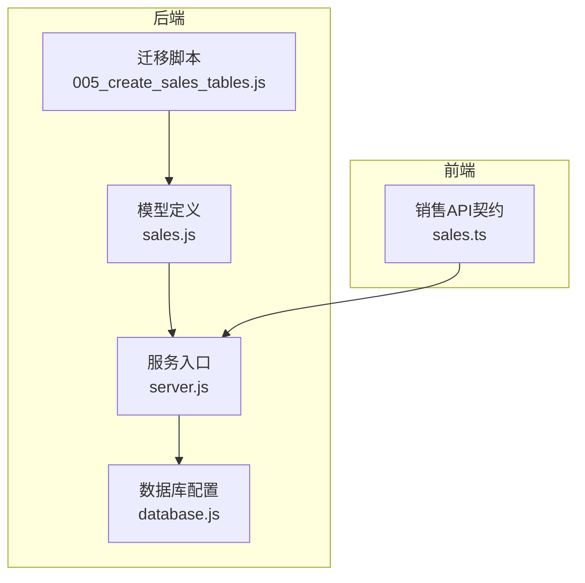
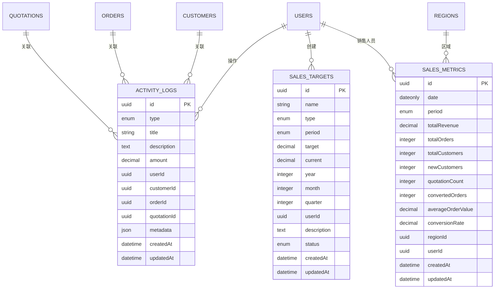
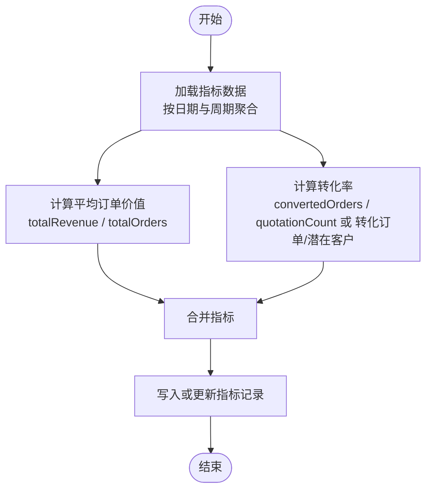
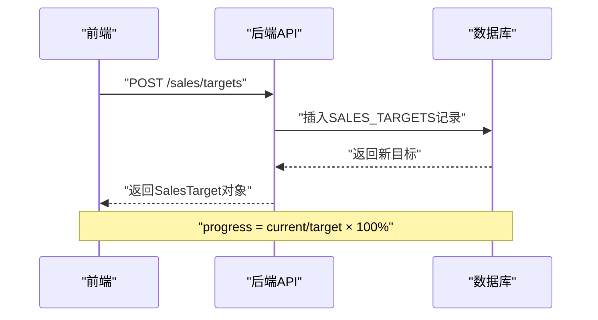
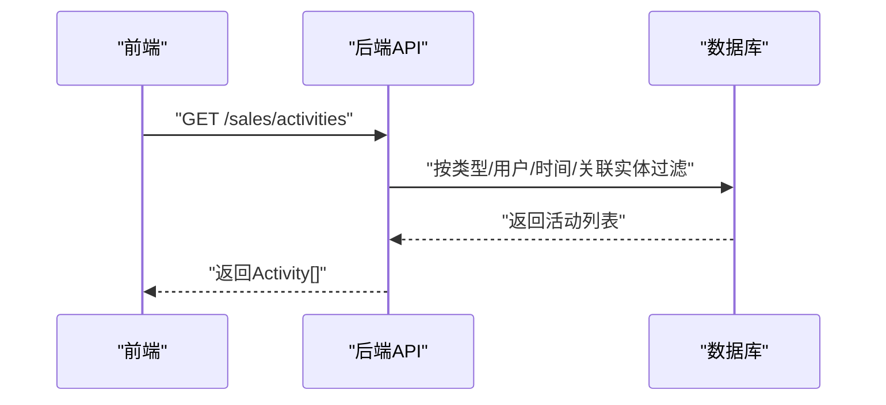
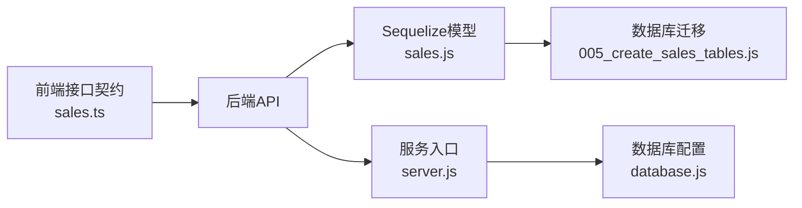

# 销售数据模型

<cite>
**本文引用的文件**
- [005_create_sales_tables.js](file://backend/migrations/005_create_sales_tables.js)
- [sales.js](file://backend/models/sales.js)
- [sales.ts](file://07-frontend/src/api/sales.ts)
- [server.js](file://backend/server.js)
- [database.js](file://backend/config/database.js)
</cite>

## 目录
1. [简介](#简介)
2. [项目结构](#项目结构)
3. [核心组件](#核心组件)
4. [架构概览](#架构概览)
5. [详细组件分析](#详细组件分析)
6. [依赖分析](#依赖分析)
7. [性能考虑](#性能考虑)
8. [故障排查指南](#故障排查指南)
9. [结论](#结论)
10. [附录](#附录)

## 简介
本文件聚焦销售领域三大核心数据模型：SalesMetrics（销售指标）、SalesTarget（销售目标）与ActivityLog（活动日志）。文档基于数据库迁移脚本与前后端TypeScript接口定义，系统梳理三者的字段、业务含义、计算逻辑与外键约束，并说明前端数据契约与后端模型之间的映射关系，帮助开发者快速理解与扩展销售数据模型。

## 项目结构
销售数据模型涉及以下关键文件：
- 数据库迁移：用于创建销售相关表、索引与外键约束
- 模型定义：Sequelize模型定义及关联关系
- 前端接口契约：TypeScript接口定义，描述前后端数据交换格式
- 后端服务：提供健康检查与静态资源服务（销售相关路由在其他模块）

图表来源
- [005_create_sales_tables.js](file://backend/migrations/005_create_sales_tables.js#L1-L288)
- [sales.js](file://backend/models/sales.js#L1-L296)
- [sales.ts](file://07-frontend/src/api/sales.ts#L1-L522)
- [server.js](file://backend/server.js#L1-L81)
- [database.js](file://backend/config/database.js#L1-L179)

章节来源
- [005_create_sales_tables.js](file://backend/migrations/005_create_sales_tables.js#L1-L288)
- [sales.js](file://backend/models/sales.js#L1-L296)
- [sales.ts](file://07-frontend/src/api/sales.ts#L1-L522)
- [server.js](file://backend/server.js#L1-L81)
- [database.js](file://backend/config/database.js#L1-L179)

## 核心组件
- SalesMetrics（销售指标）
  - 字段要点：日期、统计周期、总收入、总订单数、总客户数、新客户数、报价单数量、转化的订单数、平均订单价值、转化率、区域与销售人员关联
  - 业务含义：反映某统计周期内的销售表现与客户行为，支持趋势分析与KPI监控
- SalesTarget（销售目标）
  - 字段要点：目标名称、目标类型（收入/订单/客户/利润）、周期（月度/季度/年度）、目标值、当前值、年份、月/季度、创建用户、状态、描述
  - 业务含义：为个人或团队设定可追踪的目标，支持进度与完成度评估
- ActivityLog（活动日志）
  - 字段要点：活动类型（订单/报价单/客户/支付/退款/发货）、标题、描述、相关金额、操作用户、客户/订单/报价单关联、元数据、时间戳
  - 业务含义：记录与销售流程相关的关键事件，便于审计与回溯

章节来源
- [005_create_sales_tables.js](file://backend/migrations/005_create_sales_tables.js#L130-L203)
- [sales.js](file://backend/models/sales.js#L1-L296)
- [sales.ts](file://07-frontend/src/api/sales.ts#L103-L144)

## 架构概览
销售数据模型通过迁移脚本在数据库层面建立三张核心表，并在Sequelize层定义模型与关联关系；前端通过TypeScript接口与后端API交互，形成“前端契约—后端模型—数据库表”的闭环。

图表来源
- [005_create_sales_tables.js](file://backend/migrations/005_create_sales_tables.js#L1-L288)
- [sales.js](file://backend/models/sales.js#L253-L296)

## 详细组件分析

### SalesMetrics（销售指标）模型
- 字段与业务含义
  - date：统计日期，用于按日/周/月/季/年聚合
  - period：统计周期枚举，决定聚合粒度
  - totalRevenue：该周期内累计收入
  - totalOrders：该周期内累计订单数
  - totalCustomers/newCustomers：累计客户数与新增客户数
  - quotationCount：报价单数量
  - convertedOrders：从报价到订单的转化订单数
  - averageOrderValue：平均订单价值（通常由收入/订单数推导）
  - conversionRate：转化率（通常由转化订单/报价单或转化订单/潜在客户推导）
  - regionId/userId：区域与销售人员关联，支持分维度分析
- 计算逻辑与复杂度
  - averageOrderValue ≈ totalRevenue / totalOrders（整除校验与边界处理）
  - conversionRate（示例思路）
    - 若以报价到订单的转化：conversionRate = convertedOrders / quotationCount × 100%
    - 若以潜在客户到订单的转化：conversionRate = convertedOrders / 潜在客户数 × 100%
  - 复杂度：单表聚合查询 O(n)，带索引优化后可降至 O(log n + k)
- 外键与索引
  - regionId、userId 作为外键关联至区域与用户表
  - 索引覆盖 date+period、userId、regionId，提升查询性能
- 前后端契约映射
  - 前端接口返回的销售指标对象包含 revenue/orders/customers/conversion 及平均订单价值等字段，与数据库字段一一对应

图表来源
- [005_create_sales_tables.js](file://backend/migrations/005_create_sales_tables.js#L130-L203)
- [sales.js](file://backend/models/sales.js#L165-L221)
- [sales.ts](file://07-frontend/src/api/sales.ts#L74-L101)

章节来源
- [005_create_sales_tables.js](file://backend/migrations/005_create_sales_tables.js#L130-L203)
- [sales.js](file://backend/models/sales.js#L165-L221)
- [sales.ts](file://07-frontend/src/api/sales.ts#L74-L101)

### SalesTarget（销售目标）模型
- 字段与业务含义
  - name/type/period/target/current/year/month/quarter：目标名称、类型（收入/订单/客户/利润）、周期、目标值、当前值、年份与周期细分
  - userId/status/description：创建用户、状态（启用/完成/取消）、描述
- 设定逻辑
  - period + year 决定目标归属周期；month/quarter 仅在相应周期下生效
  - current 字段用于跟踪进度，progress 可由后端计算（current/target × 100%）
- 外键与索引
  - userId 外键关联 users 表
  - 索引覆盖 userId+period+year、type、status，便于筛选与排序
- 前后端契约映射
  - 前端接口定义了 SalesTarget 类型，包含 progress 字段，与数据库 current/target 的映射关系需在后端计算

图表来源
- [005_create_sales_tables.js](file://backend/migrations/005_create_sales_tables.js#L5-L72)
- [sales.js](file://backend/models/sales.js#L1-L85)
- [sales.ts](file://07-frontend/src/api/sales.ts#L115-L128)

章节来源
- [005_create_sales_tables.js](file://backend/migrations/005_create_sales_tables.js#L5-L72)
- [sales.js](file://backend/models/sales.js#L1-L85)
- [sales.ts](file://07-frontend/src/api/sales.ts#L115-L128)

### ActivityLog（活动日志）模型
- 字段与业务含义
  - type/title/description/amount：活动类型与描述、相关金额
  - userId/customerId/orderId/quotationId：关联用户、客户、订单、报价单
  - metadata：额外元数据，便于扩展
- 外键与索引
  - userId 外键关联 users
  - customerId 外键关联 customers（删除设为空）
  - orderId 外键关联 orders（删除设为空）
  - quotationId 外键关联 quotations（删除设为空）
  - 索引覆盖 userId+createdAt、customerId、orderId、quotationId、type、createdAt
- 前后端契约映射
  - 前端接口定义了 Activity 类型，包含用户、客户、订单、报价单标识与时间戳等字段

图表来源
- [005_create_sales_tables.js](file://backend/migrations/005_create_sales_tables.js#L74-L128)
- [sales.js](file://backend/models/sales.js#L87-L163)
- [sales.ts](file://07-frontend/src/api/sales.ts#L130-L144)

章节来源
- [005_create_sales_tables.js](file://backend/migrations/005_create_sales_tables.js#L74-L128)
- [sales.js](file://backend/models/sales.js#L87-L163)
- [sales.ts](file://07-frontend/src/api/sales.ts#L130-L144)

## 依赖分析
- 模型与数据库
  - 迁移脚本定义三张表的结构、索引与外键约束
  - 模型定义与迁移脚本字段保持一致，并补充关联关系
- 前后端契约
  - 前端 sales.ts 定义了 SalesMetrics、SalesTarget、Activity 等接口，用于与后端API交互
  - 后端 server.js 提供基础服务与健康检查，销售相关路由在其他模块
- 外部依赖
  - database.js 使用 better-sqlite3（注意：迁移脚本使用的是 Sequelize/MySQL），两者不冲突，分别服务于不同模块

图表来源
- [sales.ts](file://07-frontend/src/api/sales.ts#L1-L522)
- [sales.js](file://backend/models/sales.js#L1-L296)
- [005_create_sales_tables.js](file://backend/migrations/005_create_sales_tables.js#L1-L288)
- [server.js](file://backend/server.js#L1-L81)
- [database.js](file://backend/config/database.js#L1-L179)

章节来源
- [sales.ts](file://07-frontend/src/api/sales.ts#L1-L522)
- [sales.js](file://backend/models/sales.js#L1-L296)
- [005_create_sales_tables.js](file://backend/migrations/005_create_sales_tables.js#L1-L288)
- [server.js](file://backend/server.js#L1-L81)
- [database.js](file://backend/config/database.js#L1-L179)

## 性能考虑
- 索引策略
  - sales_targets：userId+period+year、type、status，支持目标筛选与状态统计
  - activity_logs：userId+createdAt、customerId、orderId、quotationId、type、createdAt，支持按用户与实体维度检索
  - sales_metrics：date+period、userId、regionId，支持按周期与人员/区域聚合
- 查询建议
  - 聚合查询优先使用索引列进行过滤与排序
  - 对高并发场景，建议对热点字段增加复合索引
- 存储与计算
  - averageOrderValue 与 conversionRate 建议在入库时计算并缓存，避免重复计算
  - 对历史数据归档与分区策略可进一步优化长周期查询性能

## 故障排查指南
- 常见问题
  - 外键约束报错：检查 users、customers、orders、quotations 表是否存在且 ID 有效
  - 查询性能差：确认是否命中索引；必要时添加复合索引
  - 数据不一致：核对 averageOrderValue 与 conversionRate 的计算逻辑与边界条件
- 建议步骤
  - 使用数据库客户端验证表结构与索引
  - 在后端日志中定位慢查询与异常
  - 前端通过 sales.ts 的接口返回体核对字段映射

章节来源
- [005_create_sales_tables.js](file://backend/migrations/005_create_sales_tables.js#L205-L288)
- [sales.js](file://backend/models/sales.js#L253-L296)
- [sales.ts](file://07-frontend/src/api/sales.ts#L74-L144)

## 结论
本文件基于迁移脚本与TypeScript接口，系统梳理了 SalesMetrics、SalesTarget 与 ActivityLog 三类核心模型的字段、业务含义与计算逻辑，并明确了外键约束与索引策略。通过前后端契约与模型定义的映射，可确保数据一致性与可维护性。后续可在入库时完善指标计算与缓存策略，以提升查询性能与用户体验。

## 附录
- 关键字段速查
  - SalesMetrics：date、period、totalRevenue、totalOrders、totalCustomers、newCustomers、quotationCount、convertedOrders、averageOrderValue、conversionRate、regionId、userId
  - SalesTarget：name、type、period、target、current、year、month、quarter、userId、status、description
  - ActivityLog：type、title、description、amount、userId、customerId、orderId、quotationId、metadata
- 前端接口速查
  - SalesMetrics、SalesTarget、Activity 等接口类型定义位于 sales.ts