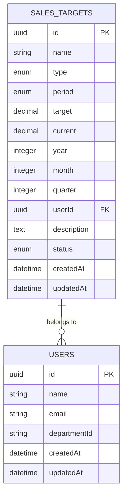
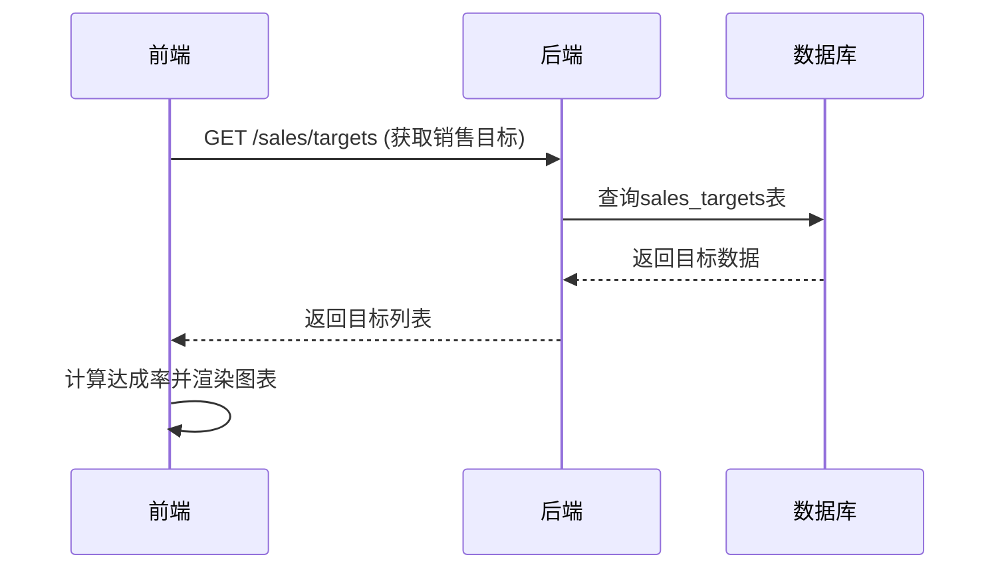

# 销售目标模型

<cite>
**本文档引用的文件**
- [sales.js](file://backend/models/sales.js)
- [005_create_sales_tables.js](file://backend/migrations/005_create_sales_tables.js)
- [sales.ts](file://07-frontend/src/api/sales.ts)
- [salesController.js](file://backend/controllers/salesController.js)
- [salesService.js](file://backend/services/salesService.js)
</cite>

## 目录
1. [引言](#引言)
2. [SalesTarget模型结构分析](#salestarget模型结构分析)
3. [数据库表创建与约束](#数据库表创建与约束)
4. [前端数据消费与应用](#前端数据消费与应用)
5. [业务流程示例](#业务流程示例)
6. [数据一致性维护策略](#数据一致性维护策略)
7. [常见问题与解决方案](#常见问题与解决方案)
8. [结论](#结论)

## 引言
销售目标模型是企业销售管理系统的核心组成部分，用于定义、跟踪和评估销售团队或个人的业绩目标。该模型通过结构化的数据设计，支持月度、季度和年度等不同周期的目标设定，并与用户、部门等组织结构建立关联。本文档将深入解析SalesTarget模型的结构与业务应用，重点描述关键字段的含义与约束，分析模型的验证规则和默认值设置，说明前端如何消费该模型数据，并提供目标设定与动态调整的业务流程示例。

## SalesTarget模型结构分析

SalesTarget模型定义了销售目标的核心属性，包括目标名称、类型、周期、目标值、当前值、年份、月份、季度、创建用户ID、描述和状态等字段。模型通过Sequelize ORM框架定义，确保了数据的完整性和一致性。

### 关键字段解析

#### period（周期）
周期字段定义了销售目标的时间范围，支持月度、季度和年度三种类型。该字段为枚举类型，确保了数据的有效性。在月度目标中，月份字段必须指定；在季度目标中，季度字段必须指定。

#### year（年份）
年份字段指定了销售目标所属的年份，为整数类型，且不能为空。该字段与周期字段结合，共同确定了目标的时间范围。

#### targetAmount（目标金额）
目标金额字段在模型中对应`target`字段，为DECIMAL(15, 2)类型，表示目标值的金额。该字段不能为空，且默认值为0。目标金额是衡量销售业绩的关键指标，通常与收入、订单、客户或利润等目标类型相关联。

#### achievedAmount（达成金额）
达成金额字段在模型中对应`current`字段，为DECIMAL(15, 2)类型，表示当前已达成的金额。该字段的默认值为0，随着销售活动的进行，该值会动态更新。达成金额与目标金额的比值即为目标达成率。

### 验证规则与默认值设置
模型在定义时设置了严格的验证规则和默认值，确保数据的完整性和一致性。例如，`name`、`type`、`period`、`target`和`year`字段均设置为`allowNull: false`，确保这些关键字段不能为空。`current`字段的默认值为0，`status`字段的默认值为'active'，`createdAt`和`updatedAt`字段的默认值为当前时间。

**Section sources**
- [sales.js](file://backend/models/sales.js#L1-L85)

## 数据库表创建与约束

### 表创建过程
`005_create_sales_tables.js`迁移文件定义了`sales_targets`表的创建过程。该文件使用Sequelize的`createTable`方法创建表，并定义了所有字段的类型、约束和注释。表的主键为`id`字段，类型为UUID，确保了全局唯一性。

### 时间范围约束
表结构中通过`year`、`month`和`quarter`字段实现了时间范围的约束。`year`字段为必填项，`month`和`quarter`字段根据`period`字段的值选择性填写。例如，当`period`为'monthly'时，`month`字段必须填写；当`period`为'quarterly'时，`quarter`字段必须填写。

### 与user或department的关联关系
`sales_targets`表通过`userId`字段与`users`表建立了外键关联，确保了每个销售目标都归属于一个具体的用户。外键约束设置为`onDelete: 'CASCADE'`和`onUpdate: 'CASCADE'`，当用户被删除或更新时，相关的销售目标也会被级联删除或更新。

**Diagram sources**
- [005_create_sales_tables.js](file://backend/migrations/005_create_sales_tables.js#L6-L56)
- [sales.js](file://backend/models/sales.js#L5-L85)

## 前端数据消费与应用

### SalesTarget接口定义
前端通过`07-frontend/src/api/sales.ts`文件中的`SalesTarget`接口定义来消费后端的销售目标数据。该接口定义了与后端模型对应的字段，包括`id`、`name`、`type`、`period`、`target`、`current`、`progress`、`year`、`month`、`quarter`、`createdAt`和`updatedAt`。`progress`字段是计算字段，表示目标达成率。

### 目标达成率图表应用
前端通过调用`getSalesTargets` API获取销售目标数据，并在目标达成率图表中展示。图表通常以柱状图或进度条的形式显示每个目标的达成情况，帮助销售团队直观地了解业绩进展。

**Diagram sources**
- [sales.ts](file://07-frontend/src/api/sales.ts#L115-L128)
- [salesController.js](file://backend/controllers/salesController.js#L175-L209)
- [salesService.js](file://backend/services/salesService.js#L365-L391)

## 业务流程示例

### 目标设定流程
1. 销售经理登录系统，进入销售目标管理页面。
2. 点击“创建目标”按钮，填写目标名称、类型、周期、目标金额、年份、月份或季度等信息。
3. 系统验证输入数据的有效性，如周期与月份/季度的匹配性。
4. 提交目标，系统将目标数据保存到`sales_targets`表中，并设置状态为'active'。
5. 目标创建成功后，系统通知相关销售人员。

### 动态调整流程
1. 销售经理根据市场变化或业务需求，进入目标管理页面。
2. 选择需要调整的目标，点击“编辑”按钮。
3. 修改目标金额或其他相关信息。
4. 系统验证修改后的数据有效性。
5. 提交修改，系统更新`sales_targets`表中的相应记录。
6. 系统记录修改日志，并通知相关人员。

**Section sources**
- [salesController.js](file://backend/controllers/salesController.js#L214-L279)
- [salesService.js](file://backend/services/salesService.js#L440-L471)

## 数据一致性维护策略

### 事务处理
在创建或更新销售目标时，系统使用数据库事务确保数据的一致性。例如，在创建目标时，如果同时需要创建相关的活动日志，则这两个操作会在同一个事务中执行，确保要么全部成功，要么全部失败。

### 外键约束
通过外键约束，确保了`sales_targets`表中的`userId`字段始终引用`users`表中的有效用户。当用户被删除时，相关的销售目标会被级联删除，避免了孤儿记录的产生。

### 数据验证
系统在多个层次上实施数据验证，包括前端输入验证、API参数验证和数据库约束。例如，`salesService.js`中的`validateTargetCreation`方法会验证目标创建数据的有效性，确保周期与月份/季度的匹配性。

**Section sources**
- [salesService.js](file://backend/services/salesService.js#L440-L471)
- [salesController.js](file://backend/controllers/salesController.js#L220-L227)

## 常见问题与解决方案

### 目标重叠问题
**问题描述**：多个销售目标的时间范围重叠，导致业绩计算混乱。
**解决方案**：在创建目标时，系统应检查是否存在时间范围重叠的目标。如果存在，则提示用户调整时间范围或合并目标。

### 时间范围错误
**问题描述**：用户在创建月度目标时未填写月份，或在创建季度目标时未填写季度。
**解决方案**：在前端表单中，根据周期字段的值动态显示或隐藏月份和季度字段。在后端API中，验证周期与月份/季度的匹配性，如果不符合则返回错误信息。

**Section sources**
- [salesController.js](file://backend/controllers/salesController.js#L220-L227)
- [salesService.js](file://backend/services/salesService.js#L440-L471)

## 结论
SalesTarget模型通过结构化的数据设计和严格的验证规则，为销售目标的管理提供了坚实的基础。通过与用户、部门等组织结构的关联，以及前端数据消费的应用，该模型支持了从目标设定到业绩评估的完整业务流程。通过实施数据一致性维护策略和解决常见问题，系统能够确保销售目标数据的准确性和可靠性，为企业的销售管理提供有力支持。