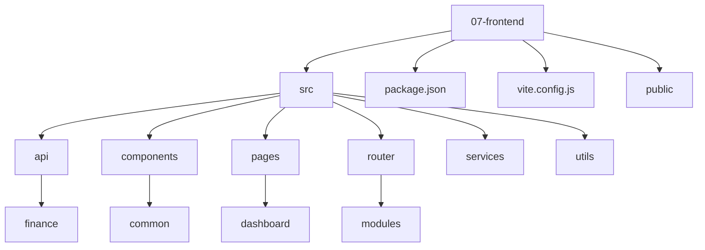
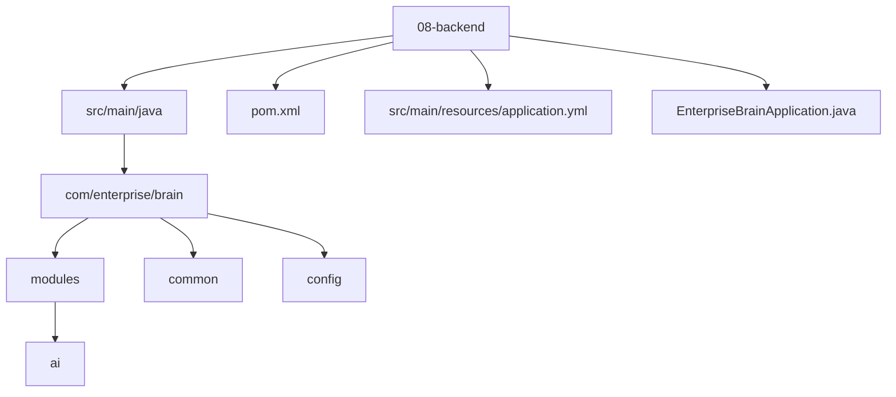
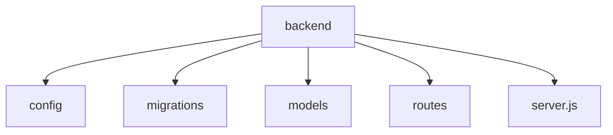
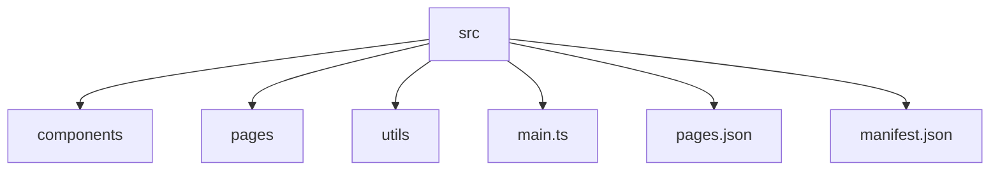
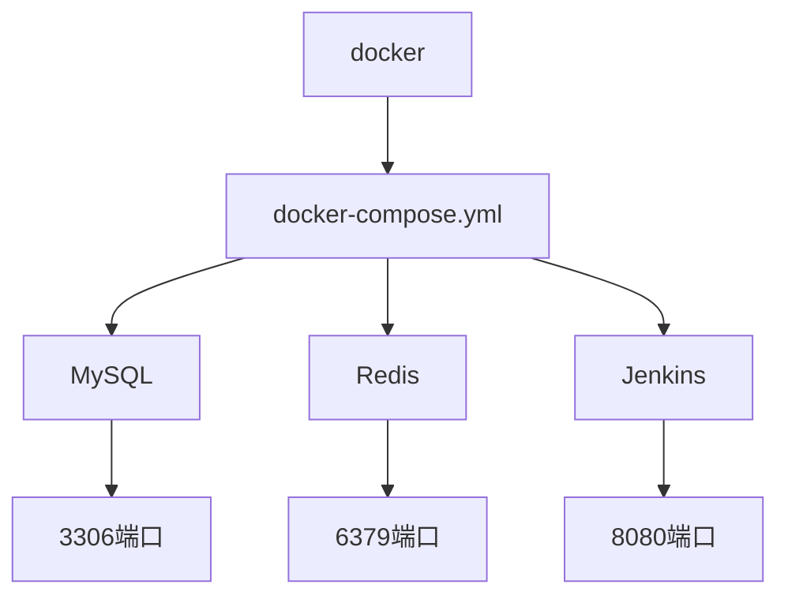
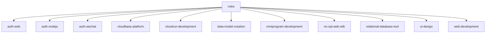
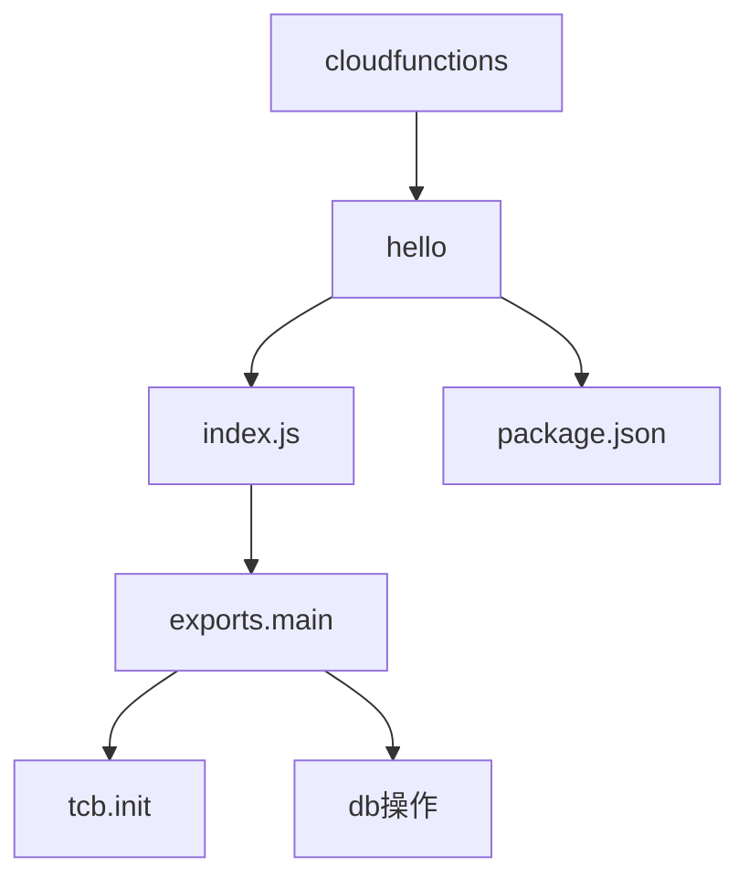
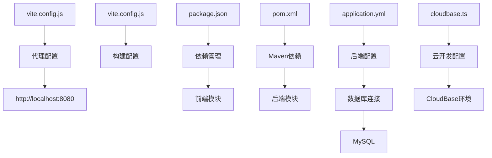
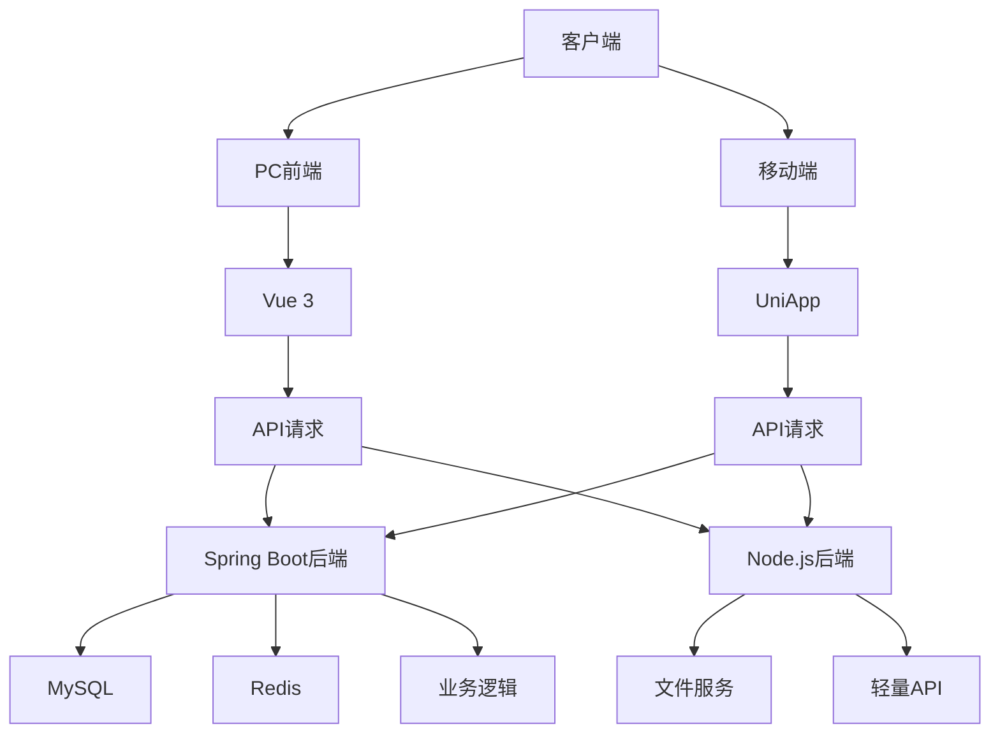

# 目录结构说明

<cite>
**本文档引用的文件**  
- [package.json](file://07-frontend/package.json)
- [vite.config.js](file://07-frontend/vite.config.js)
- [pom.xml](file://08-backend/pom.xml)
- [application.yml](file://08-backend/src/main/resources/application.yml)
- [server.js](file://backend/server.js)
- [main.js](file://07-frontend/src/main.js)
- [index.js](file://07-frontend/src/router/index.js)
- [EnterpriseBrainApplication.java](file://08-backend/src/main/java/com/enterprise/brain/EnterpriseBrainApplication.java)
- [main.ts](file://src/main.ts)
- [cloudbase.ts](file://src/utils/cloudbase.ts)
- [docker-compose.yml](file://docker/docker-compose.yml)
- [index.js](file://cloudfunctions/hello/index.js)
- [rule.md](file://rules/auth-web/rule.md)
</cite>

## 目录结构说明

### 07-frontend（PC前端）
该目录是企业大脑系统的PC端前端应用，基于Vue 3 + Vite构建，采用模块化路由设计。前端应用通过Vite开发服务器运行在3001端口，并通过代理配置将API请求转发到后端服务。项目使用Element Plus作为UI组件库，Pinia进行状态管理，Vue Router实现路由控制。

**目录来源**  
- [package.json](file://07-frontend/package.json)
- [vite.config.js](file://07-frontend/vite.config.js)
- [main.js](file://07-frontend/src/main.js)

### 08-backend（Spring Boot后端）
该目录是系统的主要后端服务，基于Spring Boot 3.1.0构建，使用Java 17开发。后端服务提供RESTful API接口，通过MyBatis Plus与MySQL数据库交互，使用Redis进行缓存管理。服务运行在8080端口，API路径以/api为前缀。项目采用模块化设计，包含AI、财务、系统管理等多个业务模块。

**目录来源**  
- [pom.xml](file://08-backend/pom.xml)
- [application.yml](file://08-backend/src/main/resources/application.yml)
- [EnterpriseBrainApplication.java](file://08-backend/src/main/java/com/enterprise/brain/EnterpriseBrainApplication.java)

### backend（Node.js后端）
该目录是系统的辅助后端服务，基于Express框架构建，使用Node.js开发。该服务主要处理物料管理相关的API请求，运行在3005端口。与Spring Boot后端形成双后端架构，分别处理不同类型的业务逻辑。这种架构设计使得系统能够灵活应对不同技术栈的需求。

**目录来源**  
- [server.js](file://backend/server.js)

### src（UniApp移动端）
该目录是系统的移动端应用，基于UniApp框架开发，支持多端部署。项目使用Vue 3语法，通过uni-app编译器生成各平台应用。移动端应用通过云开发(CloudBase)实现后端服务集成，支持微信小程序、H5等多种部署方式。应用配置在pages.json中定义页面路由和全局样式。

**目录来源**  
- [main.ts](file://src/main.ts)
- [pages.json](file://src/pages.json)
- [cloudbase.ts](file://src/utils/cloudbase.ts)

## docker目录
该目录包含Docker容器编排配置，通过docker-compose.yml文件定义了MySQL、Redis和Jenkins三个服务的容器化部署。MySQL容器运行在3306端口，用于存储应用数据；Redis容器运行在6379端口，用于缓存管理；Jenkins容器运行在8080端口，用于CI/CD持续集成。所有服务通过app-network网络进行通信。

**目录来源**  
- [docker-compose.yml](file://docker/docker-compose.yml)

## rules目录
该目录包含各类规则文档，定义了系统各模块的开发规范和使用指南。其中包括Web端认证、Node.js认证、微信小程序认证等多种认证方式的详细说明，以及云开发平台、数据库工具、UI设计等方面的规范。这些规则文档为开发者提供了统一的技术标准和最佳实践指导。

**目录来源**  
- [rule.md](file://rules/auth-web/rule.md)

## cloudfunctions目录
该目录包含云函数代码，基于腾讯云CloudBase平台。云函数使用Node.js开发，通过@cloudbase/node-sdk与云开发环境交互。每个云函数目录包含index.js入口文件和package.json依赖配置。云函数可以独立部署和运行，用于处理特定的业务逻辑或作为后端服务的补充。

**目录来源**  
- [index.js](file://cloudfunctions/hello/index.js)

## 配置文件协同工作机制
项目中的配置文件通过分层设计实现协同工作。前端使用package.json和vite.config.js管理依赖和构建配置，后端使用pom.xml管理Maven依赖，移动端使用tsconfig.json管理TypeScript编译选项。各配置文件通过环境变量和路径别名实现跨模块引用，确保开发、测试和生产环境的一致性。

**配置来源**  
- [package.json](file://07-frontend/package.json)
- [vite.config.js](file://07-frontend/vite.config.js)
- [pom.xml](file://08-backend/pom.xml)
- [application.yml](file://08-backend/src/main/resources/application.yml)
- [cloudbase.ts](file://src/utils/cloudbase.ts)

## 多前端入口与双后端架构
系统采用多前端入口设计，PC端使用Vue 3 + Vite技术栈，移动端使用UniApp框架，两者共享部分业务逻辑但拥有独立的用户界面。双后端架构中，Spring Boot后端处理核心业务逻辑和数据持久化，Node.js后端处理轻量级API请求和文件服务。这种架构设计提高了系统的可扩展性和维护性。

**架构来源**  
- [package.json](file://07-frontend/package.json)
- [pom.xml](file://08-backend/pom.xml)
- [server.js](file://backend/server.js)
- [main.ts](file://src/main.ts)