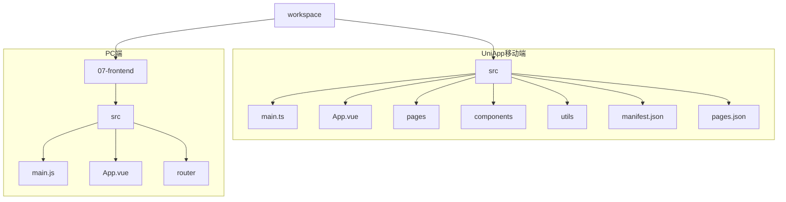
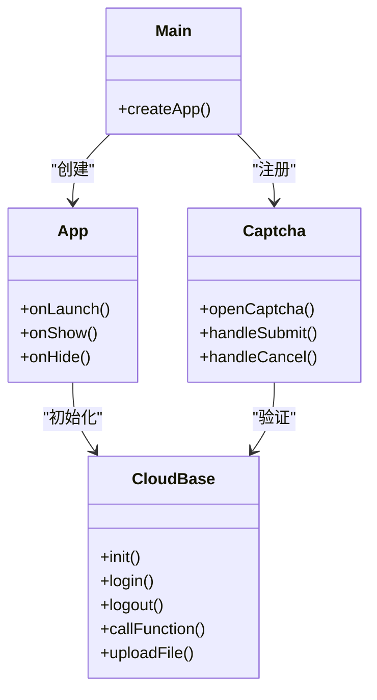
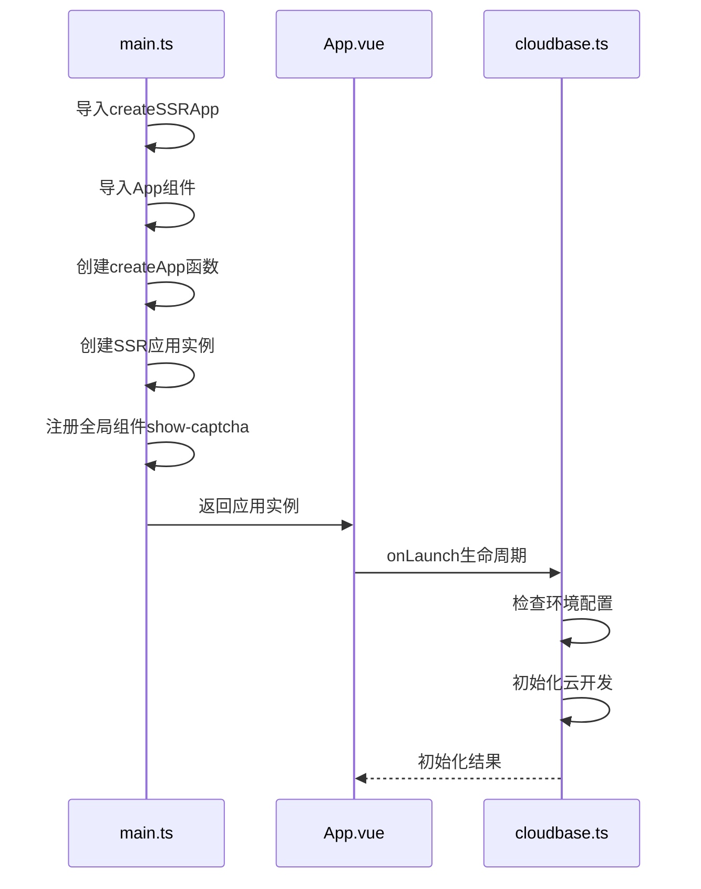
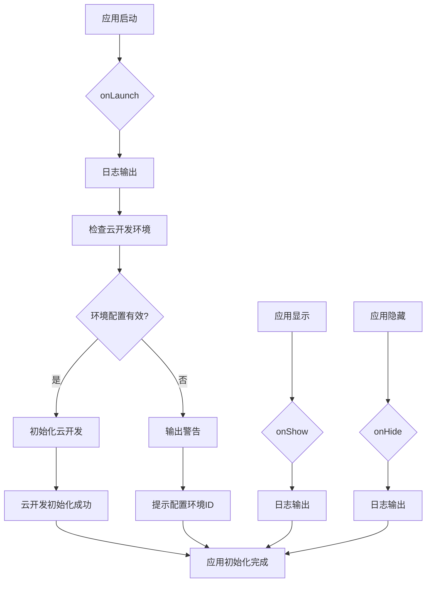
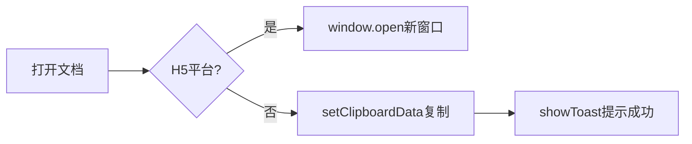
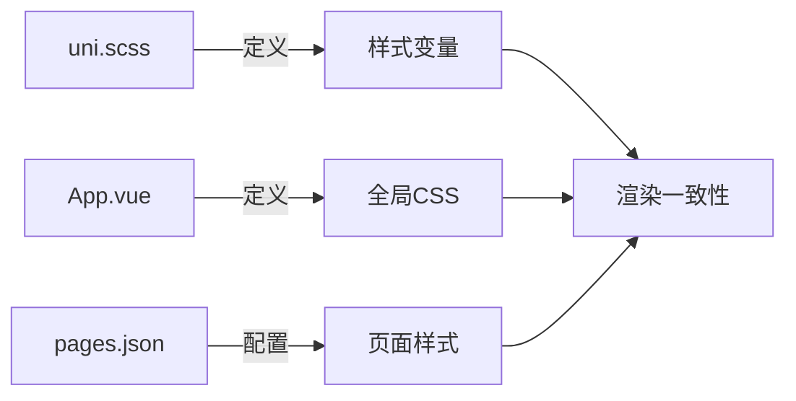

# UniApp框架集成

<cite>
**本文档引用文件**  
- [main.ts](file://src/main.ts)
- [App.vue](file://src/App.vue)
- [main.js](file://07-frontend/src/main.js)
- [manifest.json](file://src/manifest.json)
- [pages.json](file://src/pages.json)
- [cloudbase.ts](file://src/utils/cloudbase.ts)
- [show-captcha.vue](file://src/components/show-captcha.vue)
- [uni.scss](file://src/uni.scss)
- [index.vue](file://src/pages/index/index.vue)
- [demo.vue](file://src/pages/demo/demo.vue)
</cite>

## 目录
1. [项目结构](#项目结构)
2. [核心组件](#核心组件)
3. [应用初始化流程](#应用初始化流程)
4. [移动端生命周期实现](#移动端生命周期实现)
5. [条件编译与平台适配](#条件编译与平台适配)
6. [全局样式与渲染一致性](#全局样式与渲染一致性)
7. [PC端组件复用最佳实践](#pc端组件复用最佳实践)

## 项目结构

UniApp项目采用标准的跨平台目录结构，通过`src`目录统一管理移动端代码，同时与PC端代码库并存于同一工作区。项目通过`manifest.json`配置多端编译参数，`pages.json`定义页面路由和全局样式。

**图示来源**  
- [manifest.json](file://src/manifest.json#L1-L74)
- [pages.json](file://src/pages.json#L1-L74)

**本节来源**  
- [manifest.json](file://src/manifest.json#L1-L74)
- [pages.json](file://src/pages.json#L1-L74)

## 核心组件

项目基于Vue 3语法构建，采用组合式API（Composition API）实现响应式数据管理。核心组件包括应用入口`App.vue`、初始化文件`main.ts`以及云开发集成工具`cloudbase.ts`。全局组件`show-captcha.vue`通过`uni-popup`实现跨平台验证码弹窗。

**图示来源**  
- [main.ts](file://src/main.ts#L1-L15)
- [App.vue](file://src/App.vue#L1-L94)
- [cloudbase.ts](file://src/utils/cloudbase.ts#L1-L383)
- [show-captcha.vue](file://src/components/show-captcha.vue#L1-L329)

**本节来源**  
- [main.ts](file://src/main.ts#L1-L15)
- [App.vue](file://src/App.vue#L1-L94)
- [cloudbase.ts](file://src/utils/cloudbase.ts#L1-L383)

## 应用初始化流程

移动端应用通过`main.ts`中的`createSSRApp`函数初始化，与PC端`main.js`中的`createApp`形成差异。`createSSRApp`支持服务端渲染，适用于移动端多端适配场景。

移动端初始化流程在`main.ts`中实现：

1. 使用`createSSRApp(App)`创建应用实例
2. 通过`app.component()`注册全局组件
3. 返回应用实例供框架挂载

而PC端在`main.js`中使用标准的`createApp(App)`，并集成`ElementPlus`、`Pinia`等PC端专属框架。

**图示来源**  
- [main.ts](file://src/main.ts#L1-L15)
- [main.js](file://07-frontend/src/main.js#L1-L27)
- [App.vue](file://src/App.vue#L1-L94)

**本节来源**  
- [main.ts](file://src/main.ts#L1-L15)
- [main.js](file://07-frontend/src/main.js#L1-L27)

## 移动端生命周期实现

`App.vue`中通过`@dcloudio/uni-app`提供的生命周期钩子实现移动端特有逻辑。`onLaunch`在应用启动时执行云开发初始化，`onShow`在应用显示时触发，`onHide`在应用隐藏时执行。

关键生命周期函数：

- `onLaunch`: 应用初始化入口，执行云开发环境检查和初始化
- `onShow`: 应用从前台显示时触发，可用于数据刷新
- `onHide`: 应用进入后台时触发，可用于资源释放

**图示来源**  
- [App.vue](file://src/App.vue#L1-L33)

**本节来源**  
- [App.vue](file://src/App.vue#L1-L33)

## 条件编译与平台适配

项目通过`#ifdef`和`#ifndef`指令实现条件编译，在`index.vue`中根据平台差异提供不同功能实现。H5平台直接打开文档链接，非H5平台则复制链接到剪贴板。

条件编译语法：

- `#ifdef H5`: 仅在H5平台编译的代码块
- `#ifndef H5`: 除H5外所有平台编译的代码块
- `#ifdef MP-WEIXIN`: 仅在微信小程序平台编译

这种机制确保代码在不同平台的正确执行，避免API不兼容问题。

**图示来源**  
- [index.vue](file://src/pages/index/index.vue#L75-L89)

**本节来源**  
- [index.vue](file://src/pages/index/index.vue#L75-L89)

## 全局样式与渲染一致性

项目通过`uni.scss`定义跨平台样式变量，`App.vue`中的`<style>`标签定义全局CSS样式，`pages.json`中的`globalStyle`配置页面全局属性，三者协同保障多端渲染一致性。

样式层级结构：

1. `uni.scss`: 定义颜色、字体、间距等设计系统变量
2. `App.vue`样式: 定义`page`背景、按钮、卡片等通用组件样式
3. `pages.json`全局样式: 配置导航栏颜色、标题等页面级样式

这种分层设计确保了UI在不同移动平台（iOS、Android、小程序）的一致性表现。

**图示来源**  
- [uni.scss](file://src/uni.scss#L1-L76)
- [App.vue](file://src/App.vue#L35-L93)
- [pages.json](file://src/pages.json#L60-L65)

**本节来源**  
- [uni.scss](file://src/uni.scss#L1-L76)
- [App.vue](file://src/App.vue#L35-L93)
- [pages.json](file://src/pages.json#L60-L65)

## PC端组件复用最佳实践

通过分析`07-frontend`目录结构，可将PC端通用组件迁移至移动端复用。关键策略包括：

1. **组件抽象**: 将`SmartSelect.vue`等通用组件提取为跨平台组件
2. **API适配**: 使用`uni` API替代`element-ui`特定方法
3. **样式兼容**: 将`element-plus`样式替换为`uni-app`内置样式或自定义样式
4. **条件引入**: 使用条件编译按需加载平台特定组件

迁移示例：将`el-select`替换为`SmartSelect`组件，保持功能一致性的同时适配移动端交互模式。

**本节来源**  
- [SmartSelect.vue](file://07-frontend/src/components/SmartSelect.vue)
- [MigrationGuide.md](file://07-frontend/src/docs/MigrationGuide.md)