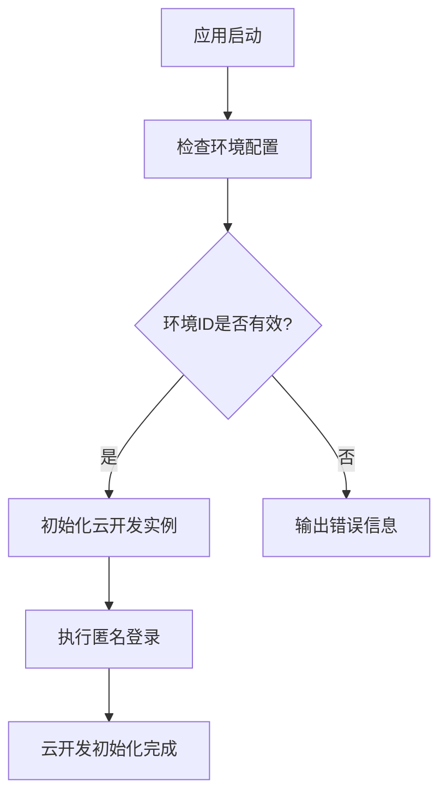
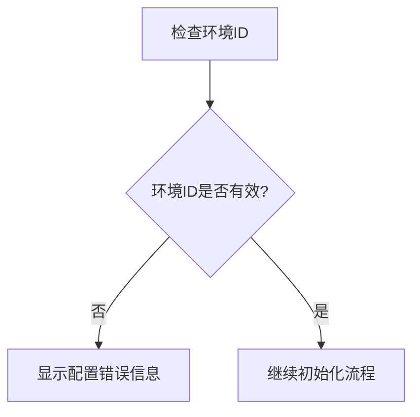
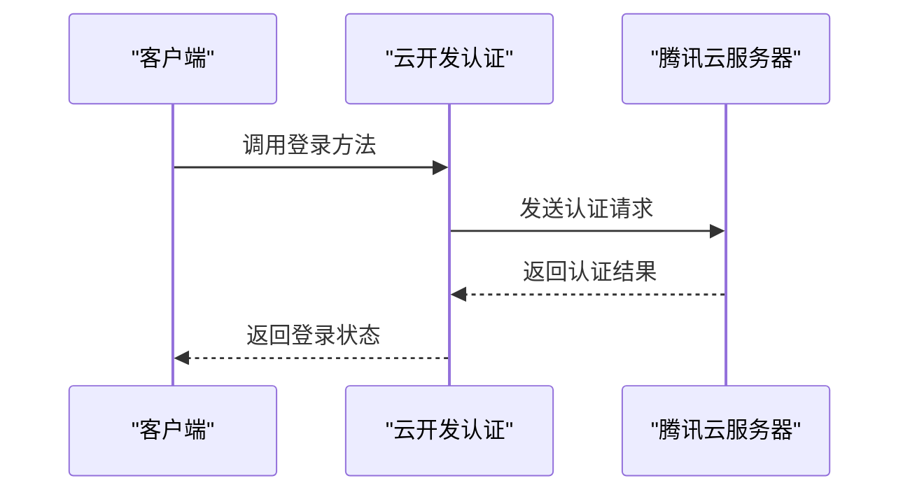
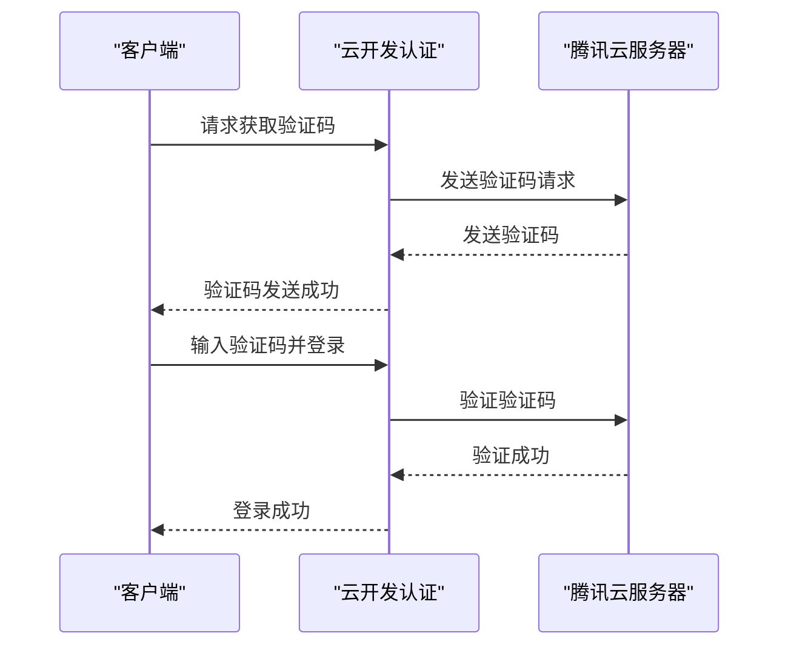
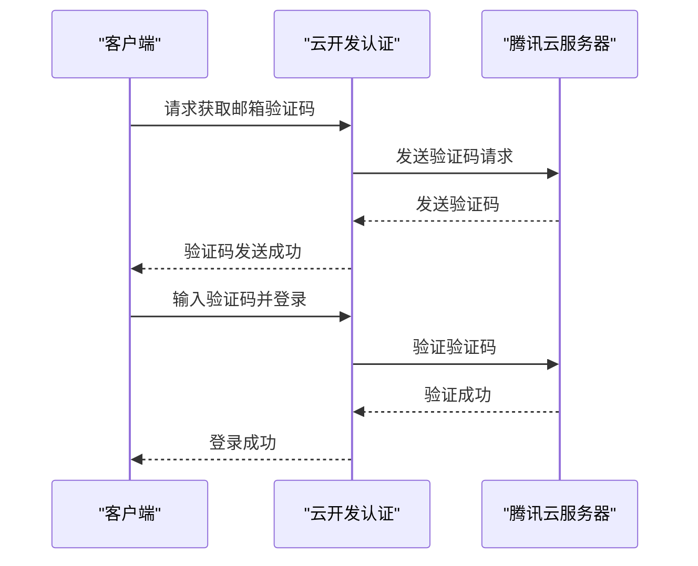
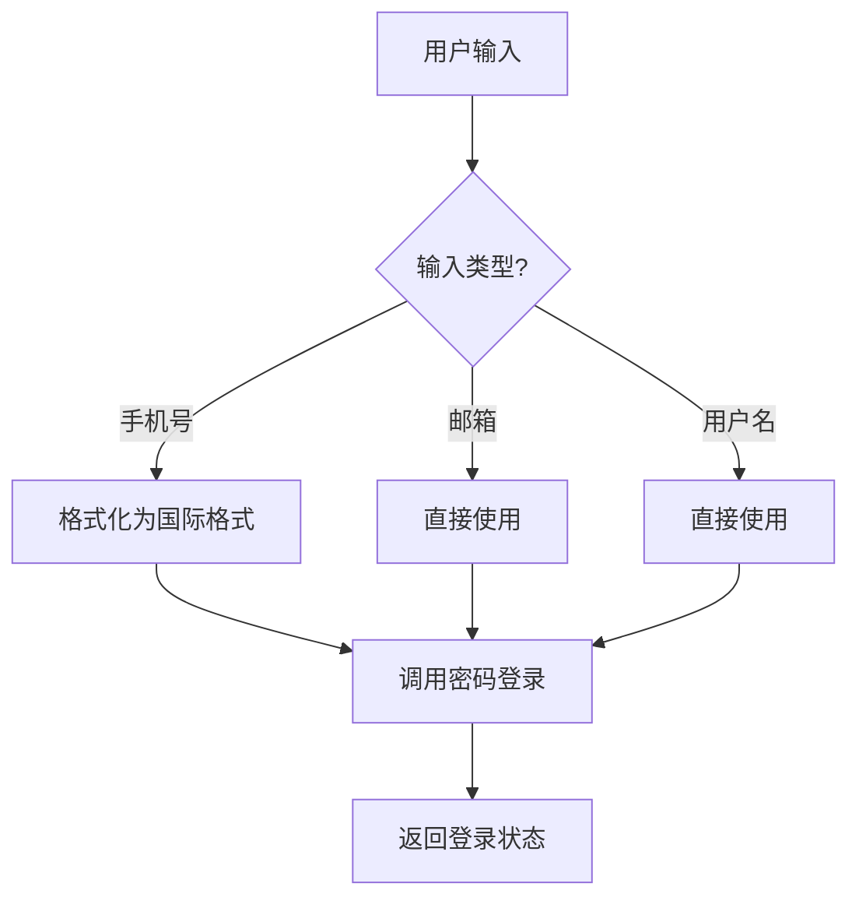
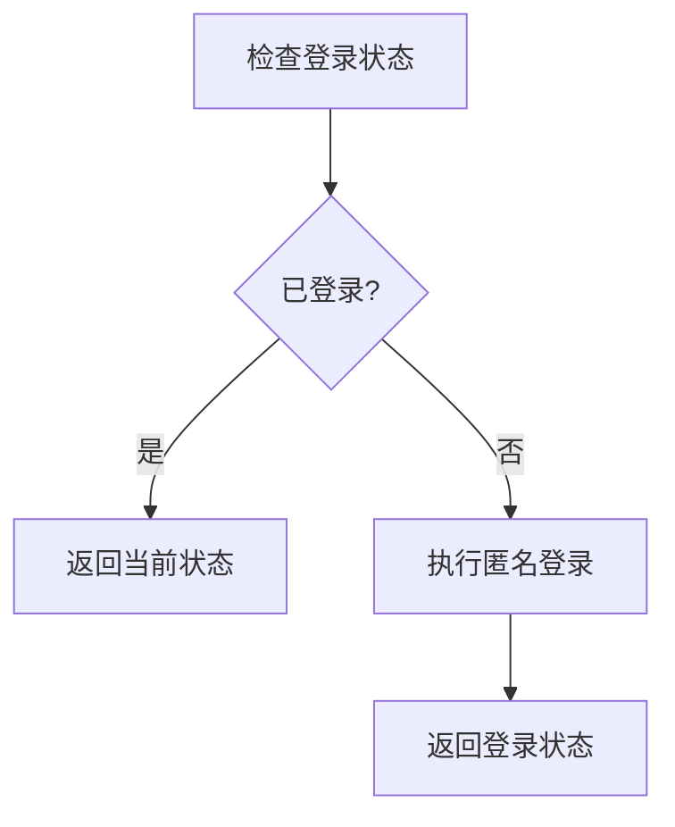
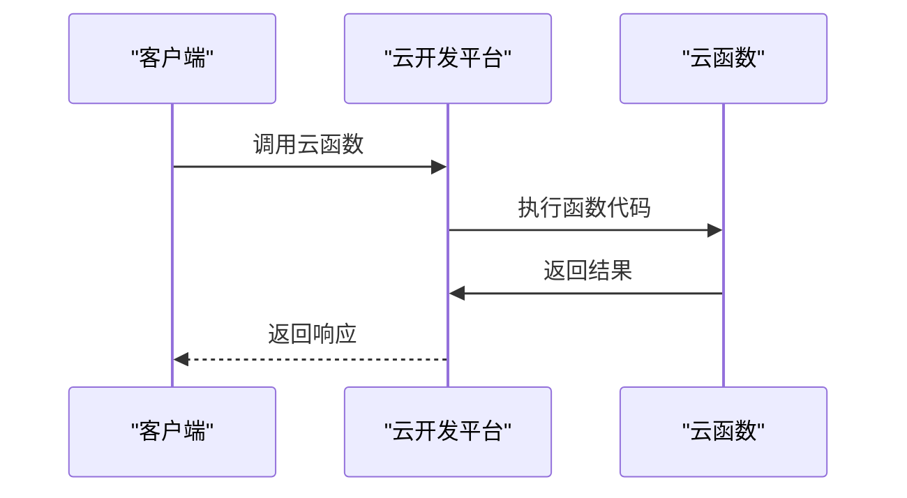
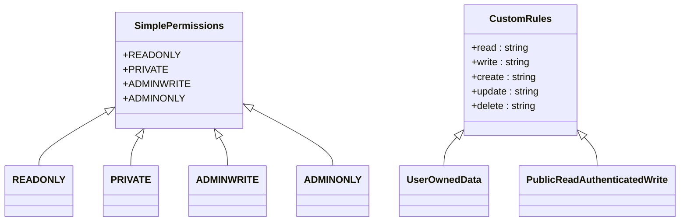
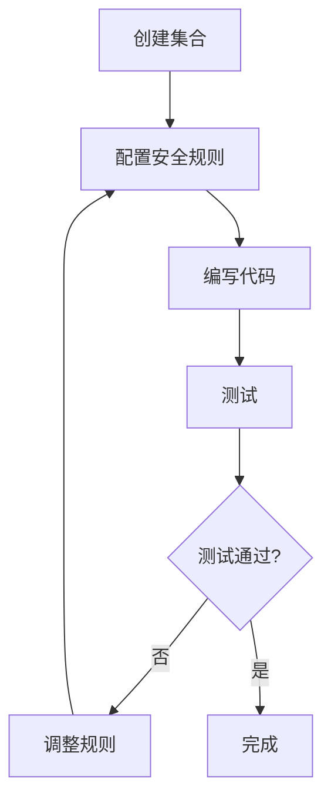

# 云开发集成

<cite>
**本文档引用的文件**   
- [cloudbase.ts](file://src/utils/cloudbase.ts)
- [App.vue](file://src/App.vue)
- [cloudbaserc.json](file://cloudbaserc.json)
- [security-rules.md](file://rules/no-sql-web-sdk/security-rules.md)
- [hello/index.js](file://cloudfunctions/hello/index.js)
- [rule.md](file://rules/cloudbase-platform/rule.md)
</cite>

## 目录
1. [简介](#简介)
2. [SDK初始化与环境配置](#sdk初始化与环境配置)
3. [认证体系实现](#认证体系实现)
4. [云函数调用与数据库访问](#云函数调用与数据库访问)
5. [安全规则配置](#安全规则配置)
6. [资源配额管理与调试技巧](#资源配额管理与调试技巧)
7. [生产环境最佳实践](#生产环境最佳实践)
8. [总结](#总结)

## 简介

本文档全面文档化腾讯云开发（CloudBase）的集成实现，详细解释`cloudbase.ts`中SDK初始化、环境配置检查和认证体系。说明`initCloudBase`函数在`App.vue`中的调用时机和错误处理机制。涵盖匿名登录、手机号验证码登录、邮箱登录等多种认证方式的实现细节。描述云函数调用、数据库访问的安全规则配置。提供云开发资源配额管理、调试技巧和生产环境最佳实践，确保开发者能够快速上手云开发能力。

## SDK初始化与环境配置

云开发SDK的初始化是整个应用的基础，通过`cloudbase.ts`文件中的`init`函数完成。该函数接收配置参数，包括环境ID和超时时间，并返回一个云开发实例。



**图示来源**
- [cloudbase.ts](file://src/utils/cloudbase.ts#L20-L32)
- [App.vue](file://src/App.vue#L5-L23)

环境配置通过`checkEnvironment`函数进行验证，确保环境ID已正确配置。如果未配置，系统会输出详细的错误信息，指导开发者如何配置环境ID。

**代码路径**
- `init`函数: [cloudbase.ts#L20-L32](file://src/utils/cloudbase.ts#L20-L32)
- `checkEnvironment`函数: [cloudbase.ts#L48-L55](file://src/utils/cloudbase.ts#L48-L55)

**环境配置检查**


**图示来源**
- [cloudbase.ts](file://src/utils/cloudbase.ts#L48-L55)

**Section sources**
- [cloudbase.ts](file://src/utils/cloudbase.ts#L1-L383)
- [App.vue](file://src/App.vue#L1-L94)

## 认证体系实现

### 认证流程概述

云开发提供了多种认证方式，包括匿名登录、手机号验证码登录、邮箱登录等。这些认证方式通过`cloudbase.ts`中的`auth`模块实现。



**图示来源**
- [cloudbase.ts](file://src/utils/cloudbase.ts#L62-L382)
- [security-rules.md](file://rules/no-sql-web-sdk/security-rules.md#L164-L665)

### 匿名登录

匿名登录是默认的登录方式，通过`signInAnonymously`方法实现。这种方式适用于不需要用户身份验证的场景。

```typescript
await auth.signInAnonymously();
```

**代码路径**: [cloudbase.ts#L66](file://src/utils/cloudbase.ts#L66)

### 手机号验证码登录

手机号验证码登录分为两个步骤：获取验证码和使用验证码登录。



**图示来源**
- [cloudbase.ts](file://src/utils/cloudbase.ts#L107-L178)
- [security-rules.md](file://rules/no-sql-web-sdk/security-rules.md#L174-L196)

**代码路径**
- `getPhoneVerification`: [cloudbase.ts#L107-L139](file://src/utils/cloudbase.ts#L107-L139)
- `signInWithPhoneCode`: [cloudbase.ts#L150-L178](file://src/utils/cloudbase.ts#L150-L178)

### 邮箱登录

邮箱登录同样分为获取验证码和使用验证码登录两个步骤。



**图示来源**
- [cloudbase.ts](file://src/utils/cloudbase.ts#L244-L298)
- [security-rules.md](file://rules/no-sql-web-sdk/security-rules.md#L198-L211)

**代码路径**
- `getEmailVerification`: [cloudbase.ts#L244-L262](file://src/utils/cloudbase.ts#L244-L262)
- `signInWithEmailCode`: [cloudbase.ts#L272-L298](file://src/utils/cloudbase.ts#L272-L298)

### 密码登录

密码登录支持手机号、邮箱和用户名三种方式。系统会自动识别输入类型并进行格式化。



**图示来源**
- [cloudbase.ts](file://src/utils/cloudbase.ts#L186-L236)
- [security-rules.md](file://rules/no-sql-web-sdk/security-rules.md#L213-L220)

**代码路径**: [cloudbase.ts#L186-L236](file://src/utils/cloudbase.ts#L186-L236)

### 登录状态管理

`ensureLogin`函数确保用户已登录，如果未登录则执行匿名登录。



**图示来源**
- [cloudbase.ts](file://src/utils/cloudbase.ts#L305-L332)

**代码路径**: [cloudbase.ts#L305-L332](file://src/utils/cloudbase.ts#L305-L332)

**Section sources**
- [cloudbase.ts](file://src/utils/cloudbase.ts#L62-L382)
- [security-rules.md](file://rules/no-sql-web-sdk/security-rules.md#L164-L665)

## 云函数调用与数据库访问

### 云函数调用

云函数是无服务器架构的核心组件，通过`cloudfunctions`目录下的函数文件实现。每个云函数都是一个独立的Node.js模块。



**图示来源**
- [hello/index.js](file://cloudfunctions/hello/index.js#L1-L36)
- [rule.md](file://rules/cloudbase-platform/rule.md#L128-L130)

**代码路径**: [cloudfunctions/hello/index.js](file://cloudfunctions/hello/index.js)

### 数据库访问

数据库访问通过云开发SDK提供的`database()`方法实现。开发者可以使用类似MongoDB的语法进行数据操作。

```typescript
const db = app.database();
const collection = db.collection('collection-name');
```

**代码路径**: [rule.md](file://rules/cloudbase-platform/rule.md#L134-L137)

**Section sources**
- [hello/index.js](file://cloudfunctions/hello/index.js#L1-L36)
- [rule.md](file://rules/cloudbase-platform/rule.md#L128-L149)

## 安全规则配置

### 安全规则类型

云开发提供了多种安全规则类型，包括简单权限和自定义规则。



**图示来源**
- [security-rules.md](file://rules/no-sql-web-sdk/security-rules.md#L19-L23)
- [security-rules.md](file://rules/no-sql-web-sdk/security-rules.md#L94-L102)

### 简单权限

简单权限是预配置的权限模板，适用于大多数常见场景。

| 权限类型 | 读权限 | 写权限 |
|---------|-------|-------|
| READONLY | 所有用户 | 创建者和管理员 |
| PRIVATE | 创建者和管理员 | 创建者和管理员 |
| ADMINWRITE | 所有用户 | 仅管理员 |
| ADMINONLY | 仅管理员 | 仅管理员 |

**表来源**
- [security-rules.md](file://rules/no-sql-web-sdk/security-rules.md#L19-L23)
- [rule.md](file://rules/cloudbase-platform/rule.md#L99-L102)

### 自定义规则

自定义规则允许基于文档数据、用户身份或复杂条件进行细粒度控制。

```json
{
  "read": "auth.uid == doc.user_id",
  "write": "auth.uid == doc.user_id"
}
```

**代码路径**: [security-rules.md#L156-L157](file://rules/no-sql-web-sdk/security-rules.md#L156-L157)

### 安全规则配置流程



**图示来源**
- [rule.md](file://rules/cloudbase-platform/rule.md#L113-L114)

**Section sources**
- [security-rules.md](file://rules/no-sql-web-sdk/security-rules.md#L1-L354)
- [rule.md](file://rules/cloudbase-platform/rule.md#L96-L149)

## 资源配额管理与调试技巧

### 资源配额管理

云开发为各项服务设置了资源配额，开发者需要合理规划使用。


**图示来源**
- [README.md](file://README.md#L121-L124)
- [cloudbaserc.json](file://cloudbaserc.json#L1-L32)

### 调试技巧

#### 错误处理

所有数据库操作都应包含错误处理逻辑。

```typescript
try {
  const result = await db.collection('todos').get();
  console.log(result.data);
} catch (error) {
  console.error('数据库错误:', error);
}
```

**代码路径**: [security-rules.md#L143-L151](file://rules/no-sql-web-sdk/security-rules.md#L143-L151)

#### 日志记录

合理使用日志记录可以帮助快速定位问题。

```typescript
console.log('云开发初始化成功');
console.warn('云开发环境ID未配置');
console.error('登录失败:', error);
```

**代码路径**: [cloudbase.ts](file://src/utils/cloudbase.ts)

**Section sources**
- [security-rules.md](file://rules/no-sql-web-sdk/security-rules.md#L143-L151)
- [cloudbase.ts](file://src/utils/cloudbase.ts)

## 生产环境最佳实践

### 安全性最佳实践

1. **始终在服务器端验证** - 前端只负责用户体验，鉴权应在后端基于`access_token`完成。
2. **仅使用HTTPS** - 生产环境必须使用HTTPS（除localhost外）。
3. **域名白名单** - 将所有前端域名加入控制台「安全域名」。
4. **敏感操作重新认证** - 删除账号等操作前先调用`auth.sudo`重新校验身份。

**来源**: [security-rules.md#L654-L657](file://rules/no-sql-web-sdk/security-rules.md#L654-L657)

### 用户体验最佳实践

1. **检查现有登录状态** - 页面初始化时通过`await auth.getCurrentUser()`检查当前登录状态，避免重复登录。
2. **处理会话过期** - 使用`onLoginStateChanged`监听token失效，提示用户重新登录。
3. **显示加载状态** - 登录/注册按钮要有加载状态和防抖。
4. **清除错误消息** - 将错误码映射为用户可读的中文提示。
5. **短信倒计时** - 发送验证码按钮增加倒计时，避免重复点击。

**来源**: [security-rules.md#L661-L665](file://rules/no-sql-web-sdk/security-rules.md#L661-L665)

### 性能优化

1. **初始化SDK一次** - 在应用启动时初始化SDK。
2. **重用数据库实例** - 在整个应用中重用数据库实例。
3. **使用查询操作符** - 对于复杂条件使用查询操作符。
4. **实现分页** - 对于大数据集实现分页。
5. **仅选择所需字段** - 减少数据传输量。
6. **为频繁查询的字段创建索引** - 提高查询性能。

**来源**: [security-rules.md#L172-L178](file://rules/no-sql-web-sdk/security-rules.md#L172-L178)

**Section sources**
- [security-rules.md](file://rules/no-sql-web-sdk/security-rules.md#L654-L665)
- [security-rules.md](file://rules/no-sql-web-sdk/security-rules.md#L172-L178)

## 总结

本文档全面介绍了腾讯云开发（CloudBase）的集成实现，涵盖了SDK初始化、环境配置检查、认证体系、云函数调用、数据库访问安全规则配置等方面。通过详细的代码路径和图示，帮助开发者快速上手云开发能力。同时提供了资源配额管理、调试技巧和生产环境最佳实践，确保应用的安全性和性能。

**Section sources**
- [cloudbase.ts](file://src/utils/cloudbase.ts)
- [App.vue](file://src/App.vue)
- [cloudbaserc.json](file://cloudbaserc.json)
- [security-rules.md](file://rules/no-sql-web-sdk/security-rules.md)
- [hello/index.js](file://cloudfunctions/hello/index.js)
- [rule.md](file://rules/cloudbase-platform/rule.md)