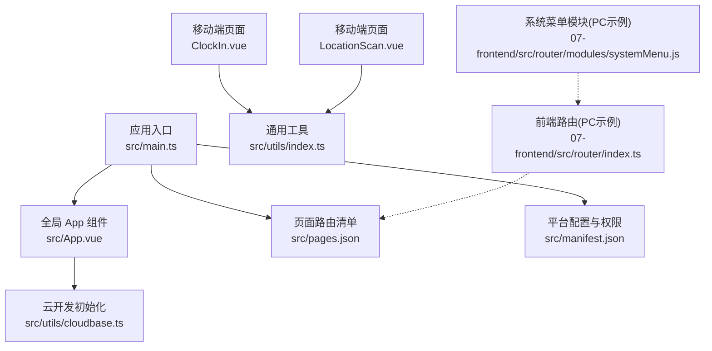
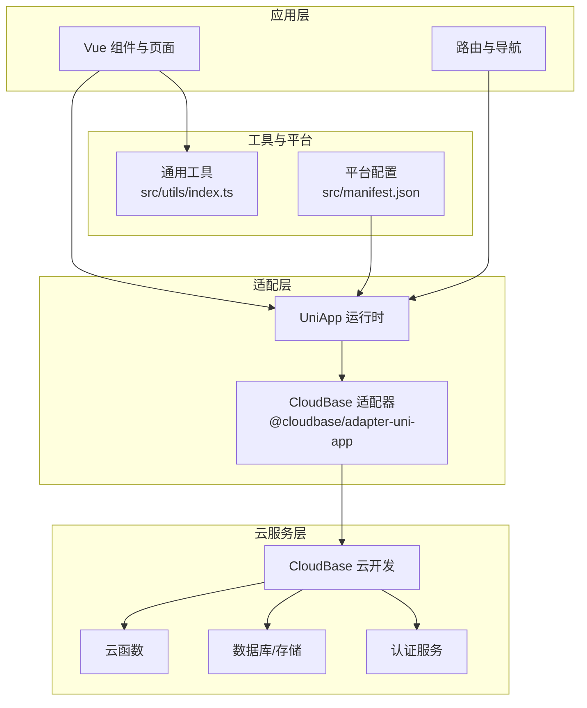
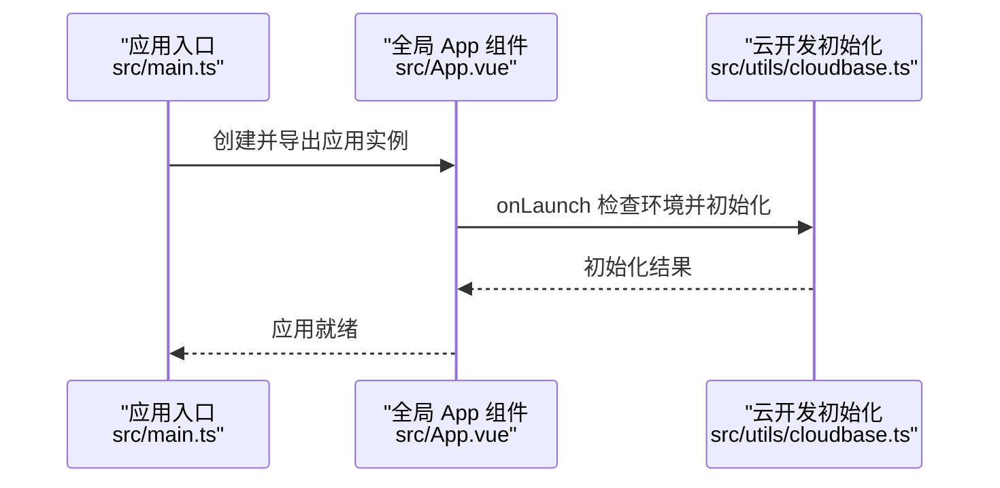
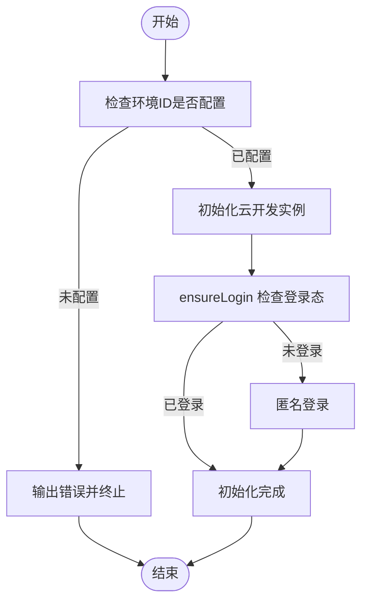
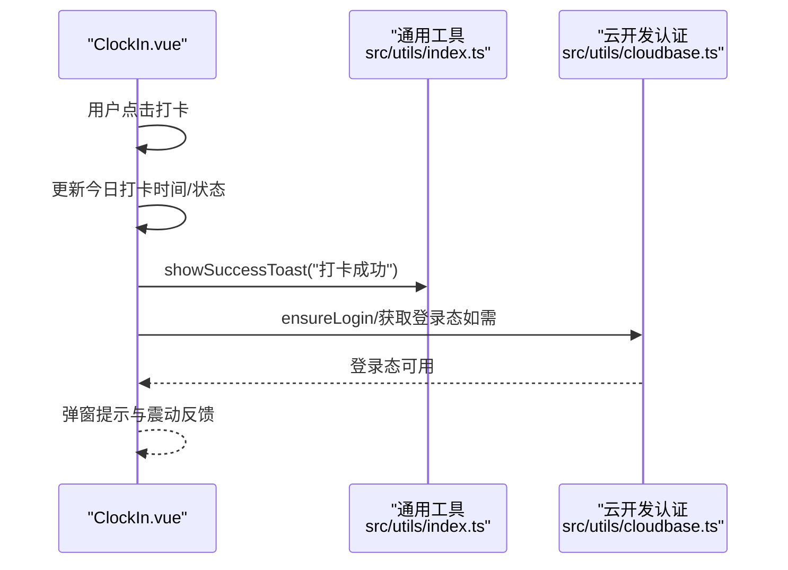
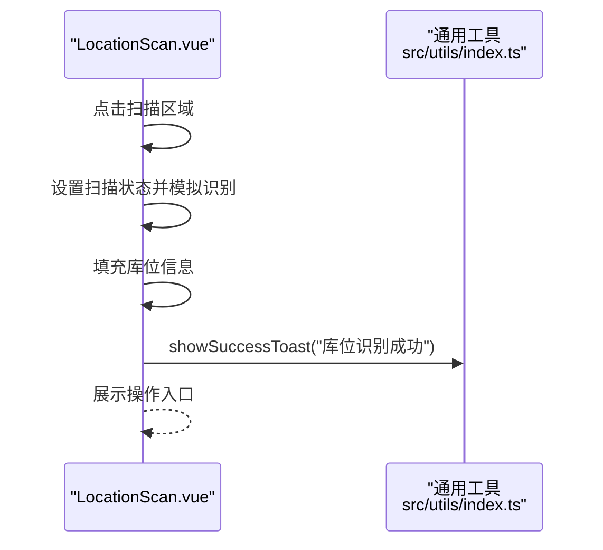
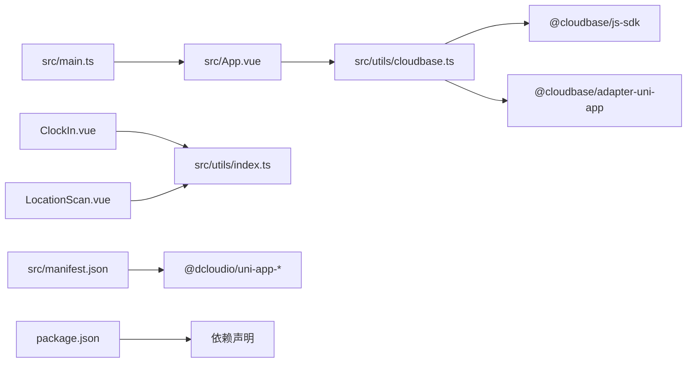

# 移动端架构

<cite>
**本文引用的文件**
- [src/main.ts](file://src/main.ts)
- [src/App.vue](file://src/App.vue)
- [src/pages.json](file://src/pages.json)
- [src/utils/cloudbase.ts](file://src/utils/cloudbase.ts)
- [src/manifest.json](file://src/manifest.json)
- [src/utils/index.ts](file://src/utils/index.ts)
- [07-frontend/src/platforms/mobile/pages/attendance/ClockIn.vue](file://07-frontend/src/platforms/mobile/pages/attendance/ClockIn.vue)
- [07-frontend/src/platforms/mobile/pages/inventory/LocationScan.vue](file://07-frontend/src/platforms/mobile/pages/inventory/LocationScan.vue)
- [07-frontend/src/router/index.ts](file://07-frontend/src/router/index.ts)
- [07-frontend/src/router/modules/systemMenu.js](file://07-frontend/src/router/modules/systemMenu.js)
- [package.json](file://package.json)
- [README.md](file://README.md)
</cite>

## 目录
1. [简介](#简介)
2. [项目结构](#项目结构)
3. [核心组件](#核心组件)
4. [架构总览](#架构总览)
5. [详细组件分析](#详细组件分析)
6. [依赖关系分析](#依赖关系分析)
7. [性能考量](#性能考量)
8. [故障排查指南](#故障排查指南)
9. [结论](#结论)
10. [附录](#附录)

## 简介
本项目基于 UniApp 框架构建，采用 Vue 3 语法，统一前后端技术栈，实现跨平台（H5、微信小程序、App 等）应用开发。本文档聚焦移动端架构实现，解释应用初始化流程、全局配置、页面路由结构、条件编译与平台适配、云开发能力集成（云函数、数据库、认证），并通过扫码与考勤打卡两个移动端特色功能示例，帮助理解移动端与 PC 端的功能差异及数据同步策略。

## 项目结构
- 应用入口与全局配置
  - 应用入口：src/main.ts
  - 全局 App 生命周期：src/App.vue
  - 页面路由清单：src/pages.json
  - 平台打包与权限声明：src/manifest.json
- 云开发集成
  - 云开发初始化与认证：src/utils/cloudbase.ts
- 移动端页面与功能
  - 考勤打卡：07-frontend/src/platforms/mobile/pages/attendance/ClockIn.vue
  - 库位扫码：07-frontend/src/platforms/mobile/pages/inventory/LocationScan.vue
- 路由与导航
  - 前端路由（PC 端示例）：07-frontend/src/router/index.ts
  - 系统菜单模块路由（PC 端示例）：07-frontend/src/router/modules/systemMenu.js
- 工具与平台适配
  - 通用工具与事件总线：src/utils/index.ts
  - 平台脚本与依赖：package.json
  - README 平台适配说明：README.md

图表来源
- [src/main.ts](file://src/main.ts#L1-L15)
- [src/App.vue](file://src/App.vue#L1-L33)
- [src/utils/cloudbase.ts](file://src/utils/cloudbase.ts#L1-L60)
- [src/pages.json](file://src/pages.json#L1-L74)
- [src/manifest.json](file://src/manifest.json#L1-L74)
- [07-frontend/src/platforms/mobile/pages/attendance/ClockIn.vue](file://07-frontend/src/platforms/mobile/pages/attendance/ClockIn.vue#L1-L120)
- [07-frontend/src/platforms/mobile/pages/inventory/LocationScan.vue](file://07-frontend/src/platforms/mobile/pages/inventory/LocationScan.vue#L1-L120)
- [07-frontend/src/router/index.ts](file://07-frontend/src/router/index.ts#L1-L27)
- [07-frontend/src/router/modules/systemMenu.js](file://07-frontend/src/router/modules/systemMenu.js#L1-L56)

章节来源
- [src/main.ts](file://src/main.ts#L1-L15)
- [src/App.vue](file://src/App.vue#L1-L33)
- [src/pages.json](file://src/pages.json#L1-L74)
- [src/manifest.json](file://src/manifest.json#L1-L74)
- [package.json](file://package.json#L1-L83)
- [README.md](file://README.md#L165-L191)

## 核心组件
- 应用初始化流程（main.ts）
  - 创建 SSR 应用实例，注册全局组件，导出包含 app 实例的对象，供各端运行时挂载。
- 全局配置（App.vue）
  - 在 App 启动生命周期中检查云开发环境配置，若有效则初始化云开发；提供全局样式与主题变量。
- 页面路由结构（pages.json）
  - 定义应用启动页与若干页面，设置导航栏标题、背景色等全局样式；启用 easycom 自动扫描以简化组件引入。
- 平台打包与权限（manifest.json）
  - 针对 App（Android/iOS）声明权限（网络、振动、相机等），以及各小程序平台的配置项。
- 云开发能力（cloudbase.ts）
  - 初始化云开发实例，封装认证（匿名登录、手机号一键登录、OpenID 静默登录、密码登录）、验证码发送与校验、登录态确保、登出等能力。
- 移动端页面与功能
  - 考勤打卡（ClockIn.vue）：展示时间、位置、打卡状态与统计，模拟打卡 API 调用与震动反馈。
  - 库位扫码（LocationScan.vue）：模拟扫码识别库位，展示库位信息与操作入口。
- 路由与导航（PC 示例）
  - 前端路由（07-frontend/src/router/index.ts）与系统菜单模块（07-frontend/src/router/modules/systemMenu.js）用于 PC 端页面导航，便于理解跨端路由组织方式。
- 工具与平台适配（utils/index.ts）
  - 提供 toast、loading、页面跳转、系统信息获取、深拷贝、查询串解析、事件总线等通用能力，支撑移动端交互与数据处理。

章节来源
- [src/main.ts](file://src/main.ts#L1-L15)
- [src/App.vue](file://src/App.vue#L1-L33)
- [src/pages.json](file://src/pages.json#L1-L74)
- [src/manifest.json](file://src/manifest.json#L1-L74)
- [src/utils/cloudbase.ts](file://src/utils/cloudbase.ts#L1-L120)
- [07-frontend/src/platforms/mobile/pages/attendance/ClockIn.vue](file://07-frontend/src/platforms/mobile/pages/attendance/ClockIn.vue#L1-L120)
- [07-frontend/src/platforms/mobile/pages/inventory/LocationScan.vue](file://07-frontend/src/platforms/mobile/pages/inventory/LocationScan.vue#L1-L120)
- [07-frontend/src/router/index.ts](file://07-frontend/src/router/index.ts#L1-L27)
- [07-frontend/src/router/modules/systemMenu.js](file://07-frontend/src/router/modules/systemMenu.js#L1-L56)
- [src/utils/index.ts](file://src/utils/index.ts#L1-L120)

## 架构总览
本项目采用“统一代码 + 多端编译”的架构模式：
- 业务层：Vue 组件与页面，统一使用 Composition API 与模板语法。
- 适配层：通过 UniApp 与各平台 SDK（如 @cloudbase/adapter-uni-app）实现跨端能力。
- 云服务层：通过 CloudBase SDK 进行云函数、数据库与认证集成。
- 数据与状态：移动端通过本地工具与事件总线进行状态管理与交互反馈。

图表来源
- [src/utils/cloudbase.ts](file://src/utils/cloudbase.ts#L1-L40)
- [src/manifest.json](file://src/manifest.json#L1-L74)
- [src/utils/index.ts](file://src/utils/index.ts#L1-L120)
- [package.json](file://package.json#L40-L67)

## 详细组件分析

### 应用初始化流程（main.ts）
- 关键点
  - 使用 createSSRApp 创建应用实例。
  - 注册全局组件（如验证码组件）。
  - 返回包含 app 的对象，供各端运行时挂载。
- 设计意图
  - 保持入口简洁，将平台差异隐藏在运行时与适配器中，统一业务逻辑。

图表来源
- [src/main.ts](file://src/main.ts#L1-L15)
- [src/App.vue](file://src/App.vue#L1-L33)
- [src/utils/cloudbase.ts](file://src/utils/cloudbase.ts#L339-L348)

章节来源
- [src/main.ts](file://src/main.ts#L1-L15)

### 全局配置与生命周期（App.vue）
- 关键点
  - onLaunch：检查环境配置，初始化云开发。
  - onShow/onHide：应用显示与隐藏日志。
  - 全局样式：定义按钮、卡片、输入框等通用样式。
- 设计意图
  - 将云开发初始化前置到应用生命周期早期，保证后续页面与功能可用。

章节来源
- [src/App.vue](file://src/App.vue#L1-L33)
- [src/App.vue](file://src/App.vue#L35-L94)

### 页面路由结构（pages.json）
- 关键点
  - pages 数组定义启动页与其他页面，设置导航栏标题、背景色与文字颜色。
  - globalStyle 统一导航栏与背景色。
  - easycom 自动扫描 uni-ui 组件，减少手动引入。
- 设计意图
  - 通过集中式配置管理页面与导航样式，提升一致性与可维护性。

章节来源
- [src/pages.json](file://src/pages.json#L1-L74)

### 平台打包与权限（manifest.json）
- 关键点
  - app-plus 权限声明（网络、振动、相机等）。
  - 各小程序平台配置（如 mp-weixin）。
  - vueVersion 指定 Vue 3。
- 设计意图
  - 明确各端所需权限与配置，避免运行时权限不足导致功能异常。

章节来源
- [src/manifest.json](file://src/manifest.json#L1-L74)

### 云开发能力集成（cloudbase.ts）
- 关键点
  - 使用 @cloudbase/adapter-uni-app 适配 UniApp 运行时。
  - 初始化云开发实例，暴露 app、auth 等对象。
  - 认证能力：匿名登录、手机号一键登录、OpenID 静默登录、密码登录。
  - 验证码：手机号与邮箱验证码发送与登录。
  - 登录态确保：ensureLogin 自动匿名登录。
  - 登出：signOut。
- 设计意图
  - 将云开发能力封装为可复用模块，统一认证与登录流程，降低页面耦合度。

图表来源
- [src/utils/cloudbase.ts](file://src/utils/cloudbase.ts#L40-L120)
- [src/utils/cloudbase.ts](file://src/utils/cloudbase.ts#L339-L348)

章节来源
- [src/utils/cloudbase.ts](file://src/utils/cloudbase.ts#L1-L120)
- [src/utils/cloudbase.ts](file://src/utils/cloudbase.ts#L339-L348)

### 移动端页面与功能示例

#### 考勤打卡（ClockIn.vue）
- 功能要点
  - 时间与日期实时显示，位置信息展示。
  - 打卡按钮切换“上班/下班”状态，弹窗提示与震动反馈。
  - 今日考勤与本周统计展示。
  - 快捷入口：请假申请、加班申请、考勤记录。
- 实现要点
  - 使用 vant 组件库与 Toast/SuccessToast 进行交互反馈。
  - 模拟 API 调用与工作时长计算。
  - 生命周期内定时更新时间，清理定时器。

图表来源
- [07-frontend/src/platforms/mobile/pages/attendance/ClockIn.vue](file://07-frontend/src/platforms/mobile/pages/attendance/ClockIn.vue#L1-L120)
- [src/utils/index.ts](file://src/utils/index.ts#L24-L73)
- [src/utils/cloudbase.ts](file://src/utils/cloudbase.ts#L301-L348)

章节来源
- [07-frontend/src/platforms/mobile/pages/attendance/ClockIn.vue](file://07-frontend/src/platforms/mobile/pages/attendance/ClockIn.vue#L1-L246)

#### 库位扫码（LocationScan.vue）
- 功能要点
  - 扫码区域动画与提示，模拟扫码识别库位。
  - 展示库位信息（编码、名称、区域、类型、状态、容量）。
  - 操作入口：查看库存、库存移位、库位维护、打印标签。
- 实现要点
  - 使用 vant 组件库与 Toast 进行交互反馈。
  - 模拟扫码流程与库位信息填充。

图表来源
- [07-frontend/src/platforms/mobile/pages/inventory/LocationScan.vue](file://07-frontend/src/platforms/mobile/pages/inventory/LocationScan.vue#L1-L135)
- [src/utils/index.ts](file://src/utils/index.ts#L24-L73)

章节来源
- [07-frontend/src/platforms/mobile/pages/inventory/LocationScan.vue](file://07-frontend/src/platforms/mobile/pages/inventory/LocationScan.vue#L1-L135)

### 路由与导航（PC 示例）
- 关键点
  - 前端路由（07-frontend/src/router/index.ts）：登录守卫与重定向。
  - 系统菜单模块（07-frontend/src/router/modules/systemMenu.js）：布局与子路由组织。
- 设计意图
  - 通过模块化路由组织 PC 端页面，便于扩展与权限控制；移动端路由可参考此模式进行组织。

章节来源
- [07-frontend/src/router/index.ts](file://07-frontend/src/router/index.ts#L1-L27)
- [07-frontend/src/router/modules/systemMenu.js](file://07-frontend/src/router/modules/systemMenu.js#L1-L56)

### 工具与平台适配（utils/index.ts）
- 关键点
  - 提示与加载：toast、showLoading、hideLoading。
  - 页面跳转：navigateTo、redirectTo、switchTab。
  - 系统信息：getSystemInfo。
  - 深拷贝、查询串解析、事件总线（EventBus/globalEventBus）。
- 设计意图
  - 抽象跨端通用能力，减少重复代码，提升可测试性与可维护性。

章节来源
- [src/utils/index.ts](file://src/utils/index.ts#L1-L239)

## 依赖关系分析
- 依赖关系
  - 应用入口依赖全局 App 组件与云开发模块。
  - 页面依赖通用工具与 UI 组件库。
  - 云开发模块依赖 @cloudbase/adapter-uni-app 与 @cloudbase/js-sdk。
  - 平台打包依赖 @dcloudio/uni-app-* 系列包与 manifest.json 权限声明。
- 关系图

图表来源
- [src/main.ts](file://src/main.ts#L1-L15)
- [src/App.vue](file://src/App.vue#L1-L33)
- [src/utils/cloudbase.ts](file://src/utils/cloudbase.ts#L1-L40)
- [src/utils/index.ts](file://src/utils/index.ts#L1-L120)
- [src/manifest.json](file://src/manifest.json#L1-L74)
- [package.json](file://package.json#L40-L67)

章节来源
- [package.json](file://package.json#L1-L83)
- [src/utils/cloudbase.ts](file://src/utils/cloudbase.ts#L1-L40)
- [src/manifest.json](file://src/manifest.json#L1-L74)

## 性能考量
- 跨端渲染与适配
  - 使用 UniApp 与适配器统一渲染，减少多端差异带来的性能损耗。
- 云开发调用
  - 合理使用登录态缓存与请求超时配置，避免频繁初始化。
- 移动端交互
  - 使用轻量级 Toast/Loading，避免过度动画影响性能。
- 资源与打包
  - 通过 manifest.json 声明必要权限，避免无用权限导致的额外开销。
- 路由与懒加载
  - PC 端路由示例展示了懒加载与守卫，移动端可借鉴该模式优化首屏加载。

[本节为通用建议，不直接分析具体文件]

## 故障排查指南
- 云开发初始化失败
  - 现象：控制台输出初始化失败或警告。
  - 排查：检查环境 ID 是否配置，确认 src/utils/cloudbase.ts 中 ENV_ID 是否正确；确认网络连通性。
- 登录异常
  - 现象：登录态为空或匿名登录失败。
  - 排查：调用 ensureLogin 与 login，确认环境配置；查看错误日志。
- 打卡/扫码功能无效
  - 现象：点击无反应或无提示。
  - 排查：检查页面生命周期绑定与定时器清理；确认模拟流程是否触发；核对权限声明（manifest.json）。
- 平台权限问题
  - 现象：相机、振动等功能不可用。
  - 排查：核对 Android 权限声明与设备实际权限授权。

章节来源
- [src/App.vue](file://src/App.vue#L1-L33)
- [src/utils/cloudbase.ts](file://src/utils/cloudbase.ts#L339-L348)
- [src/manifest.json](file://src/manifest.json#L20-L73)
- [07-frontend/src/platforms/mobile/pages/attendance/ClockIn.vue](file://07-frontend/src/platforms/mobile/pages/attendance/ClockIn.vue#L170-L206)
- [07-frontend/src/platforms/mobile/pages/inventory/LocationScan.vue](file://07-frontend/src/platforms/mobile/pages/inventory/LocationScan.vue#L75-L105)

## 结论
本项目通过 UniApp 与 Vue 3 实现了跨平台应用开发，统一了技术栈并在移动端实现了扫码与考勤打卡等特色功能。云开发模块提供了认证与登录态管理能力，配合 manifest.json 的平台权限声明，保障了移动端功能的可用性。通过 pages.json 与路由示例，可以清晰地组织页面与导航。建议在实际项目中进一步完善真实云函数调用、数据库访问与数据同步策略，以满足生产环境需求。

[本节为总结性内容，不直接分析具体文件]

## 附录
- 平台适配说明
  - README 中明确列出 H5、微信小程序、支付宝小程序、抖音小程序、App（iOS/Android）等平台支持情况。
- 脚本与依赖
  - package.json 提供多端开发与构建脚本，依赖 @dcloudio/uni-app-* 与 @cloudbase/* 系列包。

章节来源
- [README.md](file://README.md#L165-L191)
- [package.json](file://package.json#L1-L83)