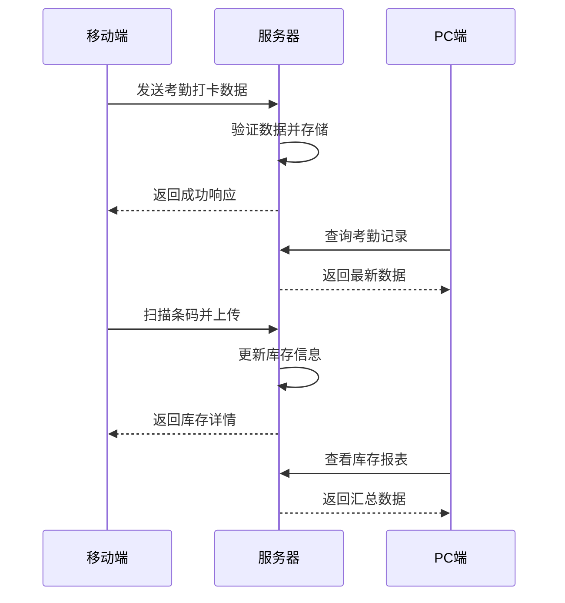

# 移动端特有功能

<cite>
**本文档引用文件**   
- [ClockIn.vue](file://07-frontend/src/platforms/mobile/pages/attendance/ClockIn.vue)
- [LocationScan.vue](file://07-frontend/src/platforms/mobile/pages/inventory/LocationScan.vue)
- [DefectReport.vue](file://07-frontend/src/platforms/mobile/pages/production/DefectReport.vue)
- [WorkReport.vue](file://07-frontend/src/platforms/mobile/pages/production/WorkReport.vue)
- [SyncService.js](file://07-frontend/src/services/SyncService.js)
- [BackupService.js](file://07-frontend/src/services/BackupService.js)
- [storage.js](file://07-frontend/src/services/utils/storage.js)
- [request.js](file://07-frontend/src/services/utils/request.js)
- [sw.js](file://07-frontend/public/sw.js)
- [offline.html](file://07-frontend/public/offline.html)
</cite>

## 目录
1. [引言](#引言)
2. [基于GPS和Wi-Fi的考勤打卡](#基于gps和wi-fi的考勤打卡)
3. [条码/二维码扫描与库存管理](#条码二维码扫描与库存管理)
4. [生产缺陷上报与工作汇报](#生产缺陷上报与工作汇报)
5. [移动端与PC端功能设计差异](#移动端与pc端功能设计差异)
6. [API协调与数据一致性](#api协调与数据一致性)
7. [结论](#结论)

## 引言
本文档详细描述了移动端特有功能模块的实现机制，包括基于GPS和Wi-Fi的考勤打卡、条码/二维码扫描与库存管理系统的数据同步逻辑、生产缺陷上报和工作汇报的离线数据存储与自动同步方案，以及移动端与PC端在功能设计上的差异和通过API协调实现数据一致性的方法。

## 基于GPS和Wi-Fi的考勤打卡

### 定位精度控制
移动端考勤打卡功能通过集成GPS和Wi-Fi定位技术，确保在不同环境下的定位精度。在户外环境中，主要依赖GPS进行高精度定位；在室内或信号不佳的区域，则切换至Wi-Fi定位，利用附近的Wi-Fi热点进行位置估算。这种双模定位策略有效提高了定位的可靠性和准确性。

### 防作弊策略
为了防止考勤作弊，系统采用了多种防作弊措施。首先，通过获取设备的唯一标识符（如IMEI）和MAC地址，确保每次打卡操作都与特定设备绑定。其次，系统会记录打卡时的环境信息，包括Wi-Fi信号强度、蓝牙设备列表等，用于后续的异常检测。此外，后台还会对打卡时间、地点进行智能分析，识别出异常模式并发出警告。

**Section sources**
- [ClockIn.vue](file://07-frontend/src/platforms/mobile/pages/attendance/ClockIn.vue#L1-L368)

## 条码/二维码扫描与库存管理

### 数据同步逻辑
条码/二维码扫描功能与库存管理系统通过API接口实现数据同步。当用户扫描条码或二维码时，系统会立即调用API获取对应的库存信息，并实时更新本地缓存。这一过程确保了数据的一致性和实时性，即使在网络不稳定的情况下也能提供流畅的用户体验。

### 扫描与库存管理
扫描功能不仅限于读取条码或二维码，还支持手动输入和历史记录查询。扫描结果会显示详细的库存信息，包括库位编码、名称、所属区域、类型、状态和容量等。用户可以通过点击相关按钮进行查看库存、库存移位、库位维护和打印标签等操作，极大地提升了工作效率。

**Section sources**
- [LocationScan.vue](file://07-frontend/src/platforms/mobile/pages/inventory/LocationScan.vue#L1-L211)

## 生产缺陷上报与工作汇报

### 离线数据存储
生产缺陷上报和工作汇报功能支持离线数据存储。当设备处于离线状态时，所有操作数据会被临时保存在本地存储中，待网络恢复后自动同步至服务器。这一机制确保了数据不会因网络问题而丢失，保障了业务的连续性。

### 自动同步方案
自动同步方案通过后台服务定期检查网络状态和数据同步需求。一旦检测到网络连接，服务会自动将本地存储的数据上传至服务器，并下载最新的数据更新本地缓存。同步过程中，系统会处理数据冲突，确保数据的一致性和完整性。

**Section sources**
- [DefectReport.vue](file://07-frontend/src/platforms/mobile/pages/production/DefectReport.vue#L1-L388)
- [WorkReport.vue](file://07-frontend/src/platforms/mobile/pages/production/WorkReport.vue#L1-L375)
- [SyncService.js](file://07-frontend/src/services/SyncService.js#L1-L340)
- [BackupService.js](file://07-frontend/src/services/BackupService.js#L1-L219)

## 移动端与PC端功能设计差异

### 用户界面设计
移动端和PC端在用户界面设计上存在显著差异。移动端界面更加简洁，注重操作的便捷性和直观性，通常采用大图标和大按钮，以适应触摸屏操作。PC端界面则更为复杂，提供更多高级功能和详细信息展示，适合长时间的桌面操作。

### 功能侧重
移动端功能侧重于快速操作和实时反馈，如考勤打卡、条码扫描等，强调即时性和移动性。PC端功能则更侧重于数据分析、报表生成和系统管理，适合进行复杂的业务处理和决策支持。

### 交互方式
移动端主要依赖触摸屏进行交互，支持手势操作，如滑动、缩放等。PC端则主要依赖鼠标和键盘，支持更精细的操作和快捷键。这些差异决定了各自平台上的功能设计和用户体验优化方向。

**Section sources**
- [ClockIn.vue](file://07-frontend/src/platforms/mobile/pages/attendance/ClockIn.vue#L1-L368)
- [LocationScan.vue](file://07-frontend/src/platforms/mobile/pages/inventory/LocationScan.vue#L1-L211)
- [DefectReport.vue](file://07-frontend/src/platforms/mobile/pages/production/DefectReport.vue#L1-L388)
- [WorkReport.vue](file://07-frontend/src/platforms/mobile/pages/production/WorkReport.vue#L1-L375)

## API协调与数据一致性

### API设计
API设计遵循RESTful原则，提供统一的接口规范，确保移动端和PC端能够无缝对接。API接口支持多种数据格式，如JSON和XML，满足不同场景的需求。同时，API还提供了详细的错误码和错误信息，便于前端进行错误处理和用户提示。

### 数据一致性
为了保证数据一致性，系统采用了多层同步机制。首先，通过事务处理确保数据在数据库层面的一致性。其次，利用消息队列异步处理数据同步任务，避免阻塞主业务流程。最后，通过定期的数据校验和修复机制，确保长期运行中的数据完整性。

**Diagram sources **
- [ClockIn.vue](file://07-frontend/src/platforms/mobile/pages/attendance/ClockIn.vue#L1-L368)
- [LocationScan.vue](file://07-frontend/src/platforms/mobile/pages/inventory/LocationScan.vue#L1-L211)
- [request.js](file://07-frontend/src/services/utils/request.js#L1-L798)

**Section sources**
- [SyncService.js](file://07-frontend/src/services/SyncService.js#L1-L340)
- [request.js](file://07-frontend/src/services/utils/request.js#L1-L798)
- [sw.js](file://07-frontend/public/sw.js#L93-L510)
- [offline.html](file://07-frontend/public/offline.html#L352-L396)

## 结论
移动端特有功能模块通过集成GPS和Wi-Fi定位技术、条码/二维码扫描、离线数据存储和自动同步方案，实现了高效、可靠的考勤打卡、库存管理和生产缺陷上报等功能。移动端与PC端在功能设计上各有侧重，通过API协调和数据一致性机制，确保了跨平台的数据同步和业务连续性。这些功能的实现不仅提升了用户体验，也为企业的数字化转型提供了有力支持。