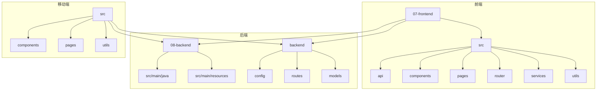
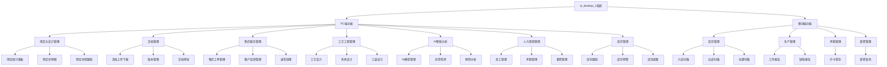
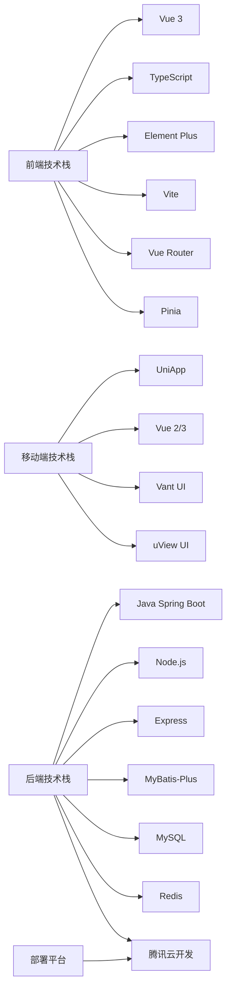
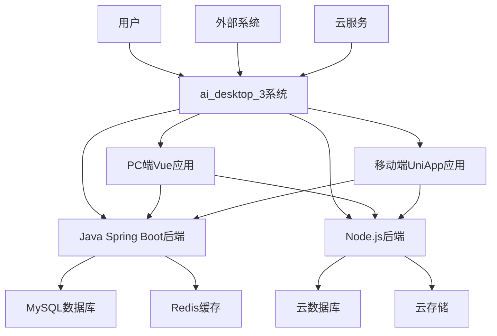
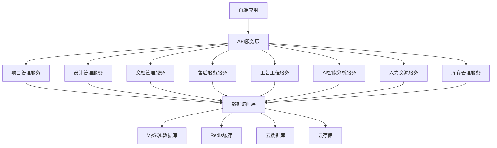
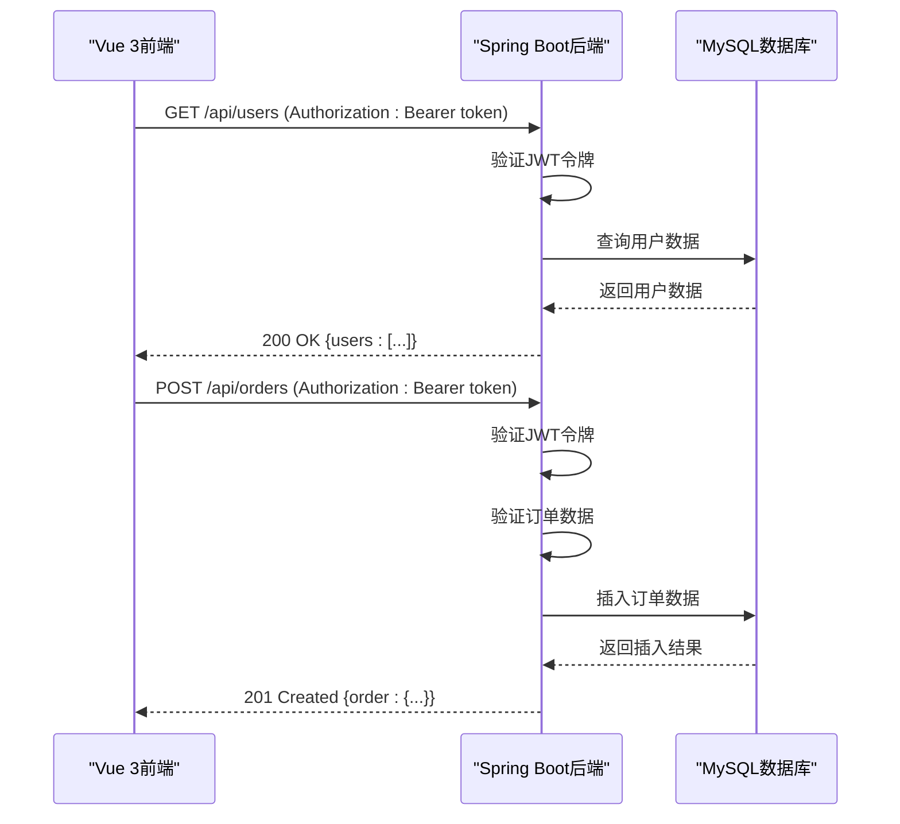
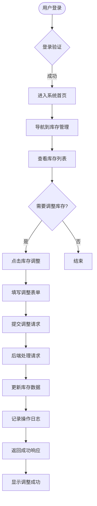
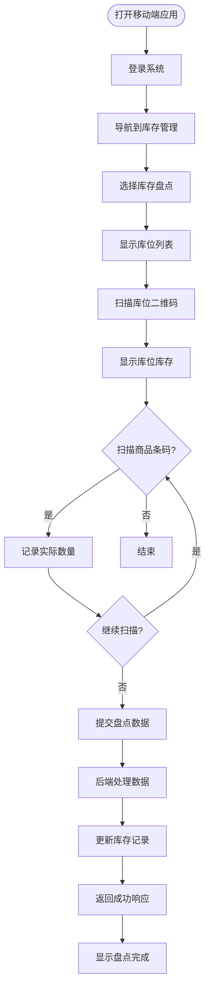

# 系统概述

<cite>
**本文档引用文件**   
- [README.md](file://README.md)
- [package.json](file://package.json)
- [pom.xml](file://pom.xml)
- [07-frontend/package.json](file://07-frontend/package.json)
- [08-backend/src/main/resources/application.yml](file://08-backend/src/main/resources/application.yml)
- [07-frontend/src/main.js](file://07-frontend/src/main.js)
- [07-frontend/src/App.vue](file://07-frontend/src/App.vue)
- [07-frontend/src/router/index.js](file://07-frontend/src/router/index.js)
- [08-backend/src/main/java/com/enterprise/brain/EnterpriseBrainApplication.java](file://08-backend/src/main/java/com/enterprise/brain/EnterpriseBrainApplication.java)
- [backend/server.js](file://backend/server.js)
- [07-frontend/src/layout/index.vue](file://07-frontend/src/layout/index.vue)
- [08-backend/src/main/java/com/enterprise/brain/common/base/BaseController.java](file://08-backend/src/main/java/com/enterprise/brain/common/base/BaseController.java)
- [07-frontend/src/utils/request.js](file://07-frontend/src/utils/request.js)
</cite>

## 目录
1. [简介](#简介)
2. [项目结构](#项目结构)
3. [核心功能模块](#核心功能模块)
4. [技术栈](#技术栈)
5. [系统架构](#系统架构)
6. [前后端分离设计](#前后端分离设计)
7. [典型用户工作流](#典型用户工作流)
8. [部署与运行](#部署与运行)

## 简介

ai_desktop_3项目是一个企业级全栈管理系统，旨在为企业提供全面的业务管理解决方案。该系统融合了PC端Vue应用、移动端UniApp应用与Spring Boot/Node.js后端服务，实现了跨平台的业务管理能力。系统集成了项目管理、设计管理、文档管理、售后服务、工艺工程、AI智能分析、人力资源及库存管理等核心功能模块，满足企业多维度的管理需求。

作为企业级全栈管理系统，ai_desktop_3采用了现代化的技术架构和设计理念。系统采用前后端分离架构，前端基于Vue 3 + TypeScript构建，后端采用Java Spring Boot和Node.js双技术栈，实现了技术协同和灵活扩展。通过腾讯云开发（CloudBase）平台，系统实现了无服务器部署和云函数调用，提高了系统的可伸缩性和可靠性。

**Section sources**
- [README.md](file://README.md#L1-L204)

## 项目结构

ai_desktop_3项目具有清晰的目录结构，体现了前后端分离和模块化设计的特点。项目根目录下包含多个关键文件夹：`07-frontend`存放PC端Vue应用代码，`08-backend`存放Java Spring Boot后端服务，`backend`存放Node.js后端服务，`src`存放移动端UniApp应用代码。

PC端前端应用采用Vue 3 + Element Plus技术栈，位于`07-frontend`目录下。该目录包含标准的Vue项目结构，包括`src`目录下的`api`、`assets`、`components`、`pages`、`router`、`services`和`utils`等子目录。`api`目录按功能模块组织，如财务、人力资源、库存、销售等，每个模块都有独立的API定义文件。`components`目录包含通用组件和业务组件，实现了组件化开发。

后端服务采用双技术栈设计，包含Java Spring Boot和Node.js两种实现。Java后端位于`08-backend`目录下，采用标准的Spring Boot项目结构，包含`src/main/java`和`src/main/resources`目录。Node.js后端位于`backend`目录下，包含`config`、`migrations`、`models`和`routes`等目录，采用Express框架构建RESTful API。



**Diagram sources**
- [project_structure](file://project_structure)

**Section sources**
- [project_structure](file://project_structure)

## 核心功能模块

ai_desktop_3系统提供了全面的企业管理功能，涵盖了企业运营的各个方面。系统功能分为PC端和移动端两大类，满足不同场景下的使用需求。

### PC端功能模块

PC端功能模块包括项目与设计管理、文档管理、售后服务管理、工艺工程管理、AI智能分析、人力资源管理和库存管理等。项目与设计管理模块提供研发项目管理、项目统计看板、项目甘特图可视化和项目详情跟踪功能。文档管理模块支持文档上传下载、版本管理、预览和批量操作。售后服务管理模块涵盖售后工单管理、客户反馈管理、退货处理、保修管理和投诉管理。

AI智能分析模块是系统的核心亮点，包含AI智能分析中心，提供AI模型管理、异常检测、预测分析和智能建议等功能。人力资源管理模块提供员工管理、考勤管理、薪资管理和绩效评估功能。库存管理模块支持商品库存跟踪、库存预警、库存调整和批量操作。

### 移动端功能模块

移动端功能模块针对移动场景进行了优化，包括库存管理、生产管理、考勤管理和薪资管理。库存管理模块提供入库扫描、出库扫描、位置扫描、库存盘点和发货扫描功能，支持移动设备的扫码操作。生产管理模块包含工作报告和缺陷报告功能，便于现场人员实时记录生产情况。考勤管理模块提供打卡签到功能，支持移动考勤。薪资管理模块允许员工在移动端查询薪资信息。



**Diagram sources**
- [README.md](file://README.md#L11-L104)

**Section sources**
- [README.md](file://README.md#L11-L104)

## 技术栈

ai_desktop_3系统采用了现代化的技术栈，结合了前端、后端和移动端的先进技术，实现了高性能、可扩展的企业级应用。

### PC端技术栈

PC端采用Vue 3 + TypeScript作为核心框架，结合Element Plus组件库构建用户界面。Vue 3提供了响应式系统和组合式API，提高了代码的可维护性和开发效率。TypeScript提供了静态类型检查，增强了代码的可靠性和可读性。Vite作为新一代前端构建工具，提供了快速的开发服务器和高效的生产构建。Vue Router用于路由管理，Pinia用于状态管理。

### 移动端技术栈

移动端采用UniApp跨平台开发框架，基于Vue语法构建，支持多端发布。UniApp结合Vant UI和uView UI组件库，提供了丰富的移动端UI组件。通过UniApp，系统可以同时发布到H5、微信小程序、支付宝小程序、抖音小程序和原生App（iOS/Android）等多个平台，实现了"一次开发，多端运行"的目标。

### 后端技术栈

后端采用双技术栈设计，包含Java Spring Boot和Node.js两种实现。Java后端基于Spring Boot框架，结合MyBatis-Plus作为ORM框架，使用MySQL作为关系型数据库，Redis作为缓存系统。Node.js后端采用Express框架，提供了轻量级的RESTful API服务。系统通过腾讯云开发（CloudBase）平台实现无服务器部署，利用云函数、云数据库和云存储服务，提高了系统的可伸缩性和可靠性。



**Diagram sources**
- [README.md](file://README.md#L105-L125)
- [package.json](file://package.json)
- [07-frontend/package.json](file://07-frontend/package.json)
- [pom.xml](file://pom.xml)

**Section sources**
- [README.md](file://README.md#L105-L125)
- [package.json](file://package.json)
- [07-frontend/package.json](file://07-frontend/package.json)
- [pom.xml](file://pom.xml)

## 系统架构

ai_desktop_3系统采用前后端分离的微服务架构，实现了高内聚、低耦合的设计目标。系统架构分为表现层、应用层、服务层和数据层，各层之间通过清晰的接口进行通信。

### 系统上下文图

系统上下文图展示了ai_desktop_3系统与外部实体的交互关系。系统与用户通过PC端和移动端进行交互，通过API与外部系统集成，利用云服务提供基础设施支持。



**Diagram sources**
- [README.md](file://README.md)
- [project_structure](file://project_structure)

### 核心功能模块关系图

核心功能模块关系图展示了系统内部各功能模块之间的依赖关系。各业务模块通过API服务层与后端进行通信，共享基础服务和数据访问层。



**Diagram sources**
- [project_structure](file://project_structure)
- [08-backend/src/main/java/com/enterprise/brain/modules](file://08-backend/src/main/java/com/enterprise/brain/modules)

### 微服务架构

系统采用微服务架构设计，将不同的业务功能拆分为独立的服务模块。Java后端的`08-backend`项目中，`modules`目录下包含`ai`、`analytics`、`finance`、`system`等多个模块，每个模块负责特定的业务功能。这种模块化设计提高了系统的可维护性和可扩展性，支持独立开发、测试和部署。

Node.js后端提供轻量级的API服务，处理特定的业务逻辑，如客户管理、物料管理和产品管理。通过双后端技术栈的设计，系统可以根据业务需求选择合适的技术实现，提高了技术灵活性。

**Section sources**
- [project_structure](file://project_structure)
- [08-backend/src/main/java/com/enterprise/brain/modules](file://08-backend/src/main/java/com/enterprise/brain/modules)
- [backend/routes](file://backend/routes)

## 前后端分离设计

ai_desktop_3系统采用前后端分离架构设计，实现了前端和后端的解耦，提高了开发效率和系统可维护性。

### 前端架构

前端基于Vue 3 + TypeScript构建，采用组件化开发模式。系统使用`07-frontend`目录作为前端项目根目录，包含`src`目录下的`api`、`components`、`pages`、`router`、`services`和`utils`等子目录。`api`目录按功能模块组织API调用，`components`目录包含可复用的UI组件，`pages`目录包含页面级组件，`router`目录管理路由配置。

前端通过Axios库与后端API进行通信，`src/utils/request.js`文件封装了请求拦截器和响应拦截器，统一处理认证、错误和加载状态。系统使用Pinia进行状态管理，实现了全局状态的集中管理。

### 后端架构

后端采用Java Spring Boot和Node.js双技术栈。Java后端基于Spring Boot框架，使用`@RestController`注解定义RESTful API，通过`@RequestMapping`注解映射HTTP请求。系统使用MyBatis-Plus作为ORM框架，简化了数据库操作。`BaseController`类提供了统一的响应格式和错误处理机制。

Node.js后端使用Express框架构建，`backend/server.js`文件定义了应用入口和路由配置。系统通过中间件处理CORS、JSON解析和错误处理，确保API的稳定性和安全性。

### 技术协同机制

Vue 3 + TypeScript前端与Java Spring Boot后端通过RESTful API进行协同。前端通过Axios发送HTTP请求，后端返回JSON格式的响应数据。系统使用JWT进行身份认证，前端在请求头中携带`Authorization`令牌，后端通过拦截器验证令牌的有效性。



**Diagram sources**
- [07-frontend/src/utils/request.js](file://07-frontend/src/utils/request.js)
- [08-backend/src/main/java/com/enterprise/brain/common/base/BaseController.java](file://08-backend/src/main/java/com/enterprise/brain/common/base/BaseController.java)
- [07-frontend/src/main.js](file://07-frontend/src/main.js)

**Section sources**
- [07-frontend/src/utils/request.js](file://07-frontend/src/utils/request.js)
- [08-backend/src/main/java/com/enterprise/brain/common/base/BaseController.java](file://08-backend/src/main/java/com/enterprise/brain/common/base/BaseController.java)
- [07-frontend/src/main.js](file://07-frontend/src/main.js)

## 典型用户工作流

ai_desktop_3系统为不同角色的用户提供了优化的工作流程，以下以库存管理人员为例，展示典型的用户工作流。

### PC端库存管理流程

库存管理人员登录系统后，通过左侧菜单导航到库存管理模块，查看商品库存情况。当需要进行库存调整时，点击"库存调整"按钮，系统弹出调整表单。用户填写调整数量、原因等信息，提交后系统更新库存数据并记录操作日志。



**Diagram sources**
- [07-frontend/src/router/index.js](file://07-frontend/src/router/index.js)
- [07-frontend/src/layout/index.vue](file://07-frontend/src/layout/index.vue)
- [07-frontend/src/pages/inventory/inventory-management/InventoryList.vue](file://07-frontend/src/pages/inventory/inventory-management/InventoryList.vue)

### 移动端库存盘点流程

现场工作人员使用移动设备进行库存盘点。打开移动端应用，导航到库存管理模块，选择"库存盘点"功能。系统显示需要盘点的库位列表，工作人员扫描库位二维码，系统显示该库位的库存信息。工作人员扫描商品条码，系统记录实际库存数量，完成盘点后提交数据。



**Diagram sources**
- [src/pages/inventory/LocationScan.vue](file://src/pages/inventory/LocationScan.vue)
- [07-frontend/src/pages/inventory/inventory-management/StockMovement.vue](file://07-frontend/src/pages/inventory/inventory-management/StockMovement.vue)

**Section sources**
- [src/pages/inventory/LocationScan.vue](file://src/pages/inventory/LocationScan.vue)
- [07-frontend/src/pages/inventory/inventory-management/StockMovement.vue](file://07-frontend/src/pages/inventory/inventory-management/StockMovement.vue)

## 部署与运行

ai_desktop_3系统支持多种部署方式，包括本地开发环境和云平台部署。

### 本地开发环境

系统提供了详细的本地开发环境配置指南。PC端开发需要Node.js 16+环境，通过`npm install`安装依赖，`npm run dev`启动开发服务器。移动端开发推荐使用HBuilderX工具，支持运行到浏览器、模拟器或真机。

```bash
# PC端
cd 07-frontend
npm install
npm run dev

# 移动端
cd platforms/mobile
npm install
```

### 云平台部署

系统基于腾讯云开发（CloudBase）平台，支持无服务器部署。部署流程包括：注册腾讯云账号、开通云开发服务、创建云开发环境、配置云函数和数据库、部署静态资源。通过云开发平台，系统实现了自动伸缩、高可用和免运维的部署模式。

**Section sources**
- [README.md](file://README.md#L126-L183)