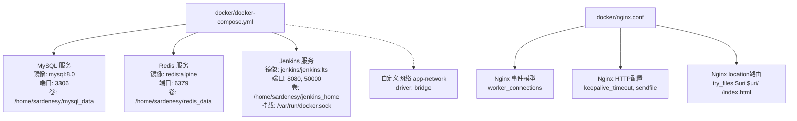
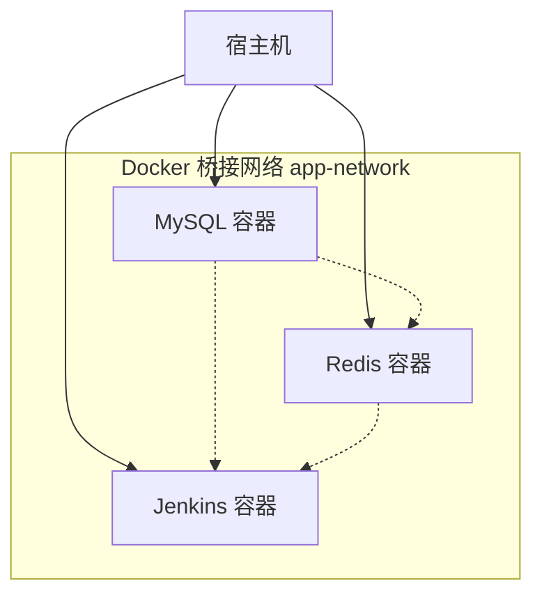
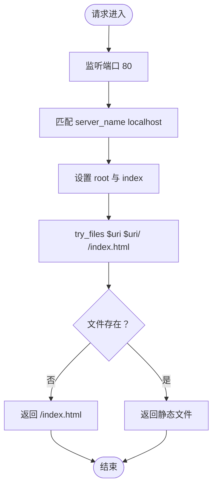
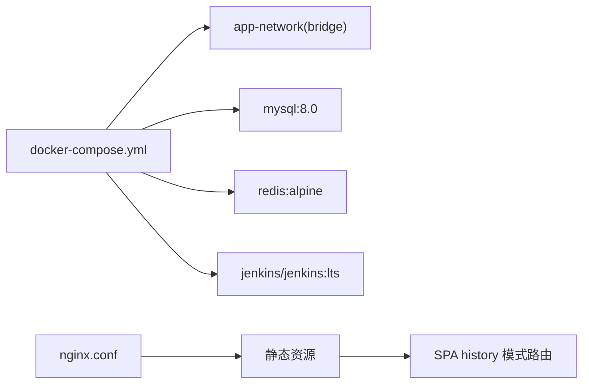

# Docker配置

<cite>
**本文引用的文件**
- [docker-compose.yml](file://docker/docker-compose.yml)
- [nginx.conf](file://docker/nginx.conf)
- [README.md](file://README.md)
</cite>

## 目录
1. [引言](#引言)
2. [项目结构](#项目结构)
3. [核心组件](#核心组件)
4. [架构总览](#架构总览)
5. [详细组件分析](#详细组件分析)
6. [依赖关系分析](#依赖关系分析)
7. [性能考虑](#性能考虑)
8. [故障排查指南](#故障排查指南)
9. [结论](#结论)
10. [附录](#附录)

## 引言
本文件面向运维人员，围绕仓库中的Docker相关配置进行深入解析，重点覆盖：
- docker-compose.yml中MySQL、Redis、Jenkins的服务定义与网络通信机制
- Nginx配置文件nginx.conf的事件处理模型、HTTP配置与location路由规则（尤其是前端单页应用history模式支持）
- Docker网络桥接模式原理与性能优化建议
- 容器日志管理、数据持久化与安全配置的最佳实践

## 项目结构
仓库中与Docker直接相关的配置位于docker目录，包含：
- docker-compose.yml：定义MySQL、Redis、Jenkins三个服务及自定义桥接网络
- nginx.conf：Nginx基础配置，包含事件模型、HTTP参数与location路由

**图表来源**
- [docker-compose.yml](file://docker/docker-compose.yml#L1-L45)
- [nginx.conf](file://docker/nginx.conf#L1-L23)

**章节来源**
- [docker-compose.yml](file://docker/docker-compose.yml#L1-L45)
- [nginx.conf](file://docker/nginx.conf#L1-L23)

## 核心组件
本节对三个核心容器服务进行逐项解析，并说明其在compose中的网络与数据卷配置。

- MySQL服务
  - 镜像版本：mysql:8.0
  - 环境变量：设置root密码与默认数据库名
  - 端口映射：宿主机3306映射到容器3306
  - 数据卷：宿主机路径/home/sardenesy/mysql_data挂载到容器/var/lib/mysql
  - 网络：加入自定义桥接网络app-network
  - 重启策略：unless-stopped

- Redis服务
  - 镜像版本：redis:alpine
  - 端口映射：宿主机6379映射到容器6379
  - 数据卷：宿主机路径/home/sardenesy/redis_data挂载到容器/data
  - 网络：加入自定义桥接网络app-network
  - 重启策略：unless-stopped

- Jenkins服务
  - 镜像版本：jenkins/jenkins:lts
  - 端口映射：宿主机8080映射到容器8080；50000映射到容器50000（JNLP）
  - 数据卷：宿主机路径/home/sardenesy/jenkins_home挂载到容器/var/jenkins_home；挂载/var/run/docker.sock以支持在容器内调用Docker
  - 网络：加入自定义桥接网络app-network
  - 重启策略：unless-stopped

- 自定义网络
  - 名称：app-network
  - 驱动：bridge（Docker默认桥接驱动）

**章节来源**
- [docker-compose.yml](file://docker/docker-compose.yml#L1-L45)

## 架构总览
下图展示容器间网络拓扑与通信关系。所有服务均连接到同一自定义桥接网络，实现彼此通过服务名或容器名可达。

**图表来源**
- [docker-compose.yml](file://docker/docker-compose.yml#L1-L45)

## 详细组件分析

### MySQL服务配置分析
- 镜像与版本：mysql:8.0
- 环境变量：包含root密码与默认数据库名
- 端口映射：3306对外暴露
- 数据卷：持久化到宿主机/home/sardenesy/mysql_data
- 网络：加入app-network
- 重启策略：unless-stopped

该服务适合作为后端应用的数据存储，配合后端应用通过服务名访问容器内部的MySQL实例。

**章节来源**
- [docker-compose.yml](file://docker/docker-compose.yml#L1-L45)

### Redis服务配置分析
- 镜像与版本：redis:alpine
- 端口映射：6379对外暴露
- 数据卷：持久化到宿主机/home/sardenesy/redis_data
- 网络：加入app-network
- 重启策略：unless-stopped

该服务适合作为缓存与会话存储，后端应用可通过服务名访问Redis。

**章节来源**
- [docker-compose.yml](file://docker/docker-compose.yml#L1-L45)

### Jenkins服务配置分析
- 镜像与版本：jenkins/jenkins:lts
- 端口映射：8080对外暴露Web界面；50000对外暴露JNLP端口
- 数据卷：/home/sardenesy/jenkins_home持久化Jenkins工作空间；/var/run/docker.sock挂载以支持在容器内调用Docker
- 网络：加入app-network
- 重启策略：unless-stopped

该服务适合CI/CD流水线，挂载Docker Socket可实现在Jenkins容器内执行Docker命令。

**章节来源**
- [docker-compose.yml](file://docker/docker-compose.yml#L1-L45)

### Nginx配置分析（nginx.conf）
- 事件处理模型：worker_connections设置为1024
- HTTP配置：sendfile开启；keepalive_timeout设置为65
- Server块：监听80端口，server_name为localhost
- Location块：根路径下使用try_files回退到/index.html，支持前端单页应用history模式

该配置适用于将静态资源（如前端构建产物）托管在Nginx，并通过try_files实现SPA的history模式路由。

**图表来源**
- [nginx.conf](file://docker/nginx.conf#L1-L23)

**章节来源**
- [nginx.conf](file://docker/nginx.conf#L1-L23)

## 依赖关系分析
- compose文件定义了三个服务与一个自定义桥接网络
- 三个服务均加入app-network，彼此通过服务名可达
- Jenkins挂载/var/run/docker.sock，具备在容器内调用Docker的能力
- 前端静态资源由Nginx提供，location规则支持SPA history模式

**图表来源**
- [docker-compose.yml](file://docker/docker-compose.yml#L1-L45)
- [nginx.conf](file://docker/nginx.conf#L1-L23)

**章节来源**
- [docker-compose.yml](file://docker/docker-compose.yml#L1-L45)
- [nginx.conf](file://docker/nginx.conf#L1-L23)

## 性能考虑
- 网络桥接模式
  - 使用bridge驱动创建app-network，容器间通过服务名通信，延迟低且隔离性好
  - 建议避免过多容器共享同一宿主机网络栈，必要时使用独立子网或分层网络
- Nginx性能
  - worker_connections设置为1024，适合中小规模并发；高并发场景可按需提升
  - keepalive_timeout设置为65，有助于复用TCP连接，减少握手开销
  - sendfile开启，减少内核态与用户态切换，提高静态文件传输效率
- 数据持久化
  - MySQL与Redis分别挂载宿主机目录，确保数据持久化与快速恢复
  - 建议定期备份宿主机挂载目录，并监控磁盘空间
- Jenkins
  - 挂载/var/run/docker.sock可能带来安全风险，建议仅在受控环境中启用
  - 将Jenkins Home卷与Docker Socket分离，便于独立扩展与迁移

[本节为通用性能建议，不直接分析具体文件，故无“章节来源”]

## 故障排查指南
- MySQL无法连接
  - 检查宿主机3306端口是否被占用
  - 确认环境变量中的root密码与数据库名配置正确
  - 查看容器日志，确认MySQL启动成功
  - 确认容器已加入app-network，且后端应用使用正确的服务名访问

- Redis无法连接
  - 检查宿主机6379端口是否被占用
  - 确认容器已加入app-network，且后端应用使用正确的服务名访问

- Jenkins无法访问或JNLP端口不可用
  - 检查宿主机8080与50000端口映射是否正确
  - 若启用Docker Socket挂载，确认宿主机Docker服务正常
  - 查看容器日志，定位初始化问题

- Nginx返回404或空白页面
  - 确认静态资源已正确挂载到Nginx的root目录
  - 检查location块的try_files规则是否生效
  - 确认SPA构建产物已放置在Nginx root目录下

- 日志管理
  - 使用Docker日志查看容器输出
  - 对于生产环境，建议将日志输出到集中式日志系统（如ELK、Fluentd等），并配置日志轮转

- 安全配置
  - Jenkins挂载Docker Socket存在安全风险，建议仅在可信网络内使用
  - MySQL/Redis应设置强密码与最小权限账户，避免使用root直接访问
  - 仅暴露必要端口，关闭不必要的外部访问

**章节来源**
- [docker-compose.yml](file://docker/docker-compose.yml#L1-L45)
- [nginx.conf](file://docker/nginx.conf#L1-L23)

## 结论
本仓库的Docker配置通过自定义桥接网络实现了MySQL、Redis与Jenkins的稳定互联，结合Nginx的SPA路由规则，能够满足前端静态资源托管与history模式支持的需求。建议在生产环境中进一步完善日志管理、数据备份与安全加固措施，确保系统的可靠性与可维护性。

[本节为总结性内容，不直接分析具体文件，故无“章节来源”]

## 附录
- 项目背景与技术栈
  - 项目简介与技术栈信息可参考根目录README文件，其中包含前端、移动端与后端的技术选型说明

**章节来源**
- [README.md](file://README.md#L1-L204)