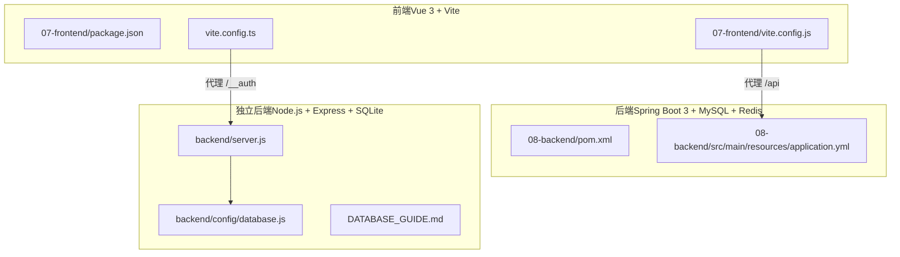
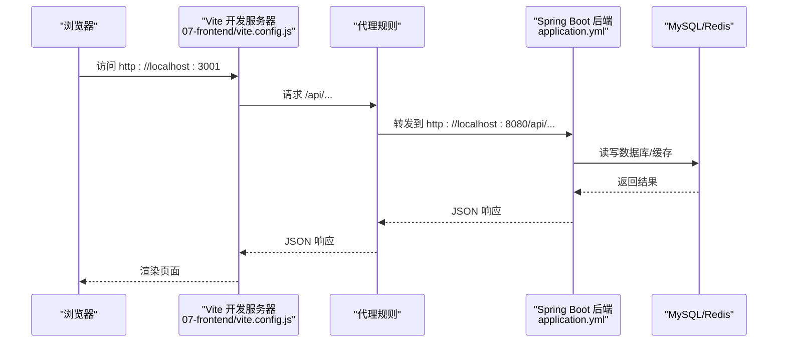
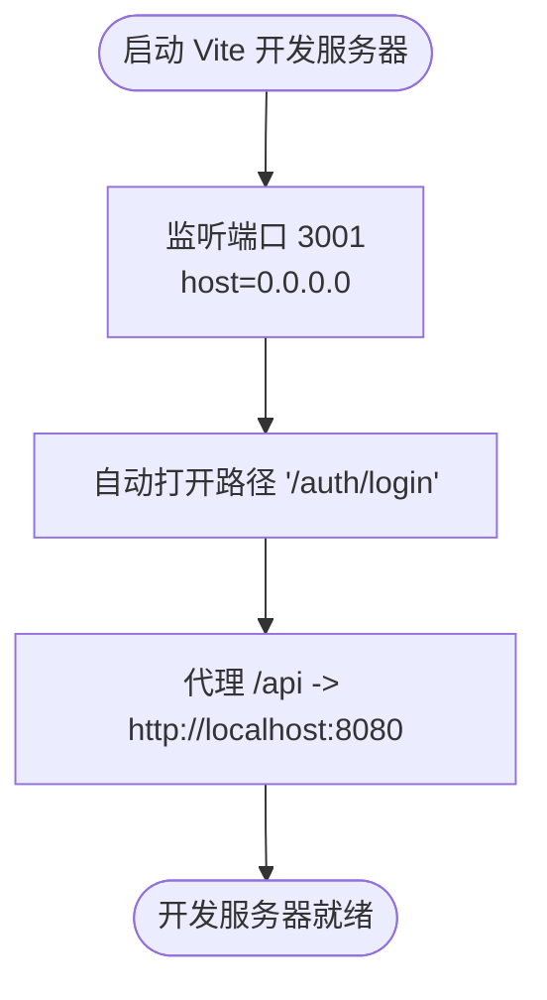
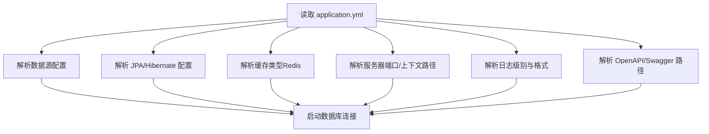
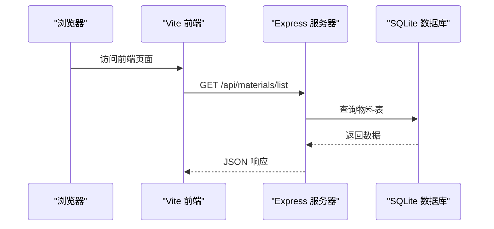

# 开发环境搭建

<cite>
**本文引用的文件**
- [07-frontend/package.json](file://07-frontend/package.json)
- [07-frontend/vite.config.js](file://07-frontend/vite.config.js)
- [07-frontend/TROUBLESHOOTING.md](file://07-frontend/TROUBLESHOOTING.md)
- [08-backend/pom.xml](file://08-backend/pom.xml)
- [08-backend/src/main/resources/application.yml](file://08-backend/src/main/resources/application.yml)
- [backend/server.js](file://backend/server.js)
- [backend/config/database.js](file://backend/config/database.js)
- [DATABASE_GUIDE.md](file://DATABASE_GUIDE.md)
- [vite.config.ts](file://vite.config.ts)
- [pom.xml](file://pom.xml)
</cite>

## 目录
1. [简介](#简介)
2. [项目结构](#项目结构)
3. [核心组件](#核心组件)
4. [架构总览](#架构总览)
5. [详细组件分析](#详细组件分析)
6. [依赖关系分析](#依赖关系分析)
7. [性能考虑](#性能考虑)
8. [故障排查指南](#故障排查指南)
9. [结论](#结论)
10. [附录](#附录)

## 简介
本指南面向新加入的开发者，帮助你在本地快速搭建完整的开发环境，涵盖前端（Vue 3 + Vite）、后端（Spring Boot + MySQL/Redis）以及可选的独立后端（Node.js + Express + SQLite）。你将学会：
- 安装与配置 Node.js、Java JDK、Maven 等必要工具及其版本要求
- 前后端依赖安装与构建流程
- Vite 开发服务器配置（端口、主机、自动打开、代理）
- Spring Boot 开发环境数据库连接、Redis 缓存与日志级别配置
- 常见问题排查（端口冲突、依赖下载失败、跨域、代理不通等）

## 项目结构
该仓库包含多个子项目与示例后端，主要涉及两条开发路径：
- 前端（Vue 3 + Vite）位于 07-frontend 目录，提供现代化开发体验与热更新
- 后端（Spring Boot 3 + MySQL + Redis）位于 08-backend 目录，提供企业级微服务能力
- 另有一套独立后端（Node.js + Express + SQLite）位于 backend 目录，适合轻量联调与演示

图表来源
- [07-frontend/vite.config.js](file://07-frontend/vite.config.js#L1-L27)
- [08-backend/src/main/resources/application.yml](file://08-backend/src/main/resources/application.yml#L1-L42)
- [backend/server.js](file://backend/server.js#L1-L73)
- [backend/config/database.js](file://backend/config/database.js#L1-L179)
- [vite.config.ts](file://vite.config.ts#L1-L22)

章节来源
- [07-frontend/package.json](file://07-frontend/package.json#L1-L34)
- [07-frontend/vite.config.js](file://07-frontend/vite.config.js#L1-L27)
- [08-backend/pom.xml](file://08-backend/pom.xml#L1-L115)
- [08-backend/src/main/resources/application.yml](file://08-backend/src/main/resources/application.yml#L1-L42)
- [backend/server.js](file://backend/server.js#L1-L73)
- [backend/config/database.js](file://backend/config/database.js#L1-L179)
- [DATABASE_GUIDE.md](file://DATABASE_GUIDE.md#L1-L185)
- [vite.config.ts](file://vite.config.ts#L1-L22)
- [pom.xml](file://pom.xml#L1-L32)

## 核心组件
- 前端开发工具链
  - Node.js 与包管理器（npm/yarn/pnpm）
  - Vite 作为开发服务器与构建工具
  - Vue 3、TypeScript、ESLint、Prettier
- 后端开发工具链
  - Java JDK 17（Spring Boot 3 需要）
  - Maven 3.6+（用于构建 Spring Boot 应用）
  - MySQL 8（开发数据库）
  - Redis（缓存）
- 独立后端（可选）
  - Node.js + Express 提供 REST API
  - better-sqlite3 + SQLite 存储数据

章节来源
- [07-frontend/package.json](file://07-frontend/package.json#L1-L34)
- [08-backend/pom.xml](file://08-backend/pom.xml#L1-L115)
- [08-backend/src/main/resources/application.yml](file://08-backend/src/main/resources/application.yml#L1-L42)
- [backend/server.js](file://backend/server.js#L1-L73)
- [backend/config/database.js](file://backend/config/database.js#L1-L179)
- [DATABASE_GUIDE.md](file://DATABASE_GUIDE.md#L1-L185)
- [pom.xml](file://pom.xml#L1-L32)

## 架构总览
本项目提供两种联调方案：
- 方案A：前端（Vite）通过 /api 代理到 Spring Boot 后端（端口 8080），Swagger UI 访问 /swagger-ui.html
- 方案B：前端（Vite）通过 /__auth 代理到 CloudBase 示例站点；同时独立后端（Express + SQLite）提供物料 API

图表来源
- [07-frontend/vite.config.js](file://07-frontend/vite.config.js#L1-L27)
- [08-backend/src/main/resources/application.yml](file://08-backend/src/main/resources/application.yml#L1-L42)

## 详细组件分析

### 前端开发服务器配置（Vite）
- 端口与主机
  - 开发端口：3001
  - 主机绑定：0.0.0.0，允许局域网访问
- 自动打开
  - 启动后自动打开登录页路径
- 代理规则
  - /api 代理到后端服务地址，转发后端 API 请求
  - 适用于 Spring Boot 后端（端口 8080）
- 路径别名
  - @ 指向 src 目录，便于模块导入

图表来源
- [07-frontend/vite.config.js](file://07-frontend/vite.config.js#L1-L27)

章节来源
- [07-frontend/vite.config.js](file://07-frontend/vite.config.js#L1-L27)

### Spring Boot 后端配置（application.yml）
- 数据源
  - 地址：localhost:3306
  - 数据库名：app_db
  - 用户名/密码：devuser/dev123456
  - 驱动类：MySQL Connector/J
- JPA/Hibernate
  - DDL 自动更新
  - SQL 输出开启
  - 方言：MySQL8Dialect
- 缓存
  - 类型：redis
- 服务器
  - 端口：8080
  - 地址：0.0.0.0
  - 上下文路径：/api
- 日志
  - 包级别：DEBUG（项目包）
  - 安全相关：INFO
  - 控制台格式：时间戳 + 消息
- 文档
  - OpenAPI：/v3/api-docs
  - Swagger UI：/swagger-ui.html

图表来源
- [08-backend/src/main/resources/application.yml](file://08-backend/src/main/resources/application.yml#L1-L42)

章节来源
- [08-backend/src/main/resources/application.yml](file://08-backend/src/main/resources/application.yml#L1-L42)

### 独立后端（Node.js + Express + SQLite）
- 服务器
  - 默认端口：3005（可通过环境变量覆盖）
  - 支持 CORS，JSON/URL 编码解析
  - 静态文件：/uploads
- 路由
  - /api/materials/*：物料管理接口
  - GET /health：健康检查
  - 根路径返回可用端点列表
- 数据库
  - better-sqlite3 + SQLite
  - 自动创建数据目录与表结构
  - 初始化物料、BOM、子件等表与索引

图表来源
- [backend/server.js](file://backend/server.js#L1-L73)
- [backend/config/database.js](file://backend/config/database.js#L1-L179)

章节来源
- [backend/server.js](file://backend/server.js#L1-L73)
- [backend/config/database.js](file://backend/config/database.js#L1-L179)
- [DATABASE_GUIDE.md](file://DATABASE_GUIDE.md#L1-L185)

### CloudBase 适配（可选）
- 代理 /__auth 到 CloudBase 示例站点，便于认证联调
- 仅在需要联调 CloudBase 平台时启用

章节来源
- [vite.config.ts](file://vite.config.ts#L1-L22)

## 依赖关系分析

### 前端依赖安装与构建
- 安装依赖
  - 在 07-frontend 目录执行依赖安装
- 构建与预览
  - 构建产物：Vite 构建输出
  - 预览：本地静态服务预览构建产物
- 开发脚本
  - dev：启动 Vite 开发服务器
  - lint/format：代码质量与格式化

章节来源
- [07-frontend/package.json](file://07-frontend/package.json#L1-L34)

### 后端依赖安装与构建
- JDK 与 Maven
  - Java 版本：17（Spring Boot 3 需要）
  - Maven：3.6+（推荐使用 3.9+）
- 依赖说明
  - Spring Web、JPA、Security、Validation、Cache
  - MySQL Connector/J 8.0.33
  - MyBatis Plus
  - SpringDoc OpenAPI
  - Lombok
- 构建与运行
  - 使用 Maven 插件构建 Spring Boot 可执行 JAR
  - 运行时依赖 MySQL 与 Redis

章节来源
- [08-backend/pom.xml](file://08-backend/pom.xml#L1-L115)
- [pom.xml](file://pom.xml#L1-L32)

### 独立后端依赖安装与运行
- Node.js：安装 LTS 版本
- 依赖安装：在项目根目录执行
- 运行
  - 开发模式：支持热重载
  - 生产模式：通过环境变量切换

章节来源
- [backend/server.js](file://backend/server.js#L1-L73)
- [DATABASE_GUIDE.md](file://DATABASE_GUIDE.md#L1-L185)

## 性能考虑
- 前端
  - 合理使用按需导入与懒加载，减少首屏体积
  - 代理仅在开发阶段启用，避免生产环境不必要的转发
- 后端
  - 数据库连接池与索引优化
  - Redis 缓存命中率与过期策略
  - JPA SQL 输出仅在开发阶段开启
- 独立后端
  - SQLite 文件大小与索引维护
  - 静态文件缓存与上传目录权限

[本节为通用建议，无需列出具体文件来源]

## 故障排查指南

### 端口冲突
- 现象
  - Vite 启动报端口占用（3001）
  - Spring Boot 启动报端口占用（8080）
  - Express 启动报端口占用（3005）
- 处理
  - 修改对应配置文件中的端口
  - 或释放占用端口的进程
- 参考
  - 前端开发服务器端口：3001
  - Spring Boot 服务器端口：8080
  - Express 默认端口：3005

章节来源
- [07-frontend/vite.config.js](file://07-frontend/vite.config.js#L1-L27)
- [08-backend/src/main/resources/application.yml](file://08-backend/src/main/resources/application.yml#L1-L42)
- [backend/server.js](file://backend/server.js#L1-L73)

### 依赖下载失败（网络/镜像）
- 现象
  - npm/yarn/pnpm 安装依赖超时或失败
- 处理
  - 切换国内镜像源（如 cnpm、TUNA、Azure）
  - 清理缓存并重试
  - 检查代理与防火墙设置
- 参考
  - 前端依赖安装与脚本定义
  - 后端依赖清单与版本约束

章节来源
- [07-frontend/package.json](file://07-frontend/package.json#L1-L34)
- [08-backend/pom.xml](file://08-backend/pom.xml#L1-L115)

### 跨域与代理不通
- 现象
  - 前端请求 /api 报跨域错误
  - 代理到后端 8080 失败
- 处理
  - 确认后端已启动且端口正确
  - 检查代理规则与目标地址
  - 浏览器开发者工具 Network 标签查看请求与响应
- 参考
  - 前端代理配置
  - 后端上下文路径与端口

章节来源
- [07-frontend/vite.config.js](file://07-frontend/vite.config.js#L1-L27)
- [08-backend/src/main/resources/application.yml](file://08-backend/src/main/resources/application.yml#L1-L42)

### 数据库连接失败
- 现象
  - Spring Boot 启动报数据库连接异常
  - 独立后端 SQLite 初始化失败
- 处理
  - 确认 MySQL/Redis 已安装并运行
  - 检查 application.yml 中的用户名、密码、地址
  - 独立后端：确认 data 目录可写，数据库文件权限正常
- 参考
  - Spring Boot 数据源配置
  - 独立后端数据库初始化逻辑

章节来源
- [08-backend/src/main/resources/application.yml](file://08-backend/src/main/resources/application.yml#L1-L42)
- [backend/config/database.js](file://backend/config/database.js#L1-L179)

### 日志级别与定位问题
- 前端
  - 启用 HMR 错误覆盖层，便于快速定位
  - 使用 Vue Devtools 查看组件树与状态
- 后端
  - 开发阶段可提高日志级别至 DEBUG
  - 关注安全相关日志级别为 INFO
- 参考
  - 前端调试技巧与 HMR 配置
  - 后端日志级别与格式

章节来源
- [07-frontend/TROUBLESHOOTING.md](file://07-frontend/TROUBLESHOOTING.md#L1-L271)
- [08-backend/src/main/resources/application.yml](file://08-backend/src/main/resources/application.yml#L1-L42)

## 结论
通过以上步骤，你可以完成本地开发环境的搭建与联调：
- 前端使用 Vite 开发服务器，端口 3001，自动打开登录页，并通过 /api 代理到后端
- 后端使用 Spring Boot，端口 8080，上下文路径 /api，数据库与 Redis 已配置
- 独立后端（可选）使用 Node.js + Express + SQLite，提供物料 API 与健康检查
- 遇到常见问题时，可依据本指南的排查要点快速定位并解决

[本节为总结性内容，无需列出具体文件来源]

## 附录

### 版本与工具要求
- Node.js
  - 前端工程：任意 LTS 版本
  - 独立后端：任意 LTS 版本
- Java JDK
  - Spring Boot 3 需要 JDK 17
  - 另一个 Java 工程使用 JDK 21（不影响主后端）
- Maven
  - 建议 3.9+，兼容 Spring Boot 3
- MySQL
  - 版本 8（驱动版本 8.0.33）
- Redis
  - 开发环境本地运行
- SQLite（独立后端）
  - better-sqlite3 + SQLite

章节来源
- [08-backend/pom.xml](file://08-backend/pom.xml#L1-L115)
- [pom.xml](file://pom.xml#L1-L32)
- [08-backend/src/main/resources/application.yml](file://08-backend/src/main/resources/application.yml#L1-L42)
- [backend/server.js](file://backend/server.js#L1-L73)

### 快速启动清单
- 启动后端（Spring Boot）
  - 进入 08-backend 目录，使用 Maven 构建并运行
  - 确认端口 8080 可访问，Swagger UI 路径 /swagger-ui.html
- 启动前端
  - 进入 07-frontend 目录，执行开发脚本
  - 访问 http://localhost:3001，自动打开登录页
- 联调（可选）
  - 独立后端：在项目根目录启动 Node.js 服务器
  - 访问 http://localhost:3005/health 检查健康状态

章节来源
- [08-backend/pom.xml](file://08-backend/pom.xml#L1-L115)
- [07-frontend/package.json](file://07-frontend/package.json#L1-L34)
- [07-frontend/vite.config.js](file://07-frontend/vite.config.js#L1-L27)
- [backend/server.js](file://backend/server.js#L1-L73)