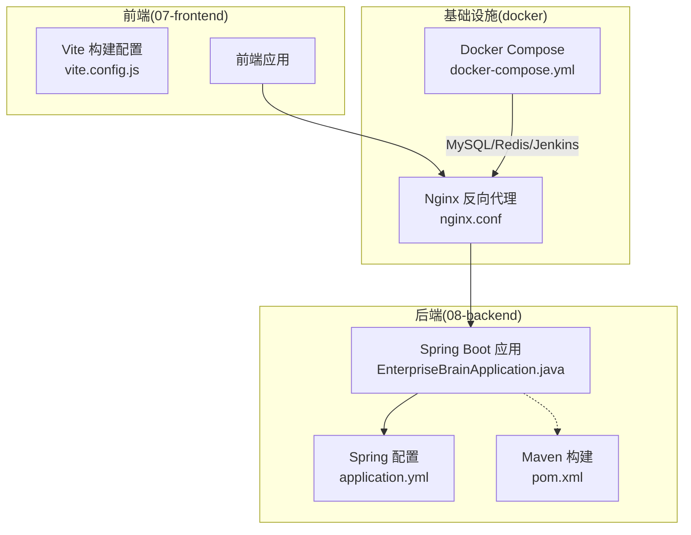
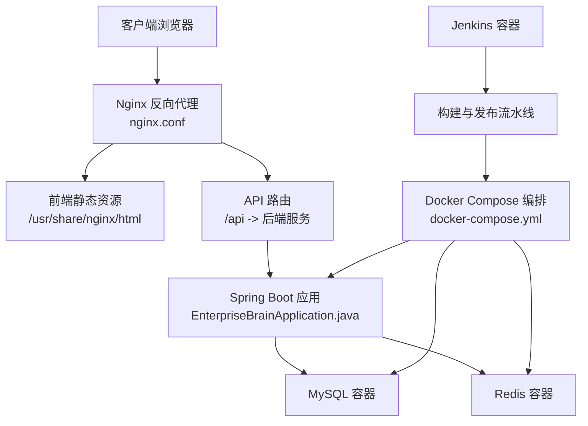
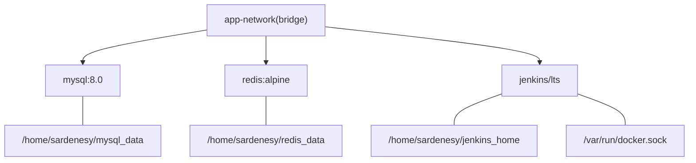
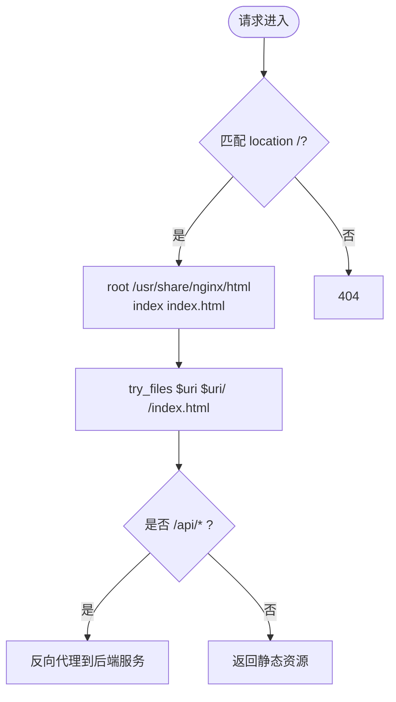
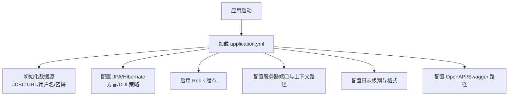
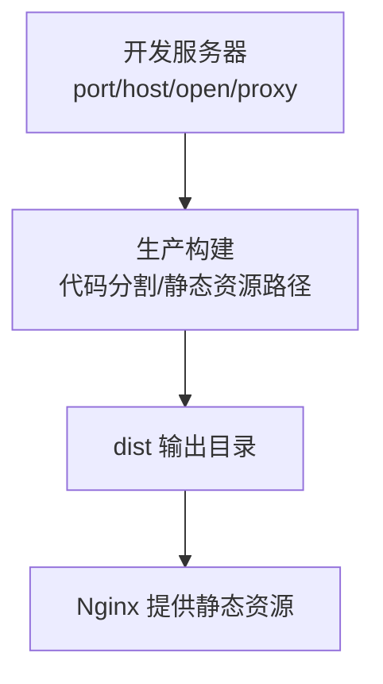
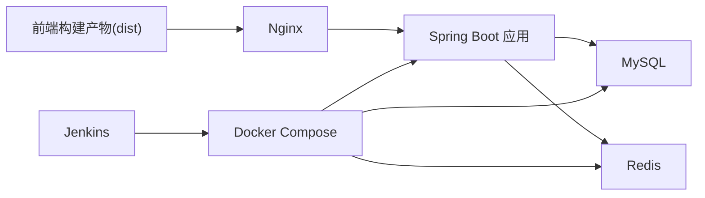

# 生产环境部署

<cite>
**本文引用的文件**
- [docker-compose.yml](file://docker/docker-compose.yml)
- [nginx.conf](file://docker/nginx.conf)
- [application.yml](file://08-backend/src/main/resources/application.yml)
- [vite.config.js](file://07-frontend/vite.config.js)
- [pom.xml](file://08-backend/pom.xml)
- [EnterpriseBrainApplication.java](file://08-backend/src/main/java/com/enterprise/brain/EnterpriseBrainApplication.java)
- [DATABASE_GUIDE.md](file://DATABASE_GUIDE.md)
</cite>

## 目录
1. [简介](#简介)
2. [项目结构](#项目结构)
3. [核心组件](#核心组件)
4. [架构总览](#架构总览)
5. [详细组件分析](#详细组件分析)
6. [依赖关系分析](#依赖关系分析)
7. [性能考量](#性能考量)
8. [故障排查指南](#故障排查指南)
9. [结论](#结论)
10. [附录](#附录)

## 简介
本方案面向生产环境部署，覆盖从代码构建到服务上线的完整流程。基于仓库中的 docker-compose.yml 文件，说明如何通过 Docker 容器化部署 MySQL、Redis 和 Jenkins；结合 nginx.conf 配置文件，解释 Nginx 作为反向代理与静态资源服务器的配置要点；说明 vite.config.js 中的生产构建优化（如代码分割与静态资源路径）；并解析 application.yml 中的数据库连接池、缓存策略与安全配置。最后提供部署验证与健康检查方法，确保系统稳定运行。

## 项目结构
本仓库包含前后端与基础设施配置：
- 前端工程位于 07-frontend，使用 Vite 构建，提供开发与代理配置；
- 后端工程位于 08-backend，采用 Spring Boot 3 + Maven，配置文件为 application.yml；
- 基础设施编排位于 docker 目录，包含 docker-compose.yml 与 nginx.conf；
- 另一套独立的 Node.js + SQLite 后端位于 backend 目录，并配有 DATABASE_GUIDE.md。

图表来源
- [docker-compose.yml](file://docker/docker-compose.yml#L1-L45)
- [nginx.conf](file://docker/nginx.conf#L1-L23)
- [application.yml](file://08-backend/src/main/resources/application.yml#L1-L42)
- [vite.config.js](file://07-frontend/vite.config.js#L1-L27)
- [pom.xml](file://08-backend/pom.xml#L1-L115)
- [EnterpriseBrainApplication.java](file://08-backend/src/main/java/com/enterprise/brain/EnterpriseBrainApplication.java#L1-L62)

章节来源
- [docker-compose.yml](file://docker/docker-compose.yml#L1-L45)
- [nginx.conf](file://docker/nginx.conf#L1-L23)
- [application.yml](file://08-backend/src/main/resources/application.yml#L1-L42)
- [vite.config.js](file://07-frontend/vite.config.js#L1-L27)
- [pom.xml](file://08-backend/pom.xml#L1-L115)
- [EnterpriseBrainApplication.java](file://08-backend/src/main/java/com/enterprise/brain/EnterpriseBrainApplication.java#L1-L62)

## 核心组件
- Docker Compose 服务
  - MySQL：提供关系型数据库，映射端口与数据卷，重启策略为 unless-stopped。
  - Redis：提供缓存与会话存储，映射端口与数据卷，重启策略为 unless-stopped。
  - Jenkins：提供 CI/CD 流水线，映射端口与工作目录，挂载 Docker Socket 以便容器内拉取镜像。
- Nginx：监听 80 端口，作为静态资源服务器与反向代理，将 /api 路由转发至后端服务。
- Spring Boot 应用：基于 application.yml 配置数据源、JPA、缓存与安全等。
- 前端 Vite：提供开发代理与构建配置，便于联调与打包。

章节来源
- [docker-compose.yml](file://docker/docker-compose.yml#L1-L45)
- [nginx.conf](file://docker/nginx.conf#L1-L23)
- [application.yml](file://08-backend/src/main/resources/application.yml#L1-L42)
- [vite.config.js](file://07-frontend/vite.config.js#L1-L27)

## 架构总览
生产环境采用容器化部署，Nginx 作为统一入口，负责静态资源分发与 API 反向代理；后端 Spring Boot 应用通过容器网络与 MySQL、Redis 通信；Jenkins 用于自动化构建与发布。

图表来源
- [docker-compose.yml](file://docker/docker-compose.yml#L1-L45)
- [nginx.conf](file://docker/nginx.conf#L1-L23)
- [EnterpriseBrainApplication.java](file://08-backend/src/main/java/com/enterprise/brain/EnterpriseBrainApplication.java#L1-L62)

## 详细组件分析

### Docker Compose 组件
- MySQL
  - 镜像与端口映射：3306 映射到宿主机。
  - 数据卷：将宿主机目录挂载到容器内数据库数据目录，确保持久化。
  - 环境变量：设置 root 密码与默认数据库名。
  - 重启策略：unless-stopped，避免意外退出影响业务。
- Redis
  - 镜像与端口映射：6379 映射到宿主机。
  - 数据卷：将宿主机目录挂载到容器内持久化目录。
  - 重启策略：unless-stopped。
- Jenkins
  - 镜像与端口映射：8080 与 50000。
  - 数据卷：挂载 Jenkins Home 目录与 Docker Socket，便于容器内执行构建。
  - 重启策略：unless-stopped。
- 网络
  - 自定义桥接网络 app-network，使服务间通过容器名互通。

图表来源
- [docker-compose.yml](file://docker/docker-compose.yml#L1-L45)

章节来源
- [docker-compose.yml](file://docker/docker-compose.yml#L1-L45)

### Nginx 反向代理与静态资源
- 监听 80 端口，server_name 为 localhost。
- 根目录指向 /usr/share/nginx/html，index 为 index.html。
- try_files 逻辑：优先尝试真实文件/目录，否则回退到 index.html，适合单页应用路由。
- 代理规则：/api 路由转发至后端服务地址（开发代理指向 8080），生产环境可按需调整。

图表来源
- [nginx.conf](file://docker/nginx.conf#L1-L23)

章节来源
- [nginx.conf](file://docker/nginx.conf#L1-L23)

### Spring Boot 应用配置(application.yml)
- 数据源
  - JDBC URL 指向本地 MySQL，启用 SSL、时区与字符集设置。
  - 用户名与密码用于连接数据库。
  - 驱动类名指定 MySQL Connector。
- JPA/Hibernate
  - ddl-auto: update，自动建表/变更。
  - 方言为 MySQL8Dialect，格式化 SQL。
- 缓存
  - 类型为 redis，配合 Redis 容器使用。
- 服务器
  - 端口 8080，允许局域网访问，context-path 为 /api。
- 日志
  - 控制台输出格式与级别配置。
- 文档
  - OpenAPI/Swagger 路径配置。

图表来源
- [application.yml](file://08-backend/src/main/resources/application.yml#L1-L42)
- [EnterpriseBrainApplication.java](file://08-backend/src/main/java/com/enterprise/brain/EnterpriseBrainApplication.java#L1-L62)

章节来源
- [application.yml](file://08-backend/src/main/resources/application.yml#L1-L42)
- [EnterpriseBrainApplication.java](file://08-backend/src/main/java/com/enterprise/brain/EnterpriseBrainApplication.java#L1-L62)

### 前端构建与优化(vite.config.js)
- 插件：Vue 插件。
- 别名：@ 指向 src 目录，便于模块导入。
- 开发服务器：端口 3001，host 0.0.0.0，自动打开登录页。
- 代理：/api 路由代理到后端服务地址，changeOrigin 与路径重写，便于开发联调。
- 生产构建优化建议
  - 代码分割：拆分 vendor 与业务包，减少首屏体积。
  - 静态资源路径：设置 base 与 publicPath，确保 CDN 或子路径部署正确。
  - 构建产物：输出到 dist，交由 Nginx 提供静态资源。

图表来源
- [vite.config.js](file://07-frontend/vite.config.js#L1-L27)

章节来源
- [vite.config.js](file://07-frontend/vite.config.js#L1-L27)

### Jenkins 与 CI/CD
- Jenkins 容器映射 8080 与 50000 端口，挂载 jenkins_home 与 Docker Socket。
- 重启策略 unless-stopped，保障持续集成服务可用。
- 建议在 Jenkins 中配置流水线，触发 Maven 构建与 Docker 镜像推送，最终通过 docker-compose 部署。

章节来源
- [docker-compose.yml](file://docker/docker-compose.yml#L1-L45)

## 依赖关系分析
- Spring Boot 应用依赖 MySQL 与 Redis，通过容器网络访问。
- Nginx 依赖前端构建产物（dist），通过挂载或构建流程生成。
- Jenkins 依赖 Docker 环境与 Maven 工具链，完成构建与发布。

图表来源
- [docker-compose.yml](file://docker/docker-compose.yml#L1-L45)
- [nginx.conf](file://docker/nginx.conf#L1-L23)
- [application.yml](file://08-backend/src/main/resources/application.yml#L1-L42)

章节来源
- [docker-compose.yml](file://docker/docker-compose.yml#L1-L45)
- [nginx.conf](file://docker/nginx.conf#L1-L23)
- [application.yml](file://08-backend/src/main/resources/application.yml#L1-L42)

## 性能考量
- Nginx
  - keepalive_timeout 与 sendfile 已开启，有助于长连接与高效传输。
  - 建议启用 gzip 压缩与缓存头，提升静态资源加载速度。
- Spring Boot
  - 连接池：建议在生产环境显式配置连接池大小与超时参数，避免默认值导致瓶颈。
  - 缓存：合理设置 Redis 缓存键与过期策略，避免热点数据雪崩。
  - 日志：生产环境降低 DEBUG 级别，避免过多 IO。
- 前端
  - 代码分割与懒加载，减少首屏体积。
  - 静态资源 CDN 化，缩短加载时间。
- 数据库
  - MySQL：建立必要索引，定期维护与备份。
  - Redis：合理设置内存淘汰策略与持久化策略。

[本节为通用指导，不直接分析具体文件]

## 故障排查指南
- 容器状态
  - 检查 MySQL/Redis/Jenkins 是否正常运行，端口映射是否冲突。
  - 查看容器日志，定位启动失败原因。
- 网络连通
  - 确认 app-network 桥接网络存在且服务间可互相访问。
  - 检查 Spring Boot 应用能否连接到 MySQL 与 Redis。
- Nginx
  - 确认静态资源目录已挂载，index.html 存在。
  - /api 路由是否正确代理到后端服务。
- 应用健康
  - 访问后端健康检查端点（若存在），或通过 Swagger UI 验证接口可用性。
- 数据库
  - 若使用独立 Node.js + SQLite 的后端，参考 DATABASE_GUIDE.md 的生产环境部署建议与备份策略。

章节来源
- [docker-compose.yml](file://docker/docker-compose.yml#L1-L45)
- [nginx.conf](file://docker/nginx.conf#L1-L23)
- [DATABASE_GUIDE.md](file://DATABASE_GUIDE.md#L1-L185)

## 结论
本方案通过 Docker Compose 将 MySQL、Redis、Jenkins 容器化，结合 Nginx 提供静态资源与反向代理能力，配合 Spring Boot 的生产配置与前端构建优化，形成完整的生产部署闭环。建议在生产环境中进一步完善连接池、缓存策略、日志级别与备份策略，确保系统高可用与可维护性。

[本节为总结，不直接分析具体文件]

## 附录

### 部署步骤清单
- 准备宿主机
  - 安装 Docker 与 Docker Compose。
  - 准备数据卷目录（/home/sardenesy/mysql_data、/home/sardenesy/redis_data、/home/sardenesy/jenkins_home）。
- 启动基础设施
  - 使用 docker-compose 启动 MySQL、Redis、Jenkins。
- 构建与部署
  - 前端：执行构建，产出 dist，交由 Nginx 提供静态资源。
  - 后端：使用 Maven 打包，运行 Spring Boot 应用。
  - Nginx：配置静态资源与 /api 反代。
- 验证
  - 访问前端首页与后端 Swagger UI。
  - 检查数据库连接与缓存可用性。
  - 观察容器日志与健康检查结果。

章节来源
- [docker-compose.yml](file://docker/docker-compose.yml#L1-L45)
- [nginx.conf](file://docker/nginx.conf#L1-L23)
- [application.yml](file://08-backend/src/main/resources/application.yml#L1-L42)
- [vite.config.js](file://07-frontend/vite.config.js#L1-L27)
- [pom.xml](file://08-backend/pom.xml#L1-L115)
- [EnterpriseBrainApplication.java](file://08-backend/src/main/java/com/enterprise/brain/EnterpriseBrainApplication.java#L1-L62)