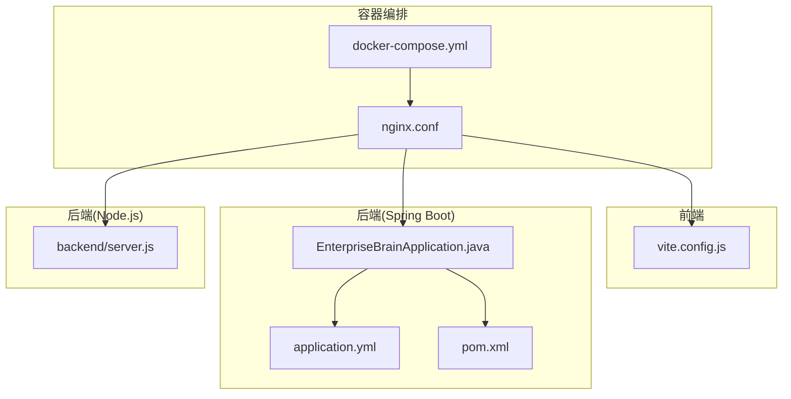
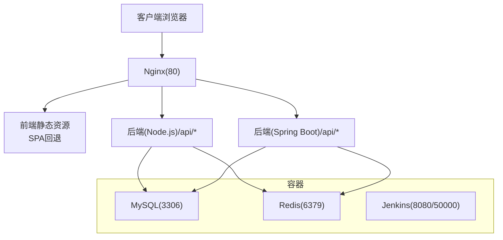
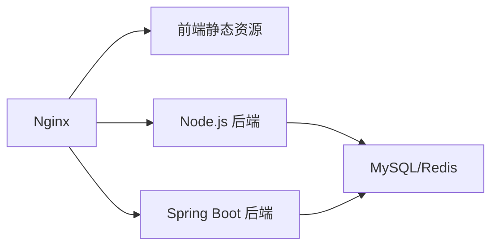

# 部署与运维

<cite>
**本文引用的文件**
- [docker/docker-compose.yml](file://docker/docker-compose.yml)
- [docker/nginx.conf](file://docker/nginx.conf)
- [07-frontend/vite.config.js](file://07-frontend/vite.config.js)
- [08-backend/src/main/resources/application.yml](file://08-backend/src/main/resources/application.yml)
- [08-backend/pom.xml](file://08-backend/pom.xml)
- [08-backend/src/main/java/com/enterprise/brain/EnterpriseBrainApplication.java](file://08-backend/src/main/java/com/enterprise/brain/EnterpriseBrainApplication.java)
- [backend/server.js](file://backend/server.js)
- [DATABASE_GUIDE.md](file://DATABASE_GUIDE.md)
- [README.md](file://README.md)
</cite>

## 目录
1. [简介](#简介)
2. [项目结构](#项目结构)
3. [核心组件](#核心组件)
4. [架构总览](#架构总览)
5. [详细组件分析](#详细组件分析)
6. [依赖关系分析](#依赖关系分析)
7. [性能考虑](#性能考虑)
8. [故障排查指南](#故障排查指南)
9. [结论](#结论)
10. [附录](#附录)

## 简介
本指南面向开发、测试与生产环境，提供基于现有配置的完整部署与运维实践，重点围绕以下方面展开：
- 使用 docker-compose 启动 MySQL、Redis、Jenkins 等基础设施服务，并说明网络、卷挂载与环境变量。
- 解释 nginx.conf 的反向代理与静态资源服务配置，支撑前后端分离部署。
- 描述 Vite 构建配置（vite.config.js）中的开发与生产相关优化点，以及与后端代理的关系。
- 说明 application.yml 中的生产环境参数调优，包括数据库连接、缓存、日志级别等。
- 提供监控方案建议，包括日志收集、性能监控与告警设置，确保系统稳定运行。

## 项目结构
该仓库包含前端（PC端与移动端）、后端（Spring Boot 与 Node.js 双栈）、容器编排与基础配置。与部署运维直接相关的关键文件如下：
- 容器编排与反向代理
  - docker/docker-compose.yml：定义 MySQL、Redis、Jenkins 服务及网络。
  - docker/nginx.conf：Nginx 反向代理与静态资源服务配置。
- 前端
  - 07-frontend/vite.config.js：Vite 开发服务器、代理与别名配置。
- 后端（Spring Boot）
  - 08-backend/src/main/resources/application.yml：数据库、缓存、日志、Swagger 等配置。
  - 08-backend/pom.xml：依赖与构建插件。
  - 08-backend/src/main/java/com/enterprise/brain/EnterpriseBrainApplication.java：启动入口与日志输出。
- 后端（Node.js Express）
  - backend/server.js：Express 服务、静态资源、健康检查与错误处理。
- 运维与部署参考
  - DATABASE_GUIDE.md：SQLite 独立数据库的环境隔离、备份与生产部署建议。
  - README.md：快速开始与生产构建说明。

图表来源
- [docker/docker-compose.yml](file://docker/docker-compose.yml#L1-L45)
- [docker/nginx.conf](file://docker/nginx.conf#L1-L23)
- [07-frontend/vite.config.js](file://07-frontend/vite.config.js#L1-L27)
- [08-backend/src/main/resources/application.yml](file://08-backend/src/main/resources/application.yml#L1-L42)
- [08-backend/pom.xml](file://08-backend/pom.xml#L1-L115)
- [08-backend/src/main/java/com/enterprise/brain/EnterpriseBrainApplication.java](file://08-backend/src/main/java/com/enterprise/brain/EnterpriseBrainApplication.java#L1-L62)
- [backend/server.js](file://backend/server.js#L1-L73)

章节来源
- [docker/docker-compose.yml](file://docker/docker-compose.yml#L1-L45)
- [docker/nginx.conf](file://docker/nginx.conf#L1-L23)
- [07-frontend/vite.config.js](file://07-frontend/vite.config.js#L1-L27)
- [08-backend/src/main/resources/application.yml](file://08-backend/src/main/resources/application.yml#L1-L42)
- [08-backend/pom.xml](file://08-backend/pom.xml#L1-L115)
- [08-backend/src/main/java/com/enterprise/brain/EnterpriseBrainApplication.java](file://08-backend/src/main/java/com/enterprise/brain/EnterpriseBrainApplication.java#L1-L62)
- [backend/server.js](file://backend/server.js#L1-L73)
- [DATABASE_GUIDE.md](file://DATABASE_GUIDE.md#L1-L185)
- [README.md](file://README.md#L120-L170)

## 核心组件
- Docker Compose 基础设施
  - MySQL 8.0：持久化数据目录映射，环境变量配置，桥接网络。
  - Redis：持久化数据目录映射，桥接网络。
  - Jenkins：端口映射、宿主机 Docker Socket 挂载、持久化工作区。
- Nginx 反向代理与静态资源
  - 监听 80 端口，根路径提供静态 HTML，支持 SPA 回退。
- 前端 Vite
  - 别名、开发服务器端口与主机、代理到后端 API。
- 后端（Spring Boot）
  - 数据源、JPA、缓存、Redis、日志级别、Swagger 路径。
- 后端（Node.js Express）
  - CORS、JSON/URL 编码限制、静态文件上传目录、健康检查、错误处理。

章节来源
- [docker/docker-compose.yml](file://docker/docker-compose.yml#L1-L45)
- [docker/nginx.conf](file://docker/nginx.conf#L1-L23)
- [07-frontend/vite.config.js](file://07-frontend/vite.config.js#L1-L27)
- [08-backend/src/main/resources/application.yml](file://08-backend/src/main/resources/application.yml#L1-L42)
- [backend/server.js](file://backend/server.js#L1-L73)

## 架构总览
整体部署采用“容器化 + 反向代理 + 前后端分离”的架构。Nginx 作为统一入口，负责静态资源与 API 反向代理；前端通过 Vite 开发服务器或构建产物接入；后端提供 Spring Boot 与 Node.js 两种形态，分别对接 MySQL/Redis 与 SQLite。

图表来源
- [docker/docker-compose.yml](file://docker/docker-compose.yml#L1-L45)
- [docker/nginx.conf](file://docker/nginx.conf#L1-L23)
- [backend/server.js](file://backend/server.js#L1-L73)
- [08-backend/src/main/resources/application.yml](file://08-backend/src/main/resources/application.yml#L1-L42)

## 详细组件分析

### Docker Compose 部署与运维
- 服务定义
  - MySQL：镜像、容器名、环境变量（root 密码、数据库名）、端口映射、卷挂载、重启策略、网络。
  - Redis：镜像、容器名、端口映射、卷挂载、重启策略、网络。
  - Jenkins：镜像、容器名、端口映射、卷挂载（工作区与 Docker Socket）、重启策略、网络。
- 网络
  - 自定义桥接网络，便于服务间通信与隔离。
- 卷挂载
  - MySQL/Redis 数据持久化目录映射到宿主机，避免容器重建导致数据丢失。
- 环境变量
  - MySQL 初始化参数，需结合初始化脚本或迁移工具使用。
- 运维要点
  - 定期备份宿主机上的持久化目录。
  - 使用重启策略保证服务稳定性。
  - Jenkins 挂载 Docker Socket 以支持流水线内拉起容器。

章节来源
- [docker/docker-compose.yml](file://docker/docker-compose.yml#L1-L45)

### Nginx 反向代理与静态资源
- 监听与站点
  - 监听 80 端口，server_name 指定域名或 localhost。
- 静态资源
  - root 指向静态文件根目录，index 指定首页。
  - try_files 实现 SPA 回退，确保前端路由正常工作。
- 运维建议
  - 将构建后的前端产物复制到 Nginx root 目录。
  - 如需 HTTPS，可在上游增加 SSL 终止与证书管理。
  - 结合 CDN 加速静态资源，减少带宽与延迟。

章节来源
- [docker/nginx.conf](file://docker/nginx.conf#L1-L23)

### Vite 构建与开发代理
- 别名与开发服务器
  - 路径别名指向 src，提升导入便捷性。
  - 开发服务器端口、主机与自动打开路径。
- 开发代理
  - 将 /api 前缀代理到后端服务地址，实现跨域与统一入口。
- 生产构建
  - 仓库未提供独立的生产构建配置文件，建议在 CI 中执行构建并将产物放入 Nginx 静态目录。

章节来源
- [07-frontend/vite.config.js](file://07-frontend/vite.config.js#L1-L27)

### Spring Boot 生产参数调优
- 数据源与连接池
  - JDBC URL、用户名、密码、驱动类名；建议在生产环境通过环境变量注入。
- JPA 与 Hibernate
  - DDL 自动策略、SQL 显示与方言配置；生产环境建议关闭自动建表。
- 缓存与 Redis
  - 缓存类型与 Redis 连接参数；确保 Redis 可用性与持久化。
- 日志级别与格式
  - 包级日志级别与控制台输出格式；生产环境建议降低调试级别。
- Swagger 文档
  - OpenAPI 与 UI 路径；生产环境建议关闭或限制访问。
- 启动入口
  - EnterpriseBrainApplication 输出访问 URL、Swagger 地址与激活 Profile，便于运维定位。

章节来源
- [08-backend/src/main/resources/application.yml](file://08-backend/src/main/resources/application.yml#L1-L42)
- [08-backend/src/main/java/com/enterprise/brain/EnterpriseBrainApplication.java](file://08-backend/src/main/java/com/enterprise/brain/EnterpriseBrainApplication.java#L1-L62)

### Node.js 后端服务
- 中间件与静态资源
  - CORS、JSON/URL 编码大小限制、静态文件上传目录。
- 路由与健康检查
  - 材料管理路由、根路径信息、健康检查接口。
- 错误处理与 404
  - 统一错误响应与 404 处理，便于前端与监控系统识别异常。
- 运维建议
  - 使用 PM2 管理进程，配置开机自启与日志轮转。
  - 结合 Nginx 反向代理，统一暴露端口与访问入口。

章节来源
- [backend/server.js](file://backend/server.js#L1-L73)

### 独立数据库系统（SQLite）与生产部署
- 环境隔离
  - 开发、测试、生产三套数据库文件，分别位于不同子目录。
- 数据持久化
  - data/enterprise_brain.db 默认数据库，按环境区分。
- 备份与恢复
  - 启动时自动备份，支持手动备份与恢复。
- 生产部署建议
  - 使用 PM2 管理进程、配置开机自启动与日志监控。
  - 定期执行数据库维护（压缩、索引、完整性检查）。

章节来源
- [DATABASE_GUIDE.md](file://DATABASE_GUIDE.md#L1-L185)

## 依赖关系分析
- 组件耦合
  - Nginx 作为统一入口，依赖前端静态资源与后端 API。
  - 后端（Spring Boot 与 Node.js）共享 MySQL/Redis，受容器编排与网络影响。
- 外部依赖
  - Spring Boot 依赖 MySQL、Redis、MyBatis Plus、OpenAPI 等。
  - 前端依赖 Vue 3、Vite、Element Plus 等。
- 潜在环路
  - 当前配置未见循环依赖；建议在引入新服务时保持清晰的单向依赖链。

图表来源
- [docker/docker-compose.yml](file://docker/docker-compose.yml#L1-L45)
- [docker/nginx.conf](file://docker/nginx.conf#L1-L23)
- [backend/server.js](file://backend/server.js#L1-L73)
- [08-backend/src/main/resources/application.yml](file://08-backend/src/main/resources/application.yml#L1-L42)

章节来源
- [docker/docker-compose.yml](file://docker/docker-compose.yml#L1-L45)
- [docker/nginx.conf](file://docker/nginx.conf#L1-L23)
- [08-backend/pom.xml](file://08-backend/pom.xml#L1-L115)
- [backend/server.js](file://backend/server.js#L1-L73)

## 性能考虑
- 前端
  - 构建产物应启用 Gzip/Brotli 压缩与缓存头，结合 CDN 提升加载速度。
  - 代码分割与懒加载，减少首屏体积。
- 后端（Spring Boot）
  - 合理设置连接池大小、超时与只读事务，避免阻塞。
  - Redis 缓存热点数据，降低数据库压力。
- 后端（Node.js）
  - 控制请求体大小与并发，避免内存溢出。
  - 使用进程池与负载均衡，提升吞吐。
- Nginx
  - 启用 keepalive、gzip、静态缓存与合理的 worker 连接数。
  - 限制上传文件大小与超时时间，防止资源滥用。

[本节为通用指导，不直接分析具体文件]

## 故障排查指南
- 健康检查
  - Node.js 后端提供 /health 接口，可用于探活与自动化运维。
- 常见问题
  - 前端无法连接后端：检查后端是否运行、端口是否开放、代理配置是否正确。
  - 数据导入后刷新数据丢失：确认后端服务运行、浏览器控制台无错误、后端日志记录成功写入。
  - 数据库文件损坏：从备份恢复或删除重建数据库文件。
- 运维工具
  - PM2：进程管理、开机自启、日志轮转。
  - Docker：容器状态、日志查看与卷挂载验证。
  - Nginx：配置校验、访问日志与错误日志分析。

章节来源
- [backend/server.js](file://backend/server.js#L1-L73)
- [DATABASE_GUIDE.md](file://DATABASE_GUIDE.md#L120-L185)

## 结论
本指南基于现有配置，给出了从开发到生产的部署与运维实践。建议在生产环境中：
- 使用 docker-compose 管理基础设施，确保数据持久化与网络隔离。
- 通过 Nginx 提供统一入口与静态资源服务，结合 CDN 与缓存策略。
- 在 Spring Boot 与 Node.js 后端中合理配置数据库、缓存与日志，保障稳定性与可观测性。
- 建立完善的监控与告警体系，配合日志收集与备份策略，确保系统长期稳定运行。

[本节为总结性内容，不直接分析具体文件]

## 附录

### 开发、测试、生产环境部署流程
- 开发环境
  - 启动后端（Spring Boot 或 Node.js），前端通过 Vite 开发服务器访问。
  - 若使用 Node.js 后端，确保代理配置指向后端服务。
- 测试环境
  - 使用独立数据库文件与配置，隔离测试数据。
  - 部署 Nginx 并指向测试构建产物。
- 生产环境
  - 构建前端产物并放置到 Nginx 静态目录。
  - 启动 MySQL/Redis/Jenkins 容器，配置持久化卷与环境变量。
  - 后端通过 PM2 管理进程，配置开机自启与日志轮转。

章节来源
- [README.md](file://README.md#L157-L170)
- [DATABASE_GUIDE.md](file://DATABASE_GUIDE.md#L151-L185)
- [docker/docker-compose.yml](file://docker/docker-compose.yml#L1-L45)
- [docker/nginx.conf](file://docker/nginx.conf#L1-L23)
- [07-frontend/vite.config.js](file://07-frontend/vite.config.js#L1-L27)
- [08-backend/src/main/resources/application.yml](file://08-backend/src/main/resources/application.yml#L1-L42)
- [backend/server.js](file://backend/server.js#L1-L73)

### 监控方案建议
- 日志收集
  - Nginx：访问日志与错误日志集中采集。
  - 后端：Spring Boot 与 Node.js 输出结构化日志，统一收集与检索。
  - 前端：浏览器错误上报与埋点日志。
- 性能监控
  - Nginx：连接数、请求速率、响应时间。
  - 应用：CPU、内存、GC、数据库连接池使用率。
  - 容器：Docker 资源使用情况与健康检查。
- 告警设置
  - 关键阈值：错误率、响应时间、磁盘空间、连接池耗尽、容器崩溃。
  - 通知渠道：邮件、IM、电话等分级告警。

[本节为通用指导，不直接分析具体文件]