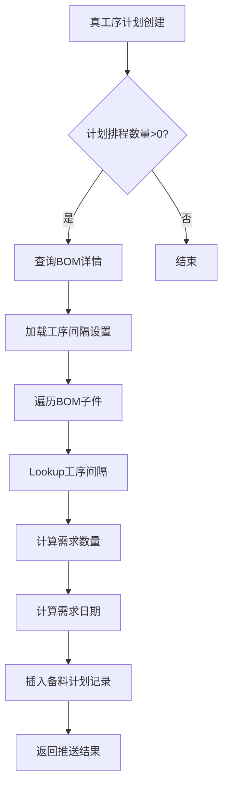

# 真工序计划→备料计划数据流实现说明

## 功能概述
当真工序计划创建成功且"计划排程数量">0时，自动推送数据到备料计划表。

## 触发时机
- **触发页面**: 真工序计划列表 (`http://localhost:3003/process-planning/real-process-plan`)
- **触发时机**: 真工序计划创建成功
- **触发条件**: `计划排程数量 > 0`

## 数据流映射规则

### 备料计划字段映射

| 备料计划字段 | 来源 | 说明 |
|------------|------|------|
| 备料计划编号 | 系统自动生成 | 格式：`MPP + 年月日 + 时间戳 + 随机数` |
| 来源主计划编号 | 真工序计划.主生产计划编号 | `master_plan_no` |
| 来源工序计划编号 | 真工序计划.工序计划编号 | `plan_no` |
| 父件编号 | 真工序计划.生产产品编号 | `product_code` |
| 父件名称 | 真工序计划.生产产品名称 | `product_name` |
| 父件排程数量 | 真工序计划.计划排程数量 | `schedule_quantity` |
| 备料物料编号 | BOM详情.子件编号 | `child_code` |
| 备料物料名称 | BOM详情.子件名称 | `child_name` |
| 物料来源 | BOM详情.子件来源 | `component_source` |
| 物料单位 | `/` | 暂时默认 |
| 需求数量 | BOM详情.需领用数量 | `计划排程数量 × 标准用量` |
| 是否需要MRP运算 | `/` | 暂时默认0 |
| 实时库存 | `0` | 暂时默认0 |
| 预计结存 | `0` | 暂时默认0 |
| 有效库存 | `0` | 暂时默认0 |
| 需补货数量 | 计算 | `需求数量 - 有效库存` |
| 来源工序 | BOM详情.产出工序 | `output_process` |
| 车间名称 | `/` | 暂时默认 |
| **父件工序名称** | **真工序计划.工序名称** | **新增字段** |
| **工序间隔工时** | **lookup工序间隔设置** | **新增字段** |
| **工序间隔单位** | **lookup工序间隔设置** | **新增字段** |
| **工序计划排程日期** | **真工序计划.计划排程日期** | **新增字段** |
| 需求日期 | 计算 | `工序计划排程日期 - 工序间隔工时` |

### 工序间隔Lookup规则

**匹配条件**:
```javascript
工序间隔设置.上道工序名称 = 备料计划.父件工序名称 
AND 
工序间隔设置.下道工序名称 = 备料计划.来源工序
```

**查询字段**:
- `工序间隔工时` = 工序间隔设置.数值
- `工序间隔单位` = 工序间隔设置.间隔单位

**需求日期计算**:
```javascript
if (工序间隔单位 === '小时') {
  需求日期 = 工序计划排程日期 - 工序间隔工时(小时)
} else if (工序间隔单位 === '天') {
  需求日期 = 工序计划排程日期 - 工序间隔工时(天)
}
```

## 实现文件

### 后端文件
1. **服务层** - `/backend/services/realProcessPlanService.js`
   - 在`create()`方法中添加自动推送逻辑
   - 触发条件：`scheduleQuantity > 0`

2. **数据流服务** - `/backend/services/realProcessPlanToMaterialService.js`
   - `pushToMaterialPreparation()`: 核心推送方法
   - `buildProcessIntervalMap()`: 构建工序间隔Map
   - `generatePlanNo()`: 生成备料计划编号

3. **路由层** - `/backend/routes/realProcessPlans.js`
   - `POST /:id/push-to-material`: 手动推送接口(备用)

### 前端文件
1. **备料计划页面** - `/07-frontend/src/pages/production-planning/MaterialPreparationPlanNew.vue`
   - 包含4个新增字段的列配置和表单

2. **工序间隔设置页面** - `/07-frontend/src/pages/production-planning/ProcessIntervalSettings.vue`
   - 管理工序间隔规则
   - 数据存储在localStorage: `processIntervalData`

## 数据流程图



## 关键代码片段

### 1. 真工序计划创建时自动推送

```javascript
// backend/services/realProcessPlanService.js
static async create(data) {
  // ... 创建真工序计划 ...
  
  // ✅ 自动推送到备料计划（触发条件：计划排程数量>0）
  if (data.scheduleQuantity && parseFloat(data.scheduleQuantity) > 0) {
    const [createdPlanRows] = await pool.execute(
      'SELECT * FROM real_process_plans WHERE id = ?',
      [result.insertId]
    );
    
    const realProcessPlanToMaterialService = require('./realProcessPlanToMaterialService');
    const processIntervalSettings = await this.loadProcessIntervalSettings();
    
    const pushResult = await realProcessPlanToMaterialService.pushToMaterialPreparation(
      createdPlanRows[0],
      processIntervalSettings
    );
  }
  
  return { id: result.insertId };
}
```

### 2. 工序间隔Lookup

```javascript
// backend/services/realProcessPlanToMaterialService.js
const intervalKey = `${parentProcessName}__${bomChild.output_process}`;
const interval = processIntervalMap[intervalKey] || { hours: 0, unit: '小时' };
```

### 3. 需求日期计算

```javascript
let demandDate = null;
if (scheduleDate && interval.hours > 0) {
  const scheduleDateTime = new Date(scheduleDate);
  if (interval.unit === '小时') {
    scheduleDateTime.setHours(scheduleDateTime.getHours() - interval.hours);
  } else if (interval.unit === '天') {
    scheduleDateTime.setDate(scheduleDateTime.getDate() - interval.hours);
  }
  demandDate = scheduleDateTime.toISOString().split('T')[0];
} else {
  demandDate = scheduleDate;
}
```

## 测试步骤

### 1. 准备工作
1. 确保工序列表有数据
2. 配置工序间隔设置：
   - 访问 `http://localhost:3003/production-planning/process-interval-settings`
   - 添加工序间隔规则，例如：
     - 上道工序：`焊接`，下道工序：`打磨`，数值：`2`，单位：`小时`

### 2. 创建真工序计划
1. 访问真工序计划页面：`http://localhost:3003/process-planning/real-process-plan`
2. 点击"新增"按钮
3. 填写表单：
   - 工序计划编号: 自动生成
   - 生产产品编号: 选择有BOM的产品
   - 工序名称: `焊接`
   - 计划排程数量: `100`（必须>0）
   - 计划排程日期: `2025-12-15`
4. 点击"保存"

### 3. 验证备料计划
1. 访问备料计划页面：`http://localhost:3007/production-planning/material-preparation-new`
2. 检查是否自动生成了备料计划记录
3. 验证字段值：
   - 来源工序计划编号 = 真工序计划编号
   - 父件编号 = 生产产品编号
   - 父件工序名称 = `焊接`
   - 工序间隔工时 = `2`
   - 工序间隔单位 = `小时`
   - 工序计划排程日期 = `2025-12-15`
   - 需求日期 = `2025-12-15 00:00:00 - 2小时` = `2025-12-14 22:00:00` (显示为 `2025-12-14`)

### 4. 查看后端日志
```bash
cd /home/sardenesy/ai_workspaces/ai_desktop_3/backend
pm2 logs backend
```

预期日志输出：
```
📤 触发自动推送到备料计划: 编号=RPP20251213..., 排程数量=100
📤 开始推送真工序计划到备料计划...
✅ 找到 5 个BOM子件
✅ 成功推送 5 条备料计划记录
✅ 自动推送到备料计划成功
```

## 注意事项

### 1. 工序间隔数据源
- 当前工序间隔设置存储在前端localStorage
- 键名: `processIntervalData`
- 格式: `[{ previousProcess, nextProcess, intervalValue, intervalUnit }]`
- 未来可迁移到数据库表

### 2. BOM数据依赖
- 推送前必须确保产品有BOM数据
- BOM表: `list_style_production_boms` (父件)
- BOM子件表: `list_style_bom_children`
- 查询条件: `is_default = '是'`

### 3. 字段默认值
- 物料单位: `/`
- 车间名称: `/`
- 是否需要MRP运算: `0`
- 实时库存/预计结存/有效库存: `0`

### 4. 错误处理
- 推送失败不会阻塞真工序计划创建
- 错误日志会记录但不抛出异常
- 确保主流程正常执行

## 相关页面链接

- 真工序计划列表: `http://localhost:3003/process-planning/real-process-plan`
- 工序间隔设置: `http://localhost:3003/production-planning/process-interval-settings`
- 备料计划(新): `http://localhost:3007/production-planning/material-preparation-new`
- 备料计划(旧): `http://localhost:3003/production-planning/material-preparation`

## 更新日志

- 2025-12-13: 初始实现真工序计划→备料计划自动推送
- 2025-12-13: 新增4个字段：父件工序名称、工序间隔工时、工序间隔单位、工序计划排程日期
- 2025-12-13: 实现工序间隔Lookup和需求日期计算
