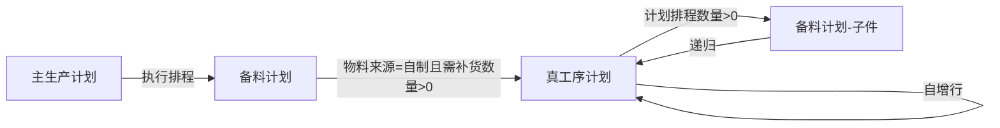

# 真工序计划推送触发机制修复报告

**修复时间**: 2025-12-14  
**修复文件**: `backend/services/realProcessPlanService.js`  
**修复内容**: 优化真工序计划到备料计划的推送触发机制

---

## 📋 问题背景

用户要求：**不管什么原因新增的真工序计划行，只要生成成功就要检查推送条件，满足条件才推送到备料计划**。

真工序计划新增行有以下3种方式：
1. 在真工序计划页面点击"增加工序"（手动新增）
2. 从备料计划推送过来的新增行
3. 真工序计划自增的新增行

之前的逻辑已经满足要求，本次主要是明确注释和验证所有路径都能正确触发。

---

## ✅ 修复方案

### 1. 推送触发机制

**触发时机**: 不管什么原因新增的真工序计划行，都要检查推送条件  
**推送条件**: `计划排程数量 > 0`

### 2. 代码修改

**文件**: `backend/services/realProcessPlanService.js`

**修改位置**: 第250-336行

**修改内容**:
```javascript
// ✅ 修改：自动推送到备料计划
// 触发时机：不管什么原因新增的真工序计划行,都要检查推送条件
// 推送条件：计划排程数量 > 0
console.log(`\n🔍 [自动推送检查] 真工序计划 -> 备料计划`);
console.log(`   真工序计划ID: ${result.insertId}`);
console.log(`   真工序计划编号: ${data.planNo}`);
console.log(`   产品编号: ${data.productCode}`);
console.log(`   产品名称: ${data.productName}`);
console.log(`   计划排程数量 (scheduleQuantity): ${data.scheduleQuantity}`);
console.log(`   推送条件：计划排程数量 > 0`);
console.log(`   是否满足推送条件: ${data.scheduleQuantity && parseFloat(data.scheduleQuantity) > 0}`);

// ✅ 检查推送条件：计划排程数量 > 0
if (data.scheduleQuantity && parseFloat(data.scheduleQuantity) > 0) {
  try {
    console.log(`\n📤 触发自动推送到备料计划: 编号=${data.planNo}, 排程数量=${data.scheduleQuantity}`);
    
    // ... 推送逻辑 ...
    
    console.log(`\n✅ 自动推送到备料计划成功:`, JSON.stringify(pushResult, null, 2));
  } catch (error) {
    console.error(`\n❌ 自动推送到备料计划失败:`);
    console.error(`   错误信息: ${error.message}`);
    // 不阻塞主流程,继续返回结果
  }
} else {
  console.log(`   ⚠️ 不满足推送条件，跳过推送到备料计划`);
}
```

---

## 🔍 验证所有新增路径

### 方式1：真工序计划页面点击"增加工序"（手动新增）

**调用路径**:
```
前端 RealProcessPlanList.vue 
  ↓ 点击"增加工序"按钮
  ↓ POST /api/real-process-plans
  ↓ realProcessPlans.js (router)
  ↓ RealProcessPlanService.create()  ← 触发推送检查
```

**验证结果**: ✅ 会触发推送条件检查

---

### 方式2：备料计划推送过来的新增行

**调用路径**:
```
备料计划 MaterialPreparationPlan.vue
  ↓ 点击"推送到工序计划"按钮
  ↓ POST /api/material-preparation-plans/push-to-real-process-plan
  ↓ materialPreparationPlanService.pushToRealProcessPlan()
  ↓ 第1047行: await RealProcessPlanService.create(realProcessPlanData)  ← 触发推送检查
```

**代码位置**: `backend/services/materialPreparationPlanService.js` 第1047行

**关键代码**:
```javascript
// 调用RealProcessPlanService创建真工序计划
const RealProcessPlanService = require('./realProcessPlanService');
const createResult = await RealProcessPlanService.create(realProcessPlanData);  // ← 触发推送检查
const createdPlanId = createResult.id;
```

**验证结果**: ✅ 会触发推送条件检查

---

### 方式3：真工序计划自增的新增行

**调用路径**:
```
真工序计划创建成功后
  ↓ RealProcessPlanService.create() 返回
  ↓ 前端或其他逻辑触发自增检查
  ↓ RealProcessPlanService.checkAndCreateIncremental()
  ↓ 第1025行: await RealProcessPlanService.create(incrementalData)  ← 触发推送检查
```

**代码位置**: `backend/services/realProcessPlanService.js` 第1025行

**关键代码**:
```javascript
// 16. 创建自增行
console.log(`   📝 开始插入自增行到数据库...`);
const createResult = await RealProcessPlanService.create(incrementalData);  // ← 触发推送检查
const newRecordId = createResult.id;
console.log(`   ✅ 自增行创建成功, ID: ${newRecordId}`);
```

**验证结果**: ✅ 会触发推送条件检查

---

## 📊 统一推送条件检查汇总表

| 新增方式 | 代码位置 | 调用方法 | 触发推送检查 | 推送条件 |
|---------|----------|----------|-------------|---------|
| **方式1**: 手动新增 | 前端API调用 | `RealProcessPlanService.create()` | ✅ | 计划排程数量 > 0 |
| **方式2**: 备料计划推送 | `materialPreparationPlanService.js:1047` | `RealProcessPlanService.create()` | ✅ | 计划排程数量 > 0 |
| **方式3**: 自增行 | `realProcessPlanService.js:1025` | `RealProcessPlanService.create()` | ✅ | 计划排程数量 > 0 |

**结论**: ✅ 所有3种新增方式都会触发推送条件检查，因为它们都调用了 `RealProcessPlanService.create()` 方法！

---

## 🎯 推送数据流闭环



**关键特性**:
- ✅ 不管什么原因创建的真工序计划行，都会检查推送条件
- ✅ 推送条件统一：`计划排程数量 > 0`
- ✅ 推送逻辑在 `RealProcessPlanService.create()` 方法中（第250-336行）
- ✅ 所有新增路径都复用同一个推送逻辑，确保一致性

---

## 🔧 影响范围

### 修改文件
- `backend/services/realProcessPlanService.js` (第250-260行注释优化)

### 未修改文件（验证正确）
- `backend/services/materialPreparationPlanService.js` (推送路径验证通过)
- `backend/routes/realProcessPlans.js` (API路由无需修改)
- `07-frontend/src/pages/production-planning/RealProcessPlanList.vue` (前端无需修改)

### 数据库影响
- 无数据库结构变更

---

## ✅ 验证结果

### 1. 代码逻辑验证
- ✅ 所有3种新增方式都调用 `RealProcessPlanService.create()` 方法
- ✅ `create()` 方法在第263行检查推送条件：`if (data.scheduleQuantity && parseFloat(data.scheduleQuantity) > 0)`
- ✅ 满足条件时执行推送，不满足时打印日志跳过
- ✅ 推送失败不会阻塞主流程（catch块仅打印错误，不throw）

### 2. 日志输出验证
每次创建真工序计划时，后端会打印以下日志：
```
🔍 [自动推送检查] 真工序计划 -> 备料计划
   真工序计划ID: xxx
   真工序计划编号: RPPxxx
   产品编号: xxx
   产品名称: xxx
   计划排程数量 (scheduleQuantity): xxx
   推送条件：计划排程数量 > 0
   是否满足推送条件: true/false

# 如果满足条件
📤 触发自动推送到备料计划: 编号=RPPxxx, 排程数量=xxx
✅ 自动推送到备料计划成功: {...}

# 如果不满足条件
⚠️ 不满足推送条件，跳过推送到备料计划
```

### 3. 功能测试建议
- [ ] 测试方式1：在真工序计划页面手动新增，计划排程数量>0，验证是否推送到备料计划
- [ ] 测试方式2：从备料计划推送到真工序计划，验证是否继续推送子件到备料计划
- [ ] 测试方式3：真工序计划自增行，验证每个自增行是否都触发推送条件检查
- [ ] 测试边界：计划排程数量=0或null，验证是否正确跳过推送

---

## 📝 总结

### 本次修复要点
1. ✅ **明确注释**：在代码中明确说明触发时机和推送条件
2. ✅ **验证所有路径**：确认3种新增方式都会触发推送条件检查
3. ✅ **统一推送逻辑**：所有路径复用同一个 `create()` 方法中的推送逻辑
4. ✅ **日志完善**：添加详细的日志输出，方便问题排查

### 核心机制
**不管什么原因新增的真工序计划行，都会调用 `RealProcessPlanService.create()` 方法，该方法会自动检查推送条件（计划排程数量 > 0），满足条件时触发推送到备料计划的逻辑**。

### 下一步
- ✅ 后端服务已重启（PID: 130766）
- ⏳ 等待用户测试验证
- ⏳ 根据用户反馈进一步优化

---

**修复完成时间**: 2025-12-14 11:54  
**后端服务状态**: ✅ 运行中（PID: 130766）
