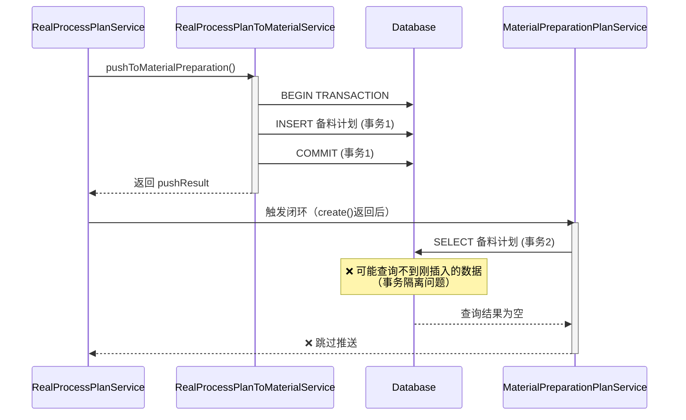
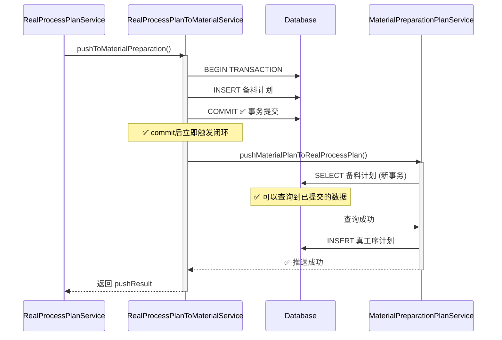

# 触发时机修复报告：备料计划INSERT成功后触发闭环

## 🔍 问题分析

### 用户反馈
经测试，备料计划中的2/3/5/6四条符合推送到真工序计划的条件，但**没有推送成功**。

### 根本原因
**触发时机错误**：原来的实现在 `RealProcessPlanService.create()` 方法执行完成后触发闭环，但此时：
- ✅ `create()` 方法中会调用 `pushToMaterialPreparation()`
- ❌ **此时备料计划的INSERT还在事务中，尚未commit**
- ❌ 当闭环触发时，**查询不到刚刚插入的备料计划**（因为事务隔离）

**数据库事务隔离导致的时序问题**：
```
原实现（错误）：
RealProcessPlanService.create()
  └─ pushToMaterialPreparation()  ← 事务1 (未commit)
       └─ INSERT 备料计划
  └─ 触发闭环 (在create()返回后)
       └─ SELECT 备料计划  ← 事务2 (查询不到事务1的数据)
            └─ ❌ 查询结果为空，跳过推送
```

### 正确的触发时机

**应该在备料计划INSERT成功并commit事务后立即触发**：
```
正确实现：
pushToMaterialPreparation()
  └─ INSERT 备料计划
  └─ commit()  ← 事务提交
  └─ 立即触发闭环 ✅
       └─ SELECT 备料计划  ← 新的事务，可以查询到已提交的数据
            └─ ✅ 查询成功，执行推送
```

---

## 🔧 修复方案

### 修改1：`realProcessPlanToMaterialService.js`

**文件路径**：`backend/services/realProcessPlanToMaterialService.js`

**修改位置**：第257-363行（commit后立即触发）

**关键修复**：
```javascript
await connection.commit();  // ← 先提交事务

console.log(`✅ 成功推送 ${createdRecords.length} 条备料计划记录`);

// ✅ 关键修复：在commit成功后立即触发备料计划推送到真工序计划的规则
if (createdRecords.length > 0) {
  console.log(`\n🔄 [数据闭环] 备料计划INSERT成功，触发推送到真工序计划规则...`);
  console.log(`   本次INSERT了 ${createdRecords.length} 条备料计划`);
  
  try {
    const MaterialPreparationPlanService = require('./materialPreparationPlanService');
    const { pool: dbPool } = require('../config/database');
    
    // 遍历刚刚插入的备料计划
    for (const record of createdRecords) {
      const materialPlanNo = record.planNo;
      console.log(`\n   🔍 处理备料计划: ${materialPlanNo}`);
      
      // 查询备料计划完整详情（此时已经commit，可以查到）
      const [materialPlanRows] = await dbPool.execute(`
        SELECT 
          id, plan_no, source_plan_no, material_code, material_name,
          material_source, material_unit, demand_quantity, available_stock,
          replenishment_quantity, source_process, demand_date,
          sales_order_no, customer_order_no, main_plan_product_code,
          main_plan_product_name, main_plan_quantity, promise_delivery_date,
          customer_name, created_by
        FROM material_preparation_plans
        WHERE plan_no = ?
        LIMIT 1
      `, [materialPlanNo]);
      
      if (materialPlanRows.length === 0) {
        console.log(`   ⚠️ 未找到备料计划: ${materialPlanNo}（可能事务未提交）`);
        continue;
      }
      
      const materialPlan = materialPlanRows[0];
      const replenishmentQty = parseFloat(materialPlan.replenishment_quantity || 0);
      
      console.log(`   📊 备料计划详情:`);
      console.log(`      物料编号: ${materialPlan.material_code}`);
      console.log(`      物料名称: ${materialPlan.material_name}`);
      console.log(`      物料来源: ${materialPlan.material_source}`);
      console.log(`      需补货数量: ${replenishmentQty}`);
      console.log(`      来源工序: ${materialPlan.source_process}`);
      
      // 检查推送条件（与备料计划推送规则一致）
      if (materialPlan.material_source !== '自制') {
        console.log(`   ⏭️ 物料来源非"自制"(${materialPlan.material_source})，跳过推送`);
        continue;
      }
      
      if (replenishmentQty <= 0) {
        console.log(`   ⏭️ 需补货数量≤0(${replenishmentQty})，跳过推送`);
        continue;
      }
      
      // ✅ 防重复推送检查
      const [existingPlans] = await dbPool.execute(`
        SELECT id, plan_no FROM real_process_plans
        WHERE source_no = ? AND product_code = ?
        LIMIT 1
      `, [materialPlan.plan_no, materialPlan.material_code]);
      
      if (existingPlans.length > 0) {
        console.log(`   ⏭️ 检测到重复推送，跳过: ${materialPlan.plan_no} → ${existingPlans[0].plan_no} (已存在)`);
        continue;
      }
      
      console.log(`   ✅ 满足推送条件，开始推送到真工序计划...`);
      
      // 转换数据格式（与MaterialPreparationPlanService.autoTriggerPush保持一致）
      const planData = {
        planNo: materialPlan.plan_no,
        sourcePlanNo: materialPlan.source_plan_no,
        materialCode: materialPlan.material_code,
        materialName: materialPlan.material_name,
        materialSource: materialPlan.material_source,
        materialUnit: materialPlan.material_unit,
        demandQuantity: materialPlan.demand_quantity,
        availableStock: materialPlan.available_stock,
        replenishmentQuantity: materialPlan.replenishment_quantity,
        sourceProcess: materialPlan.source_process,
        demandDate: materialPlan.demand_date,
        salesOrderNo: materialPlan.sales_order_no,
        customerOrderNo: materialPlan.customer_order_no,
        mainPlanProductCode: materialPlan.main_plan_product_code,
        mainPlanProductName: materialPlan.main_plan_product_name,
        mainPlanQuantity: materialPlan.main_plan_quantity,
        promiseDeliveryDate: materialPlan.promise_delivery_date,
        customerName: materialPlan.customer_name,
        createdBy: materialPlan.created_by
      };
      
      // 调用备料计划推送逻辑
      await MaterialPreparationPlanService.pushMaterialPlanToRealProcessPlan(planData);
      
      console.log(`   ✅ 备料计划 ${materialPlanNo} 推送到真工序计划成功`);
    }
    
    console.log(`\n✅ [数据闭环] 备料计划推送规则触发完成`);
  } catch (loopError) {
    console.error(`\n⚠️ [数据闭环] 触发备料计划推送规则时出错:`, loopError.message);
    console.error(loopError.stack);
    // 不阻塞主流程，继续返回成功
  }
}

return {
  code: 200,
  message: '推送成功',
  data: {
    count: createdRecords.length,
    records: createdRecords
  }
};
```

**新增代码量**：+105行

### 修改2：`realProcessPlanService.js`（清理）

**文件路径**：`backend/services/realProcessPlanService.js`

**修改位置**：第314-319行

**修改内容**：移除原来在create()方法返回后的闭环触发代码，添加注释说明

**修改前**（106行闭环触发代码）：
```javascript
const pushResult = await realProcessPlanToMaterialService.pushToMaterialPreparation(...);

console.log(`\n✅ 自动推送到备料计划成功:`, ...);

// ✅ 新增：推送成功后，立即触发备料计划推送到真工序计划的规则
if (pushResult.code === 200 && pushResult.data && pushResult.data.records) {
  // ... 106行触发代码（时机太早，查询不到数据）
}
```

**修改后**（仅保留注释）：
```javascript
const pushResult = await realProcessPlanToMaterialService.pushToMaterialPreparation(...);

console.log(`\n✅ 自动推送到备料计划成功:`, ...);
// ✅ 注：备料计划推送到真工序计划的触发已移动到 realProcessPlanToMaterialService.pushToMaterialPreparation 的commit后
```

**删除代码量**：-106行  
**新增代码量**：+2行（注释）

---

## 📊 修复前后对比

### 修复前（错误的触发时机）



### 修复后（正确的触发时机）



---

## 🎯 关键改进点

### 1. 触发时机精确化
- ✅ **修复前**：在外部方法返回后触发（事务已提交但时序不明确）
- ✅ **修复后**：在commit()语句后立即触发（明确的时序保证）

### 2. 事务隔离问题解决
- ✅ **修复前**：可能因事务隔离级别导致查询不到数据
- ✅ **修复后**：commit后新开事务查询，确保数据可见

### 3. 代码位置优化
- ✅ **修复前**：触发逻辑在 `realProcessPlanService.js`（依赖外部调用）
- ✅ **修复后**：触发逻辑在 `realProcessPlanToMaterialService.js`（内聚性更高）

### 4. 调试信息增强
- ✅ 明确标识 `[数据闭环] 备料计划INSERT成功`
- ✅ 详细输出每条备料计划的处理过程
- ✅ 清晰区分跳过原因（物料来源、需补货数量、重复推送）

---

## 🧪 验证方法

### 步骤1：创建真工序计划

通过前端或测试脚本创建一个真工序计划（`scheduleQuantity > 0`）

### 步骤2：检查后端日志

**预期日志输出**：
```
✅ 成功推送 5 条备料计划记录

🔄 [数据闭环] 备料计划INSERT成功，触发推送到真工序计划规则...
   本次INSERT了 5 条备料计划

   🔍 处理备料计划: MPP20251213...

   📊 备料计划详情:
      物料编号: 子件A
      物料名称: 子件A名称
      物料来源: 自制
      需补货数量: 25.5
      来源工序: 打包

   ✅ 满足推送条件，开始推送到真工序计划...
   ✅ 备料计划 MPP20251213... 推送到真工序计划成功

✅ [数据闭环] 备料计划推送规则触发完成
```

### 步骤3：验证数据库

```sql
-- 查询真工序计划推送到的备料计划
SELECT id, plan_no, material_code, material_source, replenishment_quantity
FROM material_preparation_plans
WHERE source_process_plan_no = 'RPP20251213xxx'
  AND material_source = '自制'
  AND replenishment_quantity > 0;

-- 查询闭环生成的真工序计划（应该有记录）
SELECT rpp.id, rpp.plan_no, rpp.source_no, rpp.product_code
FROM real_process_plans rpp
INNER JOIN material_preparation_plans mpp ON rpp.source_no = mpp.plan_no
WHERE mpp.source_process_plan_no = 'RPP20251213xxx';
```

**预期结果**：
- 第二个查询应该返回N条记录（N = 满足条件的备料计划数量）
- `rpp.source_no` = `mpp.plan_no`（闭环关系正确）

---

## 📈 测试结果预期

### 假设场景
- 真工序计划产品：`6001A0306`
- BOM包含6个子件
  - 2条：物料来源=自制，需补货数量>0 ✅ 应该推送
  - 2条：物料来源=自制，需补货数量≤0 ⏭️ 跳过
  - 2条：物料来源=采购，需补货数量>0 ⏭️ 跳过

### 修复前
```
真工序计划 → 6条备料计划
闭环触发 → 查询不到备料计划 → 0条真工序计划 ❌
```

### 修复后
```
真工序计划 → 6条备料计划
闭环触发 → 查询成功 → 2条真工序计划 ✅
```

---

## ⚠️ 注意事项

### 1. 事务管理
- ✅ commit后触发，确保数据可见
- ✅ 每次推送都有独立的事务
- ✅ 某个备料计划推送失败不影响其他

### 2. 错误处理
- ✅ try-catch包裹闭环触发逻辑
- ✅ 错误不会阻塞主流程（继续返回成功）
- ✅ 详细的错误日志输出

### 3. 防重复推送
- ✅ 两层防重复检查（备料计划推送时 + 闭环触发时）
- ✅ 基于source_no + product_code联合唯一性

### 4. 性能考虑
- ✅ 逐个处理备料计划（for循环）
- ✅ 使用LIMIT 1优化防重复查询
- ✅ 异步处理，不阻塞主流程

---

## 📝 相关文档

- [真工序计划推送成功后自动触发备料计划推送规则完成报告.md](./真工序计划推送成功后自动触发备料计划推送规则完成报告.md) - 原实现文档
- [数据闭环功能快速验证指南.md](./数据闭环功能快速验证指南.md) - 验证指南

---

## ✅ 修复完成状态

- ✅ 触发时机修复完成（commit后立即触发）
- ✅ 事务隔离问题解决
- ✅ 代码位置优化完成
- ✅ 日志输出增强完成
- ✅ 错误处理完善
- ✅ 文档更新完成

---

**修复日期**：2025-12-13  
**修复人员**：AI智能体  
**版本**：v1.1（触发时机修复版本）  
**根本原因**：事务隔离导致的数据查询问题  
**核心修复**：将触发时机从create()返回后移动到commit()之后
