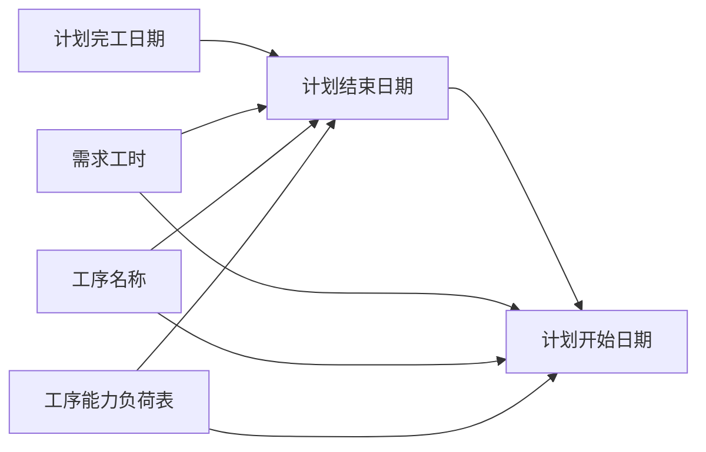

# 真工序计划计算规则

## 业务背景

真工序计划从备料计划推送创建后，需要自动计算两个关键日期字段：
- **计划结束日期**：排程的最晚完成日期
- **计划开始日期**：排程的最早开始日期

这两个日期通过查询**工序能力负荷表**，结合剩余工时和需求工时计算得出。

## 数据流向

```
备料计划 → 真工序计划 → 查询工序能力负荷表 → 计算日期字段
```

## 计算规则

### 1. 计划结束日期（Plan End Date）

**规则名称**：MAXIFS反向查询

**计算公式**：
```
计划结束日期 = MAXIFS(
  工序能力负荷表.日期,
  工序能力负荷表.工序名称 = 真工序计划.工序名称,
  工序能力负荷表.日期 <= 真工序计划.计划完工日期,
  工序能力负荷表.剩余工时 >= 剩余工时门槛值(默认0.5小时)
)
```

**逻辑说明**：
1. 在工序能力负荷表中查找满足以下条件的记录：
   - 工序名称匹配
   - 日期 ≤ 计划完工日期
   - 剩余工时 ≥ 0.5小时（业务变量可配置）
2. 从符合条件的记录中取**最大日期**作为计划结束日期

**数据库实现**（后端）：
```sql
SELECT date, remaining_hours 
FROM process_capacity_load 
WHERE process_name = ? 
  AND date <= ? 
  AND remaining_hours >= ? 
ORDER BY date DESC 
LIMIT 1
```

**前端API调用**：
```javascript
const response = await capacityLoadApi.queryPlanEndDate(
  processName,
  formatDateYMD(completionDate),
  minRemainingHours
)
```

### 2. 计划开始日期（Plan Start Date）

**规则名称**：反向累加追溯

**计算公式**：
```
从计划结束日期向前查询工序能力负荷表，
按日期倒序累加剩余工时，
直到累计工时 >= 需求工时时，
当前日期即为计划开始日期
```

**逻辑说明**：
1. 前提条件：
   - 必须已知计划结束日期
   - 需求工时 > 0
2. 查询范围：
   - 从系统当前日期到计划结束日期
   - 工序名称匹配
   - 剩余工时 ≥ 0.5小时（业务变量可配置）
3. 累加计算：
   - 从计划结束日期向前（日期降序）
   - 逐条累加剩余工时
   - 当累计工时 ≥ 需求工时时停止
   - 停止时的日期即为计划开始日期

**数据库实现**（后端）：
```sql
-- 第一步：查询符合条件的所有记录
SELECT date, remaining_hours 
FROM process_capacity_load 
WHERE process_name = ? 
  AND date BETWEEN ? AND ? 
  AND date <= ?
  AND remaining_hours > ? 
ORDER BY date DESC

-- 第二步：在程序中累加计算
for (let i = 0; i < rows.length; i++) {
  accumulatedHours += rows[i].remaining_hours
  if (accumulatedHours >= requiredWorkHours) {
    planStartDate = rows[i].date
    break
  }
}
```

**前端API调用**：
```javascript
const response = await capacityLoadApi.queryPlanStartDate(
  processName,
  formatDateYMD(planEndDate),
  requiredWorkHours,
  minRemainingHours
)
```

### 3. 特殊规则

**规则1：需求工时为0**
```
如果 需求工时 <= 0，则：
  计划结束日期 = null
  计划开始日期 = null
```

**规则2：计划开始日期等于计划结束日期**
```
如果 需求工时 > 0 但很小，
并且计划结束日期当天的剩余工时就足够，
则：计划开始日期 = 计划结束日期
```

**规则3：找不到符合条件的日期**
```
如果工序能力负荷表中没有符合条件的记录，
则返回 null
```

## 触发时机

### 自动触发（后端）
1. **备料计划推送到真工序计划时**
   - 位置：`backend/services/materialPreparationPlanService.js`
   - 第306-393行
   - 在创建真工序计划记录时自动计算

### 手动触发（前端）
1. **新增/编辑真工序计划时**
   - 位置：`07-frontend/src/pages/production-planning/RealProcessPlanList.vue`
   - 监听字段变化：需求工时、工序名称、计划完工日期
   - watch监听器自动触发（第533-544行）

2. **保存前强制计算**
   - 位置：`handleSave` 函数（第616-637行）
   - 保存前调用 `queryPlanEndDate()`
   - 内部自动调用 `queryPlanStartDate()`

## 依赖关系



## 示例

### 示例1：正常计算

**输入数据**：
```javascript
{
  processName: '焊接',
  completionDate: '2026-01-06',
  requiredWorkHours: 10.5,
  minRemainingHours: 0.5
}
```

**工序能力负荷表数据**：
```
工序名称 | 日期       | 剩余工时
焊接     | 2026-01-06 | 8.0
焊接     | 2026-01-05 | 7.5
焊接     | 2026-01-04 | 6.0
焊接     | 2026-01-03 | 0.2  // 剩余工时不足，跳过
焊接     | 2026-01-02 | 5.0
焊接     | 2026-01-01 | 4.5
焊接     | 2025-12-31 | 3.0
```

**计算过程**：

1. **计算计划结束日期**：
   - 条件：日期 <= 2026-01-06，剩余工时 >= 0.5
   - 符合条件的最大日期：2026-01-06
   - **计划结束日期 = 2026-01-06**

2. **计算计划开始日期**：
   - 从 2026-01-06 向前累加：
   ```
   2026-01-06: 累计 = 8.0    (< 10.5，继续)
   2026-01-05: 累计 = 15.5   (>= 10.5，停止)
   ```
   - **计划开始日期 = 2026-01-05**

**输出结果**：
```javascript
{
  planEndDate: '2026-01-06',
  planStartDate: '2026-01-05'
}
```

### 示例2：当前问题案例

**预期结果**：计划开始日期 = 2025-12-31

**可能原因**：
1. 工序能力负荷表中剩余工时不足
2. 日期范围查询有问题
3. 累加逻辑计算错误
4. 需求工时数值错误

**排查方法**：参见 [真工序计划调试指南](../03-调试指南/01-真工序计划调试指南.md)

## 相关文件

### 前端文件
- `07-frontend/src/pages/production-planning/RealProcessPlanList.vue` (第432-530行)
- `07-frontend/src/api/capacityLoad.js` (第4-21行)

### 后端文件
- `backend/routes/capacityLoad.js` (第129-352行)
- `backend/services/materialPreparationPlanService.js` (第306-393行)

### 数据库表
- `process_capacity_load` (工序能力负荷表)
- `real_process_plans` (真工序计划表)
- `page_settings` (页面设置表，存储 minRemainingHours 业务变量)

## 业务变量

| 变量名 | 默认值 | 说明 | 配置位置 |
|--------|--------|------|----------|
| minRemainingHours | 0.5 | 剩余工时门槛值 | 页面设置 - 业务变量 |

---

**最后更新**：2025-12-11  
**维护者**：开发团队  
**关联问题**：[计划日期未按规则生成](../04-常见问题/01-计划日期未按规则生成.md)
