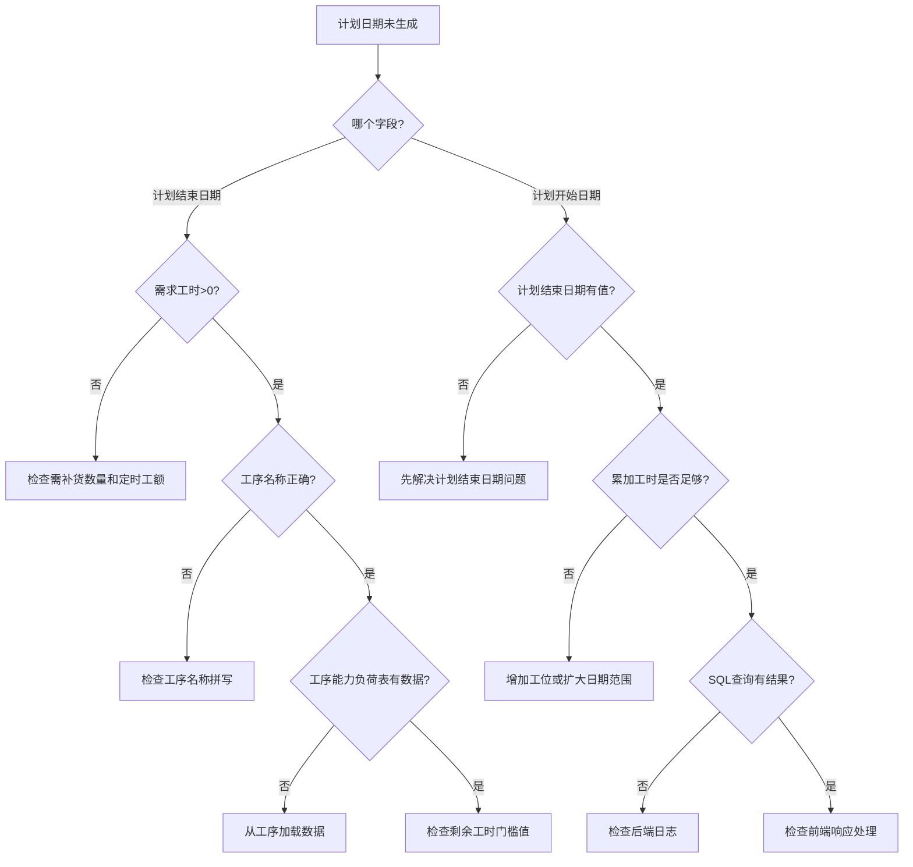

# 常见问题：计划日期未按规则生成

## 问题分类

### 问题1：计划开始日期为null

**症状**：
```
预期：计划开始日期 = 2025-12-31
实际：计划开始日期 = null
```

**可能原因**：

#### 原因1：工序能力负荷表数据不足
```sql
-- 检查SQL
SELECT process_name, date, remaining_hours
FROM process_capacity_load
WHERE process_name = '焊接'
  AND date BETWEEN '2025-12-01' AND '2026-01-06'
  AND remaining_hours >= 0.5
ORDER BY date DESC;

-- 如果返回记录 < 5条，可能数据不足
```

**解决方案**：
1. 打开工序能力负荷表页面
2. 点击"从工序加载"按钮
3. 选择相应工序
4. 生成足够的日期数据

#### 原因2：剩余工时门槛值设置过高
```
如果门槛值 = 5.0，但大部分记录剩余工时 < 5.0
则无法找到符合条件的记录
```

**解决方案**：
1. 打开真工序计划页面设置
2. 查看"业务变量" → "剩余工时小于"
3. 调整为合理值（建议0.5-1.0）

#### 原因3：累加工时不足
```
需求工时 = 20小时
但工序能力负荷表中符合条件的剩余工时总和 < 20小时
```

**排查方法**：
```sql
-- 计算总剩余工时
SELECT 
  process_name,
  SUM(remaining_hours) as total_remaining
FROM process_capacity_load
WHERE process_name = '焊接'
  AND date BETWEEN '2025-12-01' AND '2026-01-06'
  AND remaining_hours >= 0.5
GROUP BY process_name;
```

**解决方案**：
1. 增加可用工位数量
2. 扩大日期范围
3. 调整需求工时计算公式

#### 原因4：工序名称不匹配
```
前端：processName = "焊接 "（末尾有空格）
数据库：process_name = "焊接"
结果：无法匹配
```

**排查方法**：
```javascript
// 在浏览器Console中检查
console.log('工序名称:', JSON.stringify(formData.value.processName))
// 如果输出："焊接 " 说明有多余空格
```

**解决方案**：
```javascript
// 在查询前trim
const trimmedProcessName = processName.trim()
```

### 问题2：计划结束日期为null

**症状**：
```
预期：计划结束日期 = 2026-01-06
实际：计划结束日期 = null
```

**可能原因**：

#### 原因1：需求工时为0
```javascript
需求工时 = 需补货数量 / 定时工额
如果 定时工额 = 0，则 需求工时 = Infinity
如果 需补货数量 = 0，则 需求工时 = 0
```

**解决方案**：
1. 检查需补货数量 > 0
2. 检查定时工额 > 0
3. 确认计算公式正确

#### 原因2：计划完工日期无效
```
计划完工日期 = null
或
计划完工日期 < 系统当前日期（已过期）
```

**解决方案**：
1. 确认计划完工日期已填写
2. 确认日期格式正确（YYYY-MM-DD）
3. 确认日期未过期

#### 原因3：工序能力负荷表无该工序
```sql
SELECT COUNT(*) as count
FROM process_capacity_load
WHERE process_name = '焊接';
-- 如果 count = 0，说明未加载该工序
```

**解决方案**：
参见问题1原因1的解决方案

### 问题3：计划开始日期晚于计划结束日期

**症状**：
```
计划开始日期 = 2026-01-10
计划结束日期 = 2026-01-06
逻辑错误：开始日期应该 <= 结束日期
```

**可能原因**：

#### 原因1：累加顺序错误
```javascript
// 错误：从小到大累加
for (let i = 0; i < rows.length; i++) { ... }
ORDER BY date ASC  // ❌ 升序

// 正确：从大到小累加（倒序）
for (let i = 0; i < rows.length; i++) { ... }
ORDER BY date DESC  // ✅ 降序
```

**解决方案**：
检查后端SQL的ORDER BY子句，确保是DESC

#### 原因2：日期范围错误
```javascript
// 错误：查询范围超出计划结束日期
WHERE date BETWEEN '2025-12-01' AND '2026-02-01'
// 应该限制在计划结束日期之前
WHERE date BETWEEN '2025-12-01' AND planEndDate
```

**解决方案**：
检查后端WHERE条件，确保 `date <= planEndDate`

## 诊断流程图



## 快速检查清单

在提交BUG前，请完成以下检查：

### 前端检查
- [ ] 浏览器Console无JavaScript错误
- [ ] Network面板显示API调用成功（200 OK）
- [ ] 需求工时 > 0
- [ ] 工序名称不为空
- [ ] 计划完工日期有效
- [ ] 计划结束日期已生成（如果排查计划开始日期）

### 后端检查
- [ ] backend.log无ERROR日志
- [ ] API接收到的参数完整
- [ ] SQL查询返回记录 > 0
- [ ] 累加计算逻辑正确
- [ ] 响应数据格式正确

### 数据检查
- [ ] 工序能力负荷表有该工序数据
- [ ] 日期范围覆盖预期日期
- [ ] 剩余工时 >= 门槛值
- [ ] 剩余工时总和 >= 需求工时

## 自助诊断脚本

将以下脚本复制到浏览器Console运行：

```javascript
// ============ 计划日期诊断脚本 ============
(async function diagnose() {
  console.log('🔍 开始诊断计划日期问题...\n')
  
  // 检查1：表单数据
  console.log('📋 检查1：表单数据')
  const data = {
    processName: formData.value?.processName,
    completionDate: formData.value?.completionDate,
    requiredWorkHours: formData.value?.requiredWorkHours,
    planEndDate: formData.value?.planEndDate,
    planStartDate: formData.value?.planStartDate
  }
  console.table(data)
  
  if (!data.processName) {
    console.error('❌ 工序名称为空')
    return
  }
  if (!data.completionDate) {
    console.error('❌ 计划完工日期为空')
    return
  }
  if (data.requiredWorkHours <= 0) {
    console.warn('⚠️ 需求工时为0或负数')
  }
  
  // 检查2：计划结束日期
  console.log('\n📋 检查2：计划结束日期')
  try {
    const endDateResponse = await capacityLoadApi.queryPlanEndDate(
      data.processName,
      formatDateYMD(data.completionDate),
      0.5
    )
    console.log('✅ API响应:', endDateResponse)
    if (!endDateResponse?.data?.planEndDate) {
      console.error('❌ 未找到计划结束日期')
      console.log('💡 建议：检查工序能力负荷表是否有数据')
    }
  } catch (error) {
    console.error('❌ API调用失败:', error)
  }
  
  // 检查3：计划开始日期
  console.log('\n📋 检查3：计划开始日期')
  if (!data.planEndDate) {
    console.error('❌ 计划结束日期为空，无法查询计划开始日期')
    return
  }
  
  try {
    const startDateResponse = await capacityLoadApi.queryPlanStartDate(
      data.processName,
      formatDateYMD(data.planEndDate),
      data.requiredWorkHours,
      0.5
    )
    console.log('✅ API响应:', startDateResponse)
    if (!startDateResponse?.planStartDate) {
      console.error('❌ 未找到计划开始日期')
      console.log('💡 建议：检查累加工时是否足够')
    } else {
      console.log(`✅ 计划开始日期: ${startDateResponse.planStartDate}`)
      console.log(`✅ 累计工时: ${startDateResponse.accumulatedHours}`)
    }
  } catch (error) {
    console.error('❌ API调用失败:', error)
  }
  
  console.log('\n🎉 诊断完成！')
})()
```

## 已知问题和限制

### 1. 日期跨年问题
```
如果计划完工日期是下一年的1月，
而当前是12月，
可能出现日期范围计算错误
```

**状态**：已修复（2025-12-11）

### 2. 时区问题
```
服务器时区与浏览器时区不一致时，
日期可能相差1天
```

**解决方案**：统一使用本地时区格式化（YYYY-MM-DD）

### 3. 并发问题
```
多个用户同时修改工序能力负荷表时，
可能导致剩余工时计算不准确
```

**状态**：待优化

## 相关文档

- [真工序计划计算规则](../01-数据流规则/03-真工序计划计算规则.md)
- [真工序计划字段映射](../02-字段映射关系/01-真工序计划字段映射.md)
- [真工序计划调试指南](../03-调试指南/01-真工序计划调试指南.md)

## 提交BUG报告模板

如果以上方法都无法解决，请按以下模板提交BUG：

```markdown
## BUG标题
真工序计划 - 计划开始日期未按规则生成

## 复现步骤
1. 打开真工序计划页面
2. 点击新增按钮
3. 填写以下数据：
   - 工序名称：焊接
   - 需补货数量：100
   - 定时工额：10
   - 计划完工日期：2026-01-06
4. 观察计划开始日期字段

## 预期结果
计划开始日期 = 2025-12-31

## 实际结果
计划开始日期 = null

## 环境信息
- 页面路径：http://localhost:3007/process-planning/real-process-plan
- 浏览器：Chrome 120.0.0
- 操作系统：Windows 11
- 后端版本：1.0.0

## 诊断信息
- [ ] 已运行自助诊断脚本
- [ ] 已检查浏览器Console
- [ ] 已检查后端日志
- [ ] 已检查工序能力负荷表数据

## 附加信息
（粘贴诊断脚本输出、截图等）
```

---

**最后更新**：2025-12-11  
**修复记录**：无  
**待优化**：并发问题
