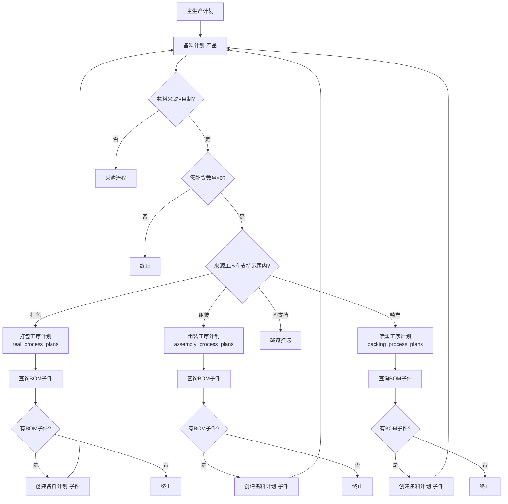

# 备料计划自动推送修复报告

## 修复时间
2024年12月14日

## 问题描述

在之前的实现中，备料计划创建后**无法自动推送到工序计划**，导致数据流递归链条中断。根本原因是：

1. **create方法中的推送逻辑被注释掉**（第313-363行）
2. **create方法没有调用pushToRealProcessPlan方法**
3. **只有autoTriggerPush方法会调用推送**，但需要手动触发

## 修复方案

### 核心修改：在create方法中启用自动推送

#### 修改前（错误的代码）
```javascript
static async create(data) {
  let connection = await pool.getConnection();
  try {
    await connection.beginTransaction();
    
    // INSERT 备料计划
    const [result] = await connection.execute(sql, [...]);
    const insertedId = result.insertId;
    
    // ❌ 推送逻辑被注释掉
    /* 
    if (shouldPush) {
      // 创建工序计划（被注释）
      await connection.execute(`INSERT INTO process_plans ...`);
    }
    */
    
    await connection.commit();
    return { id: insertedId };
  } catch (error) {
    // ... 大量旧代码残留（约500行）
  }
}
```

#### 修改后（正确的代码）
```javascript
static async create(data) {
  let connection = await pool.getConnection();
  try {
    await connection.beginTransaction();
    
    // INSERT 备料计划
    const [result] = await connection.execute(sql, [...]);
    const insertedId = result.insertId;
    console.log(`备料计划创建成功, ID: ${insertedId}, 编号: ${data.planNo}`);
    
    await connection.commit();
    
    // ✅ 自动推送到工序计划（在事务提交后）
    if (data.planNo && data.materialSource === '自制') {
      const demandQty = parseFloat(data.demandQuantity || 0);
      const availableQty = parseFloat(data.availableStock || 0);
      const replenishmentQty = demandQty - availableQty;
      
      if (replenishmentQty > 0) {
        console.log('🔄 备料计划创建成功，开始自动推送到工序计划...');
        
        try {
          const pushResult = await this.pushToRealProcessPlan(data);
          
          if (pushResult && pushResult.success) {
            console.log(`✅ 自动推送成功: ${data.planNo} → ${pushResult.serviceName} (${pushResult.planNo})`);
            
            // 更新推送状态
            await pool.execute(
              'UPDATE material_preparation_plans SET push_to_process = ? WHERE plan_no = ?',
              [1, data.planNo]
            );
          } else {
            console.log(`⏭️ 推送跳过: ${pushResult ? pushResult.reason : '未知原因'}`);
          }
        } catch (pushError) {
          console.error(`❌ 自动推送失败:`, pushError.message);
        }
      } else {
        console.log('⏭️ 需补货数量≤0，跳过推送');
      }
    }
    
    return { 
      id: insertedId
    };
  } catch (error) {
    await connection.rollback();
    console.error('更新备料计划失败:', error);
    throw error;
  } finally {
    connection.release();
  }
}
```

### 关键改进点

1. **在事务提交后调用推送**：避免事务冲突
2. **调用pushToRealProcessPlan方法**：复用已有的完整推送逻辑，包括：
   - 路由检查（打包/组装/喷塑）
   - 防重复推送检查
   - 自动创建工序计划
   - 自动推送BOM子件（工序计划创建后）
3. **异常处理**：推送失败不影响备料计划创建
4. **更新推送状态**：成功后更新`push_to_process`字段

## 数据流完整闭环

修复后，实现了完整的循环推送逻辑：



## 修改的文件

### `/home/sardenesy/ai_workspaces/ai_desktop_3/backend/services/materialPreparationPlanService.js`

**修改内容：**

1. **create方法（第159-271行）**
   - 删除了第313-737行的大量注释代码和旧逻辑
   - 在第228-259行添加自动推送逻辑
   - 事务提交后立即调用`pushToRealProcessPlan`方法

2. **pushToRealProcessPlan方法（第419-774行）** - 已存在，无需修改
   - 包含完整的路由逻辑：打包→real_process_plans，组装→assembly_process_plans，喷塑→packing_process_plans
   - 防重复推送检查
   - 自动计算各种排程字段
   - 调用对应Service创建工序计划
   - 触发BOM子件推送

## 工序计划命名规范（已在之前修复）

| 工序类型 | Service文件 | 数据库表 | 显示名称 | 编号前缀 |
|---------|------------|---------|---------|---------|
| 打包 | realProcessPlanService.js | real_process_plans | 打包工序计划 | RPP |
| 组装 | assemblyProcessPlanService.js | assembly_process_plans | 组装工序计划 | ASPP |
| 喷塑 | packingProcessPlanService.js | packing_process_plans | 喷塑工序计划 | SPPP |

## 推送条件

备料计划创建后，满足以下**所有条件**时自动推送到工序计划：

1. ✅ `plan_no` 不为空（备料计划编号）
2. ✅ `material_source` = '自制'（物料来源）
3. ✅ `replenishment_quantity` > 0（需补货数量 = 需求数量 - 可用库存）
4. ✅ `source_process` 在支持范围内（打包/组装/喷塑）

## 终止条件

满足以下**任意条件**时，停止推送循环：

1. ❌ `material_source` = '采购'（物料来源为采购）
2. ❌ `replenishment_quantity` ≤ 0（无需补货）
3. ❌ `source_process` 不在支持范围内
4. ❌ BOM表中无子件记录

## 测试验证建议

1. **创建主生产计划** → 自动生成备料计划（产品）
2. **验证自动推送** → 检查是否自动创建了工序计划（打包/组装/喷塑）
3. **验证BOM推送** → 检查工序计划是否推送BOM子件到备料计划
4. **验证循环推送** → 检查BOM子件备料计划是否继续推送到下级工序计划
5. **验证终止条件** → 检查采购物料或无BOM时是否正确终止

## 日志输出示例

```
备料计划创建成功, ID: 123, 编号: BL2024123456
🔄 备料计划创建成功，开始自动推送到工序计划...
   物料来源: 自制
   需补货数量: 100.00
   来源工序: 打包

🔍 [推送条件检查] 备料计划: BL2024123456
   ✅ 备料计划编号不为空: BL2024123456
   ✅ 需补货数量 > 0: 100.00
   ✅ 物料来源 = 自制
   ✅ 来源工序=打包，在推送范围内

📍 [数据路由] 来源工序=打包 → 推送到打包工序计划 (表: real_process_plans)
   备料计划编号=BL2024123456
   物料编号=MAT001, 物料名称=测试物料
   需补货数量=100

✅ 打包工序计划创建成功: RPP2024123456, ID: 456

🔍 [自动推送检查] 打包工序计划 -> 备料计划
   打包工序计划ID: 456
   产品编号: MAT001
   开始查询BOM子件...

📊 查询到 2 条BOM子件
   子件1: MAT001-1, 用量: 2.00
   子件2: MAT001-2, 用量: 1.50

✅ 成功生成子件备料计划: BL2024123457 (物料: MAT001-1, 数量: 200.00)
✅ 成功生成子件备料计划: BL2024123458 (物料: MAT001-2, 数量: 150.00)

🔄 子件备料计划 BL2024123457 继续推送...
...（循环继续）
```

## 总结

本次修复解决了备料计划到工序计划的自动推送问题，实现了完整的数据流递归闭环。修复后：

✅ **备料计划创建** → 自动推送到工序计划
✅ **工序计划创建** → 自动推送BOM子件到备料计划
✅ **循环推送** → 直到满足终止条件
✅ **路由正确** → 打包/组装/喷塑分别推送到不同的表
✅ **防重复** → 通过source_no字段关联，避免重复推送
✅ **异常处理** → 推送失败不影响备料计划创建

**修复前后对比：**
- **修复前**：备料计划创建后需要手动触发`autoTriggerPush`才能推送
- **修复后**：备料计划创建后自动推送，无需手动干预

**性能优化建议：**
- 如果数据量很大，可以考虑将推送逻辑改为异步任务队列
- 当前实现在事务提交后同步执行推送，保证了数据一致性
